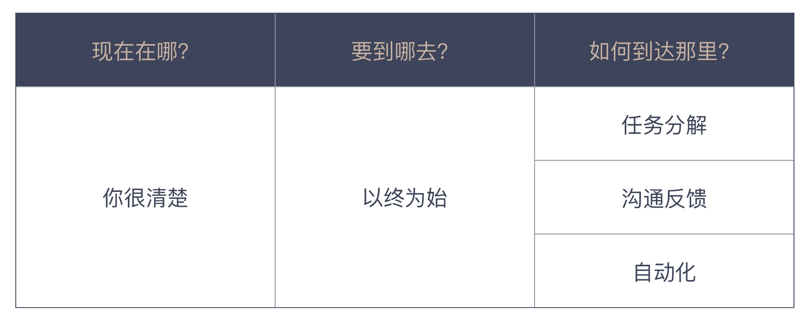

**本节课目的**：怎样才能把时间和精力尽可能地放在处理本质复杂度的事情上，减少在偶然复杂度上的消耗。

## 如何衡量一个开发任务的合理性？

为什么要做这个特性，它会给用户带来怎样的价值？

什么样的用户会用到这个特性，他们在什么场景下使用，他们又会怎样使用它？

达成这个目的是否有其它手段？是不是一定要开发一个系统？

这个特性上线之后，怎么衡量它的有效性？

对应于思考框架（现状->目标->实现路径）来分析：

现状：一般来说，一个新特性要开发时，现状我是知道的。所以，我更关心目标。

目标：这里“为什么要做这个特性？”就是在问目标，“给用户带来怎样的价值”是在确定这个目标的有效性。衡量有效性，则是要保证我的工作不会被浪费。

实现路径：用户会怎么用，是否有其他的替代手段，我需要了解产品经理的设计是经过思考的，还是“拍着脑袋”给出的。

上面问题对应了思考框架，但是如何能想到提出这些问题？

可以遵循下面这四项原则：

以终为始；确定自己的目标，而不是分配的任务

任务分解；实现路径

沟通反馈；避免工作偏差疏漏

自动化。将繁琐的工作交给机器完成，提高效率

最后，只需要记住：

面对问题时，用思考框架问问自己，现状、目标和路径。

