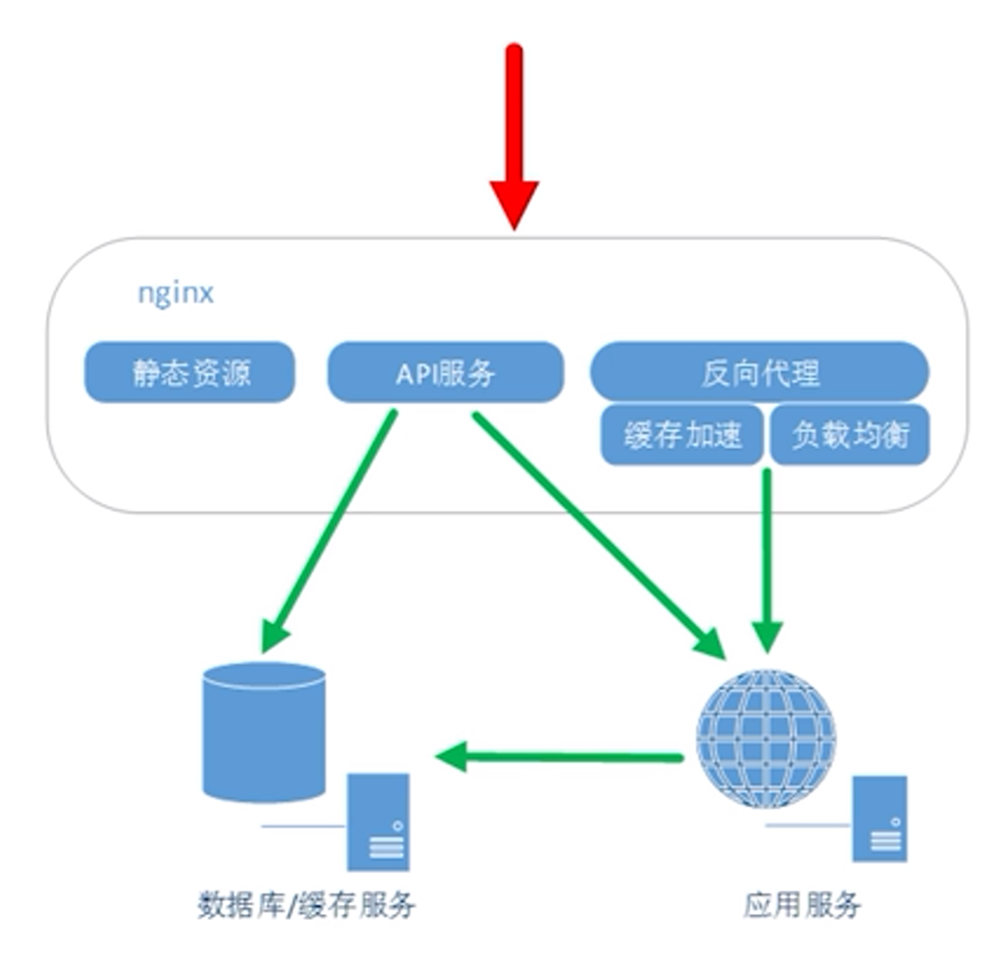
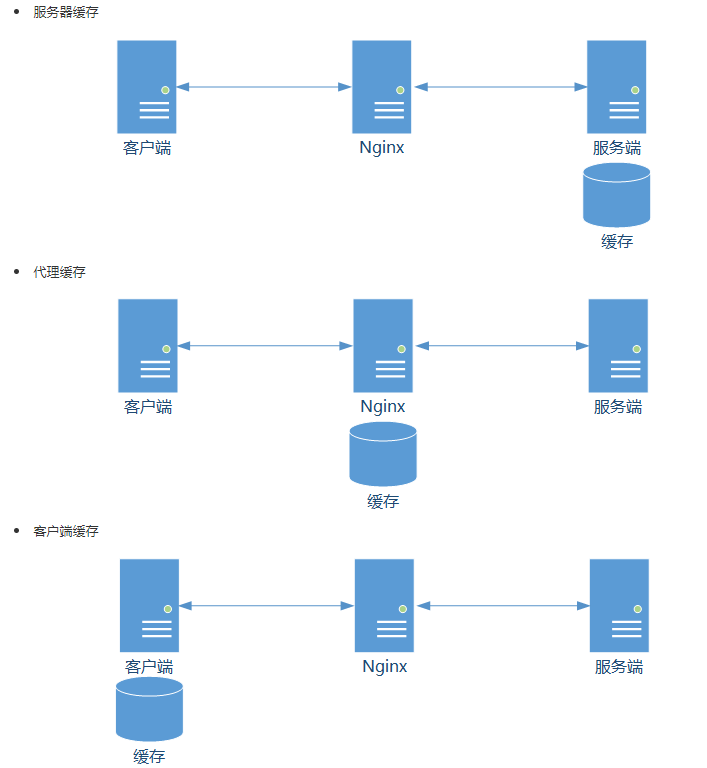
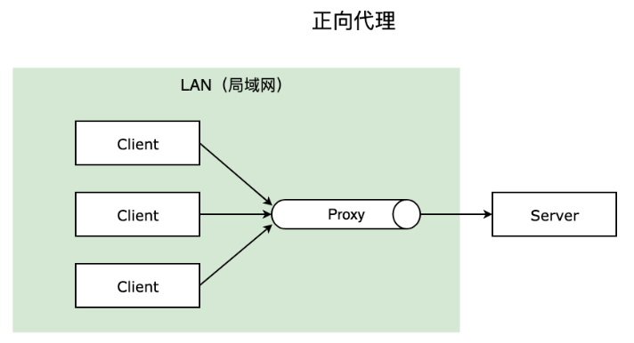

# Nginx

## Nginx 简介

### Nginx 是什么

nginx (engine x) 是一个 HTTP 和反向代理服务器，一个邮件代理服务器，一个通用的 TCP/UDP 代理服务器，最初由 Igor Sysoev 编写。实际在在设计之初**Nginx**的产品目的就是为了邮件服务而诞生的，特点是占有内存少、体积小、并发能力强、性能高。

### nginx 适用场景



Nginx 的三个主要应用场景：

**1、静态资源服务**

静态资源直接可以由 nginx 提供服务，降低对后台应用访问。

**2、反向代理**

- 通过反向代理访问后端接口
- 后端应用服务构成集群后，需要动态扩容，有的应用出问题了需要做容灾，那么需要 nginx 负载均衡功能
- 通过缓存功能，加快资源访问。

**3、API 服务**

数据库服务的性能，远高于后端应用服务，所以可以衍生出直接使用 nginx 访问数据库或者 redis，利用 nginx 的高并发性能，实现如 web 防火墙等复杂的业务功能。如 OpenResty 工具。

### nginx 历史背景

`C10K` 问题是 Nginx 抢占舞台的主要原因。

随着互联网数据的快速增长，对我们的硬件设备和性能提出了很高的要求。根据摩尔定义，硬件性能得到很大提升，但是低效的 Apache 拖累了性能，导致硬件的性能没有得到最大的发挥。因为 Apache 的一个进程在同一时间只能处理一个连接，导致高并发的时候，进程间切换会消耗大量的性能。

1999 年的一个晴朗的早晨，Dan Kegel 发现了所有传统 Web 服务器都无法处理 10K 并发客户端/连接的问题，并将其命名为 C10K 问题。这个缩写中的 C 代表并发连接数，10K 代表数字。一起，它将问题表示为 10K 并发连接问题。

### nginx 的优点

- 高并发，高性能
- 可扩展性好：模块化设计，生态圈好，如 `Tengine`
- 高可靠性：持续运行数年
- 热部署：不停止服务的时候升级 Nginx
- BSD 许可证：开源免费，可以修改源码并商用

## nginx 的安装和使用

一般我们都会使用 Linux 下进行部署服务，所以 window 版本暂不做考虑。

### 安装 Nginx

> 相信你每天都在使用 `npm`，npm 是一个包管理工具，可在本地环境中轻松操作各种包应用。当然 `CentOS`也有一个相当 npm 那样的包管理工具，可在服务器环境中轻松管理各种 npm 模块。

> `yum`是一个在 `Fedora`、`RedHat`和 `CentOS`中的**Shell 软件包管理器**。其基于 `rpm包管理`，可从指定的服务器自动安装 `rpm包`，可自动处理依赖关系并一次性地安装所有依赖的软件包，整个过程与 `npm`有点像，只需掌握以下命令就能操作 `yum`。

> 注意：在 ubuntu 里面就不是 `yum`了，在 Ubuntu 中，类似于 yum 的包管理器是 `apt`（Advanced Package Tool）。

下面以 `CentOS`环境为例：

首先检测 yum 源中有无 nginx

```nginx
yum list | grep nginx
```

如果存在，在安装 nginx：

```nginx
yum install nginx
```

再执行 `nginx -v`，输出版本表示安装成功。

如果不存在，或者不是你需要的版本，需要**[自行配置 yum 源](https://jspang.com/article/39?spm=wolai.workspace.0.0.139b27a46cog40#toc2)**。

### 启动 nginx

```
nginx
```

启动 `Nginx`后，在浏览器打开公网 IP，就可以看到 nginx 启动页面。

> 注意需要在阿里云配置 80 端口安全组。

### 常用命令

得益其安全稳定的特性，若未遇到特殊情况几乎都不会再重启，只需掌握以下命令就能操作 `nginx`：

| 命令                   | 功能     |
| ---------------------- | -------- |
| `nginx`                | 启动进程 |
| `nginx -t`             | 验证配置 |
| `nginx -s reload`      | 重启进程 |
| `nginx -s stop`        | 强制退出 |
| `nginx -s quit`        | 安全退出 |
| `ps -ef \| grep nginx` | 查看进程 |

> Linux 每个应用运行都会产生一个进程，那么我们就可以通过查看 Nginx 进程是否存在来判断它是否启动。 **用 ps -ef 列出进程列表，然后通过 grep 过滤**。 如： ps -ef | grep nginx 就可以看到 Nginx 进程是否存在了。

## nginx 配置

### **文件结构**

```nginx
...    # 全局配置，对全局生效
events  # 配置影响 Nginx 服务器或与用户的网络连接
http    # 配置代理，缓存，日志定义等绝大多数功能和第三方模块的配置
  ├── upstream # 配置后端服务器具体地址，负载均衡配置不可或缺的部分
  ├── server   # 配置虚拟主机的相关参数，一个 http 块中可以有多个 server 块
  ├── server
  │   ├── location  # server 块可以包含多个 location 块，location 指令用于匹配 uri
  │   ├── location
  │   └── ...
  └── ...

```

- 1、 **全局块** ：「影响 nginx 服务器整体配置的指令」。一般有运行 nginx 服务器的用户组，nginx 进程 pid 存放路径，日志存放路径，配置文件引入，允许生成 worker process 数等。
- 2、 **events 块** ：影响「Nginx 服务器与用户的网络连接」。有每个进程的最大连接数，选取哪种事件驱动模型处理连接请求，是否允许同时接受多个网路连接，开启多个网络连接序列化等。
- 3、 **http 块** ：代理、缓存、日志等绝大多数功能和第三方模块的配置功能（可以嵌套多个 server）。如文件引入，mime-type 定义，日志自定义，是否使用 sendfile 传输文件，连接超时时间，单连接请求数等。
- 4、 **server 块** ：主要用于制定虚拟主机域名、IP 和端口号，一个 http 中可以有多个 server。
- 5、 **location 块** ：配置请求的路由，以及各种页面的处理情况。

> 他们之间的关系：server 继承 main，location 继承 server；upstream 既不会继承指令也不会被继承。

### 语法说明

- 配置文件由 `指令`与 `指令块`组成
- 指令以 `分号`结尾，指令与参数以 `空格`分隔
- 指令块以 `大括号`将多条指令组织在一起
- 使用 `$`表示变量，提高复用性
- 使用 `#`加入注释，提高可读性
- 部分指令的参数支持正则表达式
- `include`语句允许组合多个配置文件以提升配置的可维护性

一个简单的 nginx 配置示例：

```nginx
user  nginx;                        # 运行用户，默认即是nginx，可以不进行设置
worker_processes  1;                # Nginx 进程数，一般设置为和 CPU 核数一样
error_log  /var/log/nginx/error.log warn;   # Nginx 的错误日志存放目录
pid        /var/run/nginx.pid;      # Nginx 服务启动时的 pid 存放位置

events {
    use epoll;     # 使用epoll的I/O模型(如果你不知道Nginx该使用哪种轮询方法，会自动选择一个最适合你操作系统的)
    worker_connections 1024;   # 每个进程允许最大并发数
}

http {   # 配置使用最频繁的部分，代理、缓存、日志定义等绝大多数功能和第三方模块的配置都在这里设置
    # 设置日志模式
    log_format  main  '$remote_addr - $remote_user [$time_local] "$request" '
                      '$status $body_bytes_sent "$http_referer" '
                      '"$http_user_agent" "$http_x_forwarded_for"';

    access_log  /var/log/nginx/access.log  main;   # Nginx访问日志存放位置

    sendfile            on;   # 开启高效传输模式
    tcp_nopush          on;   # 减少网络报文段的数量
    tcp_nodelay         on;
    keepalive_timeout   65;   # 保持连接的时间，也叫超时时间，单位秒
    types_hash_max_size 2048;
    gzip  on;                 #开启gzip压缩

    include             /etc/nginx/mime.types;      # 文件扩展名与类型映射表
    default_type        application/octet-stream;   # 默认文件类型

    include /etc/nginx/conf.d/*.conf;   # 包含的子配置项位置和文件

    server {
      listen       80;       # 配置监听的端口
      server_name  localhost;    # 配置的域名

      location / {
        root   /usr/share/nginx/html;  # 网站根目录
        index  index.html index.htm;   # 默认首页文件
        deny 172.168.22.11;   # 禁止访问的ip地址，可以为all
        allow 172.168.33.44； # 允许访问的ip地址，可以为all
      }

      error_page 500 502 503 504 /50x.html;  # 默认50x对应的访问页面
      error_page 400 404 error.html;   # 同上
    }
}
```

### location 匹配规则

> **注意：location 匹配的不是 url 路由地址，而是对于服务器中的目录或者文件。**

- `/`：通用匹配，任何内容请求都会匹配到
- `=`：进行普通字符匹配。也就是完全匹配。
- `^~`：前缀匹配。如果匹配成功，则不再匹配其他 location。
- `~`：表示执行一个正则匹配，区分大小写
- `~*`：表示执行一个正则匹配，不区分大小写
- `/xxx/`：常规字符串路径匹配

更多参考：[https://z.itpub.net/article/detail/03489CAF30DD7EB79B9E239E941FA82D](https://z.itpub.net/article/detail/03489CAF30DD7EB79B9E239E941FA82D)

### 预定义变量

nginx 预定义变量也叫全局变量。

```bash
$arg_PARAMNETER GET请求变量名PARAMEMTER参数的值
$args 这个变量等于Get 请求中的参数
$body_bytes_sent 传送页面的字节数
$content_length  请求头中发热content-lenth字段
$content_type   请求头中的Content-Type字段。
$cookie_COOKIE  cookie COOKIE的值。
$document_root  当前请求在root指令中指定的值
$document_uri  与$uri相同
$host      请求中的主机头(Host)字段，如果请求中的主机头不可用或者空，则为处理请求的server名称(处理请求的server的server_name指令的值)。值为小写，不包含端口。
$hostname机器名使用 gethostname系统调用的值
$http_HEADER   HTTP请求头中的内容，HEADER为HTTP请求中的内容转为小写，-变为_(破折号变为下划线)，例如：$http_user_agent(Uaer-Agent的值);
$sent_http_HEADER  HTTP响应头中的内容，HEADER为HTTP响应中的内容转为小写，-变为_(破折号变为下划线)，例如： $sent_http_cache_control, $sent_http_content_type…;
$is_args  如果$args设置，值为"?"，否则为""
$limit_rate  这个变量可以限制连接速率。
$nginx_version当前运行的nginx版本号
$query_string  与$args相同
$remote_addr客户端的IP地址。
$remote_port  客户端的端口。
$remote_user   已经经过Auth Basic Module验证的用户名
$request_filename  当前连接请求的文件路径，由root或alias指令与URI请求生成
$request_body这个变量（0.7.58+）包含请求的主要信息。在使用proxy_pass或fastcgi_pass指令的location中比较有意义
$request_body_file客户端请求主体信息的临时文件名
$request_completion   如果请求成功，设为"OK"；如果请求未完成或者不是一系列请求中最后一部分则设为空。
$request_method  这个变量是客户端请求的动作，通常为GET或POST。包括0.8.20及之前的版本中，这个变量总为main request中的动作，如果当前请求是一个子请求，并不使用这个当前请求的动作。
$request_uri  这个变量等于包含一些客户端请求参数的原始URI，它无法修改，请查看$uri更改或重写URI。
$scheme所用的协议，比如http或者是https，比如rewrite ^(.+)$ $scheme://example.com$1 redirect;
$server_addr服务器地址，在完成一次系统调用后可以确定这个值，如果要绕开系统调用，则必须在listen中指定地址并且使用bind参数。
$server_name  服务器名称
$server_port请求到达服务器的端口号
$server_protocol  请求使用的协议，通常是HTTP/1.0或HTTP/1.1。
$uri  请求中的当前URI(不带请求参数，参数位于args，不同于浏览器传递的args)，不同于浏览器传递的request_uri的值，它可以通过内部重定向，或者使用index指令进行修改。不包括协议和主机名，例如/foo/bar.html
```

关于 `$http_origin`

````javascript
$http_origin并不是nginx的内置参数，nginx支持取自定义的参数值，$http_XXX这个格式是nginx取请求中header的XXX的值的。
这里取的是origin,而一般跨域请求都会将请求的来源放在origin中（浏览器会往跨域请求的header上面加origin这个header）。

```
request headers:
-------------------------------
Accept: */*
Accept-Encoding: gzip, deflate
Accept-Language: zh-CN,zh;q=0.9
Connection: keep-alive
Host: 61.231.19.187:8089
If-Modified-Since: Sun, 16 Aug 2020 08:22:11 GMT
If-None-Match: "5f38ecb3-159"
Origin: http://abc.bdc.cn:8080
Referer: http://abc.bdc.cn:8080/1/tmp/index.html
User-Agent: Mozilla/5.0 (Windows NT 10.0) AppleWebKit/537.36 (KHTML, like Gecko) Chrome/84.0.4147.125 Safari/537.36
```

````

### 一个示例

使用 nginx 部署静态网页：

```nginx
server {
  listen 80;
  server_name 101.200.146.230; # 指定IP或域名

  location / {
    root /www/client/daotin; # 静态文件存放在/www/client/daotin目录下
    index index.html;
  }
}

```

### server 虚拟主机配置

基于端口号来配置虚拟主机，算是 Nginx 中最简单的一种方式了。原理就是 Nginx 监听多个端口，根据不同的端口号，来区分不同的网站。

```nginx
server{
    listen 8001;
    server_name localhost;
    root /usr/share/nginx/html/html8001;
    index index.html;
}
```

然后重启 nginx，我们就可以在浏览器中访问 `http://localhost:8001`了。

### 缓存配置

缓存对于 Web 至关重要，尤其对于大型高负载 Web 站点。Nginx 缓存可作为性能优化的一个重要手段，可以极大减轻后端服务器的负载。通常对于静态资源，即较少经常更新的资源，如图片，css 或 js 等进行缓存，从而在每次刷新浏览器的时候，不用重新请求，而是从缓存里面读取，这样就可以减轻服务器的压力。

Nginx 缓存类型：



Nginx 设置缓存有两种方式：

- `proxy_cache_path` 和 `proxy_cache`
- `Cache-Control` 和 `Pragma`

**一般来说，由服务器设置缓存即可，nginx 代理缓存可以不设置。**

> 参考：[https://www.cnblogs.com/itzgr/p/13321980.html](https://www.cnblogs.com/itzgr/p/13321980.html)

### 跨域配置

```html
<script>
  let myHeaders = new Headers({
    "Access-Control-Allow-Origin": "*",
    "Content-Type": "application/json",
  });

  fetch("http://101.200.146.230:4444/test.json", {
    method: "GET",
    headers: myHeaders,
    mode: "cors",
  })
    .then((response) => {
      console.log("response.json==>", response.json());
      return response.json();
    })
    .then((data) => console.log("test.json ==>", data))
    .catch((err) => console.log("fetch失败", err));
</script>
```


#### preflight request 预检请求

客户端仅发送了一个 OPTIONS 方法的请求，被服务器 403 状态码给拒绝了，查阅了有关 OPTIONS 方法和预检请求的博客和文档，梳理了大概关系。

**什么是预检请求？**

1. HTTP 请求分为简单请求 与 复杂请求，两种请求的区别主要在于简单请求不会触发 CORS 预检请求，而复杂请求会触发 CORS 预检请求
2. 满足简单请求的条件(两个条件需要都满足)
   - 方法为 GET、HEAD、POST 之一
   - 无自定义请求头，且 Content-Type 为 text/plain, mutipart/form-data application/x-www-form-urlencoded 之一
3. 不满足简单请求的一切请求都是复杂请求
4. 预检请求(一般是浏览器自动发起的 OPTIONS 方法的请求) 中
   - Access-Control-Request-Method 字段告诉服务器实际请求会使用的 HTTP 方法；
   - Access-Control-Request-Headers 字段告知服务器实际情况所携带的自定义首部字段。服务器基于预检请求获得的信息来判断，是否接受接下来的实际请求。服务器端返回的 Access-Control-Allow-Methods 字段 将服务器允许的请求方法告诉客户端。该首部字段与 Allow 类似，但只能用户设计到 CORS 的场景中。

**为什么要发起预检请求 ？**

[《关于 preflight request》](https://blog.csdn.net/mym940725/article/details/79506994 "《关于preflight request》") 解释的比较清楚，目前浏览器限制跨域的方式主要有两种

1. 浏览器限制发起跨域请求
2. 跨域请求可以正常发起，但是返回的结果被浏览器拦截

一般浏览器都是采用第二种方式限制跨域请求，也就是说请求已经到达了服务器，如果是复杂请求，对服务器数据库的数据进行了操作，但返回给浏览器的结果却被拦截，被识别为一次失败的请求，这时候可能对数据库里数据已经产生了影响。为了防止这种情况发生，这种可能对服务器数据产生操作的 HTTP 请求，浏览器必须先试用 OPTIONS 方法发起预检请求，从而获知服务器是否允许该跨域请求。

参考资料：

- [https://blog.csdn.net/zimuKobby/article/details/108389410](https://blog.csdn.net/zimuKobby/article/details/108389410 "https://blog.csdn.net/zimuKobby/article/details/108389410")
- [nginx 优化跨域的 OPTIONS 请求](https://www.imqianduan.com/nginx/preflight-options.html)

#### 如何配置跨域

> **注意：如果是 A 访问 B 出现跨域，则需要在 B 上进行跨域设置，而不是在 A 上。**

比如 A 的地址是 `101.200.146.230:80`，然后访问 B 的地址 `101.200.146.230:4444` 中的一个 `test.json`文件，因为端口不同，所以会报跨域错误。

需要在 B 服务设置跨域：

```nginx
server {
  listen 4444;
  server_name 101.200.146.230;

  # 参考方案:https://segmentfault.com/q/1010000021055878
  add_header "Access-Control-Allow-Origin" $http_origin;

  #   带cookie请求需要加上这个字段，并设置为true
  add_header Access-Control-Allow-Credentials true;

  # $http_origin动态获取请求客户端请求的域   不用*的原因是带cookie的请求不支持*号
  # add_header "Access-Control-Allow-Origin" $http_origin; # 当前请求域名，不支持携带Cookie的请求
  add_header "Access-Control-Allow-Methods" "GET, POST, OPTIONS"; # 允许的请求方式

  #   表示请求头的字段 动态获取
  add_header Access-Control-Allow-Headers $http_access_control_request_headers;

  # 防止报preflight request错误
  if ($request_method = "OPTIONS") {
    return 200;
  }

  location / {
    root /www/static; #资源存放位置
    index index.html;
  }
}
```

**除了访问别人服务器上的文件是跨域外，接口访问也是跨域。因为接口也是文件，接口实际上跟服务器上的文件是有一个映射关系的，因此，接口也可以使用 nginx 来进行跨域配置。**

### 反向代理

**什么是反向代理？**

反向代理（Reverse Proxy）方式是指以代理服务器来接受 internet 上的连接请求，然后将请求转发给内部网络上的服务器，并将从服务器上得到的结果返回给 internet 上请求连接的客户端，此时代理服务器对外就表现为一个反向代理服务器。

**正向代理：** 一般的访问流程是客户端直接向目标服务器发送请求并获取内容，使用正向代理后，客户端改为向代理服务器发送请求，并指定目标服务器（原始服务器），然后由代理服务器和原始服务器通信，转交请求并获得的内容，再返回给客户端。正向代理隐藏了真实的客户端，为客户端收发请求，使真实客户端对服务器不可见；

举个具体的例子 🌰，你的浏览器无法直接访问谷哥，这时候可以通过一个代理服务器来帮助你访问谷哥，那么这个服务器就叫正向代理。



**反向代理：** 与一般访问流程相比，使用反向代理后，直接收到请求的服务器是代理服务器，然后将请求转发给内部网络上真正进行处理的服务器，得到的结果返回给客户端。反向代理隐藏了真实的服务器，为服务器收发请求，使真实服务器对客户端不可见。一般在处理跨域请求的时候比较常用。现在基本上所有的大型网站都设置了反向代理。

举个具体的例子 🌰，去饭店吃饭，可以点川菜、粤菜、江浙菜，饭店也分别有三个菜系的厨师 👨‍🍳，但是你作为顾客不用管哪个厨师给你做的菜，只用点菜即可，小二将你菜单中的菜分配给不同的厨师来具体处理，那么这个小二就是反向代理服务器。


简单的说，一般给客户端做代理的都是正向代理，给服务器做代理的就是反向代理。

总结：

正向代理与反向代理：[https://juejin.cn/post/7095321237122990116](https://juejin.cn/post/7095321237122990116 "https://juejin.cn/post/7095321237122990116")

正向代理是**代理客户端**，为客户端收发请求，使真实客户端对服务器不可见。

用途：科学上网。

反向代理是**代理服务器**，为服务器收发请求，使真实服务器对客户端不可见。

用途：负载均衡，提供安全保障。

nginx 反向代理主要通过 `proxy_pass`来配置，将你项目的开发机地址填写到 proxy_pass 后面，正常的格式为 proxy_pass URL 即可。

```nginx
server {
    listen 80;
    location / {
        proxy_pass http://10.10.10.10:20186;
    }
}
```

反向代理还有些常用的指令，我在这里给大家列出：

- `proxy_set_header` :在将客户端请求发送给后端服务器之前，更改来自客户端的请求头信息。
- `proxy_connect_timeout`:配置 Nginx 与后端代理服务器尝试建立连接的超时时间。
- `proxy_read_timeout` : 配置 Nginx 向后端服务器组发出 read 请求后，等待相应的超时时间。
- `proxy_send_timeout`：配置 Nginx 向后端服务器组发出 write 请求后，等待相应的超时时间。
- `proxy_redirect` :用于修改后端服务器返回的响应头中的 Location 和 Refresh。

### 负载均衡

一般情况下，客户端发送多个请求到服务器，服务器处理请求，其中一部分可能要操作一些资源比如数据库、静态资源等，服务器处理完毕后，再将结果返回给客户端。

这种模式对于早期的系统来说，功能要求不复杂，且并发请求相对较少的情况下还能胜任，成本也低。随着信息数量不断增长，访问量和数据量飞速增长，以及系统业务复杂度持续增加，这种做法已无法满足要求，并发量特别大时，服务器容易崩。

很明显这是由于服务器性能的瓶颈造成的问题，除了堆机器之外，最重要的做法就是负载均衡。

请求爆发式增长的情况下，单个机器性能再强劲也无法满足要求了，这个时候集群的概念产生了，单个服务器解决不了的问题，可以使用多个服务器，然后将请求分发到各个服务器上，将负载分发到不同的服务器，这就是 **负载均衡** ，核心是「分摊压力」。

`Nginx`提供以下 `负载均衡`方式，默认为 `轮询`。

- **轮询**：无需配置，每个请求根据时间顺序逐一分配到不同服务器，若其中一个服务挂了会自动被剔除
- **weight**：根据权重分配，指定每个服务器的轮询几率，权重越高其被访问的概率越大，可解决服务器性能不均的问题
- **ip_hash**：根据访问 `IP`的 `Hash结果`分配，每个访客固定访问一个服务器，可解决动态网页 `Session共享`的问题
- **fair**：根据服务器响应时间分配，响应时间短的服务器会优先分配，需安装 `nginx-upstream-fair`

```nginx
http {
  upstream firstdemo {
    # ip_hash; # IpHash方式
    # fair; # Fair方式
    server http://127.0.0.1:9999; # 负载均衡目的服务地址：可设置多个服务器
    server http://127.0.0.1:8888;
    server http://127.0.0.1:7777 weight=10; # 配置权重：不配置默认为1
  }
  server {
    location / {
      proxy_pass firstdemo;
      proxy_connect_timeout 10;
    }
  }
}

```

上面配置各个服务器中都指明了传输协议为 `http://`, 但是如果上面的接口没有指明协议的话，那么我们需要在 proxy_pass 上加上了，`proxy_pass http://proxy_xxx` 这样的，如下配置代码：

```nginx
http {
  upstream firstdemo {
    # ip_hash; # IpHash方式
    # fair; # Fair方式
    server 127.0.0.1:9999; # 负载均衡目的服务地址：可设置多个服务器
    server 127.0.0.1:8888;
    server 127.0.0.1:7777 weight=10; # 配置权重：不配置默认为1
  }
  server {
    location / {
      proxy_pass http://firstdemo;
      proxy_connect_timeout 10;
    }
  }
}

```

### 动静分离

> **动静分离分离的是后端的动态资源和静态资源，而不是前端的资源。前端的都是静态资源。。。**

动静分离就是根据一定规则静态资源的请求全部请求 Nginx 服务器，后台数据请求转发到 Web 应用服务器上。从而达到动静分离的目的。目前比较流行的做法是将静态资源部署在 Nginx 上，而 Web 应用服务器只处理动态数据请求。这样减少 Web 应用服务器的并发压力。

动静分离，说白了，就是将网站静态资源（HTML，JavaScript，CSS，img 等文件）与后台应用分开部署，静态资源的请求全部请求 Nginx 服务器，后台数据请求转发到 Web 应用服务器上。提高用户访问静态代码的速度，降低对后台应用服务器的请求。后台应用服务器只负责动态数据请求。

动静分离可通过 location 对请求 url 进行匹配，将网站静态资源（HTML，JavaScript，CSS，img 等文件）与后台应用分开部署，提高用户访问静态代码的速度，降低对后台应用访问。通常将静态资源放到 nginx 中，动态资源转发到 tomcat 服务器中。

目前动静分离的方式有两种解决方案。

- 将静态资源单独部署到一个域名。
- 将静态资源放在项目之外的某个文件夹，通过 `Nginx`配置区分。（比如上述在 `www`文件夹中创建的 `client`文件夹用于存放 `Web`应用源码，创建的 `static`文件夹用于存放静态资源。）

```nginx
server {
  listen 80;
  server_name 101.200.146.230; # 指定IP或域名

  location / {
    root /www/client/daotin;
    index index.html;
  }

  # 拦截静态资源
  location ~ .*\.(gif|jpg|jpeg|bmp|png|ico|txt){
      root   /www/static;
      expires 7d;
  }
}
```

示例：

比如当我们代码中访问资源文件的时候，就会自动去 `/www/static`目录寻找对应的文件。

```html
<el-image src="/touxiang.jpg"></el-image>
```

需要注意的是，如果是下面的写法

```html
<el-image src="/static/touxiang.jpg"></el-image>
```

当我们使用路径匹配代理到 `/www/static` 后，它其实访问的是 `/www/static/static/touxiang.jpg `，而不是 `/www/static/touxiang.jpg`，这个千万要注意了。

```nginx
location /static/ {
    # 访问的是 /www/static/static/touxiang.jpg
    root /www/static;
    # 访问的是 /www/static/touxiang.jpg
    # alias /www/static/;
}
```

这也是 root 和 alias 的区别。

参考：

- [https://developer.aliyun.com/article/793181](https://developer.aliyun.com/article/793181)
- [https://juejin.cn/post/7112826654291918855#heading-4](https://juejin.cn/post/7112826654291918855)

### 适配 PC 或移动设备

现在很多网站都是有了 PC 端和 H5 站点的，因为这样就可以根据客户设备的不同，显示出体验更好的，不同的页面了。

除了自适应之外，很多大型网站使用分开制作的方式来呈现 PC 和 H5 站点内容。

Nginx 通过内置变量 `$http_user_agent`，可以获取到请求客户端的 userAgent，就可以用户目前处于移动端还是 PC 端，进而展示不同的页面给用户。

```nginx
server{
     listen 80;
     server_name localhost;
     location / {
      root /usr/share/nginx/html;
      if ($http_user_agent ~* '(Android|iPhone|iPod)') {
         root /usr/share/nginx/mobile;
      }
      index index.html;
     }
}
```

当然，对于单页面应用，入口都是 index.html，PC 和移动端会使用组件来区分，所以不会用到上面的配置。

### Gzip 压缩

首先，gzip 是需要服务器和浏览器同时支持的。当浏览器支持 gzip 压缩时，会在请求消息中包含 `Accept-Encoding: gzip`,这样 Nginx 就会向浏览器发送经过 gzip 后的内容，同时在相应信息头中加入 `Content-Encoding:gzip`，声明这是 gzip 后的内容，告知浏览器要先解压后才能解析输出。

Nginx 提供了专门的 gzip 模块，并且模块中的指令非常丰富。

- `gzip` : 该指令用于开启或 关闭 gzip 模块。
- `gzip_buffers` : 设置系统获取几个单位的缓存用于存储 gzip 的压缩结果数据流。
- `gzip_comp_level` : gzip 压缩比，压缩级别是 1-9，1 的压缩级别最低，9 的压缩级别最高。压缩级别越高压缩率越大，压缩时间越长。
- `gzip_disable` : 可以通过该指令对一些特定的 User-Agent 不使用压缩功能。
- `gzip_min_length`:设置允许压缩的页面最小字节数，页面字节数从相应消息头的 Content-length 中进行获取。
- `gzip_http_version`：识别 HTTP 协议版本，其值可以是 1.1.或 1.0.
- `gzip_proxied` : 用于设置启用或禁用从代理服务器上收到相应内容 gzip 压缩。
- `gzip_vary` : 用于在响应消息头中添加 Vary：Accept-Encoding,使代理服务器根据请求头中的 Accept-Encoding 识别是否启用 gzip 压缩。

```nginx
http {
   .....
    gzip on;
    # 需要压缩的类型
    gzip_types text/plain application/javascript text/css;
   .....
}
```

#### **如果 Nginx 已经做了 gzip，那么 Vue 还需要做吗？**

1、其实 Vue 本身不能做压缩打包之类的功能，他是靠 webpack 进行打包，而 webpack 有插件可以生产 gz 类型的文件。

2、当你把一个包含 gz 的静态资源放到 nginx 上，有 web 请求过来时，nginx 如果开启了 gzip，那么它会检测你的静态资源文件夹里面有没有 gz 文件，如果有的话，nginx 会直接返回 gz 文件，如果没有，nginx 会动态的压缩成 gz 返回到浏览器。

因此，当服务器配置了 gzip，那么前端可以不用做 gzip，但是你做好了 gz 文件放到服务器上， 可以为服务器省下实时压缩成 gz 文件的计算资源，所以推荐还是前端做好 gzip 然后放到服务器上。

> Tips： nginx 检测 gz 文件需要手动配置开启，也可以不检测，每次都实时压缩为 gzip

#### [Nginx 静态压缩和动态压缩](https://www.cnblogs.com/hahaha111122222/p/16277891.html)

Nginx 中配置前端的 gzip 压缩，有两种思路：

- Nginx 动态压缩，静态文件还是普通文件，请求来了再压缩，然后返回给前端。
- Nginx 静态压缩，提前把文件压缩成 .gz 格式，请求来了，直接返回即可。

Nginx 静态压缩需要设置：

```Bash
gzip_static  on;
```

> 如何判断 gzip_static 是否生效？

在请求的 response headers 里面的 Etag 里面，没有 `W/`就表明使用的是我们自己的 .gz 文件。

### 图片防盗链

防盗链的原理其实很简单，目前比较流行的做法就是通过 Referer 来进行判断和限制，Referer 的解释说明如下：

> HTTP Referer 是 header 的一部分，当浏览器向 web 服务器发送请求的时候，一般会带上 Referer，告诉服务器我是从哪个页面链接过来的，服务器基此可以获得一些信息用于处理。——引用自百度百科

简单来说，[假如我博客域名是 devler.cn](http://xn--devler-vy0j03sbubo1swtetzhynxzfn.cn)，我在 nginx 中设置，只允许 Referer 为\*.devler.cn 的来源请求图片，其它网站来的一律禁止。这里我们需要用到 ngx_http_referer_module 模块和$invalid_referer 变量，请看下面进一步解释。

#### ngx_http_referer_module 模块

ngx_http_referer_module 模块用于阻止对“Referer”头字段中具有无效值的请求访问站点。应该记住，使用适当的“Referer”字段值来构造请求非常容易，因此本模块的预期目的不是要彻底阻止此类请求，而是阻止常规浏览器发送的请求的大量流量。还应该考虑到，即使对于有效请求，常规浏览器也可能不发送“Referer”字段。

语法：valid_referers none | blocked | server_names | string ...;

可用于：server,location

可以看到 valid_referers 指令中存在一些参数，比如 none|blocked，含义如下：

- none：请求标头中缺少“Referer”字段，也就是说 Referer 为空，浏览器直接访问的时候 Referer 一般为空。
- blocked： Referer”字段出现在请求标头中，但其值已被防火墙或代理服务器删除; 这些值是不以“[http://”](http://xn--ivg/) 或 “[https://”](https://xn--ivg/) 开头的字符串;
- server_names： 服务器名称，也就是域名列表。

`$invalid_referer`变量

我们设置 valid_referers 指令后，会将其结果传递给一个变量 invalid_referer，其值为 0 或 1，可以使用这个指令来实现防盗链功能，如果 `$valid_referers`列表中没有包含 Referer 头的值，`$invalid_referer`将被设置为 1。

#### 设置防盗链白名单

白名单就是只允许白名单内的域名访问，其余一律禁止。

```nginx
location ~ .*.(gif|jpg|jpeg|png|bmp|swf|flv|mp4|ico|webp)$ {
  valid_referers none blocked *.devler.cn;
  if ($invalid_referer) {
    return 403;
  }
}
```

上面的配置含义是先用 location 匹配出需要的格式（图片和视频），然后用 valid_referers 指令设置允许的域名，其它域名没有包含在 valid_referers 列表中，$invalid_referer 变量返回的值为 1，最终返回 403，禁止访问。以上就是防盗链白名单的设置。

#### 防盗链黑名单

黑名单与白名单正好相反，就是只禁止黑名单中的域名请求，其余一律放行，相比白名单，黑名单的限制更加宽松。网上大部分教程只提到了防盗链白名单的设置，了解原理后黑名单的设置方法也差不多。

```nginx
location ~ .*.(gif|jpg|jpeg|png|bmp|swf|flv|mp4|ico|webp)$ {
  valid_referers *.baidu.com;
  if ($invalid_referer = 0) {
    return 403;
  }
}
```

上面的配置中我们用 valid_referers 指令设置黑名单域名\*.baidu.com，获取到指定的 Referer 头之后，$invalid_referer 返回值为 0，最终返回 403，禁止百度的域名来访问。

### 配置示例（完整）

```nginx
#定义Nginx运行的用户和用户组
user nginx;
#nginx进程数，通常设置成和cpu的数量相等
worker_processes 4;

#全局错误日志定义位置和类型，[debug | info | notice | warn | error | crit]
#error_log  logs/error.log;
#error_log  logs/error.log  notice;
#error_log  logs/error.log  info;


#进程pid文件
#pid        logs/nginx.pid;

#工作模式及连接数上限
events {
    #epoll是多路复用IO(I/O Multiplexing)中的一种方式,
    #仅用于linux2.6以上内核,可以大大提高nginx的性能

    #参考事件模型，use [ kqueue | rtsig | epoll | /dev/poll | select | poll ]; epoll模型
    #是Linux 2.6以上版本内核中的高性能网络I/O模型，linux建议epoll，如果跑在FreeBSD上面，就用kqueue模型。
    #补充说明：
    #与apache相类，nginx针对不同的操作系统，有不同的事件模型
    #A）标准事件模型
    #Select、poll属于标准事件模型，如果当前系统不存在更有效的方法，nginx会选择select或poll
    #B）高效事件模型
    #Kqueue：使用于FreeBSD 4.1+, OpenBSD 2.9+, NetBSD 2.0 和 MacOS X.使用双处理器的MacOS X系统使用kqueue可能会造成内核崩溃。
    #Epoll：使用于Linux内核2.6版本及以后的系统。
    #/dev/poll：使用于Solaris 7 11/99+，HP/UX 11.22+ (eventport)，IRIX 6.5.15+ 和 Tru64 UNIX 5.1A+。
    #Eventport：使用于Solaris 10。 为了防止出现内核崩溃的问题， 有必要安装安全补丁。
    use   epoll;

    #单个进程最大连接数（最大连接数=连接数+进程数）
    #根据硬件调整，和前面工作进程配合起来用，尽量大，但是别把cup跑到100%就行。
    worker_connections  1024;

    #keepalive 超时时间
    keepalive_timeout 60;

    #客户端请求头部的缓冲区大小。这个可以根据你的系统分页大小来设置，一般一个请求头的大小不会超过1k，不过由于一般系统分页都要大于1k，所以这里设置为分页大小。
    #分页大小可以用命令getconf PAGESIZE 取得。
    #[root@web001 ~]# getconf PAGESIZE
    #但也有client_header_buffer_size超过4k的情况，但是client_header_buffer_size该值必须设置为“系统分页大小”的整倍数。
    client_header_buffer_size 4k;

    #这个将为打开文件指定缓存，默认是没有启用的，max指定缓存数量，建议和打开文件数一致，inactive是指经过多长时间文件没被请求后删除缓存。
    open_file_cache max=65535 inactive=60s;


    #这个是指多长时间检查一次缓存的有效信息。
    #语法:open_file_cache_valid time 默认值:open_file_cache_valid 60 使用字段:http, server, location 这个指令指定了何时需要检查open_file_cache中缓存项目的有效信息.
    open_file_cache_valid 80s;


    #open_file_cache指令中的inactive参数时间内文件的最少使用次数，如果超过这个数字，文件描述符一直是在缓存中打开的，如上例，如果有一个文件在inactive时间内一次没被使用，它将被移除。
    #语法:open_file_cache_min_uses number 默认值:open_file_cache_min_uses 1 使用字段:http, server, location  这个指令指定了在open_file_cache指令无效的参数中一定的时间范围内可以使用的最小文件数,如果使用更大的值,文件描述符在cache中总是打开状态.
    open_file_cache_min_uses 1;

    #语法:open_file_cache_errors on | off 默认值:open_file_cache_errors off 使用字段:http, server, location 这个指令指定是否在搜索一个文件是记录cache错误.
    open_file_cache_errors on;
}

#设定http服务器，利用它的反向代理功能提供负载均衡支持
http {
    #文件扩展名与文件类型映射表。设定mime类型,类型由mime.type文件定义
    include /etc/nginx/mime.types;

    #默认文件类型
    default_type application/octet-stream;

    #默认编码
    charset utf-8;

    #设定日志格式
    log_format  main  '$remote_addr - $remote_user [$time_local] "$request" '
                      '$status $body_bytes_sent "$http_referer" '
                      '"$http_user_agent" "$http_x_forwarded_for"';

    # 访问日志
    access_log  logs/access.log  main;

    #服务器名字的hash表大小
    #保存服务器名字的hash表是由指令server_names_hash_max_size 和server_names_hash_bucket_size所控制的。参数hash bucket size总是等于hash表的大小，并且是一路处理器缓存大小的倍数。在减少了在内存中的存取次数后，使在处理器中加速查找hash表键值成为可能。如果hash bucket size等于一路处理器缓存的大小，那么在查找键的时候，最坏的情况下在内存中查找的次数为2。第一次是确定存储单元的地址，第二次是在存储单元中查找键 值。因此，如果Nginx给出需要增大hash max size 或 hash bucket size的提示，那么首要的是增大前一个参数的大小.
    server_names_hash_bucket_size 128;

    #客户端请求头部的缓冲区大小。这个可以根据你的系统分页大小来设置，一般一个请求的头部大小不会超过1k，不过由于一般系统分页都要大于1k，所以这里设置为分页大小。分页大小可以用命令getconf PAGESIZE取得。
    client_header_buffer_size 32k;

    #客户请求头缓冲大小。nginx默认会用client_header_buffer_size这个buffer来读取header值，如果header过大，它会使用large_client_header_buffers来读取。
    large_client_header_buffers 4 64k;

    #设定通过nginx上传文件的大小
    client_max_body_size 8m;

    #开启高效文件传输模式，sendfile指令指定nginx是否调用sendfile函数来输出文件，对于普通应用设为 on，如果用来进行下载等应用磁盘IO重负载应用，可设置为off，以平衡磁盘与网络I/O处理速度，降低系统的负载。注意：如果图片显示不正常把这个改成off。
    #sendfile指令指定 nginx 是否调用sendfile 函数（zero copy 方式）来输出文件，对于普通应用，必须设为on。如果用来进行下载等应用磁盘IO重负载应用，可设置为off，以平衡磁盘与网络IO处理速度，降低系统uptime。
    sendfile on;

    #sendfile 指令指定 nginx 是否调用 sendfile 函数（zero copy 方式）来输出文件，
    #对于普通应用，必须设为 on,
    #如果用来进行下载等应用磁盘IO重负载应用，可设置为 off，
    #以平衡磁盘与网络I/O处理速度，降低系统的uptime.
    sendfile     on;

    #此选项允许或禁止使用socke的TCP_CORK的选项，此选项仅在使用sendfile的时候使用
    tcp_nopush off;

    #长连接超时时间，单位是秒
    keepalive_timeout  65;
    tcp_nodelay     on;

    #gzip模块设置
    gzip on; #开启gzip压缩输出
    gzip_min_length 1k;    #最小压缩文件大小
    gzip_buffers 4 16k;    #压缩缓冲区
    gzip_http_version 1.0; #压缩版本（默认1.1，前端如果是squid2.5请使用1.0）
    gzip_comp_level 2;     #压缩等级
    gzip_types text/plain application/x-javascript text/css application/xml;    #压缩类型，默认就已经包含textml，所以下面就不用再写了，写上去也不会有问题，但是会有一个warn。
    gzip_vary on;

    #FastCGI相关参数是为了改善网站的性能：减少资源占用，提高访问速度。下面参数看字面意思都能理解。
    fastcgi_connect_timeout 300;
    fastcgi_send_timeout 300;
    fastcgi_read_timeout 300;
    fastcgi_buffer_size 64k;
    fastcgi_buffers 4 64k;
    fastcgi_busy_buffers_size 128k;
    fastcgi_temp_file_write_size 128k;

    #设定请求缓冲
    client_header_buffer_size    128k;
    large_client_header_buffers  4 128k;


    #负载均衡配置
    upstream piao.jd.com {

        #upstream的负载均衡，weight是权重，可以根据机器配置定义权重。weigth参数表示权值，权值越高被分配到的几率越大。
        server 192.168.80.121:80 weight=3;
        server 192.168.80.122:80 weight=2;
        server 192.168.80.123:80 weight=3;

        #nginx的upstream目前支持4种方式的分配
        #1、轮询（默认）
        #每个请求按时间顺序逐一分配到不同的后端服务器，如果后端服务器down掉，能自动剔除。
        #2、weight
        #指定轮询几率，weight和访问比率成正比，用于后端服务器性能不均的情况。
        #例如：
        #upstream bakend {
        #    server 192.168.0.14 weight=10;
        #    server 192.168.0.15 weight=10;
        #}
        #2、ip_hash
        #每个请求按访问ip的hash结果分配，这样每个访客固定访问一个后端服务器，可以解决session的问题。
        #例如：
        #upstream bakend {
        #    ip_hash;
        #    server 192.168.0.14:88;
        #    server 192.168.0.15:80;
        #}
        #3、fair（第三方）
        #按后端服务器的响应时间来分配请求，响应时间短的优先分配。
        #upstream backend {
        #    server server1;
        #    server server2;
        #    fair;
        #}
        #4、url_hash（第三方）
        #按访问url的hash结果来分配请求，使每个url定向到同一个后端服务器，后端服务器为缓存时比较有效。
        #例：在upstream中加入hash语句，server语句中不能写入weight等其他的参数，hash_method是使用的hash算法
        #upstream backend {
        #    server squid1:3128;
        #    server squid2:3128;
        #    hash $request_uri;
        #    hash_method crc32;
        #}

        #tips:
        #upstream bakend{#定义负载均衡设备的Ip及设备状态}{
        #    ip_hash;
        #    server 127.0.0.1:9090 down;
        #    server 127.0.0.1:8080 weight=2;
        #    server 127.0.0.1:6060;
        #    server 127.0.0.1:7070 backup;
        #}
        #在需要使用负载均衡的server中增加 proxy_pass http://bakend/;

        #每个设备的状态设置为:
        #1.down表示单前的server暂时不参与负载
        #2.weight为weight越大，负载的权重就越大。
        #3.max_fails：允许请求失败的次数默认为1.当超过最大次数时，返回proxy_next_upstream模块定义的错误
        #4.fail_timeout:max_fails次失败后，暂停的时间。
        #5.backup： 其它所有的非backup机器down或者忙的时候，请求backup机器。所以这台机器压力会最轻。

        #nginx支持同时设置多组的负载均衡，用来给不用的server来使用。
        #client_body_in_file_only设置为On 可以讲client post过来的数据记录到文件中用来做debug
        #client_body_temp_path设置记录文件的目录 可以设置最多3层目录
        #location对URL进行匹配.可以进行重定向或者进行新的代理 负载均衡
    }


    #设定虚拟主机配置
    server {
        #侦听80端口
        listen    80;
        # 域名可以有多个，用空格隔开。可以使用ip
        server_name  blog.redis.com.cn;

        # 默认入口文件名称
        index index.html index.htm;

        #定义服务器的默认网站根目录位置
        root /www;

        #设定本虚拟主机的访问日志
        access_log  logs/nginx.access.log  main;

        # 根据请求 URI 设置配置。
        location / {
            #定义首页索引文件的名称
            index index.php index.html index.htm;
            # 禁止ip1-200访问
            # deny xxx.xxx.xxx.1/200;
            # deng all;
            # 允许访问
            # allow xxx.xxx.xxx.1/200;
        }

        # 定义错误提示页面
        error_page 500 502 503 504 /50x.html;
        location = /50x.html {
        }

        # 静态文件，设置缓存时间
        location ~ ^/(images|javascript|js|css|flash|media|static)/ {
            #过期30天，静态文件不怎么更新，过期可以设大一点，
            #如果频繁更新，则可以设置得小一点。
            expires 30d;
        }

        #PHP 脚本请求全部转发到 FastCGI处理. 使用FastCGI默认配置.
        location ~ .php$ {
            fastcgi_pass 127.0.0.1:9000;
            fastcgi_index index.php;
            fastcgi_param  SCRIPT_FILENAME  $document_root$fastcgi_script_name;
            include fastcgi_params;
        }

        # 对 "/connect-controller" 启用反向代理
        location /connect-controller {
            # 代理地址：当用户使用接口 http://xy.xxx.com/xxx 的时候，nginx会自动指向内部服务器 http://127.0.0.1:88/xxx的
            # 具体参考链接：https://blog.csdn.net/yujia_666/article/details/111595082
            proxy_pass http://127.0.0.1:88; #请注意此处端口号不能与虚拟主机监听的端口号一样（也就是server监听的端口）
            proxy_redirect off;

            # proxy_set_header 用来重定义发往后端服务器的请求头。
            # proxy_set_header是nginx设置请求头给上游服务器
            # add_header是nginx设置响应头信息给浏览器。
            # 参考：https://blog.csdn.net/qq_38826019/article/details/109176896

            proxy_set_header X-Real-IP $remote_addr;

            #后端的Web服务器可以通过X-Forwarded-For获取用户真实IP
            proxy_set_header X-Forwarded-For $proxy_add_x_forwarded_for;

            #以下是一些反向代理的配置，可选。
            proxy_set_header Host $host;

            #允许客户端请求的最大单文件字节数
            client_max_body_size 10m;

            #缓冲区代理缓冲用户端请求的最大字节数，
            #如果把它设置为比较大的数值，例如256k，那么，无论使用firefox还是IE浏览器，来提交任意小于256k的图片，都很正常。如果注释该指令，使用默认的client_body_buffer_size设置，也就是操作系统页面大小的两倍，8k或者16k，问题就出现了。
            #无论使用firefox4.0还是IE8.0，提交一个比较大，200k左右的图片，都返回500 Internal Server Error错误
            client_body_buffer_size 128k;

            #表示使nginx阻止HTTP应答代码为400或者更高的应答。
            proxy_intercept_errors on;

            #后端服务器连接的超时时间_发起握手等候响应超时时间
            #nginx跟后端服务器连接超时时间(代理连接超时)
            proxy_connect_timeout 90;

            #后端服务器数据回传时间(代理发送超时)
            #后端服务器数据回传时间_就是在规定时间之内后端服务器必须传完所有的数据
            proxy_send_timeout 90;

            #连接成功后，后端服务器响应时间(代理接收超时)
            #连接成功后_等候后端服务器响应时间_其实已经进入后端的排队之中等候处理（也可以说是后端服务器处理请求的时间）
            proxy_read_timeout 90;

            #设置代理服务器（nginx）保存用户头信息的缓冲区大小
            #设置从被代理服务器读取的第一部分应答的缓冲区大小，通常情况下这部分应答中包含一个小的应答头，默认情况下这个值的大小为指令proxy_buffers中指定的一个缓冲区的大小，不过可以将其设置为更小
            proxy_buffer_size 4k;

            #proxy_buffers缓冲区，网页平均在32k以下的设置
            #设置用于读取应答（来自被代理服务器）的缓冲区数目和大小，默认情况也为分页大小，根据操作系统的不同可能是4k或者8k
            proxy_buffers 4 32k;

            #高负荷下缓冲大小（proxy_buffers*2）
            proxy_busy_buffers_size 64k;

            #设置在写入proxy_temp_path时数据的大小，预防一个工作进程在传递文件时阻塞太长
            #设定缓存文件夹大小，大于这个值，将从upstream服务器传
            proxy_temp_file_write_size 64k;
        }

        #禁止访问 .htxxx 文件
            location ~ /.ht {
            deny all;
        }
    }
```

#### 参考文档

- nginx 中文文档：[https://docshome.gitbook.io/nginx-docs/](https://docshome.gitbook.io/nginx-docs/)
- location 匹配规则：[https://www.cnblogs.com/woshimrf/p/nginx-config-location.html](https://www.cnblogs.com/woshimrf/p/nginx-config-location.html "https://www.cnblogs.com/woshimrf/p/nginx-config-location.html")

### TY-Store 示例

```nginx
user  nginx;
worker_processes  4;
error_log  /var/log/nginx/error.log warn;
pid      /var/run/nginx.pid;
events {
  worker_connections  1024; # 每个进程允许的最大连接数
}
http {
  include       /etc/nginx/mime.types;
  default_type  application/octet-stream;
  #设定日志格式
  log_format  main  '$remote_addr - $remote_user [$time_local] "$request" '
                        '$status $body_bytes_sent "$http_referer" '
                        '"$http_user_agent" "$http_x_forwarded_for"';
  access_log  /var/log/nginx/access.log  main;
  client_max_body_size 100M;
  client_body_buffer_size 100M;
  # 这个指令指定是否传递4xx和5xx错误信息到客户端，或者允许nginx使用error_page处理错误信息。你必须明确的在error_page中指定处理方法使这个参数有效
  fastcgi_intercept_errors on;
  server_tokens off;
  sendfile        on;
  #tcp_nopush     on;
  keepalive_timeout  120;
  #gzip  on;
  #include /etc/nginx/conf.d/*.conf;
  upstream tms-services{
    server 10.8.15.216:11001;
    server 10.8.15.217:11001;
    #server 10.8.11.30:5700;
  }
  upstream ops-services {
    server 10.8.15.216:11000;
  }
  server {
    listen       80;
    server_name  localhost;
    #add_header Content-Security-Policy "script-src 'unsafe-inline' 'unsafe-eval' 'self'; style-src 'unsafe-inline' 'self'";
    #add_header X-XSS-Protection '1; mode=block';
    #add_header X-Content-Type-Options 'nosniff';
    #add_header X-Frame-Options SAMEORIGIN;
    #add_header Set-Cookie "HttpOnly";
    #add_header Set-Cookie "Secure";
    #add_header Strict-Transport-Security "max-age=63072000;includeSubDomains;preload";
    #add_header Cache-Control 'no-store, no-cache, must-revalidate, post-check=0, pre-check=0';
    #add_header Pragma no-cache;
    if ($request_method !~* GET|POST|DELETE) {
       return 404;
    }
    if ($request_method !~* GET|POST|DELETE) {
       return 404;
    }
    location ~* \.(ini|cfg|dwt|lbi|lzma|arc)$ {
      return 404;
     }
     location ~* /(modules|images|js|plugins|css)/$ {
         return 404;
      }
      location ~* \.(tar|gz|7z|bz|ace|uha|uda|zpaq)$ {
          return 404;
      }
      location /ossfile {
            if ($request_uri ~* ^.*\/(.*)\.(java|txt|doc|pdf|rar|gz|zip|docx|exe|xlsx|ppt|pptx|jpg|png|bin|tar)(\?attname=([^&]+))$) {
                add_header Content-Disposition "attachment;filename=$arg_attname";
            }
            proxy_next_upstream http_502 http_504 error timeout invalid_header;
            proxy_pass https://whtypos-oss-sg.oss-ap-southeast-1.aliyuncs.com/ossfile;
            expires 30d;
        }

      location /s3file {
            if ($request_uri ~* ^.*\/(.*)\.(java|txt|doc|pdf|rar|gz|zip|docx|exe|xlsx|ppt|pptx|jpg|png|bin|tar)(\?attname=([^&]+))$) {
                add_header Content-Disposition "attachment;filename=$arg_attname";
            }
            proxy_next_upstream http_502 http_504 error timeout invalid_header;
            proxy_pass http://10.8.40.233:30878/bluelinkup/s3file;
            expires 30d;
        }

        # root与alias区别
        # root示例：请求 http://127.0.0.1:80/blog/root.html 这个地址时，那么在服务器里面对应的真正的资源是 /usr/local/nginx/html/blog/root.html文件。可以发现真实的路径是root指定的值加上location指定的值。
        # alisa示例：请求http://127.0.0.1:80/blog/alias.html时，在服务器查找的资源路径是：/usr/local/nginx/html/alias.html。正如其名，alias指定的路径是location的别名，不管location的值怎么写，资源的真实路径都是alias指定的路径.。
        location /ops/ {
            if ($request_filename ~* .*\.(?:htm|html)$) {
              add_header Cache-Control "private, no-store, no-cache, must-revalidate, proxy-revalidate";
            }
            alias  /usr/share/nginx/html/ops/;
            index  index.html index.htm;
        }

        location /services/tms {
          proxy_pass http://tms-services/;
          proxy_set_header Host $host;
          proxy_set_header X-Real-IP $remote_addr;
          proxy_set_header REMOTE-HOST $remote_addr;
          proxy_set_header X-Forwarded-For $proxy_add_x_forwarded_for;
          client_max_body_size  2000m;
          proxy_http_version 1.1;
          proxy_set_header Connection "upgrade";
        }

        location /services/ops {
          proxy_pass http://ops-services/;
          proxy_set_header Host $host;
          proxy_set_header X-Real-IP $remote_addr;
          proxy_set_header REMOTE-HOST $remote_addr;
          proxy_set_header X-Forwarded-For $proxy_add_x_forwarded_for;
          client_max_body_size  2000m;
          # 配置websocket -------start---------
          proxy_http_version 1.1;
          proxy_set_header Upgrade $http_upgrade;
          proxy_set_header Connection "upgrade";
          proxy_read_timeout 3600s;
          proxy_send_timeout 3600s;
          # 配置websocket -------end---------
        }
        location / {
            root  /usr/share/nginx/html;
            index  index.html index.htm;
        }
        location /help-center/ {
            proxy_pass http://10.8.15.216:22011/;
            proxy_set_header Host $host;
            proxy_set_header X-Real-IP $remote_addr;
            proxy_set_header REMOTE-HOST $remote_addr;
            proxy_set_header X-Forwarded-For $proxy_add_x_forwarded_for;
            client_max_body_size 2000m;
        }
        location /assistant/ {
          proxy_pass http://10.8.15.216:9998/;
          proxy_set_header Host $host;
          proxy_set_header X-Real-IP $remote_addr;
          proxy_set_header REMOTE-HOST $remote_addr;
          proxy_set_header X-Forwarded-For $proxy_add_x_forwarded_for;
          client_max_body_size  2000m;
          # 配置websocket -------start---------
          proxy_http_version 1.1;
          proxy_set_header Upgrade $http_upgrade;
          proxy_set_header Connection "upgrade";
          proxy_read_timeout 3600s;
          proxy_send_timeout 3600s;
          # 配置websocket -------end---------
        }
      }
}


```

### Nginx 可视化配置

工具：[https://github.com/digitalocean/nginxconfig.io](https://github.com/digitalocean/nginxconfig.io "https://github.com/digitalocean/nginxconfig.io")

## 深入学习课程

极客时间：[Nginx 核心知识 150 讲](https://time.geekbang.org/course/intro/100020301?tab=intro "Nginx 核心知识 150 讲")
