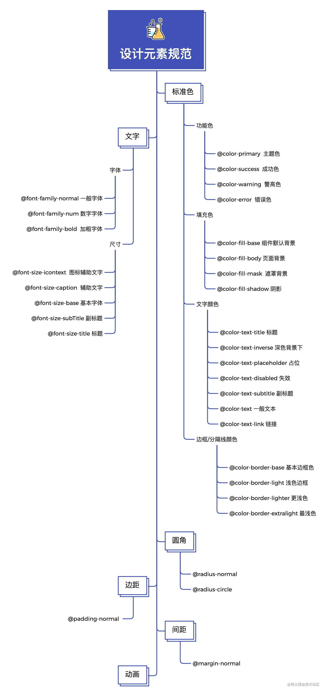

# 静态资源管理

静态资源一般指的就是图片，icons 和样式。

## 目录结构

```
├── assets
│   ├── icons/         // 存放 svg 图标
│   |── images/        // 存放图片
│   └── styles/        // 存放样式文件
```

- `images`：里面就按照分类放图片。
- `icons`：图标文件夹，放的全是 svg
- `styles`：全局样式文件
  - `reset.less`：初始化样式。（比如所有元素 padding: 0）
  - `varible.less`：通用颜色变量
  - `common.less`：通用 class。比如 clearfix，ellipsis
  - `element.less`：对 element plus 主题修改
  - `main.less`：引入 tailwind 和以上 4 个样式文件

最后只需要在 main.ts 中引入 main.less 即可。

```ts
import "./assets/styles/main.less";
```

### 基础颜色设计规范

那么`variable.less`需要设计哪些颜色变量呢？

下面这个图可以作为参考：



### 配置全局 less 变量

由于`variable.less`中是全局的颜色变量，如果要在各个组件中使用的话，每次都需要单独引入，比较麻烦，所以我们需要做一些处理，使其变成全局的方式，那么就可以在各个组件中直接使用，而无需先引入该文件了。

```ts
// vite.config.ts
{
	//...
	css: {
	  preprocessorOptions: {
	    less: {
	      javascriptEnabled: true,
	      modifyVars: {},
	      additionalData: `@import "src/assets/styles/variable.less";`,
	    },
	  },
	},
	//...
}
```

## svg 使用配置

svg 比 iconfont 优势：

- iconfont 在一倍屏幕下渲染效果并不好，在细节部分锯齿还是很明显的，SVG 上面我说过它是图形所以在浏览器中使用的是图形渲染，所以 SVG 却没有这种问题
- iconfont 只能支持单色
- iconfont 可读性不好，svg 自己可以微调，不需要重新设计
- svg 渲染性能更好
- svg 可以 tree shaking

参考：[为什么要用 SVG？- svg 与 iconfont、图片多维度对比](https://cloud.tencent.com/developer/article/1154360)

### 方案一：形成 svg 雪碧图

参考链接：

- [https://0daybug.com/posts/7e0e72c3/index.html](https://0daybug.com/posts/7e0e72c3/index.html)
- [https://blog.csdn.net/weixin_45952652/article/details/116449330](https://blog.csdn.net/weixin_45952652/article/details/116449330)

优点：配置简单，使用方便

缺点：会将所有的 svg 打包到一起（svg 雪碧图），在加载的时候全部加载，而不是按需加载。

1、安装依赖

```
npm i vite-plugin-svg-icons -D
```

2、vite 配置

```ts
// 生产svg精灵图
import { createSvgIconsPlugin } from "vite-plugin-svg-icons";

export default defineConfig(({ mode }) => {
  return {
    plugins: [
      // 生产svg精灵图
      createSvgIconsPlugin({
        // 配置路劲在你的src里的svg存放文件
        iconDirs: [path.resolve(process.cwd(), "src/assets/icons")],
        symbolId: "icon-[dir]-[name]",
      }),
    ],
  };
});
```

3、在 main.ts 中引入

```ts
import "virtual:svg-icons-register";
```

4、新增 `BaseIcon` 组件

```html
<script lang="ts" setup>
  import { computed } from "vue";

  interface IProps {
    // 图标名称，就是svg文件的名称
    name?: string;
    // 样式
    iconClass?: string;
    // 图标大小
    size?: string | number;
    //  图标颜色
    color?: string;
    // 线条的粗细
    strokeWidth?: string | number;
    // 颜色样式（如果传了color，以color为准）
    colorStyle?: "blue" | "green" | "orange" | "red" | "gray";
  }

  const props = withDefaults(defineProps<IProps>(), {
    size: 14,
    strokeWidth: 3,
  });

  // 图标名称
  const iconName = computed(() => "#icon-" + props.name);

  //  图标样式
  const iconStyle = computed(() => ({
    fontSize: typeof props.size === "string" ? props.size : `${props.size}px`,
    color: props.color,
  }));
</script>

<template>
  <svg
    class="base-icon"
    :class="[iconClass, colorStyle]"
    :style="iconStyle"
    aria-hidden="true"
  >
    <use :xlink:href="iconName" :stroke-width="strokeWidth"></use>
  </svg>
</template>

<style lang="less" scoped>
  .base-icon {
    display: inline-block;
    width: 1em;
    height: 1em;
    vertical-align: middle;
    overflow: hidden;
    fill: currentColor;
    stroke: currentColor;
    &.blue {
      color: @blue;
    }
    &.red {
      color: @red;
    }
    &.green {
      color: @green;
    }
    &.orange {
      color: @orange;
    }
    &.gray {
      color: @gray;
    }
  }
</style>
```

5、在组件中使用

```html
<BaseIcon name="logo" :size="100" />
```

### 方案二：svg 按需加载

优点：按需加载，减少体积和首页加载速度

缺点：配置麻烦，使用也麻烦

1、安装依赖

```
npm i unplugin-icons -D
```

2、vite.config.ts 配置

```ts
// icon 相关
import Icons from "unplugin-icons/vite";
import IconsResolver from "unplugin-icons/resolver";
import Components from "unplugin-vue-components/vite";
import { FileSystemIconLoader } from "unplugin-icons/loaders";

const path = require("path");
const resolve = (dir: string) => path.resolve(process.cwd(), dir);

export default defineConfig(({ mode }) => {
  const config = {
    base: "./",
    plugins: [
      //...
      Icons({
        compiler: "vue3", // vue2, vue3, jsx
        customCollections: {
          custom: FileSystemIconLoader(resolve("src/assets/icons")),
        },
      }),
      Components({
        dts: true,
        resolvers: [
          ElementPlusResolver(),
          IconsResolver({
            prefix: "icon", // 使用时名称前缀
            customCollections: ["custom"], // 对应上面customCollections的custom
          }),
        ],
      }),
      //...
    ],
  };
  return config;
});
```

3、BaseIcon 组件的封装

BaseIcon 很简单，就是简单包了一层显示 style 而已

```html
<script lang="ts" setup>
  import { computed } from "vue";
  import type { CSSProperties } from "vue";

  interface IProps {
    // 图标大小
    size?: string | number;
    //  图标颜色
    color?: string;
    // 是否旋转
    spin?: boolean;
    // 线条的粗细(1.先去掉svg图标代码中自身固定的strokeWidth，2.设置之后需要重启项目才有效果)
    strokeWidth?: string | number;
    // 旋转角度
    rotate?: number;
  }

  const props = withDefaults(defineProps<IProps>(), {
    size: 14,
    strokeWidth: 4,
  });

  const iconStyle = computed<CSSProperties>(() => ({
    fontSize: typeof props.size === "string" ? props.size : `${props.size}px`,
    color: props.color,
    strokeWidth: props.strokeWidth,
    transform: `rotateZ(${props.rotate}deg)`,
  }));
</script>

<template>
  <i class="base-icon" :class="{ spin }" :style="iconStyle">
    <slot></slot>
  </i>
</template>

<style lang="less">
  .base-icon {
    display: inline-flex;
    justify-content: center;
    align-items: center;
    height: 1em;
    width: 1em;
    fill: currentColor;
    stroke: currentColor;

    &.spin {
      animation: spinning 2s cubic-bezier(0, 0, 1, 1) infinite;
    }

    svg {
      height: 1em;
      width: 1em;
    }
  }

  @keyframes spinning {
    0% {
      transform: rotateZ(0deg);
    }
    100% {
      transform: rotateZ(360deg);
    }
  }
</style>
```

3、页面使用

简单使用：

> IconCustomAvatarUser ：前缀 icon，自定义 Custom，AvatarUser 对应的就是 avater-user.svg 文件

```html
<BaseIcon :size="24" color="#0096ff">
  <IconCustomAvatarUser />
  <!--或者-->
  <icon-custom-avatar-user />
</BaseIcon>
```

动态 icon 使用：

```html
<!--动态icon使用方式-->
<script setup>
  import IconHome from "~icons/custom/home";
  import IconSystem from "~icons/custom/manager";
  import servicePublishes from "~icons/custom/servicePublishes";
  const IconMap = {
    home: IconHome,
    system: IconSystem,
    servicePublishes: servicePublishes,
  };
</script>

<el-sub-menu v-if="config.children" :index="String(config.id)">
  <template #title>
    <BaseIcon v-if="config.icon">
      <component :is="IconMap[config.icon!]"></component>
    </BaseIcon>
    <span class="ml-2">{{ config.name }}</span>
  </template>
</el-sub-menu>
```

## 图片上 CDN

> 问题：目前图片是在 `assets/images` 目录下的，如何上传到 cdn 的？

解答：在 `public` 目录下新增 `cdn` 目录，然后拷贝一份 `assets/images` 到 `public/cdn` 目录，在 build 部署时，提取 cdn 目录到云服务器上即可。

> 问题：为什么要拷贝一份`assets/images` 到 `public/cdn` 目录？

解答：因为在 build 打包后，只有 public 目录下的文件路径是不变的，其他的都加了 hash。

### 上 cdn 后怎么使用

前端使用一个函数，先判断是否上 cdn，来决定返回本地的图片 url 或者 cdn 上的地址。

在 `/utils/cdn.ts` 中进行配置：

```ts
// domain.ts文件
const isCDN = false; // 静态资源是否上CDN
const CDNUrl = "http://res.xxx.com";
const nodeEnv = process.env.NODE_ENV || "development";

// 如果项目需要上CDN，需要将图片放在public/cdn/images目录下
export const getImageSrc = (path) => {
  if (nodeEnv === "development" || isCDN === false) {
    // 注意，此方式不支持SSR
    return new URL(`../assets/images/${path}`, import.meta.url).href;
  } else {
    return `${CDNUrl}/xxx/${path}`;
  }
};
```

最后将 getImageSrc 函数挂载到全局 window 对象上。

在项目中使用的时候，从原 import 方式，改为调用函数获取：

```ts
const loginBg = window.$getImageSrc("login.jpg");

<div class="login" :style="{ backgroundImage: `url(${loginBg})` }"></div>
```

需要在 main.ts 中将 `$getImageSrc` 注入 window：

```ts
import { getImageSrc } from "@/utils/cdn";
window.$getImageSrc = getImageSrc;
```

还需要在 env.d.ts 中声明 $getImageSrc：

```ts
/// <reference types="vite/client" />
declare interface Window {
  //...
  $getImageSrc: typeof import("@/utils/cdn")["getImageSrc"];
}
```
