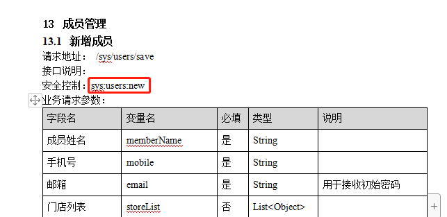

# 权限控制

权限管理分为`系统权限`，`菜单管理`和`功能管理`

## 系统权限

系统权限也叫鉴权，也就是登录功能，不登录的话无法使用系统。

前端鉴权一般有两种方式，一种是 Session-Cookie 认证，一种是 Token 认证。

具体见这篇文章：[前端鉴权方案](https://daotin.github.io/posts/2022/07/09/%E5%89%8D%E7%AB%AF%E9%89%B4%E6%9D%83%E6%96%B9%E6%A1%88.html)

## 菜单管理

菜单的管理一般会由后端返回，然后前端进行展示。

在`stores/app.ts`中会有获取菜单列表的方法：

```tsx
// 获取菜单和权限
async getMenuList(isreload = false) {
  if (this.menuList.length != 0 && isreload == false) return;
  const data = await window.$apis.common.getSysMenuNav();
  const menuList = filterMenus(data);
	// 功能权限列表
  const permissions = getPermissions(data);
	// 菜单列表
  this.menuList = menuList;
  this.menuIdUrl = getMenuIdUrl(_.cloneDeep(menuList));
  this.menuUrlId = _.invert(this.menuIdUrl);
  this.permissions = permissions;
},
```

关于前端的路由配置有两种方式：

### 方式一

**全量路由，但是菜单是后端给的（推荐）。**

相当于我们菜单是配置的路由的子集。所以普通用户通过菜单访问是 ok 的，并且通过在地址栏输入菜单之外，但是在全量路由中的地址时，也是可以进入页面的。

- 进入该页面，如果有接口请求，这时候有两种方式进行拦截操作：
  - 前端设置 permission 列表（不如下面的`路由守卫`好使），请求的接口不在该列表的，直接在请求拦截器中拦截，跳转到 error 页面
  - 后端接口校验，该用户没有该接口的权限，直接在响应拦截器进入`401`，会跳转到登录页。
- 如果没有接口请求
  - 其实可以使用`路由守卫`来判断，该路由是否在后端返回的路由里面，来进行拦截跳转到 error 页面。
    ```ts
    const routes = [
      {
        path: "/users/:id",
        component: UserDetails,
        beforeEnter: (to, from) => {
          // reject the navigation
          return false;
        },
      },
    ];
    ```
  - 其实也可以不管，如果是一个没有接口调用的静态页面，也不需要权限管理。

:::tip
这个 permission 列表，一般也是由后端，跟菜单列表一起返回的。
:::

### 方式二

**通过后端返回菜单，前端使用动态路由`addRoute`的方式，添加路由。**

## 功能管理

主要分为`接口查询`功能和`增删改操作`功能。

- 接口查询：主要是进入页面后，主动调用的接口，比如查询列表等
- 增删改操作：主要为用户点击按钮，提交表单，删除数据等主动操作导致的接口请求。

> 如何分别对`接口查询`和`增删改操作`进行权限控制呢？

接口的查询，后端会进行权限校验的，我们不用操心。

如果后端没有权限校验，我们就要使用上面 permission 列表的方式，前端进行请求拦截。

功能权限才是我们需要设置的，比如增删改操作。

> 那么，如何设置某个按钮的权限呢？

解答：使用自定义指令`v-auth`来设置。

首先，在后端下发菜单的时候，也会一并下发所有功能（一般是增删改）对应的权限 code 列表，前端会写一个自定义指令，如果某个功能按钮对应的 code，不在 code 列表中，则把该按钮移除。

### 目录结构

```
├── derectives
│   ├── modules/
│   │   └── auth.ts        // 按钮权限控制文件
│   └── index.ts           // 入口文件
```

1、auth.ts 代码

```ts
import type { Directive } from "vue";
import { checkPermission } from "@/utils";

const auth: Directive<HTMLElement, string | undefined> = {
  mounted(el, binding) {
    if (!checkPermission(binding.value)) {
      el.remove();
    }
  },
};

export default auth;
```

checkPermission 就是比对 v-auth 后面跟着的 code 是否在 code 列表中，如果没有则将该 dom 移除，也就不再显示该按钮了。

v-auth 的实现也可以采用隐藏 dom 的方式：

```ts
const auth: Directive<HTMLElement, string | undefined> = {
  bind(el, binding) {
    if (!binding.expression) return;

    let isShow = true;
    if (Array.isArray(binding.value)) {
      isShow = binding.value.every((v) => checkPermission(String(v)));
    } else {
      isShow = checkPermission(String(binding.value));
    }
    if (!isShow) {
      el.style.display = "none";
    }
  },
};
```

2、然后在 index.ts 中，注册所有的自定义指令：

```ts
import type { App, Directive } from "vue";
import auth from "./modules/auth";

const directives = { auth: auth };

export default {
  install(app: App) {
    Object.keys(directives).forEach((key) => {
      app.directive(key, directives[key]);
    });
    console.log("==directive install==");
  },
};
```

遍历所有的自定义指令，然后使用 app 注册。

3、最后在 main.ts 中注册。

```ts
import directives from "./directives";
//...

app.use(directives);
```

4、具体在页面使用方式：

```html
<el-button type="primary" v-auth="'sys:users:new'"></el-button>
```

`sys:users:new` 是后端接口文档中，在每个接口中，都会描述该接口的 authCode，只需要按照接口文档，在页面添加即可。


