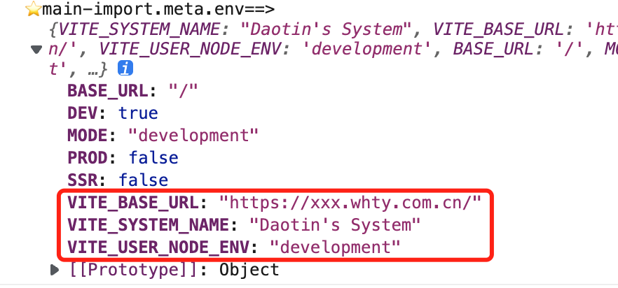

## 在 webpack 中的配置

在 webpack 中，这样设置之后，我们可以在**脚本**中使用 `process.env.NODE_ENV` 了，但是不能在**模块**中使用，要想在模块当中直接使用，我们还需要一些配置。

在 webpack 4+ 中，你可以使用 mode 选项：

```js
module.exports = {
  mode: "production",
};
```

但是在 webpack 3 及其更低版本中，你需要使用 `DefinePlugin`：

DefinePlugin 官网的解释是：DefinePlugin 允许我们创建全局变量，可以在编译时进行设置。

因此可以使用该属性来设置全局变量来区分开发环境和正式环境，这就是 DefinePlugin 的基本功能。

```js
var webpack = require("webpack");

module.exports = {
  plugins: [
    // 设置环境变量信息
    new webpack.DefinePlugin({
      PRODUCTION: JSON.stringify(true),
      VERSION: JSON.stringify("5fa3b9"),
      BROWSER_SUPPORTS_HTML5: true,
      TWO: "1+1",
      "typeof window": JSON.stringify("object"),
      "process.env": {
        NODE_ENV: JSON.stringify(process.env.NODE_ENV),
      },
    }),
  ],
};
```

## 在 vite 中的配置

**在 vite 启动后，会在 vite 内部通过 `mode` 属性，设置 `process.env.NODE_ENV`，所以我们才能在项目中使用**。

之前，我们在 scripts 命令中使用 `cross-env` 来设置 `NODE_ENV`，但是如果需要配置的环境变量太多，全部设置在 scripts 命令中既不美观也不容易维护，所以我们可以将环境变量配置在`.env` 文件中。

### `import.meta.env`

Vite 在一个特殊的 `import.meta.env` 对象上暴露环境变量。比如`import.meta.env.MODE`表示应用运行的模式。但是只有几个内置变量可用：

- `import.meta.env.MODE`: string 应用运行的模式。
- `import.meta.env.BASE_URL`: string 部署应用时的基本 URL。他由 base 配置项决定。
- `import.meta.env.PROD`: boolean 应用是否运行在生产环境。
- `import.meta.env.DEV`: boolean 应用是否运行在开发环境 (永远与 `import.meta.env.PROD` 相反)。
- `import.meta.env.SSR`: boolean 应用是否运行在 server 上。

:::tip
当我们设定 `.env` 环境变量文件后，`VITE_`开头的变量就会出现在 `import.meta.env` 中，我们就可以在项目中使用。
:::

### `.env`文件

Vite 使用 `dotenv` 从你的 环境目录 中的下列文件加载额外的环境变量：

```
.env                # 所有情况下都会加载
.env.local          # 所有情况下都会加载，但会被 git 忽略
.env.[mode]         # 只在指定模式下加载
.env.[mode].local   # 只在指定模式下加载，但会被 git 忽略

```

加载的环境变量也会通过 `import.meta.env` 以字符串形式暴露给客户端源码。

为了防止意外地将一些环境变量泄漏到客户端，只有以 `VITE_` 为前缀的变量才会暴露给经过 vite 处理的代码（**也就是说只有 `VITE_`开头的自定义变量会出现在 `import.meta.env` 中**）。

例如下面这些环境变量：

```
VITE_SOME_KEY=123
DB_PASSWORD=foobar
```

只有 `VITE_SOME_KEY` 会被暴露为 `import.meta.env.VITE_SOME_KEY` 提供给客户端源码，而 `DB_PASSWORD` 则不会。

```js
console.log(import.meta.env.VITE_SOME_KEY); // 123
console.log(import.meta.env.DB_PASSWORD); // undefined
```

当然，我们可以自定义 env 变量的前缀，请参阅 [envPrefix](https://cn.vitejs.dev/config/shared-options.html#envprefix)（不过，也没必要修改）。

## 实际测试和配置

### 测试结果

**vite.config.ts 会先于 main.ts 运行**

1、在 vite.config.ts 中：

- 在 vite 中打印 `process.env` 只有一些内置的变量，是没有任何 `NODE_ENV` 的，也没有任何 `VITE_`开头的环境变量
- 在 vite 中打印 `import.meta.env` 为 undefined

当 vite 执行完成后（大约 2s，会执行 main.ts 文件）：

2、在 main.ts 中：

- 在 main.ts 中打印 `process.env` 会报错，提示 process is not defined
- 在 main.ts 中打印 `import.meta.env` 会有除了内建变量外，还有自定义 `VITE_`开头的环境变量



3、在 main.ts 执行完成后，再到 vue 组件中看看：

- 在 login.vue 中打印 `process.env` 会报错，提示 process is not defined
- 在 login.vue 中打印 `import.meta.env` 会有除了内建变量外，还有自定义 `VITE_`开头的环境变量

跟 main.ts 中是一致的。

4、再到其他 js 文件中看看，比如 `tailwind.config.js` 文件：

- 打印 `process.env`，除了内置的变量，还多出了`VITE_USER_NODE_ENV`和`NODE_ENV`，是在 vite 中添加的（参考文章：[vite 项目为什么可以直接使用 NODE_ENV](https://daotin.github.io/posts/2022/11/16/vite%E9%A1%B9%E7%9B%AE%E4%B8%BA%E4%BB%80%E4%B9%88%E5%8F%AF%E4%BB%A5%E7%9B%B4%E6%8E%A5%E4%BD%BF%E7%94%A8NODE_ENV.html)），但是其他的`VITE_`开头的变量（比如 `VITE_BASE_URL`）不在里面。
- 打印 `import.meta.env` 会报错

### 如何配置

那么，如何得到一个完整的对象，包含 `process.env` 内置变量，`import.meta.env` 内置变量（一般用处不大），还有自定义的环境变量呢？

答案：就是使用[define](https://cn.vitejs.dev/config/shared-options.html#define)

具体设置如下，我们设置了`process.env`对象，又单独设置了`NODE_ENV`：

```js
define: {
  'process.env': {
    ...process.env,
    ...loadEnv(mode, process.cwd()),
    NODE_ENV: loadEnv(mode, process.cwd())?.VITE_USER_NODE_ENV,
  },
},
```

此时，除了 `vite.config.ts` 和 `tailwind.config.js` 外，其他的 ts 文件，vue 文件都可以在 `process.env` 拿到完整的 **`process.env` 内置变量** 和 **`VITE_`开头的自定义的环境变量** 。

- `vite.config.ts` 因为是入口，所以还是只能拿到 `process.env` 内置变量
- `tailwind.config.js` 能拿到 `process.env` 内置变量，外加 `VITE_USER_NODE_ENV`，也够用了。
- 其他地方，一律使用`process.env.VITE_USER_NODE_ENV` 或者 `process.env.NODE_ENV` 即可。

### vite.config.ts 怎么使用 env 文件定义的环境变量？

首先，它好像也用不上 env 中自定义的环境变量，实在想用，可以使用 Vite 导出的 `loadEnv` 函数来加载指定的 `.env` 文件，或者使用骚操作，[通过 node 文件读取的方式](https://github.com/vitejs/vite/issues/1930#issuecomment-778595832)进行。

毕竟尤雨溪也说过，这是个“[鸡生蛋，蛋生鸡](https://github.com/vitejs/vite/issues/1930)”的问题。
