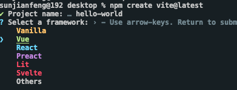
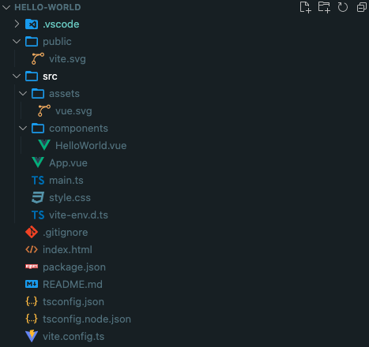
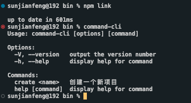
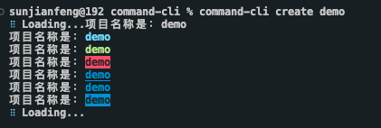
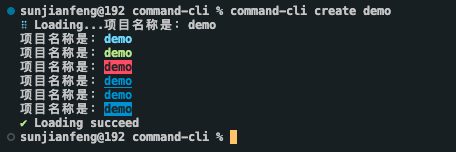
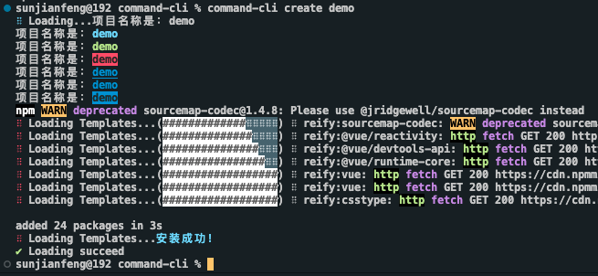
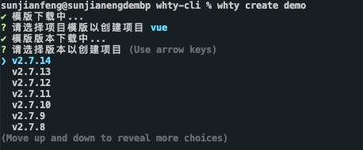
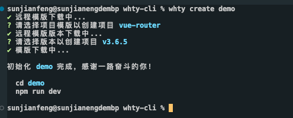
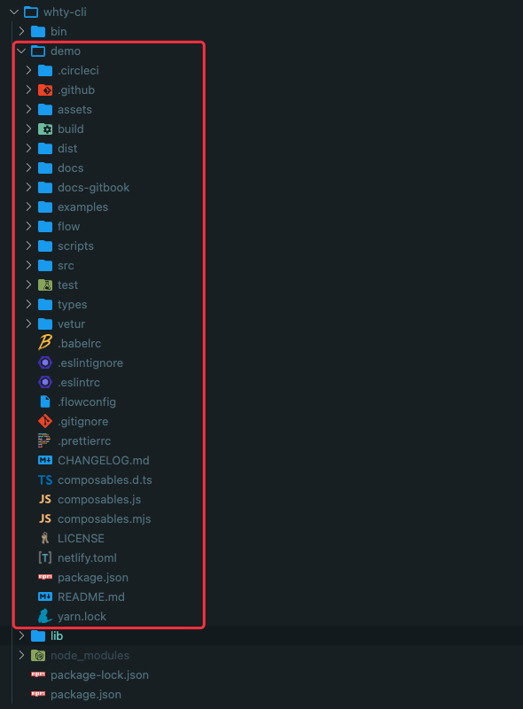
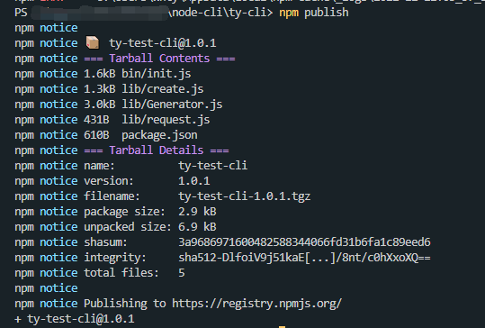

# 从零开始构建脚手架

> **作者：孙剑锋**
>
> 本人做了部分 UI 修改和少量文案修改。

搭建脚手架的目的是**快速的搭建项目的基本结构并提供项目规范和约定**。比如我们常用的 vue-cli、create-react-app、angular-cli 等等，都是通过简单的初始化命令，完成内容的快速构建。脚手架是我们常用的工具，也是团队提效的重要手段。

## 一、脚手架的简单雏形

> **脚手架在启动的时候询问一些简单的问题，并且通过用户回答的结果去渲染对应的模版文件**。
>
> 基本工作流程如下：
>
> 1. 通过命令行交互询问用户问题
> 2. 根据用户回答的结果生成文件

比如我们在使用[vite](https://cn.vitejs.dev/guide/#scaffolding-your-first-vite-project)创建一个 vue 项目的时候

#### step1：运行创建命令

```js
npm create vite@latest
```

#### step2：询问用户问题




#### step3：生成符合用户需求的项目文件



参考以上的流程，我们可以自己来搭建一个简单的脚手架。

## 二、搭建一个简单的脚手架雏形

### 1.在命令行启动 cli

目标：实现在命令行执行`demo-cli`来启动我们的脚手架。

#### 1.1 新建项目目录 demo-cli

```js
mkdir demo-cli
cd demo-cli
//生成package.json
npm init
```

#### 1.2 新建程序入口文件 index.js

在 package.json 文件中指定入口文件为 index.js，如下

```json
{
  "name": "demo-cli",
  "version": "1.0.0",
  "description": "",
  "main": "index.js",
  "bin": "index.js", // 手动添加入口文件为index.js
  "type": "module", // 注意，此处设置之后，项目中依赖的引入方式必须遵循ESM规范。
  "scripts": {
    "test": "echo \"Error: no test specified\" && exit 1"
  },
  "author": "",
  "license": "ISC"
}
```

:::details ❓ 在 package.json 中，main 和 bin 的作用和区别分别是什么？

在 package.json 文件中，"main"和"bin"是两个重要的属性。

"main"属性指定了该模块的入口文件，在使用 require()函数导入模块时会默认加载该文件。例如：

```
{
  "name": "my-module",
  "version": "1.0.0",
  "main": "index.js"
}
```

上面的示例指定了入口文件为 index.js，因此当其他模块使用 require("my-module")加载该模块时，Node.js 会自动加载 index.js 文件。

"bin"属性则用于定义命令行工具的入口文件，可以将该工具安装到全局环境中，从而可以在命令行中直接使用该工具。例如：

```
{
  "name": "my-cli-tool",
  "version": "1.0.0",
  "bin": {
    "my-tool": "./bin/my-tool.js"
  }
}
```

上面的示例定义了一个命令行工具"my-tool"，并将其入口文件指定为"./bin/my-tool.js"。当用户在命令行中执行"my-tool"命令时，Node.js 会自动加载该文件并执行其中的代码。

因此，"main"属性用于指定模块的入口文件，而"bin"属性用于指定命令行工具的入口文件。两者的作用和使用场景不同，但都是 package.json 文件中非常常用的属性。

:::

此时，项目目录结构

```
demo-cli
├─ index.js
└─ package.json
```

打开 index.js 进行编辑

```js
#! /usr/bin/env node

// #! 是用于指定脚本的解释程序
// Node CLI 应用入口文件必须要有这样的文件头
console.log("hello world");
```

#### 1.3 npm link 链接到全局

库包在开发或迭代后，不适合发布到线上进行调试（过程繁琐且会导致版本号膨胀）。`npm link`可以帮助我们模拟包安装后的状态，它会在系统中做一个快捷方式映射，让本地的包就好像 install 过一样，可以直接使用。可以用`npm unlink`解除链接。

```
npm link
```

执行完成


现在可以来测试一下，在命令行中输入 demo-cli 执行一下

```
demo-cli
```

就可以看到命令行中打印的内容了


### 2.询问用户信息

实现询问用户信息的功能需要引入[inquirer](https://link.juejin.cn?target=https%3A%2F%2Fgithub.com%2FSBoudrias%2FInquirer.js%2F)

```js
npm install inquirer
// or
yarn add inquirer
```

然后在 index.js 中设置我们的问题

```js
#! /usr/bin/env node

import inquirer from "inquirer";

inquirer
  .prompt([
    {
      type: "input",
      name: "name", // key
      message: "你的名字", // 提示信息
      default: "demo-cli", // 默认值
    },
  ])
  .then((answer) => {
    console.log(answer);
  });
```

在命令行输入 demo-cli，看下执行结果


### 3.生成对应文件

#### 3.1 新建模版文件夹

```js
mkdir templates
```

#### 3.2 新建 index.html 和 base.css 两个实例文件

```html
<!DOCTYPE html>
<html lang="en">
  <head>
    <meta charset="UTF-8" />
    <meta http-equiv="X-UA-Compatible" content="IE=edge" />
    <meta name="viewport" content="width=device-width, initial-scale=1.0" />
    <title><!-- ejs语法 --> <%= name %></title>
  </head>
  <body>
    <h1><%= name %></h1>
  </body>
</html>
```

```css
body {
  margin: 20px auto;
  background-color: #000;
}
```

此时的目录结构

```json
demo-cli
├─ templates
│  ├─ base.css
│  └─ index.html
├─ index.js
├─ package-lock.json
└─ package.json
```

#### 3.3 完善文件生成逻辑

这里借助 ejs 模版引擎将用户输入的信息渲染到模版上

```js
npm install ejs --dev
// or
yarn add -D ejs
```

完善 index.js

```js
#! /usr/bin/env node

import inquirer from "inquirer";
import path from "path";
import fs from "fs";
import ejs from "ejs";

// 在最新的ESModule中，没有全局变量 __dirname，所以需要自己定义变量才能使用
import { fileURLToPath } from "node:url";
import { dirname } from "node:path";
const __dirname = dirname(fileURLToPath(import.meta.url));

inquirer
  .prompt([
    {
      type: "input",
      name: "name", // key
      message: "你的名字", // 提示信息
      default: "demo-cli", // 默认值
    },
  ])
  .then((answer) => {
    // 模版文件目录
    const destUrl = path.join(__dirname, "templates");
    // 生成文件目录
    const cwdUrl = process.cwd();
    // 从模版目录中读取文件
    fs.readdir(destUrl, (err, files) => {
      if (err) throw err;
      files.forEach((file) => {
        // 使用ejs渲染对应的模版文件
        ejs.renderFile(path.join(destUrl, file), answer).then((data) => {
          // 生成ejs处理后的模版文件
          fs.writeFileSync(path.join(cwdUrl, file), data);
        });
      });
    });
  });
```

:::details ❓ 代码详细解释

这段代码是一个简单的命令行工具，它使用 Node.js 编写，并利用了 `inquirer` 和 `ejs` 这两个库。它的主要功能是获得用户输入的名字，然后根据模板文件生成相应的文件。下面我会详细解释每一部分的功能。

1. `#! /usr/bin/env node` 这一行是一个 [shebang ↗](<https://en.wikipedia.org/wiki/Shebang_(Unix)>) ，它告诉操作系统这个文件是一个 Node.js 脚本。

2. 导入所需的依赖库。

   - `inquirer` 用于获取命令行用户输入。
   - `path` 是 Node.js 的内置库，用于处理文件和目录路径。
   - `fs` 也是 Node.js 的内置库，用于文件系统操作。
   - `ejs` 是一个轻量级的模板引擎，用于根据模板生成文件。

3. 在 ESModule 中，全局变量 `__dirname` 未定义。因此，需要导入 `fileURLToPath` 和 `dirname` 函数来创建 `__dirname` 变量，表示当前文件所在的目录。

4. 使用 `inquirer.prompt` 函数向用户显示一个问题，要求用户输入名字。这个函数返回一个 Promise，当用户输入完成后，会将用户的输入作为参数传递给 `.then()` 方法。

5. 在 `.then()` 方法内部，首先定义模板文件目录 `destUrl` 和生成文件目录 `cwdUrl`。

6. 使用 `fs.readdir()` 函数读取模板文件目录，然后遍历其中的每个文件。对于每个文件：

   - 使用 `ejs.renderFile()` 函数根据用户输入的名字渲染模板文件。
   - 在渲染完成后，将生成的文件保存到生成文件目录中。

这样，当运行这个脚本时，用户会被提示输入名字，然后程序会根据模板文件生成相应的文件。
:::

在命令行执行一下 demo-cli，此时 index.html、base.css 已经成功创建

```json
demo-cli
├─ templates
│  ├─ base.css
│  └─ index.html
├─ base.css        // 生成的对应的base.css文件
├─ index.html  		 //	生成的对应的index.html文件
├─ index.js
├─ package-lock.json
└─ package.json
```

打开生成 index.html 文件

```html
<!DOCTYPE html>
<html lang="en">
  <head>
    <meta charset="UTF-8" />
    <meta http-equiv="X-UA-Compatible" content="IE=edge" />
    <meta name="viewport" content="width=device-width, initial-scale=1.0" />
    <title><!-- ejs语法 --> demo-cli</title>
  </head>
  <body>
    <h1>demo-cli</h1>
  </body>
</html>
```

可以看到用户输入的 `{ name: 'demo-cli' }` 已经添加到生成的 html 文件中了。

## 三、常用脚手架工具库

实际生产中搭建一个脚手架或者我们在阅读其他脚手架源码的时候需要了解下面这些工具库

| 名称                                                                                                                      | 简介                                                             |
| ------------------------------------------------------------------------------------------------------------------------- | ---------------------------------------------------------------- |
| [commander](https://link.juejin.cn?target=https%3A%2F%2Fgithub.com%2Ftj%2Fcommander.js%2Fblob%2Fmaster%2FReadme_zh-CN.md) | 命令行自定义指令                                                 |
| [inquirer](https://link.juejin.cn?target=https%3A%2F%2Fgithub.com%2FSBoudrias%2FInquirer.js%2F)                           | 命令行询问用户问题，记录回答结果                                 |
| [chalk](https://link.juejin.cn?target=https%3A%2F%2Fwww.npmjs.com%2Fpackage%2Fchalk)                                      | 控制台输出内容样式美化                                           |
| [ora](https://link.juejin.cn?target=https%3A%2F%2Fwww.npmjs.com%2Fpackage%2Fora)                                          | 控制台 loading 样式                                              |
| [figlet](https://link.juejin.cn?target=https%3A%2F%2Fwww.npmjs.com%2Fpackage%2Ffiglet)                                    | 控制台打印 logo                                                  |
| [easy-table](https://link.juejin.cn?target=https%3A%2F%2Fwww.npmjs.com%2Fpackage%2Feasy-table)                            | 控制台输出表格                                                   |
| [download-git-repo](https://link.juejin.cn?target=https%3A%2F%2Fwww.npmjs.com%2Fpackage%2Fdownload-git-repo)              | 下载远程模版                                                     |
| [fs-extra](https://link.juejin.cn?target=https%3A%2F%2Fwww.npmjs.com%2Fpackage%2Ffs-extra)                                | 系统 fs 模块的扩展，提供了更多便利的 API，并继承了 fs 模块的 API |
| [cross-spawn](https://link.juejin.cn?target=https%3A%2F%2Fwww.npmjs.com%2Fpackage%2Fcross-spawn)                          | 支持跨平台调用系统上的命令                                       |

在这里主要介绍下面这些，其他的工具可以查看相关的说明文档

### 1.commander 自定义命令行指令

简单案例

#### 1.1 新建一个简单的 Node Cli 项目

ps：具体流程参照上一章节

```json
{
  "name": "command-cli",
  "version": "1.0.0",
  "description": "",
  "main": "./bin/index.js",
  "bin": "bin/index.js",
  "type": "module", // 注意，此处设置之后，项目中依赖的引入方式必须遵循ESM规范。
  "scripts": {
    "test": "echo \"Error: no test specified\" && exit 1"
  },
  "author": "",
  "license": "ISC",
  "dependencies": {
    "commander": "^9.4.1"
  }
}
```

```json
command-cli
├─ bin
│  └─ index.js
├─ package-lock.json
└─ package.json
```

#### 1.2 引入 commander

```js
npm install commander
// or
yarn add commander
```

完善 index.js 代码

```js
#! /usr/bin/env node

import { program } from "commander";

program
  .version("1.0.0")
  .command("create <name>")
  .description("创建一个新项目")
  .action((name) => {
    // 打印命令行输入的项目名称
    console.log("项目名称是：" + name);
  });

program.parse();
```

#### 1.3npm link 链接到全局

- 执行 `npm link`将应用链接到全局
- 完成之后，在命令行中执行`command-cli`

可以看到命令行中输出的内容<br />



此时就有了`command-cli`命令使用的说明信息，在命令行中执行一下<br />


这个时候控制台就打印出来 create 命令后面`<name>`的值`demo`

### 2.chalk 命令行美化工具

[chalk](https://link.juejin.cn?target=https%3A%2F%2Fwww.npmjs.com%2Fpackage%2Fchalk)可以美化我们在命令行中输出内容的样式，例如对重点信息添加颜色<br />我们在 command-cli 项目中进行完善。

#### 2.1 安装 chalk

```js
npm install chalk
// or
yarn add chalk
```

#### 2.2 基本使用

打开`bin/index.js`，并完善代码

```js
#! /usr/bin/env node

import { program } from "commander";
import chalk from "chalk";

program
  .version("1.0.0")
  .command("create <name>")
  .description("创建一个新项目")
  .action((name) => {
    // 打印命令行输入的项目名称

    // 文本样式
    console.log("项目名称是：" + chalk.bold(name));

    // 颜色
    console.log("项目名称是：" + chalk.cyan(name));
    console.log("项目名称是：" + chalk.green(name));

    // 背景色
    console.log("项目名称是：" + chalk.bgRed(name));

    // 使用RGB颜色输出
    console.log("项目名称是：" + chalk.rgb(4, 156, 219).underline(name));
    console.log("项目名称是：" + chalk.hex("#049CDB").bold(name));
    console.log("项目名称是：" + chalk.bgHex("#049CDB").bold(name));
  });

program.parse();
```

在命令行中执行`command-cli create demo`，查看打印内容


更多样式可以查看[chalk](https://link.juejin.cn?target=https%3A%2F%2Fwww.npmjs.com%2Fpackage%2Fchalk)文档

### 3.inquirer 命令行交互工具

[inquirer](https://link.juejin.cn?target=https%3A%2F%2Fgithub.com%2FSBoudrias%2FInquirer.js%2F)工具的基本使用已在**脚手架的简单雏形**中使用到了，在这里不再过过多介绍，更多用法可以查看[inquirer](https://link.juejin.cn?target=https%3A%2F%2Fgithub.com%2FSBoudrias%2FInquirer.js%2F)文档。

### 4.ora 命令行 loading 动效

#### 4.1 安装 ora

```js
npm install ora
// or
yarn add ora
```

#### 4.2 基本使用

```js
import ora from "ora";

const message = "Loading...";
const spinner = ora(message);
spinner.start();

setTimeout(() => {
  spinner.color = "red";
  spinner.text = "Loading Templates...";

  setTimeout(() => {
    // 加载状态修改
    spinner.stop(); // 停止
    spinner.succeed("Loading succeed"); // 成功 ✔
    // spinner.fail(text?);  失败 ✖
    // spinner.warn(text?);  提示 ⚠
    // spinner.info(text?);  信息 ℹ
  }, 2000);
}, 2000);
```

在命令行中执行`command-cli create demo`，查看执行结果<br />





### 5.cross-spawn 跨平台 shell 工具

#### 5.1 安装 cross-spawn

```js
npm install cross-spawn
// or
yarn add cross-spawn
```

#### 5.2 基本使用

```js
import spawn from "cross-spawn";

// 定义需要需要安装的依赖
const dependencies = ["vue", "vuex", "vue-router"];

// 执行安装
const child = spawn("npm", ["install", "-D"].concat(dependencies), {
  stdio: "inherit",
});

// 监听执行结果
child.on("close", (code) => {
  // 执行失败
  if (code !== 0) {
    console.log(chalk.red("安装过程出现错误！"));
    process.exit(1);
  }
  // 执行成功
  else {
    console.log(chalk.cyan("安装成功！"));
  }
});
```

在命令行中执行`command-cli create demo`，查看执行结果



## 四、搭建 whty-cli 脚手架

我们已经对脚手架的基本雏形和常用的工具库都有所了解了，现在我们就来搭建自己的脚手架吧。<br />**需要实现的基本功能**：

1. 通过命令行启动项目
2. 询问用户需要选择下载的模版
3. 远程拉取模版文件

**搭建步骤**：

1. 创建项目
2. 创建脚手架启动命令（使用 commander）
3. 询问用户问题获取所需信息（使用 inquirer）
4. 下载远程模版（使用 download-git-repo）
5. 发布项目

### 1.创建项目

参照前面章节的例子，先创建一个简单的 Node-Cli 结构

```json
whty-cli
├─ bin
│  └─ init.js
└─ package.json
```

配置脚手架启动文件

```json
{
  "name": "whty-cli",
  "version": "1.0.0",
  "description": "一个前端脚手架",
  "main": "index.js",
  "bin": {
    "whty": "./bin/init.js"
  },
  "scripts": {
    "test": "echo \"Error: no test specified\" && exit 1"
  },
  "author": {
    "name": "sunjianfeng",
    "email": "sunjianfeng@whty.com.cn"
  },
  "license": "ISC"
}
```

简单编辑下 init.js

```js
#! /usr/bin/env node

console.log("whty-cli working~~~");
```

`npm link`链接到全局<br />


完成之后，测试一下<br />


可以看到控制台已经打印出了我们想要的内容。

### 2.创建脚手架启动命令

先分析下我们要怎么做：

1. 要借助 commander 依赖去实现
2. 参照 vue-cli 常用的命令有 create、config 等，也可以使用 vue ui 进行可视化创建
3. 如果创建的内容存在，需要提示是否覆盖

#### 2.1 安装依赖

```js
npm install commander
```

#### 2.2 创建命令

编辑 init.js

```js
#! /usr/bin/env node

const { program } = require("commander");
const pkg = require("../package.json");

program
  .command("create <app-name>")
  .description("创建一个新项目")
  // -f or --force 为强制创建，如果创建的目录存在则直接覆盖
  .option("-f --force", "覆盖当前目录或者退出程序")
  .action((name, options) => {
    console.log("name:", name, "options:", options);
  });

program.version(`v${pkg.version}`).usage("<command> [option]");

program.parse(process.argv);
```

在命令行执行`whty`，查看命令是否创建成功


可以看到 Commands 下面已经有了`create [options] <app-name>`，接着执行一下这个命令<br />


可以看到我们已经成功拿到命令行输入的信息

#### 2.3 执行命令

创建`lib`文件夹并在文件夹下创建`create.js`

```js
module.exports = async function (name, options) {
  console.log(">>>create.js", name, options);
};
```

在 init.js 中使用 create.js

```js
...

program
  .command('create <app-name>')
  .description('创建一个新项目')
  // -f or --force 为强制创建，如果创建的目录存在则直接覆盖
  .option('-f --force', '覆盖当前目录或者退出程序')
  .action((name, options) => {
    require('../lib/create')(name, options)
  })

...
```

执行一下`whty create demo`，此时在 create.js 正常打印了我们输入的信息


在创建目录的时候，需要思考一个问题：目录是否已存在？

1. 已存在
   1. 当`{ force: true }`时，直接移除原来的目录，创建目录
   2. 当`{ force: false }`时，询问用户是否覆盖
2. 不存在，直接创建目录

我们在这里用到了 fs 的扩展工具[fs-extra](https://link.juejin.cn?target=https%3A%2F%2Fwww.npmjs.com%2Fpackage%2Ffs-extra)，我们先安装一下

```js
npm install fs-extra
```

完善一下 create.js 内部的逻辑

```js
const path = require("path");
const fs = require("fs-extra");

module.exports = async function (name, options) {
  // 当前命令行选择的目录
  const cwd = process.cwd();
  // 需要创建的目录地址
  const targetDir = path.join(cwd, name);
  // 目录是否已存在
  if (fs.existsSync(targetDir)) {
    // 是否创建创建
    if (options.force) {
      await fs.remove(targetDir);
    } else {
      // TODO: 询问用户是否确定要覆盖
    }
  }
};
```

询问部分的逻辑，我们在下一章节继续完善。

#### 2.4 创建更多命令

如果想添加其他命令也是相同的处理方式，示例如下：

```js
...

// 配置config命令
program
  .command('config [value]')
  .description('检查并修改配置')
  .option('-g, --get <path>', '从选项中获取值')
  .option('-s, --set <path> <value>')
  .option('-d, --delete <path>', '从配置中删除选项')
  .action((value, options) => {
    console.log(value, options)
  })

// 配置ui命令
program
  .command('ui')
  .description('开始并添加open whty-cli ui')
  .option('-p, --port <port>', '用于UI服务的端口')
  .action((option) => {
    console.log(option)
  })

...
```

#### 2.5 完善帮助信息

我们可以看下 vue-cli 执行`--help`打印的消息


对比我们执行`whty --help`打印的结果，结尾处多了一条说明信息，我们进行下补充。这里注需要注意：说明信息时带有颜色的，所以这里就要用到[chalk](https://www.npmjs.com/package/chalk

)来处理

```js
...

program
  .on('--help', () => {
    // 新增说明信息
    console.log(`\r\nRun ${chalk.cyan(`whty <command> --help`)} show details\r\n`)
  })

...
```

#### 2.6 打印一个 Logo

如果我们想给脚手架配置一个 Logo，可以使用工具库的[figlet](https://www.npmjs.com/package/figlet)

```js
...

program
  .on('--help', () => {
    // 使用figlet绘制logo
    console.log('\r\n' + figlet.textSync('whty', {
      font: 'Standard',
      horizontalLayout: 'default',
      verticalLayout: 'default',
      width: 80,
      whitespace: true
    }));

    // 新增说明信息
    console.log(`\r\nRun ${chalk.cyan(`whty <command> --help`)} show details\r\n`)
  })

...
```

再执行下`whty --help`，看下控制台输出的内容<br />


### 3.询问用户问题，获取创建所需信息

接下来我们要做的：

1. 询问用户是否覆盖已存在的目录
2. 用户选择模版
3. 用户选择人版本
4. 获取下载模版的链接

#### 3.1 询问是否覆盖已存在的目录

我们先完成 2.3 章节的遗留问题。先安装一下

```js
npm install inquirer
```

然后询问用户是否覆盖目录

```js
const path = require("path");
const fs = require("fs-extra");
const inquirer = require("inquirer");

module.exports = async function (name, options) {
  // 当前命令行选择的目录
  const cwd = process.cwd();
  // 需要创建的目录地址
  const targetDir = path.join(cwd, name);
  // 目录是否已存在
  if (fs.existsSync(targetDir)) {
    // 是否创建创建
    if (options.force) {
      await fs.remove(targetDir);
    } else {
      // 询问用户是否确定要覆盖
      let { action } = await inquirer.prompt([
        {
          name: "action",
          type: "list",
          message: `${targetDir}目录已存在，请选择操作：`,
          choices: [
            {
              name: "覆盖",
              value: "overwrite",
            },
            {
              name: "取消",
              value: false,
            },
          ],
        },
      ]);

      if (!action) {
        return;
      } else if (action === "overwrite") {
        // 移除已存在的目录
        console.log(`\r\nRemoving...`);
        await fs.remove(targetAir);
      }
    }
  }
};
```

我们测试一下：

1. 在当前目录，即命令行中显示的目录下手动创建 2 个目录，例如：demo、demo1
2. 执行`whty create demo`，效果如下


3. 执行`whty create demo1 -f`或`whty create demo1 --force`，可有看到 demo1 目录被直接移除

目前这里只做了目录的移除，目录的创建我们在获取到模版地址后，下载的时候会进行。

#### 3.2 如何获取模版信息

这里我们拿 vuejs 远程仓库为例（或者使用你自己的远程仓库的项目模版）。<br />github 提供了

- [https://api.github.com/orgs/vuejs/repos](https://api.github.com/orgs/vuejs/repos) 接口获取模版信息
- [https://api.github.com/repos/vuejs/${repo}/tags](https://api.github.com/repos/vuejs/${repo}/tags) 接口获取版本信息

先安装 `axios`

```js
npm install axios
```

在 lib 目录下创建一个`request.js`专门处理模版和版本信息的获取

```js
const axios = require("axios");

axios.interceptors.response.use((res) => {
  return res.data;
});

// 获取模版列表
async function fetchRepoList() {
  return await axios.get("https://api.github.com/orgs/vuejs/repos");
}

// 获取版本信息
async function fetchTagList(repo) {
  return await axios.get(`https://api.github.com/repos/vuejs/${repo}/tags`);
}

module.exports = {
  fetchRepoList,
  fetchTagList,
};
```

#### 3.3 用户选择模版

我们创建一个`Generator.js`来处理项目创建逻辑

```js
class Generator {
  constructor(name, targetDir) {
    // 目录名称
    this.name = name;
    // 创建位置
    this.targetDir = targetDir;
  }

  // 创建方法
  create() {}
}
```

在`create.js`中引入 Generator 类

```js
...
const Generator = require('./Generator')

module.exports = async function (name, options) {
  // 当前命令行选择的目录
  const cwd = process.cwd()
  // 需要创建的目录地址
  const targetDir = path.join(cwd, name)
  // 目录是否已存在
  if (fs.existsSync(targetDir)) {
    ...
  }

  // 创建项目
  const generator = new Generator(name, targetDir)

  // 开始创建项目
  generator.create()
}
```

接着来完善询问用户选择模版的逻辑

```js
const { fetchRepoList } = require("./request");
const ora = require("ora");
const inquirer = require("inquirer");

// 添加加载动画
async function loading(fn, message, ...args) {
  // 使用ora初始化，传入提示信息message
  const spinner = ora(message);
  // 开始动画
  spinner.start();

  try {
    // 执行传入方法fn
    const result = await fn(...args);
    // 状态改为成功
    spinner.succeed();
    return result;
  } catch (error) {
    // 状态改为失败
    spinner.fail("请求失败...");
  }
}

class Generator {
  constructor(name, targetDir) {
    // 目录名称
    this.name = name;
    // 创建位置
    this.targetDir = targetDir;
  }

  // 获取用户选择的模版
  async getRepo() {
    // 从远程仓库获取项目模版
    const repoList = await loading(fetchRepoList, "模版下载中...");
    if (!repoList) return;

    // 过滤需要的模版名称
    const repos = repoList.map((item) => item.name);
    // 用户选择下载的模版名称
    const { repo } = await inquirer.prompt({
      name: "repo",
      type: "list",
      choices: repos,
      message: "请选择项目模版以创建项目",
    });

    return repo;
  }

  // 创建方法
  async create() {
    // 获取模版名称
    const repo = await this.getRepo();
    console.log("用户选择了，repo=" + repo);
  }
}

module.exports = Generator;
```

测试一下，看看控制台输出的内容


默认选择了 vue，此时


成功拿到我们想要的信息

#### 3.4 用户选择版本

此过程和上一章节相同

```js
const { fetchRepoList, fetchTagList } = require('./request')
...

// 添加加载动画
async function loading (fn, message, ...args) {
  ...
}

class Generator {
  constructor(name, targetDir) {
    // 目录名称
    this.name = name
    // 创建位置
    this.targetDir = targetDir
  }

  // 获取用户选择的模版
  async getRepo() {
    ...
  }

  // 获取用户选择的版本
  async getTag(repo) {
    // 基于repo，远程拉取对应的tag列表
    const tags = await loading(fetchTagList, '模版版本下载中...', repo)
    if (!tags) return

    // 过滤我们需要的tag
    const tagList = await tags.map(item => item.name)

    // 用户选择需要下载的tag
    const { tag } = await inquirer.prompt({
      name: 'tag',
      type: 'list',
      choices: tagList,
      message: '请选择版本以创建项目'
    })

    return tag
  }

  // 创建方法
  async create() {
    // 获取模版名称
    const repo = await this.getRepo()

    // 获取版本名称
    const tag = await this.getTag(repo)

    console.log('用户选择了，repo=' + repo + ', tag=' + tag)
  }
}

module.exports = Generator
```

我们再来测试一下，执行`whty create demo`



选择版本之后，控制台打印的信息


至此，询问用户相关内容就结束了，可以进行模版下载

### 4.下载远程模版

下载远程模版需要使用[download-git-repo](https://link.juejin.cn?target=https%3A%2F%2Fwww.npmjs.com%2Fpackage%2Fdownload-git-repo)工具包，在使用的时候需要注意：它不支持 promise，所以需要使用 util 模块中的[promisify](https://link.juejin.cn/?target=http%3A%2F%2Fnodejs.cn%2Fapi%2Futil.html%23util_util_promisify_original)方法进行 promise 化

#### 4.1 安装依赖与 promise 化

```js
npm install download-git-repo
```

进行 promise 化处理

```js
...

const util = require('util')
const downloadGitRepo = require('download-git-repo')

class Generator {
  constructor(name, targetDir) {
    // 目录名称
    this.name = name
    // 创建位置
    this.targetDir = targetDir
    // 进行promise化处理。它返回一个新的函数，这个新函数与原来的 downloadGitRepo 函数功能相同，但返回的是一个 Promise 对象
    this.downloadGitRepo = util.promisify(downloadGitRepo)
  }

  ...
}
```

#### 4.2 下载功能

以下就是下载部分的逻辑

```js
...
const util = require('util')
const downloadGitRepo = require('download-git-repo')
const path = require('path')
const chalk = require('chalk')

...

class Generator {
  constructor(name, targetDir) {
    ...

    // 对 download-git-repo 进行promise化处理
    this.downloadGitRepo = util.promisify(downloadGitRepo)
  }

  ...

  // 下载远程模版
  async download(repo, tag) {
    // 拼接下载地址
    const requestUrl = `vuejs/${repo}${tag?'#'+tag:''}`
    // 调用下载方法
    await loading(
      this.downloadGitRepo, // 下载方法
      '模版下载中...', // 加载提示信息
      requestUrl, // 下载地址
      path.resolve(process.cwd(), this.targetDir // 项目创建位置
    ))
  }

  // 创建方法
  async create() {
    ...

    // 下载模版到目录
    await this.download(repo, tag)

    // 模版创建提示
    console.log(`\r\n初始化 ${chalk.cyan(this.name)} 完成，感谢一路奋斗的你！`)
    console.log(`\r\n  cd ${chalk.cyan(this.name)}`)
    console.log('  npm run dev\r\n')
  }
}

module.exports = Generator
```

至此，一个简单的脚手架就完成了。

我们来测试一下，执行`whty create demo`



这个时候，我们可以看到模版已经创建好了



### 5.发布项目

以上我们都是在本地进行的测试，在实际使用中，可能需要发布到 npm 仓库，通过 npm 全局安装之后，直接到目标目录下面去创建项目。那么如何发布呢？

1. 在 git 上创建好仓库
2. 完善 package.json 配置

```json
{
  "name": "whty-cli",
  "version": "1.0.0",
  "description": "一个前端脚手架",
  "main": "index.js",
  "bin": {
    "ty": "./bin/init.js"
  },
  "scripts": {
    "test": "echo \"Error: no test specified\" && exit 1"
  },
  "author": {
    "name": "sunjianfeng",
    "email": "sunjianfeng@whty.com.cn"
  },
  "keywords": ["ty", "cli"],
  "license": "ISC",
  "dependencies": {
    "axios": "^1.2.1",
    "chalk": "^4.1.2",
    "commander": "^9.4.1",
    "download-git-repo": "^3.0.2",
    "figlet": "^1.5.2",
    "fs-extra": "^11.1.0",
    "inquirer": "^8.2.5",
    "ora": "^5.4.1"
  }
}
```

3. 使用 `npm publish`将项目发布至 npm，更新的时候，注意修改版本号。



至此，我们的脚手架就发布成功了。

注意：npm 上项目包的名称与我们一开始定义的不一致，这是由于之前的包名称已经被别人使用了，所以我们把 package.json 中的 name 修改一下即可。

我们的项目发布成功之后，就可以通过 npm 或 yarn 全局安装使用了。


## 五、搭建自己的 create-vue3-template 模板脚手架 dt-vue3-cli

项目模板地址为：https://github.com/Daotin/create-vue3-template

脚手架地址：https://github.com/Daotin/dt-vue3-cli

创建自己的项目成功！🎉


至此，我们的脚手架就构建发布完毕了！
