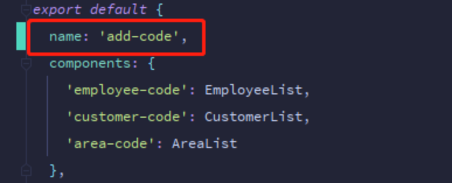
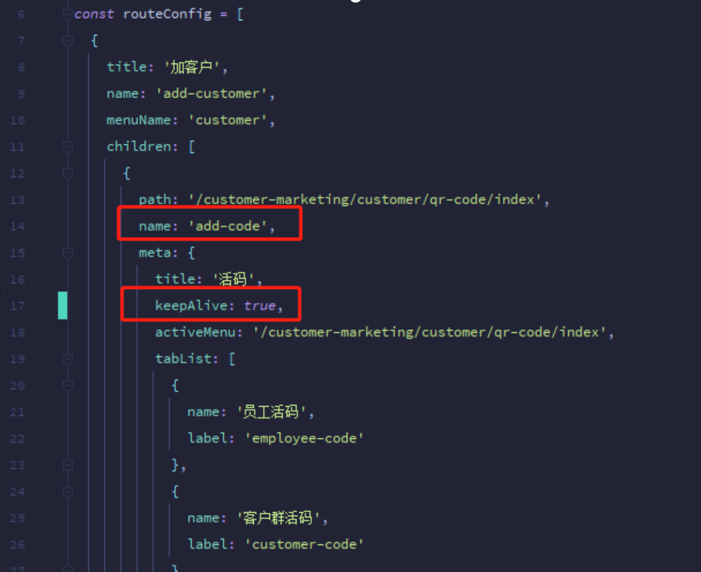

# PC 端列表页面缓存技术方案

## **需求背景**

列表=>详情=>列表，项目中列表跳转详情再回到列表的场景较多，就用户体验角度而言，期望的效果是，从详情页面回来时，列表的状态是保持不变的，其中就包括滚动位置（移动端），分页参数（pc 端），查询条件等。.

## **缓存规则**

1. 项目中所有列表页都需要做缓存处理；
2. 列表进详情，在详情中如没有新增，编辑等改变列表数据的操作，则保留列表页缓存，反之则需要清除列表页面缓存；
3. 列表进入新增页，如果没有新增成功，则保留列表页缓存，反之则需要清除列表页面缓存；

## **解决方案**

1. keep-alive 的定义：[keep-alive](https://cn.vuejs.org/v2/api/#keep-alive)
2. 使用 keep-alive 组件中 include 属性，在 store 中维护一个缓存列表 keepAliveList，并提供新增，删除，清空的方法，可依据实际场景动态改变缓存数组。

```js
// layout.vue
// 页面使用keep-alive做缓存处理
<keep-alive :include="keepAliveList">
  <router-view></router-view>
</keep-alive>

// store
const state = {
  keepAliveList: []
};
const mutations = {
  /**
   * 更新缓存列表
   * @param state
   * @param payload 分三种类型  add - 新增  delete - 删除  clear - 清空
   */
  updateKeepAliveList(state, payload) {
    const { type, name } = payload;
    if (type === 'add') {
      const hasOne = state.keepAliveList.some(v => v === name);
      !hasOne && state.keepAliveList.push(name);
    } else if (type === 'delete') {
      state.keepAliveList = state.keepAliveList.filter(v => v !== name);
    } else if (type === 'clear') {
      state.keepAliveList = [];
    }
  }
};

// 组件内清除缓存 （比如新增活码成功后清除活码列表的缓存）
this.$store.commit('keep-alive/updateKeepAliveList', {
  name: 'add-code',
  type: 'delete'
});
```

3. 使用说明

- 在需要缓存的页面，首先页面组件的 name 必须等于 路由配置文件里的 name；另外路由配置中 meta 定义 keep-alive：true。





- 在全局路由守卫 beforeEach 中：(开发者无需处理)

  

- 经过设置后，在 meta 元信息中配置了 keepAlive 的组件即可被缓存。
- 如何清缓存：通常列表->详情->列表，列表是不用清缓存的，但是比如你在列表页跳转到新增页面，新增完数据后回到列表页是需要刷新列表页缓存获取到最新的数据的，那么我们需要手动调用清缓存的方法。调用时机通常是，在新增接口调用成功后，返回列表页之前。

```js
this.$store.commit("keep-alive/updateKeepAliveList", {
  name: "add-code", // 需要清除的组件name
  type: "delete", // 清除固定传 delete
});
```

（完）
