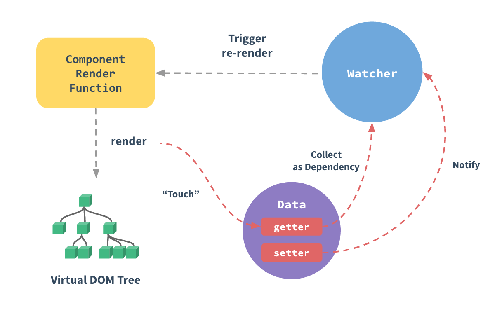

# 响应式系统

:::tip 面试官：简要介绍下 vue2 的响应式原理。

1. Vue 2 的响应式系统核心是通过 `Object.defineProperty()` 来劫持数据对象的属性，将数据对象的属性转换为 getter 和 setter。
2. 当组件渲染时，会触发 getter，此时 Vue 会将正在渲染的组件作为依赖收集到一个依赖收集器（Dep）中。
3. 当数据发生变化时，setter 会被调用，通知之前收集的依赖进行更新。

:::



## vue2 响应式简易实现原理

下面是一个简化的代码示例，演示 vue2 的响应式工作原理：[参看代码 observer1.js](/observer/observer1.js)

代码解释:

1. `Vue` 类: 这是我们的主类,模拟了 Vue 实例。它在构造函数中初始化数据,并调用 `observe` 方法来使数据变为响应式。

2. `observe` 方法: 遍历数据对象的所有属性,对每个属性调用 `defineReactive` 方法。

3. `defineReactive` 方法: 这是实现响应式的核心。它使用 `Object.defineProperty` 来重新定义属性的 getter 和 setter。

   - getter: 当属性被访问时,如果有正在收集依赖的目标(`Dep.target`),就将其添加到依赖列表中。
   - setter: 当属性被修改时,通知所有依赖进行更新。

4. `Dep` 类: 依赖收集器,管理与某个响应式属性相关的所有观察者(Watcher)。

5. `Watcher` 类: 观察者,负责在数据变化时执行更新操作。

6. `compile` 方法: 简化版的模板编译,它查找模板中的 `{ { } }` 插值,并为每个插值创建一个 Watcher。

## 组件渲染 Watcher

::: warning

上面的代码示例中，是对每个属性都会创建一个新的 Watcher。

在 Vue 2 的实际实现中，对于普通的数据属性（如您例子中的 name 和 age），不会为每次使用都创建一个 Watcher。相反，每个组件只有一个渲染 Watcher，负责整个组件模板的渲染。这个渲染 Watcher 会被添加到模板中使用的所有响应式属性的 Dep 中，但每个 Dep 只会包含这个渲染 Watcher 一次。

:::

所以，Vue 2 实际的实现逻辑：

1. 对于每个组件，Vue 只创建一个渲染 Watcher。这个 Watcher 负责该组件的整个模板的渲染。

2. 依赖收集过程：在渲染过程中，每当访问到一个响应式属性（例如在模板中使用 name），该属性的 getter 会被触发。在 getter 中，当前的渲染 Watcher 会被添加到该属性对应的 Dep 中。

3. 多次使用同一属性：即使一个属性在模板中被使用多次，它的 getter 只会将同一个渲染 Watcher 添加到 Dep 中一次。因为 Dep 使用一个集合（Set）来存储 Watcher，确保不会重复添加同一个 Watcher。

4. 更新过程：当 name 或 age 发生变化时，它们会通知各自的 Dep。Dep 然后会通知其中的渲染 Watcher。这个渲染 Watcher 会触发组件的重新渲染，更新所有使用了这些属性的地方。

5. 优化：Vue 2 使用虚拟 DOM 来优化更新过程。即使一个属性在模板中使用多次，也只需要一次比对就能确定所有需要更新的地方。

:::info

问：我大概明白了，就是对于组件只有一个 Watcher，但是不同的属性的 Dep，都会只添加一次这个 Watcher 是吧？假设 name 和 age 都变了，那么会执行两个 Dep 中的 watcher，因为 watcher 是同一个，所以会执行两次吗？

:::

您说得对，对于一个组件确实只有一个渲染 Watcher，而且不同属性的 Dep 中都会添加这个相同的 Watcher（但每个 Dep 中只添加一次）。关于多个属性变化时 Watcher 的执行，情况是这样的：

1. Watcher 的去重机制：Vue 2 在 Watcher 中实现了一个智能的去重机制。当一个 Watcher 被触发时，它不会立即执行更新，而是被标记为"脏"（dirty）。Vue 使用一个队列来收集所有"脏"的 Watcher，并在下一个"tick"中统一更新。

2. 多个属性变化的情况：假设 name 和 age 都变化了。两个属性的 Dep 都会通知它们共同的渲染 Watcher。但是，这个 Watcher 只会被添加到更新队列中一次。

3. 更新过程：在下一个"tick"，Vue 会遍历更新队列。渲染 Watcher 只会执行一次更新操作，这次更新会处理所有变化的数据。这意味着组件只会重新渲染一次，而不是每个变化的属性都触发一次渲染。

这种机制大大提高了 Vue 的性能，避免了不必要的重复渲染。

具体代码见：[observer2.js](/observer/observer2.js)

代码解释：

1. 渲染 Watcher：

   - 在 Vue 构造函数中，我们创建了一个渲染 Watcher（`this.$watcher`）。
   - 这个 Watcher 负责整个组件的渲染，对应 Vue 2 中的组件级 Watcher。

2. Dep 类的改进：

   - 使用 Set 来存储订阅者，确保不会重复添加同一个 Watcher。

3. Watcher 类的改进：

   - 添加了`deps`和`newDeps`来管理依赖关系。
   - 实现了`addDep`和`cleanupDeps`方法来处理依赖的添加和清理。
   - `update`方法不再直接触发更新，而是将自身加入更新队列。

4. 异步更新队列：

   - 实现了`queueWatcher`函数，用于将 Watcher 加入队列。
   - 使用 Promise 来模拟 Vue 2 中的 nextTick 机制。
   - `flushQueue`函数负责在下一个事件循环中执行所有队列中的 Watcher 更新。

5. 渲染函数：
   - 简化的`render`方法模拟了模板的渲染过程。

## 单个属性 watcher

:::info
还有一个小问题，在 vue2 具体的实现中，是否还存在单个元素的 watcher 呢？

:::

在 Vue 2 的实际实现中，除了组件级别的渲染 Watcher，还存在其他类型的 Watcher，包括您提到的单个元素的 Watcher。让我详细解释一下：

1. 渲染 Watcher（Render Watcher）：

   - 这是我们之前讨论的主要类型，每个组件有一个。
   - 负责整个组件模板的渲染。

2. 计算属性 Watcher（Computed Watcher）：

   - 每个计算属性都有自己的 Watcher。
   - 用于懒计算和缓存计算属性的值。

3. 侦听器 Watcher（User Watcher）：

   - 由用户通过 `watch` 选项或 `$watch` 方法创建。
   - 用于观察特定数据变化并执行自定义逻辑。

4. 指令 Watcher：

   - 某些指令（如 `v-for`、`v-if` 等）可能会创建自己的 Watcher 来处理局部的更新逻辑。

5. 单个元素 Watcher：
   - 在某些特殊情况下，Vue 2 确实会为单个元素创建 Watcher。
   - 这通常发生在使用某些高级特性时，比如：
     a. `v-for` 指令中使用 `track-by`。
     b. 使用 `v-if` / `v-else` / `v-else-if` 进行条件渲染。
     c. 动态组件（使用 `<component :is="...">`）。

这些单个元素的 Watcher 主要用于优化性能，允许 Vue 在某些情况下进行更细粒度的更新，而不是重新渲染整个组件。

举个例子，考虑以下模板：

```html
<div v-for="item in items" :key="item.id">{{ item.name }}</div>
```

在这种情况下，Vue 可能会为每个列表项创建一个 Watcher，以便在 items 数组发生变化时能够高效地更新 DOM，而不是重新渲染整个列表。

然而，需要注意的是：

1. 这些细粒度的 Watcher 是 Vue 内部优化的结果，并不直接暴露给开发者。
2. Vue 会根据具体情况决定是否创建这些额外的 Watcher，以平衡性能和内存使用。
3. 在大多数情况下，组件级别的渲染 Watcher 已经足够高效，Vue 不需要创建额外的单元素 Watcher。

总的来说，虽然 Vue 2 确实在某些情况下使用单个元素的 Watcher，但这是作为一种内部优化机制，而不是响应式系统的主要部分。

在日常开发中，我们主要关注的是组件级别的响应式和更新机制。只有在需要进行高级性能优化时，才可能需要考虑这些更细节的实现。

## 代理

:::info
现在我们的代码是通过 app.$data.name 进行更新数据的，但是在 vue 实际开发中，我们通常使用 this.name 直接修改，请问 vue 是如何做到的？

:::

1. 数据代理

Vue 实现这一特性的主要机制是"数据代理"。在 Vue 实例创建过程中，它会对 data 对象的属性进行代理。这意味着 Vue 会在实例上创建与 data 中属性同名的属性，并将这些属性的 getter 和 setter 代理到`$data`上对应的属性。

2. 实现方式

Vue 使用`Object.defineProperty`（在 Vue 3 中是 Proxy）来实现这种代理。大致过程如下：

```javascript
class Vue {
  constructor(options) {
    this.$data = options.data;
    this.observe(this.$data);
    this.proxy(this.$data); // 新增：代理数据
    // ... 其他初始化代码 ...
  }

  observe(data) {
    // ... 保持原有的观察者逻辑 ...
  }

  proxy(data) {
    Object.keys(data).forEach((key) => {
      Object.defineProperty(this, key, {
        get() {
          return this.$data[key];
        },
        set(newValue) {
          this.$data[key] = newValue;
        },
      });
    });
  }

  // ... 其他方法 ...
}

// 使用示例
const app = new Vue({
  el: '#app',
  data: {
    name: 'Vue',
    count: 0,
  },
});

console.log(app.name); // 输出: 'Vue'
app.name = 'Vue 2'; // 这会触发响应式更新
console.log(app.$data.name); // 输出: 'Vue 2'
```

这样，当你访问或修改`app.name`时，实际上是在访问或修改`app.$data.name`。

## vue 何时完成收集依赖的

:::info
在上面代码例子中，当我把响应式数据写到 template 中时，是第一次渲染实际数据的时候完成依赖收集的吗？vue 实际上也是在第一次渲染真实数据的时候收集依赖的吗？

:::

1. 我们的简化实现：

在我们的简化代码中，确实是在第一次渲染实际数据时完成依赖收集。这发生在`render`方法被调用时：

- 当我们访问数据（如`data[key]`）来替换模板中的插值表达式时，会触发属性的 getter。
- 在 getter 中，如果存在`Dep.target`（即当前正在评估的 Watcher），就会将这个 Watcher 添加到属性的依赖列表中。
- 这就完成了依赖收集。

2. Vue 的实际实现：

Vue 的实际实现与我们的简化版本在原理上是相似的，但更加复杂和优化。在 Vue 中，依赖收集确实主要发生在首次渲染过程中，但还有一些细节需要注意：

a) 编译阶段：

- Vue 首先会将模板编译成渲染函数。
- 这个过程发生在数据被实际渲染之前。

b) 首次渲染：

- 当组件挂载时，渲染函数被调用。
- 在这个过程中，会创建一个渲染 Watcher。
- 渲染 Watcher 被设置为`Dep.target`。
- 然后，渲染函数开始执行，访问数据属性。
- 每次访问响应式属性时，都会触发 getter，完成依赖收集。

c) 动态依赖：

- Vue 的依赖收集是动态的。这意味着即使在首次渲染后，如果模板中使用的数据发生变化（比如 v-if 条件改变），也可能会收集新的依赖或移除旧的依赖。

d) 计算属性和侦听器：

- 这些特殊的属性可能在组件生命周期的不同阶段收集依赖。

总的来说，Vue 确实主要在第一次渲染真实数据的时候收集依赖。但它也能在后续的更新中动态地调整依赖关系。
