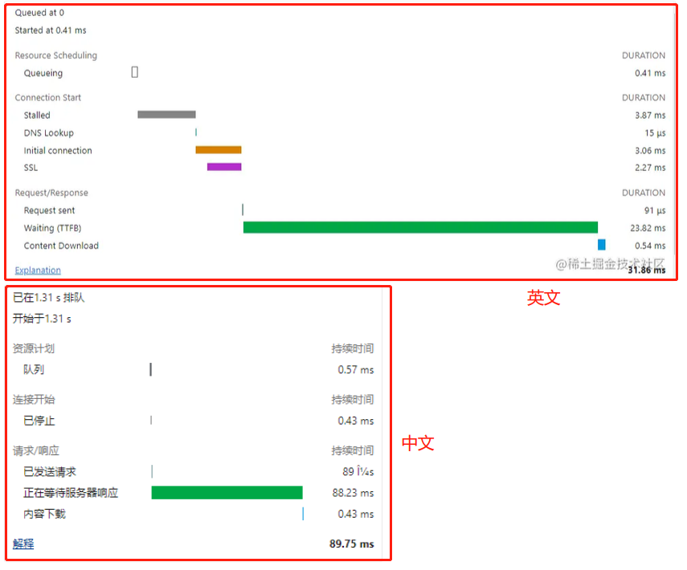

# 通过瀑布图分析前端性能问题

## 瀑布图字段含义

瀑布图：是请求不同阶段的图形表示。

下面是各个字段的解释：

### Queueing 队列

该请求等待排队时间。可能的原因如下：

- 该请求被渲染引擎推迟了，因为它被认为比关键资源（例如脚本/样式）的优先级低。这通常发生在图像上。
- 由于浏览器在 HTTP 1 上每个源仅允许六个 TCP 连接，因此该请求被暂停。
- 与代理服务器连接进行协商所花费的时间。

### stalled 已停止

浏览器得到要发出这个请求的指令到请求可以发出的等待时间，一般是代理协商，以及等待可复用的 TCP 连接释放的时间，不包括 DNS 查询、建立 TCP 连接的时间

### DNS Lookup DNS 查找

与代理服务器连接进行协商所花费的时间。每个新域 pagerequires DNS 查找一个完整的往返。 DNS 查询的时间，当本地 DNS 缓存没有的时候，这个时间可能是有一段长度的，但是比如你一旦在 host 中设置了 DNS，或者第二次访问，由于浏览器的 DNS 缓存还在，这个时间就为 0 了。

### Initial connection 初始连接

建立 TCP 连接的时间，就相当于客户端从发请求开始到 TCP 握手结束这一段，包括 DNS 查询+Proxy 时间+TCP 握手时间。

### SSL

完成 SSL 握手所花费的时间。

> 下面是开发中最应该关注的：

### Request sent 已发送请求

请求第一个字节发出前到最后一个字节发出后的时间，也就是上传时间

### Waiting(TTFB) 等待服务器响应

请求发出后，到收到响应的第一个字节所花费的时间(Time To First Byte),发送请求完毕到接收请求开始的时间;这个时间段就代表服务器处理和返回数据网络延时时间了。服务器优化的目的就是要让这个时间段尽可能短。

### Content Download 内容下载

收到响应的第一个字节，到接受完最后一个字节的时间，就是下载时间。

## 如何根据瀑布图进行优化

1、Started 过长

Started = Queued + Queueing

- 检查静态资源是否过大，导致请求延后，将资源进行分包
- 检查请求是否链式调用（比如是否使用了`Promise.all`），可以考虑将请求同步发起，如果真的是后一个请求依赖前一个请求，考虑是否有更好的方案

2、Stalled 停滞过长
通常表示请求在真正开始之前等待的时间。这个时间段可能包括代理协商、队列等待时间以及其他延迟。当你在浏览器的网络面板中看到一个请求的 Stalled 时间过长，这可能是由以下原因引起的：

- **超出了最大并发连接数**：如前所述，浏览器对于同一域名的并发请求有限制。如果同时发出多个请求，超出这个限制的请求将被放入队列中等待，这会增加停滞时间。
- **代理协商**：如果你使用了代理服务器，请求可能需要一些时间来与代理服务器协商。
- **磁盘缓存查找**：如果浏览器正在查找资源的磁盘缓存，这也可能导致停滞延迟。
- **等待前一个请求完成**：例如，一个请求可能需要另一个请求的结果作为输入。

为了优化`Stalled`时间，你可以考虑以下策略：

- **减少请求数量**：
  - 合并小文件（如 CSS 或 JavaScript 文件）。
  - 使用雪碧图或 SVG 符号来合并多个图像。
  - 使用 Web 字体子集，只加载所需的字符。
- **使用 HTTP/2**：如前所述，HTTP/2 支持多路复用，可以减少停滞时间。
- **避免使用代理**：如果可能的话，尝试直接连接到服务器，而不是通过代理。
- **优化缓存策略**：确保资源被正确地缓存，以减少对磁盘缓存的查找。
- **优先处理关键请求**：确保关键资源的请求优先于其他非关键资源。
- **使用 CDN**：使用内容分发网络（CDN）可以减少请求的往返时间，从而减少停滞时间。

3、DNS 查找过长

- 使用浏览器缓存或 DNS 预解析技术。

> DNS 预解析：`<link rel="dns-prefetch" href="//example.com">`
>
> 除了 `dns-prefetch`，还有其他预解析技术，如 `preconnect`，它不仅解析 DNS，还预先建立 TCP 连接和 TLS 握手（如果是 HTTPS）。

4、Waiting  过长

- 先与后端沟通接口是否可以调优（优化后端逻辑，数据库查询，减少服务器的计算时间等）

5、Content Download 过长

- 接口响应长（是否多返回了无用的字段）
- 压缩响应数据，使用 Gzip 或 Brotli。
