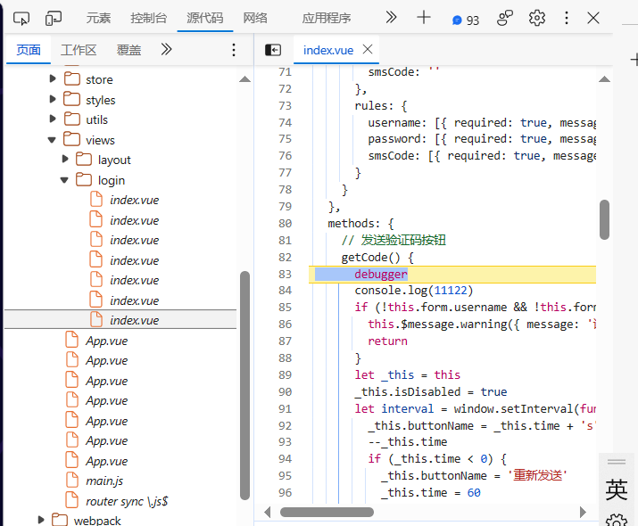
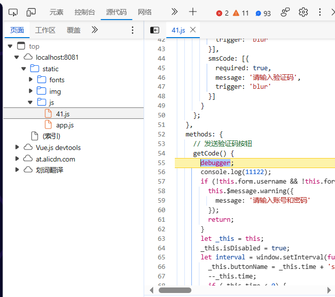
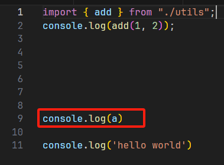
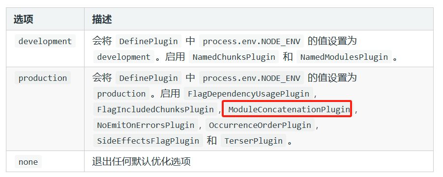

## entry

指定 webpack 的打包⼊⼝

单⼊⼝：entry 是⼀个字符串, 多⼊⼝：entry 是⼀个对象

```js
module.exports = {
  entry: './path/to/my/entry/file.js',
};

module.exports = {
  entry: {
    app: './src/app.js',
    adminApp: './src/adminApp.js',
  },
};
```

## output

告诉 webpack 如何将编译后的⽂件输出到磁盘。

```js
module.exports = {
	entry: './path/to/my/entry/file.js'
	output: {
		filename: 'bundle.js’,
		path: __dirname + '/dist'
	}
};

// 多出口配置
module.exports = {
	entry: {
		app: './src/app.js',
		search: './src/search.js'
	},
	output: {
		filename: '[name].js', // 通过占位符确保文件名称唯一
		path: __dirname + '/dist'
	}
};
```

## loaders

webpack 开箱即用只支持 JS 和 JSON 两种文件类型，通过 Loaders 去支持其它文件类型并且把它们转化成有效的模块，并且可以添加到依赖图中。

本身是一个函数，接受源文件作为参数，返回转换的结果。

语法：

```js
const path = require('path');
module.exports = {
  output: {
    filename: 'bundle.js',
  },
  module: {
    rules: [
      { test: /\.txt$/, use: 'raw-loader' }, // 需要先npm i raw-loader -D
    ],
  },
};
```

## plugins

插件⽤于 bundle ⽂件的优化，资源管理和环境变量注⼊,作⽤于整个构建过程。

比如打包前，删除 dist 目录，自动生成 dist 下 html 文件等一些不属于 loader 做的事情。

用法：

```js
const path = require('path');
module.exports = {
  output: {
    filename: 'bundle.js',
  },
  plugins: [new HtmlWebpackPlugin({ template: './src/index.html' })],
};
```

### 常用 loader 和 plugin 配置

> ==注意：这些 loader 都需要先经过 npm i 安装！==

```js
const path = require('path');

module.exports = {
  entry: './src/index.js',
  output: {
    filename: 'bundle.js',
    path: path.resolve(__dirname, 'dist'),
  },
  module: {
    rules: [
      // 解析 ES6
      {
        test: /\.js$/,
        use: 'babel-loader',
      },
      // css-loader ⽤于加载 .css ⽂件，并且转换成 commonjs 对象导出
      // style-loader 将导出的样式通过 <style> 标签插⼊到 head 中
      // loader加载的顺序是右边先执行！
      {
        test: /\.css$/,
        use: ['style-loader', 'css-loader'],
      },
      // 解析less
      {
        test: /\.less$/,
        use: ['style-loader', 'css-loader', 'less-loader'],
      },
      // 解析图片，字体首选url-loader或者file-loader，url-loader比file-loader多了options配置，可以设置较⼩资源⾃动 base64
      {
        test: /\.(png|svg|jpg|gif)$/, // test: /\.woff|woff2|eot|ttf|otf)$/
        use: [
          {
            loader: 'url-loader',
            options: {
              limit: 10240, // 10kB
            },
          },
        ],
      },
    ],
  },
};
```

> babel-loader 需要配置`.babelrc`：

```json
{
  "presets": [
    "@babel/preset-env" // 一个配置集合
  ],
  "plugins": [
    "@babel/proposal-class-properties" // 单独的配置
  ]
}
```

## 文件监听

两种方式：

- 启动 webpack 命令时，带上 --watch 参数
- 在配置 webpack.config.js 中设置 watch: true

缺点：页面需要手动刷新。

原理：**轮询判断⽂件的最后编辑时间是否变化。如果某个⽂件发⽣了变化，并不会⽴刻告诉监听者，⽽是先缓存起来，等 aggregateTimeout。**

```js
module.export = {
  //默认 false，也就是不开启
  watch: true,
  //只有开启监听模式时，watchOptions才有意义
  wathcOptions: {
    //默认为空，不监听的文件或者文件夹，支持正则匹配
    ignored: /node_modules/,
    //监听到变化发生后会等300ms再去执行，默认300ms
    aggregateTimeout: 300,
    //判断文件是否发生变化是通过不停询问系统指定文件有没有变化实现的，默认每秒问1000次
    poll: 1000,
  },
};
```

## 热更新

webpack-dev-server 优点：

- 不需要手动刷新页面
- 文件修改后的编译不输出文件到硬盘，而是到内存，速度更快

使用方式：使⽤ webpack 内置 HotModuleReplacementPlugin 插件，不需要额外安装。

```js
const path = require('path');
const webpack = require('webpack');

module.exports = {
  entry: './src/index.js',
  output: {
    path: path.join(__dirname, 'dist'),
    filename: 'bundle.js',
  },
  mode: 'development',
  plugins: [new webpack.HotModuleReplacementPlugin()],
  devServer: {
    contentBase: './dist', // webpack-dev-server服务的目录
    hot: true, // 开启热更新
  },
};
```

另外，还有一个`webpack-dev-middleware`也可以热更新，当后端使用的是 Express 或另一个 Node.js 框架作为你的服务器，可以将 `webpack-dev-middleware` 集成到现有的 Node.js 服务器中，这样就不需要运行一个额外的服务器（如 `webpack-dev-server`）来处理前端的热更新。

但是，由于是前后端分离开发，专门让后端搞一个对后端来说没用的东西也不太合理，除非是前后端都是一个人开发。

所以，最好的选择还是 webpack-dev-server。

### 热更新原理

首先来看看一张图，如下：


几个概念：

- `Webpack Compile`：将 JS 源代码编译成 bundle.js
- `HMR Server`：websocket 服务端，用来将热更新后的文件输出给 HMR Runtime
- `Bundle Server`：静态资源文件服务器，提供文件访问路径
- `HMR Runtime`：websocket 客户端，会被注入到浏览器，监听服务端更新文件的消息（在 HMR Runtime 和 HMR Server 之间建立 websocket，即图上 4 号线，用于实时更新文件变化）
- `bundle.js`：构建输出的文件（包含具体的源代码和 websocket 客户端）

上面图中，可以分成两个阶段：启动阶段和热更新阶段。

#### 启动阶段：1-2-A-B

主要过程包括以下几个步骤：

1. **Webpack 编译**：Webpack 开始编译项目源代码和 HMR Runtime，生成 bundle 文件。
2. **文件传输**：编译后的 bundle 文件传输到 Bundle Server，即静态资源服务器。
3. **服务启动**：Webpack-dev-server 启动并运行，包括一个提供静态资源的 Express 服务器和一个 WebSocket 服务器（HMR Server）。
4. **建立连接**：浏览器加载 bundle 文件，并通过 HMR Runtime 与 HMR Server 建立 WebSocket 连接。

这个过程确保了应用启动时，所有必要的资源都被加载并准备好，同时建立了必要的实时更新机制。

#### 热更新阶段：1-2-3-4

在热更新阶段的流程包括以下几个关键步骤：

1. **文件监听和编译**：Webpack 监听到文件的变化，对改动的文件重新编译，并生成新的 bundle 和和补丁文件，以及生成唯一的 hash 值，作为下一次热更新的标识。

记住两个 hash，一个是上一次的 hash 为 1240，一个为本次更新的 hash 为 2381。

补丁文件包括更新内容的（hot-update.js）和 manifest 文件（包含变化描述的 hot-update.json）。


2. **通知客户端**：当文件变化的时候，HMR Server 通过 WebSocket 连接向浏览器的 HMR Runtime 发送通知，告知有模块更新。websocket 服务器会向浏览器推送一条消息（如下图），data 为最新改动的 hash 值。


但是，这个最新的 hash 只是为了下一次更新使用的，而不是本次更新使用，本次更新使用的是上一次的 hash，也就是 hash 为 1240 的。

3. **请求文件**：此时，浏览器会创建一个 ajax 去想服务端请求说明变化内容的 manifest 文件，为了获得改动的模块名，在返回值的 c 字段可以拿到。（h 为最新的 hash 值，浏览器会默默保存，为了下次文件更新使用）


4. 拿到了更新的模块名，结合之前的 hash，再发起 ajax 请求获取改动的文件内容，然后触发 render 流程，实现局部热加载。


参考：

- https://juejin.cn/post/6844904134697549832
- https://vue3js.cn/interview/webpack/HMR.html

## 文件指纹

**什么是文件指纹？**

源代码在 webpack 打包后，生成的带有 hash 的文件名和后缀的就是文件指纹。

文件指纹可以由以下占位符组成：

```
占位符名称	含义
ext	资源后缀名
name	文件名称
path	文件的相对路径
folder	文件所在的文件夹
hash	每次webpack构建时生成一个唯一的hash值
chunkhash	根据chunk生成hash值，来源于同一个chunk，则hash值就一样
contenthash	根据内容生成hash值，文件内容相同hash值就相同
```

语法：

```js
filename: '[name]_[chunkhash:8].js';
```

**为什么要引入文件指纹？**

文件指纹（hashing）的引入主要是为了优化网络应用的缓存机制和提高资源加载效率。

在 Web 开发的早期阶段，当开发者更新网站上的 JavaScript、CSS 或其他静态资源时，用户的浏览器往往会因为缓存策略而继续使用旧版本的文件，导致网站显示不正常或功能异常。为了解决这个问题，引入文件指纹技术，通过在文件名中加入基于内容的唯一标识符（如哈希值），使得每次文件内容更新后文件名都会变化，从而强制浏览器加载新版本的文件，避免了缓存导致的问题。

**文件指纹分类**

1. **Hash**：针对整个构建过程生成的唯一标识。所有的输出文件都共享同一个`Hash`值。当任何一个文件修改，整个项目的 Hash 值将改变。适用于项目小或者不关注缓存优化时使用。
2. **Chunkhash**：根据不同的入口文件（Entry）生成的标识，每个入口文件（及其依赖的文件）构建出的结果有独立的`Chunkhash`。适用于那些文件引用不经常变化的项目，可以更好地利用缓存。
3. **Contenthash**：由文件内容产生的 Hash 值，仅当文件内容改变时`Contenthash`才会改变。这种方式特别适合用于 CSS 文件或其他在 Webpack 中单独抽离出的资源文件，确保内容实际改变时才重新请求文件。

> 注意： 如果你的 Webpack 配置只有一个 entry 点，且只生成一个 bundle 文件，那么使用`hash`和`chunkhash`生成的效果实际上是一样的。因为整个构建的输出仅有一个文件，所以无论使用哪种 hash 方法，该文件的 hash 值都会在内容变更后更新。
>
> 然而，一旦引入代码分割，生成多个 chunk（例如，通过动态导入或多个 entry 点），`hash`和`chunkhash`的行为就不再相同。
> `hash`会为所有文件生成相同的 hash 值，导致任何一个文件的更改都会使所有文件的 hash 值变化；而`chunkhash`为每个独立的 chunk 生成独立的 hash 值，仅当特定 chunk 的内容变化时，该 chunk 的 hash 值才会更新，这样更利于缓存管理和减少不必要的下载。

**各种文件指纹最佳实践**

一般使用 Chunkhash 和 Contenthash，Hash 的方式基本不使用。

在生产环境下，我们对打包的**js 文件**一般采用 `chunkhash`，对于**css，图片、字体**等静态文件，采用 `contenthash`，这样可以使得各个模块最小范围的改变打包 hash 值。

一方面，可以最大程度地利用浏览器缓存机制，提升用户的体验；另一方面，合理利用 hash 也减少了 webpack 再次打包所要处理的文件数量，提升了打包速度。

_提问：如果使用只有一个 entry 入口，并且采用 chunkhash+代码拆分，如果此时打包成 bundle1 和 bundle2 两个模块，如果 bundle1 对应的源代码有修改，bundle2 打包后的 chunkhash 会改变吗？_

在使用单个 entry 入口，并且通过代码拆分打包成`bundle1`和`bundle2`两个模块的情况下，如果`bundle1`的源代码有修改，通常`bundle2`打包后的`chunkhash`不会改变。`chunkhash`是基于 chunk 的内容生成的，所以只有当特定 chunk 的内容发生变化时，该 chunk 的 hash 值才会更新。如果`bundle2`的内容未发生改变，即使`bundle1`改变，`bundle2`的`chunkhash`也保持不变，这样有利于优化缓存和减少不必要的资源下载。

参考：

- https://www.cnblogs.com/skychx/p/webpack-hash-chunkhash-contenthash.html
- https://juejin.cn/post/6971987696029794312

## 代码压缩

### html 压缩

安装 html-webpack-plugin，设置压缩参数。

```js
plugins: [
  new HtmlWebpackPlugin({
    template: path.join(__dirname, 'src/index.html'), // 模板文件
    filename: 'index.html', // 输出文件的名称
    chunks: ['index'], // 指定要加入的entry中的chunk
    inject: true, // 将所有资产注入给定的template或templateContent - 当传递true或'body'时，所有javascript资源将放置在body元素的底部。'head'将放置在head元素中
    // 更多配置：https://github.com/terser/html-minifier-terser#options-quick-reference
    minify: {
      html5: true, // 根据HTML5规范解析输入
      collapseWhitespace: true, // 折叠空白字符
      preserveLineBreaks: false, // 保留换行符
      minifyCSS: true, // 压缩页面CSS
      minifyJS: true, // 压缩页面JS
      removeComments: false, // 移除注释
    },
  }),
];
```

### css 压缩

使⽤用 optimize-css-assets-webpack-plugin，同时使⽤用 cssnano

```js
'use strict';

const path = require('path');
const MiniCssExtractPlugin = require('mini-css-extract-plugin');
const OptimizeCSSAssetsPlugin = require('optimize-css-assets-webpack-plugin');

module.exports = {
  plugins: [
    new MiniCssExtractPlugin({
      filename: '[name]_[contenthash:8].css',
    }),
    new OptimizeCSSAssetsPlugin({
      assetNameRegExp: /\.css$/g,
      cssProcessor: require('cssnano'),
    }),
  ],
};
```

### js 压缩

内置了了 uglifyjs-webpack-plugin，并且自动压缩。

如果要自己配置，需要手动安装 uglifyjs-webpack-plugin 然后配置。


## 自动清理构建目录

**1、使用rimraf库**
`rimraf` 是一个用于 Node.js 的包，常用于删除文件和目录。它是一个跨平台的实现，类似于 Unix 系统中的 `rm -rf` 命令，可以递归地删除目录及其内容。

安装：
```
npm install rimraf -D
```

设置：
```json
{
  "scripts": {
    "build": "rimraf ./dist && vue-cli-service build"
  }
}
```

**2、使用clean-webpack-plugin插件**

安装：
```
npm i clean-webpack-plugin@^2 -D
```
> 注意安装的版本为2（最新的为4）

```js
const { CleanWebpackPlugin } = require('clean-webpack-plugin');

module.exports = {
  // 其他配置项
  plugins: [
    new CleanWebpackPlugin()
  ]
};

```

## ⾃动补⻬ CSS3 前缀

安装：
```
npm install css-loader style-loader postcss-loader autoprefixer -D

```

配置 `webpack.config.js`：
```js
const path = require('path');

module.exports = {
  entry: './src/index.js',
  output: {
    filename: 'bundle.js',
    path: path.resolve(__dirname, 'dist')
  },
  module: {
    rules: [
      {
        test: /\.css$/,
        use: [
          'style-loader',
          'css-loader',
          {
            loader: 'postcss-loader',
            options: {
              postcssOptions: {
                plugins: [
                  ['autoprefixer', { /* 插件选项 */ }]
                ]
              }
            }
          }
        ]
      }
    ]
  }
};

```

3、配置 PostCSS
在项目根目录下创建一个 postcss.config.js 文件，以便配置 PostCSS 和 Autoprefixer 插件：
```js
module.exports = {
  plugins: [
    require('autoprefixer')
  ]
};
```

## 自动px转viewport

参考：[使用viewport代替rem](https://github.com/Daotin/Web/blob/master/07-%E7%A7%BB%E5%8A%A8Web%E5%BC%80%E5%8F%91/09-em%E5%92%8Crem.md#%E4%BD%BF%E7%94%A8viewport%E4%BB%A3%E6%9B%BFrem)

## sourcemap配置

`vue.config.js` 文件中配置 `devtool` 选项：
```js
module.exports = {
  // 根据环境变量判断是否生成 source map，并指定 source map 类型
  productionSourceMap: process.env.NODE_ENV !== 'production',
  configureWebpack: config => {
    if (process.env.NODE_ENV === 'development') {
      // 开发环境下使用 eval-source-map
      config.devtool = 'eval-source-map';
    } else if (process.env.NODE_ENV === 'production') {
      // 生产环境下使用 source-map
      config.devtool = 'source-map';
    }
  }
};
```

下图为开发环境使用了sourcemap的调试效果：



下图为开发环境关闭使用sourcemap的调试效果，不是源码（上下会有很多其他代码）：



> ❓在**开发环境**生成sourcemap，要怎么使用呢？

当开发环境生成了 source map 文件并且浏览器加载这些文件后，浏览器会自动解析 source map 文件并将压缩或混淆后的代码映射到源文件。开发者不需要进行任何额外的操作。具体过程如下：

1. **自动加载**：
   - 浏览器在加载 JavaScript 文件时，会检查这些文件是否包含 source map 注释。这些注释通常是这样的形式：
     ```javascript
     //# sourceMappingURL=main.js.map
     ```
   - 如果存在这个注释，浏览器会自动请求并加载对应的 source map 文件（如 `main.js.map`）。

2. **解析 source map**：
   - 浏览器加载并解析 source map 文件，将压缩或混淆后的代码映射到源文件。这使得浏览器可以显示源代码而不是压缩后的代码。

3. **开发者工具显示源代码**：
   - 在浏览器的开发者工具中（例如 Chrome 的 DevTools 或 Firefox 的 Developer Tools），源代码会显示在“Sources”或“源”面板中。你可以看到原始的未压缩、未混淆的源代码。
   - 调试时，断点和错误信息都会对应到源代码中，而不是压缩后的代码行。

浏览器在加载 JavaScript 文件时，如果发现有指向 source map 文件的注释，会自动加载和解析这些 source map 文件。开发者无需进行任何额外操作，就可以在开发者工具中查看和调试原始的源代码。这大大简化了调试过程，使得定位和修复问题更加高效。


> ❓在**生产环境**生成sourcemap，要怎么使用呢？

1. **配置生成 source map**：
   - 在 `vue.config.js` 中配置生成 source map 文件，但在部署时不将这些文件公开。
   
   ```javascript
   module.exports = {
     productionSourceMap: true,  // 生成 source map 文件
     configureWebpack: config => {
       if (process.env.NODE_ENV === 'production') {
         config.devtool = 'source-map';  // 使用适合生产环境的 source map 类型
       }
     }
   };
   ```

2. **部署时不公开 source map 文件**：
   - 将 source map 文件保存到安全的位置，例如服务器的某个保护目录，或者仅在内部网络访问的存储位置，不将其公开发布到用户可访问的目录中。


如何使用？

1. **使用错误日志服务**：
像 Sentry 这样的错误日志服务可以自动解析 source map 文件，只需将生成的 source map 文件上传到相应的服务中。

2. **手动使用 source map 文件进行调试**
步骤：
- 从错误日志服务或浏览器控制台中获取错误信息和堆栈跟踪。
- 使用 source map 文件手动或通过工具解析错误堆栈，定位到源代码中的具体位置。
- 通过 source map 文件，你可以手动将压缩代码的行列号映射回源代码。例如，可以使用工具如 `source-map` 库来进行映射。

   ```javascript
   const { SourceMapConsumer } = require('source-map');
   const fs = require('fs');

   // 读取 source map 文件
   const rawSourceMap = JSON.parse(fs.readFileSync('path/to/your.map', 'utf8'));

   // 创建 SourceMapConsumer
   SourceMapConsumer.with(rawSourceMap, null, consumer => {
     const originalPosition = consumer.originalPositionFor({
       line: 1,  // 错误发生的压缩代码行号
       column: 1005  // 错误发生的压缩代码列号
     });

     console.log('Original position:', originalPosition);
   });
   ```

示例：



解析后：


## 基础库分离出dist

将 Vue、Element-UI 基础包通过 cdn 引⼊，不打⼊ bundle 中。

安装：
```
npm i html-webpack-externals-plugin -D
```

`html-webpack-externals-plugin` 是一个用于 Webpack 的插件，它主要的作用是将某些依赖（如第三方库）通过外部链接的方式加载，而不是将它们打包到最终的 bundle 文件中。它会自动在生成的 HTML 文件中插入相应的 `<script>` 或 `<link>` 标签。

这种做法有几个好处：

1. **减小打包后的文件大小**：通过将一些不经常变化的库（例如 jQuery、Lodash 等）从 bundle 中移除，可以显著减小打包后的文件大小，从而提升页面加载速度。
    
2. **利用 CDN 加速**：这些外部依赖可以通过 CDN（内容分发网络）加载，CDN 通常在全球多地部署服务器，能够加速文件的下载速度。
    
3. **缓存利用**：因为这些外部库可能已经被浏览器缓存，可以减少重复下载的时间。

配置：
```js

const HtmlWebpackExternalsPlugin = require('html-webpack-externals-plugin');

module.exports = {
  // 你的其他 webpack 配置
  plugins: [
    new HtmlWebpackExternalsPlugin({
      externals: [
        {
          module: 'jquery',
          entry: 'https://cdn.jsdelivr.net/npm/jquery@3.6.0/dist/jquery.min.js',
          global: 'jQuery',
        },
        {
          module: 'lodash',
          entry: 'https://cdn.jsdelivr.net/npm/lodash@4.17.21/lodash.min.js',
          global: '_',
        },
      ],
    }),
  ],
};
```
在上述配置中，`HtmlWebpackExternalsPlugin` 被添加到了插件数组中，并且指定了两个外部依赖：jQuery 和 Lodash。这样，在生成的 HTML 文件中会自动插入相应的 `<script>` 标签，加载 jQuery 和 Lodash，而不是将它们打包进 bundle 文件中。

## 基础包拆分打包

Webpack 的 `SplitChunksPlugin` 插件用于将代码分离成多个 chunk，以实现更好的缓存和更快的加载时间。它主要用于优化共享模块，并将其分离到单独的文件中。

配置：
```js
const path = require('path');
const HtmlWebpackPlugin = require('html-webpack-plugin');

module.exports = {
  //其他配置
  optimization: {
    splitChunks: {
      chunks: 'all', // 分离所有类型的 chunks（包括同步和异步）
      minSize: 20000, // 最小大小，超过这个大小的模块才会被分离
      minRemainingSize: 0, // 保持不变
      minChunks: 2, // 至少被多少模块共享
      maxAsyncRequests: 30, // 按需加载时的最大并行请求数
      maxInitialRequests: 30, // 入口点的最大并行请求数
      enforceSizeThreshold: 50000, // 强制执行拆分的大小阈值
      cacheGroups: {
        vendors: {
          test: /[\\/]node_modules[\\/]/,
          name(module) {
            // 获取模块名，例如 node_modules/packageName/index.js -> packageName
            const packageName = module.context.match(/[\\/]node_modules[\\/](.*?)([\\/]|$)/)[1];
            return `vendor.${packageName}`;
          },
          chunks: 'all',
          // 多个缓存组匹配同一模块时，优先级高的缓存组优先处理。
          priority: -10,
          // 如果已有相同名称的 chunk，复用它而不是创建新的
          reuseExistingChunk: true,
        },
        commons: {
	      // 匹配 `src` 目录下 `components` 和 `utils` 目录中的模块，将其分离到一个统一的 `commons` chunk 中。
          test: /[\\/]src[\\/](components|utils)[\\/]/, 
          name: 'commons',
          chunks: 'all',
          minChunks: 2,
          priority: -20,
          reuseExistingChunk: true,
        },
      },
    },
  },
};

```


## Scope Hoisting（不用配置）

`ModuleConcatenationPlugin` 是 Webpack 中的一个优化插件，用于通过 Scope Hoisting（作用域提升）来减少 JavaScript 文件的体积和提升执行性能。它的主要作用包括：

1. **减少闭包函数的数量**：通过将所有模块合并到一个作用域中，减少了闭包函数的数量，从而降低了 JavaScript 解析和执行的开销。

2. **提升运行时性能**：合并模块可以减少代码中的函数调用和作用域查找，提升代码的执行效率。

3. **缩小打包后的文件体积**：通过减少模块间的边界和闭包，生成的代码通常更简洁，文件体积更小。

这个插件在生产环境中特别有用，因为它可以显著提高应用的加载速度和响应性能。`ModuleConcatenationPlugin` 在 Webpack 3 及以后的版本中被默认启用。

**当设置mode: 'production'的时候，会自动启用！**

> 但，注意：只能对 ES6 模块进行优化，而不能对 CommonJS 模块进行优化。原因是 ES6 模块的静态结构使得 Webpack 能够在编译时进行更多的优化，而 CommonJS 模块的动态特性则限制了这种优化的可能性。



当然，也可以手动配置。在 Webpack 配置中使用 `ModuleConcatenationPlugin` 插件：

```javascript
const webpack = require('webpack');

module.exports = {
  mode: 'production',
  optimization: {
    concatenateModules: true,  // 启用作用域提升
  },
  plugins: [
    new webpack.optimize.ModuleConcatenationPlugin(),  // 添加插件
  ],
};
```

以上配置会自动应用作用域提升优化。


## 添加ESLint

如果是Vue-cli项目，添加eslint会比较简单：

1、安装
```
vue add @vue/eslint
```

期间会让你选择ESLint 规则，以及最后会生成`.eslintrc.js` 文件，其中包含 ESLint 的配置。

2、安装VSCode插件
在 `.vscode` 文件夹下创建一个 `settings.json` 文件，并添加以下内容：

```json
{
  "eslint.validate": [
    "javascript",
    "javascriptreact",
    "vue"
  ],
  "editor.codeActionsOnSave": {
    "source.fixAll.eslint": true
  }
}

```

3、运行eslint
```json
"scripts": {
  "lint": "vue-cli-service lint"
}
```

4、配置webpack
```js
module.exports = {
  lintOnSave: process.env.NODE_ENV !== 'production'
}
```
> 即使 lintOnSave 设置为 false，运行 npm run lint 仍然会生效。lintOnSave 选项只是控制在开发过程中保存文件时是否自动运行 ESLint 检查。如果你手动运行 npm run lint，它会检查整个项目的代码，无论 lintOnSave 的设置如何。

## 打包组件库

跟打包业务代码基本一致，区别在于在`output`中增加几个选项：

```js
const path = require('path');

module.exports = {
  entry: './src/index.js',
  output: {
    path: path.resolve(__dirname, 'dist'),
    filename: 'my-library.js',
    library: 'MyLibrary', // 你的库的全局变量名称
    // libraryTarget只需要写umd，就可以支持 AMD、CMD、UMD 以及 script 标签的方式引用
    libraryTarget: 'umd', // 支持 UMD 规范
    // 如果你的库是通过 export default 导出的，那么你应该使用 libraryExport: 'default' 来确保库在 UMD、AMD 和 CommonJS 模块系统中正确导出。比如 export default function func() {} ,当对于命名导出的情况，不需要 libraryExport: 'default'，如 export function func() {} 
    libraryExport: 'default', 
    umdNamedDefine: true  // 允许 UMD 规范下的命名
  },
  module: {
    rules: [
      {
        test: /\.js$/,
        exclude: /node_modules/,
        use: {
          loader: 'babel-loader'
        }
      }
    ]
  }
};

```


