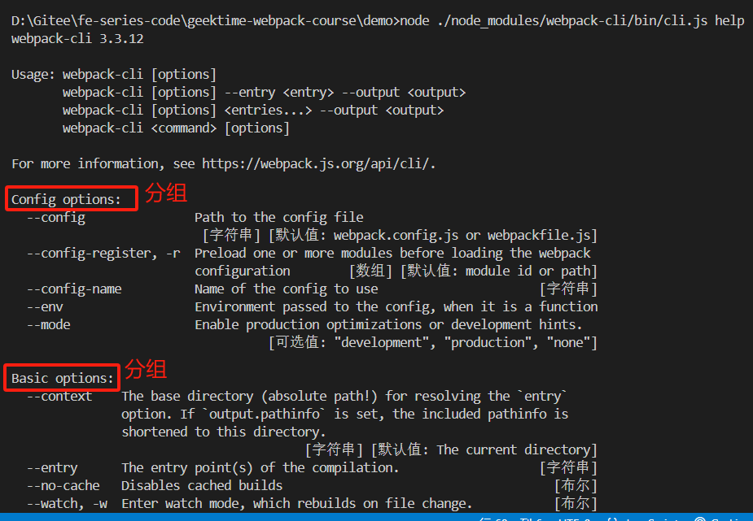

## webpack启动流程

当我们执行npm run dev/build的时候，做了什么操作？

```json
"scripts": {
	"build": "wabpack"
}
```

当使用npm run 的时候，实际上执行的是`./node_modules/.bin/webpack` 指令。

> 这个webpack指令是哪儿来的？

是在安装webpack的时候，如果安装的包中有bin选项，那么在安装的时候，如果是全局安装，则会放到全局usr/bin目录下（linux），如果是局部安装，则会放到`./node_modules/.bin`下。

bin的写法有两种：
```json
// 第一种：在这种情况下，name字段对应的值将作为命令
"bin": "./bin/webpack.js",
// 第二种：可以定义多个命令，每个命令指向不同的可执行文件
"bin": {
  "webpack-cli": "./bin/cli.js"
},
```

所以，对于webpack为例，实际指向的是`./bin/webpack.js` 文件。

### webpack的webpack.js做了什么？

这个脚本是一个Node.js命令行工具的引导程序，用于确保用户安装了必要的webpack命令行工具（CLI），并在需要时自动安装。

具体流程：

1. **设置初始退出代码**：将`process.exitCode`设为0，表示默认情况下程序成功退出。
2. **定义`runCommand`函数**：该函数使用`child_process`模块运行子进程来执行命令，并返回一个Promise，以便处理异步任务。
   - **作用**：用于执行安装命令或其他命令行任务。
3. **定义`isInstalled`函数**：检查给定的npm包是否已安装。
   - **作用**：用于检测`webpack-cli`或`webpack-command`是否已安装。
4. **定义`CliOption`类型**：定义了一个包含CLI工具信息的对象结构，用于描述可用的CLI选项。
5. **定义可用CLI列表`CLIs`**：包含两个CLI工具的信息，`webpack-cli`和`webpack-command`，并检测它们是否已安装。
6. **检查已安装的CLI工具**：通过过滤`CLIs`列表，获取已安装的CLI工具。
   - **作用**：确定用户系统中已安装的CLI工具数量。
7. **如果CLI工具数量为0，处理无已安装CLI工具的情况**：
   - 显示安装CLI工具的提示信息。
   - 检测项目是否使用Yarn作为包管理器。
   - 提示用户是否要安装`webpack-cli`。
   - 根据用户输入，使用`npm`或`yarn`安装`webpack-cli`。
8. **如果CLI工具数量为1，处理已安装一个CLI工具的情况**：
   - 加载并执行已安装的CLI工具。
9. **如果CLI工具数量为2，处理安装了多个CLI工具的情况**：
  - 提示用户只需安装一个CLI工具，并将退出代码设为1。

最后，如果我们安装了webpack-cli，则会加载并执行`webpack-cli`，具体的代码为：
```js
require(path.resolve(
	path.dirname(pkgPath),
	pkg.bin[installedClis[0].binName]
));
```

最终实际执行的是`./bin/cli.js`。

### webpack-cli中cli.js做了什么？

1、导入一些不需要编译的参数。比如init，info等

```js
const { NON_COMPILATION_ARGS } = require("./utils/constants");
```

2、如果命令行参数中有上述不需要编译的参数，直接执行`prompt-command.js`文件并退出

```js
const NON_COMPILATION_CMD = process.argv.find(arg => {
	if (arg === "serve") {
		global.process.argv = global.process.argv.filter(a => a !== "serve");
		process.argv = global.process.argv;
	}
	return NON_COMPILATION_ARGS.find(a => a === arg);
});

if (NON_COMPILATION_CMD) {
	return require("./utils/prompt-command")(NON_COMPILATION_CMD, ...process.argv);
}
```

> `prompt-command.js`文件做了什么工作？

主要作用是检查特定的 `@webpack-cli` 包是否已安装，如果未安装，则提示用户是否安装该包。其执行流程如下：

1. 构建包的名称和路径，并尝试在本地或全局范围内解析该包的路径。
2. 如果包已安装，调用 `runWhenInstalled` 函数继续执行后续逻辑。
3. 如果包未安装，构建安装命令（使用 `npm` 或 `yarn`），并通过 `readline` 模块向用户提示是否安装该包。
4. 根据用户的输入：
   - 如果用户同意安装，运行安装命令，然后调用 `runWhenInstalled` 或特定的初始化逻辑。
   - 如果用户拒绝安装，显示错误信息并设置退出代码为 1。

通过这一流程，函数确保在执行特定命令之前所需的 `@webpack-cli` 包已经安装。

比如，init示例如下：


3、引入 yargs，用于解析命令行参数

```js
const yargs = require("yargs").usage(`webpack-cli ${require("../package.json").version}

Usage: webpack-cli [options]
       webpack-cli [options] --entry <entry> --output <output>
       webpack-cli [options] <entries...> --output <output>
       webpack-cli <command> [options]

For more information, see https://webpack.js.org/api/cli/.`);

// 引入 config-yargs.js，用于配置 yargs.配置的内容有很多命令的分组。
require("./config/config-yargs")(yargs);

/**
*解析命令行参数并处理错误、帮助信息等.
   
   其中，err 为错误信息，argv 为解析后的参数，output 为帮助信息。
   output: 
     - 当用户输入有效命令和选项时，output 为空，执行命令逻辑。
     - 当用户请求帮助、版本信息或输入无效命令时，output 包含相应的信息。 
*/
yargs.parse(process.argv.slice(2), (err, argv, output) => {
		Error.stackTraceLimit = 30;

		// arguments validation failed
		if (err && output) {
			console.error(output);
			process.exitCode = 1;
			return;
		}

		// help or version info
		if (output) {
			console.log(output);
			return;
		}

		if (argv.verbose) {
			argv["display"] = "verbose";
		}
	...


/*
convert-argv.js文件的作用是解析命令行参数和配置文件，将其转换为 Webpack 可用的配置选项，
并确保所有必要的插件和编译器已正确注册和加载，从而准备好执行 Webpack 构建任务
*/
let options = require("./utils/convert-argv")(argv);
```

`config-yargs.js`配置的分组如下：

参数分组 (config/config-args.js)，将命令划分为9类：

- Config options: 配置相关参数(文件名称、运行环境等)
- Basic options: 基础参数(entry设置、debug模式设置、watch监听设置、devtool设置)
- Module options: 模块参数，给 loader 设置扩展
- Output options: 输出参数(输出路径、输出文件名称)
- Advanced options: 高级用法(记录设置、缓存设置、监听频率、bail等)
- Resolving options: 解析参数(alias 和 解析的文件后缀设置)
- Optimizing options: 优化参数
- Stats options: 统计参数
- options: 通用参数(帮助命令、版本信息等)



4、引入webpack，执行编译任务

```js
function processOptions(options) {
 // ...
}
processOptions(options);
```

processOptions具体的执行内容如下：

1. **处理 Promise**：如果 `options` 是一个 Promise，则等待其解析后再次调用 `processOptions`，捕获错误并退出。
   如果 Webpack 配置文件是以异步方式加载的，比如动态导入或使用某些插件/工具生成的配置，返回值可能是一个 Promise
```js
if (typeof options.then === "function") {
	options.then(processOptions).catch(function(err) {
		console.error(err.stack || err);
		// eslint-disable-next-line no-process-exit
		process.exit(1);
	});
	return;
}
```

2. **解析并转换统计选项**：根据 `options.stats` 设置输出选项 `outputOptions`，并根据命令行参数进一步调整输出选项。
	中间大段 ifArg 的代码主要作用是根据命令行参数对 outputOptions 进行动态配置。
	ifArg 是一个辅助函数，用于检查命令行参数是否存在，并根据参数值修改相应的 outputOptions 属性。

> `outputOptions` 的作用是配置和控制 Webpack 编译过程中的输出信息。
> 比如我们一般统计包的大小使用webpack-bundle-analyzer，但是也可以使用stats（ `webpack --config webpack.prod.js --json > stats.json` ）进行初略统计，一般不怎么使用。


3. **初始化 Webpack 编译器**：根据配置选项创建 Webpack 编译器实例，并处理初始化过程中可能的错误。
```js
try {
/**
 * 这段代码是在使用 webpack 函数创建一个新的 webpack 编译器实例。webpack 是一个模块打包工具，它可以将许多模块转换成静态资源。
  在这段代码中，webpack 函数接收一个参数 options，这是一个对象，包含了一系列配置选项。这些选项可以用来定制 webpack 的行为。
  例如，你可以在 options 对象中指定入口文件、输出路径、加载器等。
  webpack(options) 的返回值是一个 webpack 编译器实例，这个实例被赋值给了 compiler 变量。
  你可以使用这个 compiler 实例来启动编译过程，或者对编译过程进行更细粒度的控制。
 */
  compiler = webpack(options);
} catch() {
//...
}
```

4. **设置进度插件**：如果命令行参数包含 `progress`，则添加进度插件。
```js
if (argv.progress) {
	const ProgressPlugin = require("webpack").ProgressPlugin;
	new ProgressPlugin({
		profile: argv.profile
	}).apply(compiler);
}
```

5. **处理编译回调**：定义 `compilerCallback` 处理编译后的输出，包括错误处理和结果输出。

```js
function compilerCallback(err, stats) { 
	// 1. 清理缓存
	// 2. 处理错误
	// 3. 输出编译结果
	// 4. 检查错误
}
```

6. **执行编译或监视**：根据配置选项执行一次性编译或启用文件监视模式。

```js
// 这行代码检查配置选项 `firstOptions` 或 `options` 中是否设置了 `watch` 属性
if (firstOptions.watch || options.watch) { 
 // ...
 // 使用 compiler.watch 方法启用 Webpack 的文件监视模式。watchOptions 包含监视相关的选项，compilerCallback 是编译完成后的回调函数。
 compiler.watch(watchOptions, compilerCallback);
} else {
	// 如果没有设置 watch 属性，则执行一次性编译
	compiler.run((err, stats) => {//...})
}
```


最后，总结一下`cli.js`做的内容：

1. 引入 yargs，对命令行进行定制
2. 分析命令行参数，对各个参数进行转换，组成编译配置项options
3. 引用webpack，根据配置项options进行编译和构建。


### compiler到底做了什么？

compiler是引入的webpack库，当使用require引入一个库的时候，实际上调用的是`package.json` 文件中 `main` 字段对应的入口文件。

比如 `const webpack = require("webpack");` ，实际上找到的`lib/webpack.js` 文件：
```json
"main": "lib/webpack.js",
```


进入代码后，首先引入了compiler文件：
```js
const Compiler = require("./Compiler");
```

提到compiler文件，就涉及到一个Tapable架构。


### Tapable

`tapable` 是 Webpack 的一个核心库，它提供了钩子机制，用于在不同的生命周期阶段运行插件。`tapable` 允许开发人员在 Webpack 的编译过程中插入自定义逻辑，从而实现扩展和定制 Webpack 的行为。

`tapable` 是一个小型的库，提供了多种钩子（hook）类型，用于在特定时刻运行特定的函数。主要的钩子类型包括：

- `SyncHook`：同步执行，不关心返回值。
- `SyncBailHook`：同步执行，如果某个钩子返回非 `undefined`，则中断后续钩子的执行。
- `SyncWaterfallHook`：同步执行，前一个钩子的返回值会作为参数传给下一个钩子。
- `SyncLoopHook`：同步执行，钩子函数返回 `true` 时重复执行当前钩子。
- `AsyncParallelHook`：并行异步执行，不关心返回值。
- `AsyncParallelBailHook`：并行异步执行，如果某个钩子返回非 `undefined`，则中断后续钩子的执行。
- `AsyncSeriesHook`：串行异步执行。
- `AsyncSeriesBailHook`：串行异步执行，如果某个钩子返回非 `undefined`，则中断后续钩子的执行。
- `AsyncSeriesWaterfallHook`：串行异步执行，前一个钩子的返回值会作为参数传给下一个钩子。

可以把`tapable`理解成nodejs中的EventEmitter，就是一个事件监听器，但是会比EventEmitter的事件监听更复杂点，功能多点。

比如事件的绑定和触发，分为同步和异步的方式：

|                  | 同步方式 | 异步方式                |
| ---------------- | ---- | ------------------- |
| 绑定（类似node中的on）   | tap  | tapAsync/tapPromise |
| 触发（类似node中的emit） | call | callAsync/promise   |
示例：
```js
const { SyncHook, AsyncSeriesHook } = require("tapable");

class MyCompiler {
    constructor() {
        this.hooks = {
            initialize: new SyncHook(),
            compile: new SyncHook(["compilation"]),
            emit: new AsyncSeriesHook(["compilation"])
        };
    }

    run() {
        this.hooks.initialize.call();
        const compilation = {};
        this.hooks.compile.call(compilation);
        this.hooks.emit.callAsync(compilation, (err) => {
            if (err) {
                console.error("Emit phase failed:", err);
            } else {
                console.log("Emit phase succeeded");
            }
        });
    }
}

const compiler = new MyCompiler();

/*
同步绑定
*/
// 注册插件
compiler.hooks.initialize.tap("InitializePlugin", () => {
    console.log("Initialization phase");
});

compiler.hooks.compile.tap("CompilePlugin", (compilation) => {
    console.log("Compilation phase");
    // 模拟生成编译结果
    compilation.result = "some result";
});

/*
异步绑定
*/
compiler.hooks.emit.tapAsync("EmitPlugin", (compilation, callback) => {
    console.log("Emit phase");
    setTimeout(() => {
        console.log("Emitting:", compilation.result);
        callback();
    }, 1000);
});

// 事件触发
compiler.run();
```

在Webpack 中的实际应用：
在 Webpack 中，`tapable` 被广泛用于其内部的编译流程，通过钩子机制允许插件在特定阶段执行。以下是一个 Webpack 插件的简单示例：

创建一个 Webpack 插件：
```js
class MyPlugin {
    apply(compiler) {
        // 在编译开始时触发
        compiler.hooks.compile.tap("MyPlugin", (params) => {
            console.log("The compiler is starting to compile...");
        });

        // 在生成资源到 output 目录之前触发
        compiler.hooks.emit.tapAsync("MyPlugin", (compilation, callback) => {
            console.log("The compilation is going to emit files...");
            // 在这里可以访问并修改编译结果
            callback();
        });
    }
}

module.exports = MyPlugin;

```

在 Webpack 配置文件中使用插件：

```js
const MyPlugin = require("./path/to/MyPlugin");

module.exports = {
    // ...其他配置项
    plugins: [
        new MyPlugin()
    ]
};
```

> tapable相比EventEmitter的优势是什么？

**`tapable` 是专门为解决 Webpack 插件机制中的问题而诞生的。** 确实与 Node.js 的 `EventEmitter` 有一些相似之处，因为两者都允许注册和触发事件，但它们之间有几个重要的区别，使得 `tapable` 更适合用于 Webpack 的插件系统：

1、钩子类型多样性与灵活性

`tapable` 提供了多种类型的钩子（同步、异步、串行、并行、瀑布等），每种类型的钩子都有不同的行为和用途，使其在不同场景下更灵活地控制插件的执行顺序和方式。例如：

- `SyncHook`：同步执行，不关心返回值。
- `AsyncSeriesHook`：串行异步执行，依次执行每个注册的插件。
- `AsyncParallelHook`：并行异步执行，所有插件并发执行。

相比之下，`EventEmitter` 只支持简单的同步事件机制，没有内置支持复杂的异步控制和执行模式。

2、上下文和数据流管理

`tapable` 可以传递上下文参数，并通过钩子共享和传递数据。例如，`SyncWaterfallHook` 会将前一个钩子的返回值传递给下一个钩子，而 `EventEmitter` 只能传递固定的事件参数，无法动态传递和变更数据。这种能力使得 `tapable` 更适合处理复杂的编译过程，其中每个阶段可能需要基于前一个阶段的结果进行操作。

3、扩展能力和插件系统需求

`tapable` 设计为扩展 Webpack 编译过程，支持灵活的插件机制。通过钩子的 `tap`、`tapAsync`、`tapPromise` 等方法，可以方便地处理不同类型的插件和事件。Webpack 的插件系统需要在不同的编译阶段执行特定的逻辑，这些逻辑可能是同步的，也可能是异步的。`tapable` 提供的钩子类型和控制能力，能够满足 Webpack 插件系统的复杂需求。


