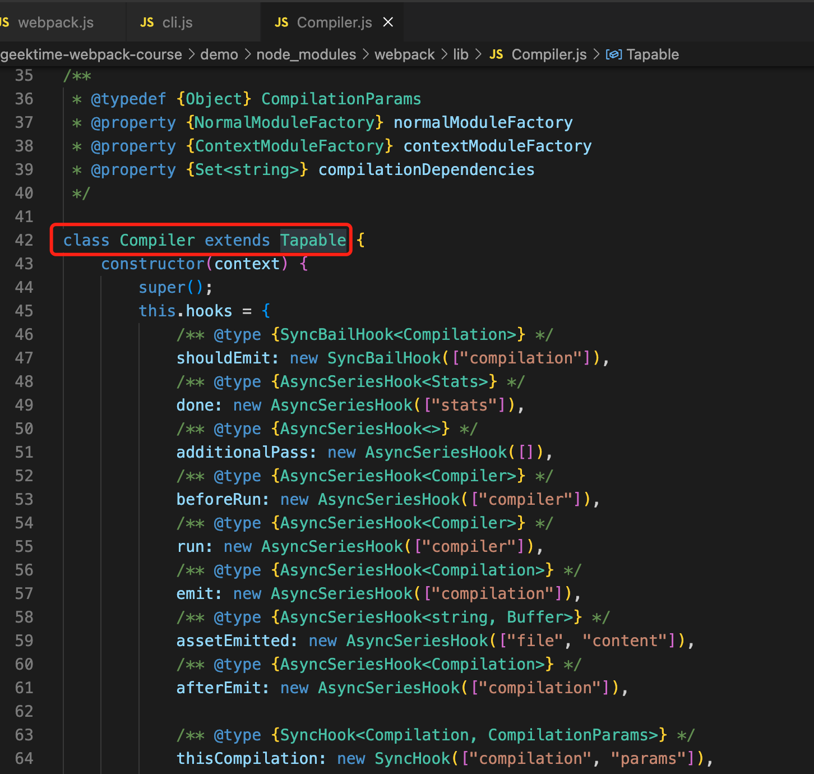
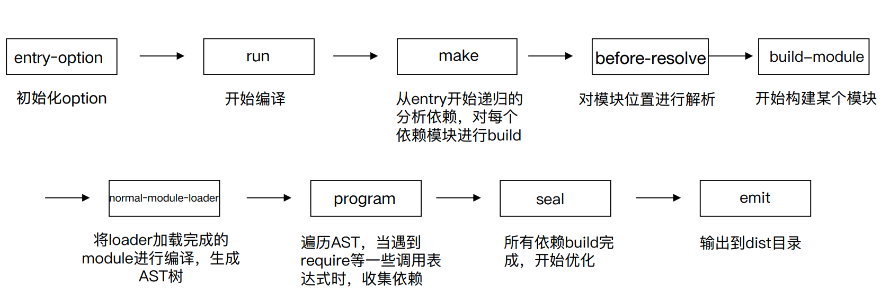
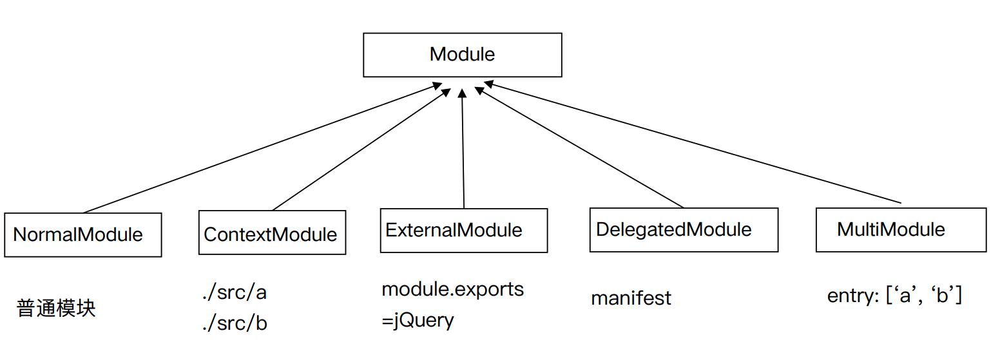
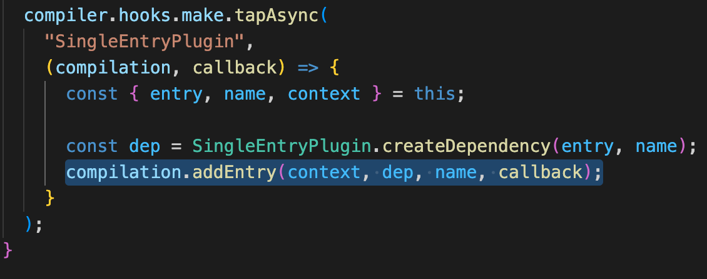
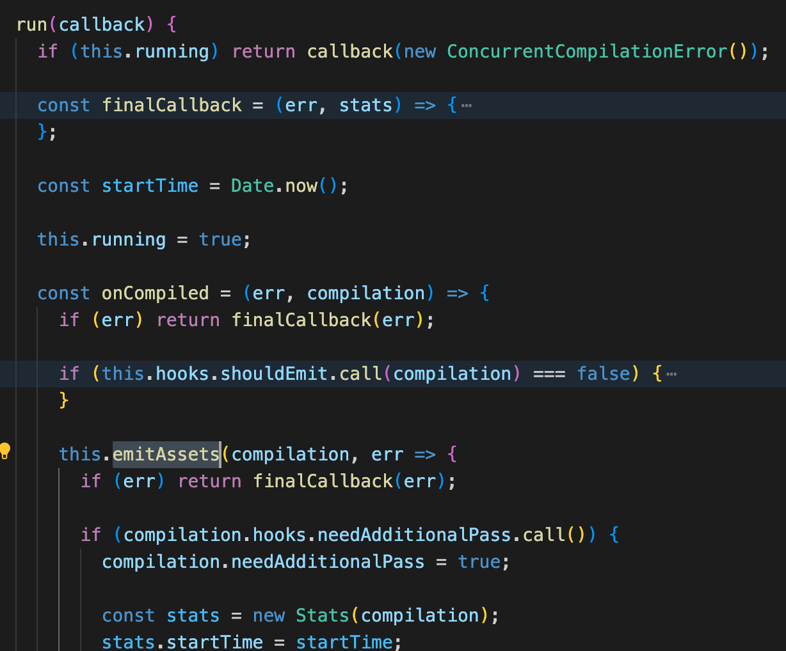
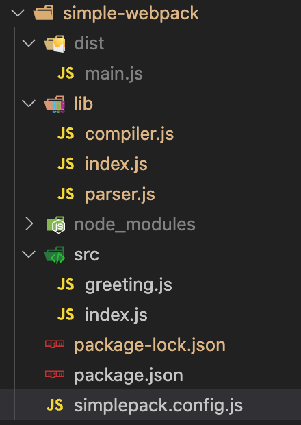

## webpack启动流程

当我们执行npm run dev/build的时候，做了什么操作？

```json
"scripts": {
	"build": "wabpack"
}
```

当使用npm run 的时候，实际上执行的是`./node_modules/.bin/webpack` 指令。

> 这个webpack指令是哪儿来的？

是在安装webpack的时候，如果安装的包中有bin选项，那么在安装的时候，如果是全局安装，则会放到全局usr/bin目录下（linux），如果是局部安装，则会放到`./node_modules/.bin`下。

bin的写法有两种：
```json
// 第一种：在这种情况下，name字段对应的值将作为命令
"bin": "./bin/webpack.js",
// 第二种：可以定义多个命令，每个命令指向不同的可执行文件
"bin": {
  "webpack-cli": "./bin/cli.js"
},
```

所以，对于webpack为例，实际指向的是`./bin/webpack.js` 文件。

### webpack的webpack.js做了什么？

这个脚本是一个Node.js命令行工具的引导程序，用于确保用户安装了必要的webpack命令行工具（CLI），并在需要时自动安装。

具体流程：

1. **设置初始退出代码**：将`process.exitCode`设为0，表示默认情况下程序成功退出。
2. **定义`runCommand`函数**：该函数使用`child_process`模块运行子进程来执行命令，并返回一个Promise，以便处理异步任务。
   - **作用**：用于执行安装命令或其他命令行任务。
3. **定义`isInstalled`函数**：检查给定的npm包是否已安装。
   - **作用**：用于检测`webpack-cli`或`webpack-command`是否已安装。
4. **定义`CliOption`类型**：定义了一个包含CLI工具信息的对象结构，用于描述可用的CLI选项。
5. **定义可用CLI列表`CLIs`**：包含两个CLI工具的信息，`webpack-cli`和`webpack-command`，并检测它们是否已安装。
6. **检查已安装的CLI工具**：通过过滤`CLIs`列表，获取已安装的CLI工具。
   - **作用**：确定用户系统中已安装的CLI工具数量。
7. **如果CLI工具数量为0，处理无已安装CLI工具的情况**：
   - 显示安装CLI工具的提示信息。
   - 检测项目是否使用Yarn作为包管理器。
   - 提示用户是否要安装`webpack-cli`。
   - 根据用户输入，使用`npm`或`yarn`安装`webpack-cli`。
8. **如果CLI工具数量为1，处理已安装一个CLI工具的情况**：
   - 加载并执行已安装的CLI工具。
9. **如果CLI工具数量为2，处理安装了多个CLI工具的情况**：
  - 提示用户只需安装一个CLI工具，并将退出代码设为1。

最后，如果我们安装了webpack-cli，则会加载并执行`webpack-cli`，具体的代码为：
```js
require(path.resolve(
	path.dirname(pkgPath),
	pkg.bin[installedClis[0].binName]
));
```

最终实际执行的是`./bin/cli.js`。

### webpack-cli中cli.js做了什么？

1、导入一些不需要编译的参数。比如init，info等

```js
const { NON_COMPILATION_ARGS } = require("./utils/constants");
```

2、如果命令行参数中有上述不需要编译的参数，直接执行`prompt-command.js`文件并退出

```js
const NON_COMPILATION_CMD = process.argv.find(arg => {
	if (arg === "serve") {
		global.process.argv = global.process.argv.filter(a => a !== "serve");
		process.argv = global.process.argv;
	}
	return NON_COMPILATION_ARGS.find(a => a === arg);
});

if (NON_COMPILATION_CMD) {
	return require("./utils/prompt-command")(NON_COMPILATION_CMD, ...process.argv);
}
```

> `prompt-command.js`文件做了什么工作？

主要作用是检查特定的 `@webpack-cli` 包是否已安装，如果未安装，则提示用户是否安装该包。其执行流程如下：

1. 构建包的名称和路径，并尝试在本地或全局范围内解析该包的路径。
2. 如果包已安装，调用 `runWhenInstalled` 函数继续执行后续逻辑。
3. 如果包未安装，构建安装命令（使用 `npm` 或 `yarn`），并通过 `readline` 模块向用户提示是否安装该包。
4. 根据用户的输入：
   - 如果用户同意安装，运行安装命令，然后调用 `runWhenInstalled` 或特定的初始化逻辑。
   - 如果用户拒绝安装，显示错误信息并设置退出代码为 1。

通过这一流程，函数确保在执行特定命令之前所需的 `@webpack-cli` 包已经安装。

比如，init示例如下：


3、引入 yargs，用于解析命令行参数

```js
const yargs = require("yargs").usage(`webpack-cli ${require("../package.json").version}

Usage: webpack-cli [options]
       webpack-cli [options] --entry <entry> --output <output>
       webpack-cli [options] <entries...> --output <output>
       webpack-cli <command> [options]

For more information, see https://webpack.js.org/api/cli/.`);

// 引入 config-yargs.js，用于配置 yargs.配置的内容有很多命令的分组。
require("./config/config-yargs")(yargs);

/**
*解析命令行参数并处理错误、帮助信息等.
   
   其中，err 为错误信息，argv 为解析后的参数，output 为帮助信息。
   output: 
     - 当用户输入有效命令和选项时，output 为空，执行命令逻辑。
     - 当用户请求帮助、版本信息或输入无效命令时，output 包含相应的信息。 
*/
yargs.parse(process.argv.slice(2), (err, argv, output) => {
		Error.stackTraceLimit = 30;

		// arguments validation failed
		if (err && output) {
			console.error(output);
			process.exitCode = 1;
			return;
		}

		// help or version info
		if (output) {
			console.log(output);
			return;
		}

		if (argv.verbose) {
			argv["display"] = "verbose";
		}
	...


/*
convert-argv.js文件的作用是解析命令行参数和配置文件，将其转换为 Webpack 可用的配置选项，
并确保所有必要的插件和编译器已正确注册和加载，从而准备好执行 Webpack 构建任务
*/
let options = require("./utils/convert-argv")(argv);
```

`config-yargs.js`配置的分组如下：

参数分组 (config/config-args.js)，将命令划分为9类：

- Config options: 配置相关参数(文件名称、运行环境等)
- Basic options: 基础参数(entry设置、debug模式设置、watch监听设置、devtool设置)
- Module options: 模块参数，给 loader 设置扩展
- Output options: 输出参数(输出路径、输出文件名称)
- Advanced options: 高级用法(记录设置、缓存设置、监听频率、bail等)
- Resolving options: 解析参数(alias 和 解析的文件后缀设置)
- Optimizing options: 优化参数
- Stats options: 统计参数
- options: 通用参数(帮助命令、版本信息等)


4、引入webpack，执行编译任务

```js
function processOptions(options) {
 // ...
}
processOptions(options);
```

processOptions具体的执行内容如下：

1. **处理 Promise**：如果 `options` 是一个 Promise，则等待其解析后再次调用 `processOptions`，捕获错误并退出。
   如果 Webpack 配置文件是以异步方式加载的，比如动态导入或使用某些插件/工具生成的配置，返回值可能是一个 Promise
```js
if (typeof options.then === "function") {
	options.then(processOptions).catch(function(err) {
		console.error(err.stack || err);
		// eslint-disable-next-line no-process-exit
		process.exit(1);
	});
	return;
}
```

2. **解析并转换统计选项**：根据 `options.stats` 设置输出选项 `outputOptions`，并根据命令行参数进一步调整输出选项。
	中间大段 ifArg 的代码主要作用是根据命令行参数对 outputOptions 进行动态配置。
	ifArg 是一个辅助函数，用于检查命令行参数是否存在，并根据参数值修改相应的 outputOptions 属性。

> `outputOptions` 的作用是配置和控制 Webpack 编译过程中的输出信息。
> 比如我们一般统计包的大小使用webpack-bundle-analyzer，但是也可以使用stats（ `webpack --config webpack.prod.js --json > stats.json` ）进行初略统计，一般不怎么使用。


3. **初始化 Webpack 编译器**：根据配置选项创建 Webpack 编译器实例，并处理初始化过程中可能的错误。
```js
try {
/**
 * 这段代码是在使用 webpack 函数创建一个新的 webpack 编译器实例。webpack 是一个模块打包工具，它可以将许多模块转换成静态资源。
  在这段代码中，webpack 函数接收一个参数 options，这是一个对象，包含了一系列配置选项。这些选项可以用来定制 webpack 的行为。
  例如，你可以在 options 对象中指定入口文件、输出路径、加载器等。
  webpack(options) 的返回值是一个 webpack 编译器实例，这个实例被赋值给了 compiler 变量。
  你可以使用这个 compiler 实例来启动编译过程，或者对编译过程进行更细粒度的控制。
 */
  compiler = webpack(options);
} catch() {
//...
}
```

4. **设置进度插件**：如果命令行参数包含 `progress`，则添加进度插件。
```js
if (argv.progress) {
	const ProgressPlugin = require("webpack").ProgressPlugin;
	new ProgressPlugin({
		profile: argv.profile
	}).apply(compiler);
}
```

5. **处理编译回调**：定义 `compilerCallback` 处理编译后的输出，包括错误处理和结果输出。

```js
function compilerCallback(err, stats) { 
	// 1. 清理缓存
	// 2. 处理错误
	// 3. 输出编译结果
	// 4. 检查错误
}
```

6. **执行编译或监视**：根据配置选项执行一次性编译或启用文件监视模式。

```js
// 这行代码检查配置选项 `firstOptions` 或 `options` 中是否设置了 `watch` 属性
if (firstOptions.watch || options.watch) { 
 // ...
 // 使用 compiler.watch 方法启用 Webpack 的文件监视模式。watchOptions 包含监视相关的选项，compilerCallback 是编译完成后的回调函数。
 compiler.watch(watchOptions, compilerCallback);
} else {
	// 如果没有设置 watch 属性，则执行一次性编译
	compiler.run((err, stats) => {//...})
}
```


最后，总结一下`cli.js`做的内容：

1. 引入 yargs，对命令行进行定制
2. 分析命令行参数，对各个参数进行转换，组成编译配置项options
3. 引用webpack，根据配置项options进行编译和构建。


### compiler到底做了什么？

compiler是引入的webpack库，当使用require引入一个库的时候，实际上调用的是`package.json` 文件中 `main` 字段对应的入口文件。

比如 `const webpack = require("webpack");` ，实际上找到的`lib/webpack.js` 文件：
```json
"main": "lib/webpack.js",
```

进入代码后，首先引入了compiler文件：
```js
const Compiler = require("./Compiler");
```

提到compiler文件，就涉及到一个Tapable架构。


#### Tapable

`tapable` 是 Webpack 的一个核心库，它提供了钩子机制，用于在不同的生命周期阶段运行插件。`tapable` 允许开发人员在 Webpack 的编译过程中插入自定义逻辑，从而实现扩展和定制 Webpack 的行为。

`tapable` 是一个小型的库，提供了多种钩子（hook）类型，用于在特定时刻运行特定的函数。主要的钩子类型包括：

- `SyncHook`：同步执行，不关心返回值。
- `SyncBailHook`：同步执行，如果某个钩子返回非 `undefined`，则中断后续钩子的执行。
- `SyncWaterfallHook`：同步执行，前一个钩子的返回值会作为参数传给下一个钩子。
- `SyncLoopHook`：同步执行，钩子函数返回 `true` 时重复执行当前钩子。
- `AsyncParallelHook`：并行异步执行，不关心返回值。
- `AsyncParallelBailHook`：并行异步执行，如果某个钩子返回非 `undefined`，则中断后续钩子的执行。
- `AsyncSeriesHook`：串行异步执行。
- `AsyncSeriesBailHook`：串行异步执行，如果某个钩子返回非 `undefined`，则中断后续钩子的执行。
- `AsyncSeriesWaterfallHook`：串行异步执行，前一个钩子的返回值会作为参数传给下一个钩子。

可以把`tapable`理解成nodejs中的EventEmitter，就是一个事件监听器，但是会比EventEmitter的事件监听更复杂点，功能多点。

比如事件的监听和触发，分为同步和异步的方式：

|                    | 同步方式   | 异步方式                    |
| ------------------ | ------ | ----------------------- |
| 监听（类似node中的`on`）   | `tap`  | `tapAsync`/`tapPromise` |
| 触发（类似node中的`emit`） | `call` | `callAsync`/`promise`   |
示例：
```js
const { SyncHook, AsyncSeriesHook } = require("tapable");

class MyCompiler {
    constructor() {
        this.hooks = {
            initialize: new SyncHook(),
            compile: new SyncHook(["compilation"]),
            emit: new AsyncSeriesHook(["compilation"])
        };
    }

    run() {
        this.hooks.initialize.call();
        const compilation = {};
        this.hooks.compile.call(compilation);
        this.hooks.emit.callAsync(compilation, (err) => {
            if (err) {
                console.error("Emit phase failed:", err);
            } else {
                console.log("Emit phase succeeded");
            }
        });
    }
}

const compiler = new MyCompiler();

/*
同步绑定
*/
// 注册插件
compiler.hooks.initialize.tap("InitializePlugin", () => {
    console.log("Initialization phase");
});

compiler.hooks.compile.tap("CompilePlugin", (compilation) => {
    console.log("Compilation phase");
    // 模拟生成编译结果
    compilation.result = "some result";
});

/*
异步绑定
*/
compiler.hooks.emit.tapAsync("EmitPlugin", (compilation, callback) => {
    console.log("Emit phase");
    setTimeout(() => {
        console.log("Emitting:", compilation.result);
        callback();
    }, 1000);
});

// 事件触发
compiler.run();
```

在Webpack 中的实际应用：
在 Webpack 中，`tapable` 被广泛用于其内部的编译流程，通过钩子机制允许插件在特定阶段执行。以下是一个 Webpack 插件的简单示例：

创建一个 Webpack 插件：
```js
class MyPlugin {
    apply(compiler) {
        // 在编译开始时触发
        compiler.hooks.compile.tap("MyPlugin", (params) => {
            console.log("The compiler is starting to compile...");
        });

        // 在生成资源到 output 目录之前触发
        compiler.hooks.emit.tapAsync("MyPlugin", (compilation, callback) => {
            console.log("The compilation is going to emit files...");
            // 在这里可以访问并修改编译结果
            callback();
        });
    }
}

module.exports = MyPlugin;

```

在 Webpack 配置文件中使用插件：

```js
const MyPlugin = require("./path/to/MyPlugin");

module.exports = {
    // ...其他配置项
    plugins: [
        new MyPlugin()
    ]
};
```

> tapable相比EventEmitter的优势是什么？

**`tapable` 是专门为解决 Webpack 插件机制中的问题而诞生的。** 确实与 Node.js 的 `EventEmitter` 有一些相似之处，因为两者都允许注册和触发事件，但它们之间有几个重要的区别，使得 `tapable` 更适合用于 Webpack 的插件系统：

1、钩子类型多样性与灵活性

`tapable` 提供了多种类型的钩子（同步、异步、串行、并行、瀑布等），每种类型的钩子都有不同的行为和用途，使其在不同场景下更灵活地控制插件的执行顺序和方式。例如：

- `SyncHook`：同步执行，不关心返回值。
- `AsyncSeriesHook`：串行异步执行，依次执行每个注册的插件。
- `AsyncParallelHook`：并行异步执行，所有插件并发执行。

相比之下，`EventEmitter` 只支持简单的同步事件机制，没有内置支持复杂的异步控制和执行模式。

2、上下文和数据流管理

`tapable` 可以传递上下文参数，并通过钩子共享和传递数据。例如，`SyncWaterfallHook` 会将前一个钩子的返回值传递给下一个钩子，而 `EventEmitter` 只能传递固定的事件参数，无法动态传递和变更数据。这种能力使得 `tapable` 更适合处理复杂的编译过程，其中每个阶段可能需要基于前一个阶段的结果进行操作。

3、扩展能力和插件系统需求

`tapable` 设计为扩展 Webpack 编译过程，支持灵活的插件机制。通过钩子的 `tap`、`tapAsync`、`tapPromise` 等方法，可以方便地处理不同类型的插件和事件。Webpack 的插件系统需要在不同的编译阶段执行特定的逻辑，这些逻辑可能是同步的，也可能是异步的。`tapable` 提供的钩子类型和控制能力，能够满足 Webpack 插件系统的复杂需求。

#### compiler对象

compiler对象其实就是继承tapable的，然后定义了很多个hooks。

> 还有一个`compilation.js`，负责模块编译，打包，优化的过程。



然后所有的插件都有个apply方法，参数传入compiler对象。

在apply里面监听compiler的某些hook，然后当compiler对象去触发这些hook的时候，就在插件中捕获到该事件，执行一些逻辑。这就是插件的执行逻辑。

总结一下：插件就是监听compiler中上百个hook的其中几个，然后执行一些特定的操作。

演示代码：
```js
// compiler.js
const {
    SyncHook,
    AsyncSeriesHook
} = require('tapable');

module.exports = class Compiler {
    constructor() {
        this.hooks = {
            accelerate: new SyncHook(['newspeed']),
            brake: new SyncHook(),
            calculateRoutes: new AsyncSeriesHook(["source", "target", "routesList"])
        }
    }
    run(){
        this.accelerate(10)
        this.break()
        this.calculateRoutes('Async', 'hook', 'demo')
    }
    accelerate(speed) {
        this.hooks.accelerate.call(speed);
    }
    break() {
        this.hooks.brake.call();
    }
    calculateRoutes() {
        this.hooks.calculateRoutes.promise(...arguments).then(() => {
        }, err => {
            console.error(err);
        });
    }
}
```

自定义插件：
```js
const Compiler = require('./Compiler')
 
class MyPlugin{
    constructor() {
 
    }
    apply(compiler){
        compiler.hooks.brake.tap("WarningLampPlugin", () => console.log('WarningLampPlugin'));
        compiler.hooks.accelerate.tap("LoggerPlugin", newSpeed => console.log(`Accelerating to ${newSpeed}`));
        compiler.hooks.calculateRoutes.tapPromise("calculateRoutes tapAsync", (source, target, routesList) => {
            return new Promise((resolve,reject)=>{
                setTimeout(()=>{
                    console.log(`tapPromise to ${source} ${target} ${routesList}`)
                    resolve();
                },1000)
            });
        });
    }
}
 
const myPlugin = new MyPlugin();
 
const options = {
    plugins: [myPlugin]
}

const compiler = new Compiler();

for (const plugin of options.plugins) {
    if (typeof plugin === "function") {
        plugin.call(compiler, compiler);
    } else {
        plugin.apply(compiler);
    }
}
compiler.run();
```

当最后`compiler.run();`的时候，插件就会触发对应的hook，执行特定的逻辑。

### webpack如何使用tapable的？

上面我们提到，实际执行的是`lib/webpack.js`，我们看了源码，其实和上面的示例过程是相同的。

```js
const webpack = (options, callback) => {
	const webpackOptionsValidationErrors = validateSchema(
		webpackOptionsSchema,
		options
	);
	if (webpackOptionsValidationErrors.length) {
		throw new WebpackOptionsValidationError(webpackOptionsValidationErrors);
	}
	let compiler;
	if (Array.isArray(options)) {
		compiler = new MultiCompiler(
			Array.from(options).map(options => webpack(options))
		);
	} else if (typeof options === "object") {
		/**
		 * 引入webpack.config.js中的配置
		 */
		options = new WebpackOptionsDefaulter().process(options);
		/**
		 * 构建Compiler
		 */
		compiler = new Compiler(options.context);
		compiler.options = options;
		new NodeEnvironmentPlugin({
			infrastructureLogging: options.infrastructureLogging
		}).apply(compiler);
		/**
		 * 如果插件配置存在，那么遍历这些插件，然后apply(compiler)，
		 * 监听compiler的一些hook
		 */
		if (options.plugins && Array.isArray(options.plugins)) {
			for (const plugin of options.plugins) {
				if (typeof plugin === "function") {
					plugin.call(compiler, compiler);
				} else {
					plugin.apply(compiler);
				}
			}
		}
		compiler.hooks.environment.call();
		compiler.hooks.afterEnvironment.call();
		/**
		 * 导入webpack自身内置的一些插件
		 */
		compiler.options = new WebpackOptionsApply().process(options, compiler);
	}
```


### webpack编译过程

webpack的编译都按照下面的钩子调用顺序执行：



#### 1、准备阶段

回到`lib/webpack.js`里面，会先触发`entryOption`事件：
```js
/**
* 根据一些配置，导入webpack自身内置的一些插件
* 比如开启devtool会导入EvalDevtoolModulePlugin, SourceMapDevToolPlugin等插件
*/
compiler.options = new WebpackOptionsApply().process(options, compiler);
```

在`WebpackOptionsApply.js`源代码中有一行，compiler会触发entryOption事件：
```js
new EntryOptionPlugin().apply(compiler);
compiler.hooks.entryOption.call(options.context, options.entry);
```
监听的位置如下：


然后执行`compiler.run`的时候，先触发`beforeRun`然后触发`run`，最后执行compile，第二阶段模块编译。
```js
// compiler.js
this.hooks.beforeRun.callAsync(this, err => {
	if (err) return finalCallback(err);

	this.hooks.run.callAsync(this, err => {
		if (err) return finalCallback(err);

		this.readRecords(err => {
			if (err) return finalCallback(err);

			this.compile(onCompiled);
		});
	});
});
```

#### 2、模块构建优化阶段

在compile阶段，流程相关hook：
- beforeRun/run
- beforeCompile/compile/afterCompile
- make
- emit/afterEmit
- done

如果是watch，则是下面的流程：
- watch-run
- watch-close

compile会调用compilation文件，里面也有hook：
- addEntry
- finish（上报模块错误）
- seal（资源生成，优化）


```js
compile(callback) {
	/**
	 * 创建两个工厂函数
	 * NormalModuleFactory：处理普通导出的模块
	 * ContextModuleFactory:处理require导入的模块
	 */
	const params = this.newCompilationParams();
	this.hooks.beforeCompile.callAsync(params, err => {
		if (err) return callback(err);

		this.hooks.compile.call(params);

		const compilation = this.newCompilation(params);

		this.hooks.make.callAsync(compilation, err => {
			if (err) return callback(err);

			compilation.finish(err => {
				if (err) return callback(err);

				compilation.seal(err => {
					if (err) return callback(err);

					this.hooks.afterCompile.callAsync(compilation, err => {
						if (err) return callback(err);

						return callback(null, compilation);
					});
				});
			});
		});
	});
}
```


其实还有很多类型的ModuleFactory：


**这里以普通模块为例，看看make做了啥？**

整个流程：
1. 使用 loader-runner 运行 loaders来构建代码
2. 在构建代码的中，如果有通过require引入了依赖，则通过 Parser 解析 (内部是 acron)，将解析的依赖通过ParserPlugins 添加到依赖列表。


在SingleEntryPlugin中，当compilation加入后，就会正式开始编译：


compilation首先会触发buildModule，buildModule会调用普通模块NormalModule中的build方法，build方法会调用doBuild方法，doBuild具体要做的事情就是，使用loader-runner，使用loader构建代码。
```js
doBuild(options, compilation, resolver, fs, callback) {
	const loaderContext = this.createLoaderContext(
		resolver,
		options,
		compilation,
		fs
	);

	runLoaders(
		{
			resource: this.resource,
			loaders: this.loaders,
			context: loaderContext,
			readResource: fs.readFile.bind(fs)
		},
		(err, result) => {
			// ...
		}
```

doBuild完成后，会调用`parser.parse` 也就是acorn，用来提取我们代码中通过require导入的依赖，然后添加到依赖列表中，然后遍历依赖的模块继续进行构建。

```js
//...
return this.doBuild(options, compilation, resolver, fs, err => {
	//...
	try {
		const result = this.parser.parse(
			this._ast || this._source.source(),
			{
				current: this,
				module: this,
				compilation: compilation,
				options: options
			},
			(err, result) => {
				if (err) {
					handleParseError(err);
				} else {
					handleParseResult(result);
				}
			}
		);
```

模块构建好了会触发succeedModule钩子，然后整个make阶段就结束了。

然后生成的资源进入seal阶段，做一些优化工作。

**在make的时候，chunk的生成算法：**

1. webpack 先将 entry 中对应的 module 都生成一个新的 chunk
2. 遍历 module 的依赖列表，将依赖的 module 也加入到 chunk 中
3. 如果一个依赖 module 是动态引入的模块，那么就会根据这个 module 创建一个
新的 chunk，继续遍历依赖
4. 重复上面的过程，直至得到所有的 chunk

#### 3、代码生成到dist

构建优化完成，在onCompiled回调里面会调用emitAssets函数：



这个方法最后触发emit事件，然后通过outputFileSystem输出到dist目录。
```js
emitAssets(compilation, callback) {
	let outputPath;
	
	const emitFiles = err => {
		//...
	}
	this.hooks.emit.callAsync(compilation, err => {
		if (err) return callback(err);
		outputPath = compilation.getPath(this.outputPath);
		this.outputFileSystem.mkdirp(outputPath, emitFiles);
	});
}
```


自己实现一个简易webpack：simplepack

功能：
- 转化es6到es5：通过 babylon 生成AST，然后通过 babel-core 将AST重新生成源码
- 分析模块之间的依赖关系：通过 babel-traverse 的 ImportDeclaration 方法获取依赖属性
- 生成类似webpack的模块结构

项目结构如下：


parser.js文件，用来转化es6到es5，并且分析模块之间的依赖关系：
```js
// parser.js


const fs = require('fs');
const babylon = require('babylon');
const traverse = require('babel-traverse').default;
const { transformFromAst } = require('babel-core');

module.exports = {
    /**
     * 生成ast语法树
     * @param {*} path 
     * @returns 
     */
    getAST: (path) => {
        const content = fs.readFileSync(path, 'utf-8')
    
        return babylon.parse(content, {
            sourceType: 'module',
        });
    },
    /**
     * 分析生成的依赖
     * 示例：类似 [./greeting.js]
     * @param {*} ast 
     * @returns 
     */
    getDependencis: (ast) => {
        const dependencies = []
        traverse(ast, {
          ImportDeclaration: ({ node }) => {
            dependencies.push(node.source.value);
          }
        });
        return dependencies;
    },
    /**
     * 讲ast生成es5代码
     * @param {*} ast 
     * @returns 
     */
    transform: (ast) => {
        const { code } = transformFromAst(ast, null, {
            presets: ['env']
        });
      
        return code;
    }
};
```

compiler.js用来生成类似webpack的模块结构，并写入到本地文件：
```js
// compiler.js

const fs = require('fs');
const path = require('path');
const { getAST, getDependencis, transform } = require('./parser');


module.exports = class Compiler {
    constructor(options) {
        const { entry, output } = options;
        this.entry = entry;
        this.output = output;
        this.modules = []; // 存放依赖列表
    }

    run() {
        const entryModule = this.buildModule(this.entry, true);
        // 构建好的模块添加到modules
        this.modules.push(entryModule);
        // 如果有依赖，则循环依赖进行构建，然后也添加到modules
        this.modules.map((_module) => {
            _module.dependencies.map((dependency) => {
                this.modules.push(this.buildModule(dependency));
            });
        });
        this.emitFiles();
    }
    /**
     * 构建单个模块
     * @param {*} filename 
     * @param {*} isEntry 
     * @returns 
     */
    buildModule(filename, isEntry) {
        let ast;
        if (isEntry) {
            ast = getAST(filename);
        } else {
            let absolutePath = path.join(process.cwd(), './src', filename);
            ast = getAST(absolutePath);
        }

        return {
          filename,
          dependencies: getDependencis(ast),
          transformCode: transform(ast)
        };
    }
    /**
     * 输出代码到dist
     */
    emitFiles() { 
        const outputPath = path.join(this.output.path, this.output.filename);
        let modules = '';
        this.modules.map((_module) => {
            modules += `'${ _module.filename }': function (require, module, exports) { ${ _module.transformCode } },`
        });
        /**
         * 构建类似webpack 的模块结构
         */
        const bundle = `
            (function(modules) {
                function require(fileName) {
                    const fn = modules[fileName];
        
                    const module = { exports : {} };
        
                    fn(require, module, module.exports);
        
                    return module.exports;
                }

                require('${this.entry}');
            })({${modules}})
        `;
        // 写入到simplepack.config.js中指定的dist/main.js中
        fs.writeFileSync(outputPath, bundle, 'utf-8');
    }
};

```

index.js执行的入口文件：
```js
// index.js
const Compiler = require('./compiler.js');
const options = require('../simplepack.config.js');
/**
 * 通过compiler.run来执行构建
 */
new Compiler(options).run();
```

simplepack.config.js
```js
'use strict';

const path = require('path');

module.exports = {
    entry: path.join(__dirname, './src/index.js'),
    output: {
        path: path.join(__dirname, './dist'),
        filename: 'main.js'
    }
};
```


