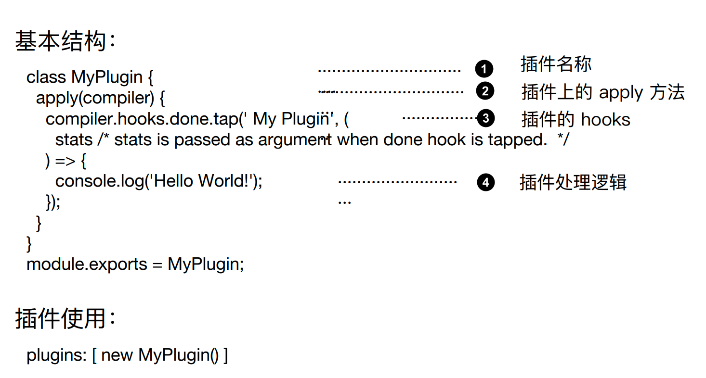

## loader

loader 的定义：**loader 只是一个导出为函数的 JavaScript 模块**。

下面是一个最简单的 loader：

```js
module.exports = function (source) {
  return source;
};
```

### loader-runner

使用 loader-runner 来测试 loader，避免每次需安装 webpack 进行测试。

```js
const { runLoaders } = require('loader-runner');
const path = require('path');
const fs = require('fs');

console.log('==>', path.join(__dirname, './demo.txt'));

runLoaders(
  {
    resource: path.join(__dirname, './demo.txt'),
    // 字符串：资源的绝对路径（可以选择包含查询字符串）
    loaders: [path.join(__dirname, './raw-loader.js')],
    // String[]：loader的绝对路径（可选地包括查询字符串）
    // {loader, options}[]: 带有选项对象的加载器的绝对路径
    context: { minimize: true },
    // 用作基本上下文的附加加载器上下文
    readResource: fs.readFile.bind(fs),
    // 可选：读取资源的函数
    // 仅当未提供 'processResource' 时使用
    // 必须有签名 function(path, function(err, buffer))
    // 默认使用 fs.readFile
  },
  function (err, result) {
    if (err) {
      console.log(err);
    } else {
      console.log(result);
    }
  }
);
```

### loader 其他配置

#### 1、传参和获取

loader 通过 options 进行传参

```js
//...
module.exports = {
  module: {
    rules: [
      {
        test: /.(png|jpg|gif|jpeg)$/,
        use: [
          {
            loader: 'url-loader',
            options: {
              limit: 10240,
            },
          },
        ],
      },
    ],
  },
};
```

通过 loader-utils 的 getOptions 方法获取参数：

```js
const loaderUtils = require('loader-utils');

module.exports = function (content) {
  const options = loaderUtils.getOptions(this);
};
```

#### 2、loader 异常处理

- 通过 throw 抛出异常
- 通过 this.callback 传递错误

```js
this.callback(
  err: Error | null,
  content: string | Buffer,
  sourceMap?: SourceMap,
  meta?: any
);
```

通过 callback 而不是 return 的方式，可以传多个内容：

```js
module.exports = function (source) {
  // return source
  this.callback(null, source, 11, 22, 33);
};
```

输出结果为：

```
{
  result: [ '你好', 11, 22, 33 ],
  resourceBuffer: <Buffer e4 bd a0 e5 a5 bd>,
  cacheable: true,
  fileDependencies: [
    '/Users/daotin/Desktop/github/fe-series-code/geektime-webpack-course/demo/loader-runner/demo.txt'
  ],
  contextDependencies: [],
  missingDependencies: []
}
```

#### 3、loader 异步处理

通过 this.async 来返回一个异步函数 callback，第一个参数是 Error，第二个参数是处理的结果。

```js
module.exports = function (source) {
  const callback = this.async();
  callback(null, source);
};
```

#### 4、loader 缓存

```js
this.cacheable(false); //关掉缓存
```

#### 5、loader 文件输出

使用`this.emitFile` 进行文件写入（_仅在 webpack 中有效，单独使用 loader-runner 无效_）

```js
const loaderUtils = require('loader-utils');
const path = require('path');

module.exports = function (source) {
  const url = path.join(__dirname, 'dist/index.js');

  this.emitFile(url, source);

  this.callback(null, source);
};
```

## plugin

> plugin 的编写没有类似 loader-runner 的独立环境，必须在 webpack 的环境中编写。

### 插件的基本结构

- 插件名称
- apply 方法（参数为 compiler）（可以查看[自定义插件](webpack构建原理.md#^5480f4)）
- 插件监听的 hooks
- 插件处理流程



### hooks 阶段

Webpack 提供了多个钩子（hooks）来在构建过程的不同阶段执行特定的操作。`emit` 阶段只是其中之一，Webpack 构建过程的各个阶段涵盖了从初始化到生成最终输出的整个生命周期。

以下是一些常见的 Webpack 阶段和它们对应的钩子：

1. **`initialize`（初始化阶段）**

   - **钩子**：`initialize`
   - 该阶段在 Webpack 启动时执行，通常用于设置插件的初始状态。

2. **`entry`（入口阶段）**

   - **钩子**：`entryOption`
   - 这是 Webpack 配置阶段，定义了入口文件（entry point）。在此阶段，Webpack 会读取 `webpack.config.js` 中的配置，确定从哪个文件开始构建依赖图。

3. **`resolve`（解析阶段）**

   - **钩子**：`resolveLoader`、`resolve`
   - 在构建模块依赖图时，Webpack 需要解析文件路径（包括模块的解析）。这包括从入口文件开始，解析文件的依赖关系并将其映射到模块。

4. **`build`（构建阶段）**

   - **钩子**：`beforeRun`、`run`、`watchRun`、`compile`
   - 在这个阶段，Webpack 开始处理源代码，将每个模块转化为对应的构建结果。
     - `beforeRun`：在构建开始之前触发。
     - `run`：在构建启动后执行，通常用于初始化编译过程。
     - `watchRun`：在 Webpack 监视模式下每次重新构建时触发。
     - `compile`：表示 Webpack 准备进行编译的阶段。

5. **`optimization`（优化阶段）**

   - **钩子**：`optimize`、`optimizeChunks`、`optimizeModules`
   - 这是 Webpack 优化处理的阶段，主要用于优化模块和 chunk 的合并、分割等。

6. **`buildModules`（构建模块阶段）**

   - **钩子**：`moduleBuild`、`module`
   - 在此阶段，Webpack 会对各个模块进行实际的构建和转换（例如通过加载器对代码进行编译或转译）。模块化的构建也在此阶段完成。

7. **`emit`（生成资源阶段）**

   - **钩子**：`emit`
   - 在此阶段，Webpack 会生成最终的文件，准备将文件输出到磁盘。`emit` 阶段通常用于文件输出的操作，如修改文件内容、创建文件名等。

8. **`afterEmit`（输出后阶段）**

   - **钩子**：`afterEmit`
   - 在 `emit` 阶段之后执行，可以用于对生成的文件进行进一步处理，或者进行清理工作等。

9. **`done`（构建完成阶段）**

   - **钩子**：`done`
   - 在 Webpack 构建过程完成后，`done` 阶段被触发，表示构建已经完成。在此阶段，插件可以进行一些收尾工作，如报告构建的结果、生成日志、清理缓存等。

10. **`failed`（构建失败阶段）**

- **钩子**：`failed`
- 如果构建过程中发生错误，`failed` 阶段将被触发，可以用于处理构建失败的情况，报告错误等。

11. **`watch`（监视模式）**

- **钩子**：`watchClose`、`watchRun`
- 这些钩子会在 Webpack 以 watch 模式运行时触发，允许开发者在文件变化时做出响应。

12. **`close`（关闭阶段）**

- **钩子**：`close`
- 当 Webpack 完成所有构建并且关闭时触发。通常用于清理资源或进行一些后处理。

13. **`afterCompile`（编译完成后阶段）**

- **钩子**：`afterCompile`
- 这个钩子在 Webpack 编译完成后触发，允许插件访问编译的内容。

常见的构建生命周期流程图：

1. **入口配置**：读取 `entry` 配置，决定构建的起点。
2. **模块解析**：解析模块的依赖关系（包括 `resolve` 阶段）。
3. **构建模块**：使用加载器对模块进行编译、转换、打包。
4. **优化**：根据配置进行优化操作（如代码分割、Tree Shaking 等）。
5. **生成输出**：通过 `emit` 阶段生成文件，准备输出到目标目录。
6. **构建完成**：构建完成后触发 `done` 钩子，进行后处理。

### plugin 其他配置

#### 1、插件中如何获取传递的参数？

通过插件的构造函数进行获取。

```js
module.exports = class MyPlugin {
  constructor(options) {
    this.options = options;
  }
  apply() {
    console.log('apply', this.options);
  }
};
```

#### 2、插件的错误处理

参数校验阶段可以直接 throw 的方式抛出

```js
throw new Error('Error');
```

如果是在 hooks 处理阶段，通过 compilation 对象的 warnings 和 errors 数组接收。

```js
compilation.warnings.push('warning');
compilation.errors.push('error');
```

#### 3、文件写入磁盘

将内容设置到`compilation.assets`对象上即可。

#### 示例：编写一个压缩构建资源为 zip 包的插件

要求：

- 生成的 zip 包文件名称可以通过插件传入
- 需要使用 compiler 对象上的特定的 hooks 进行资源生成，而不能使用 fs

分析：

- 资源的压缩使用 jszip (https://www.npmjs.com/package/jszip)
- emit 生成文件阶段，读取的是 compilation.assets 对象的值，讲 zip 资源包设置到 compilation.assets 对象上即可
- 设置到 compilation.assets 对象上时候，需要通过 webpack-sources 库中的 RawSource 类进行封装，因为 Webpack 期望的是一个符合特定接口的对象，该对象需要包含至少 `source()` 和 `size()` 方法。`RawSource` 类正是为了这个目的而设计的，它提供了这些方法，使得 Webpack 能够正确处理和输出文件内容

具体`zip-plugin.js`插件代码：

```js
const JSZip = require('jszip');
const { RawSource } = require('webpack-sources');
const zip = new JSZip();

module.exports = class ZipPlugin {
  constructor(options) {
    this.options = options;
  }

  apply(compiler) {
    console.log('zip plugin执行');

    compiler.hooks.emit.tapAsync('myZipPlugin', (compilation, callback) => {
      // console.log(compilation.options.output.path); // dist绝对路径

      // 创建一个目录
      const zip = new JSZip();
      const folder = zip.folder(this.options.filename || 'filename');

      // 目录写入文件
      for (let filename in compilation.assets) {
        const source = compilation.assets[filename].source(); // 打包后的文件内容
        folder.file(filename, source);
      }

      // 生成压缩文件
      zip.generateAsync({ type: 'nodebuffer' }).then((content) => {
        // console.log(new RawSource(content));
        const filename = this.options.filename + '.zip';
        compilation.assets[filename] = new RawSource(content); // 通过RawSource包裹一层

        callback();
      });
    });
  }
};
```

webpack 配置文件中使用：

```js
'use strict';

const path = require('path');
const CleanWebpackPlugin = require('clean-webpack-plugin');
const ZipPlugin = require('./plugins/zip-plugin');

module.exports = {
  entry: './src/index.js',
  mode: 'production',
  devtool: false,
  output: {
    path: path.join(__dirname, 'dist'),
    filename: 'bundle.js',
  },
  plugins: [
    new CleanWebpackPlugin(),
    new ZipPlugin({
      filename: 'daotin',
    }),
  ],
};
```
