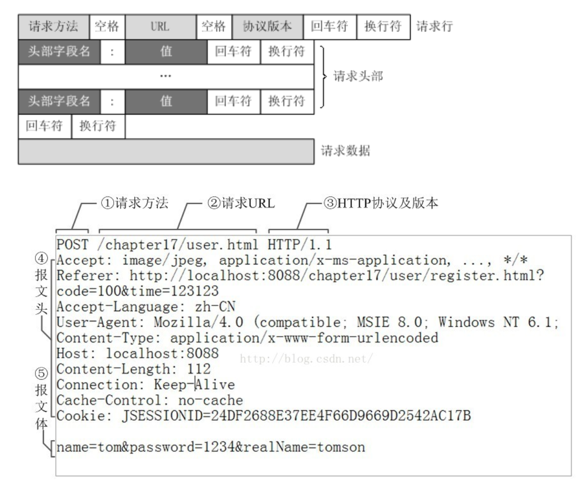
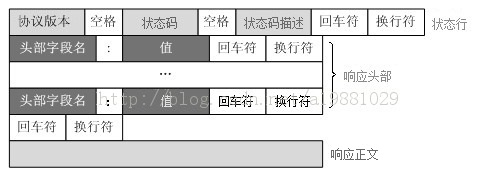
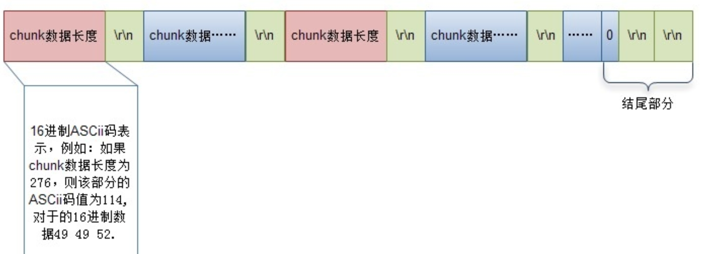
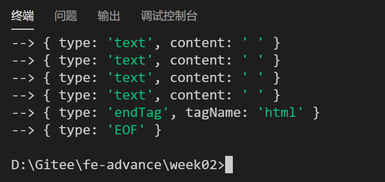
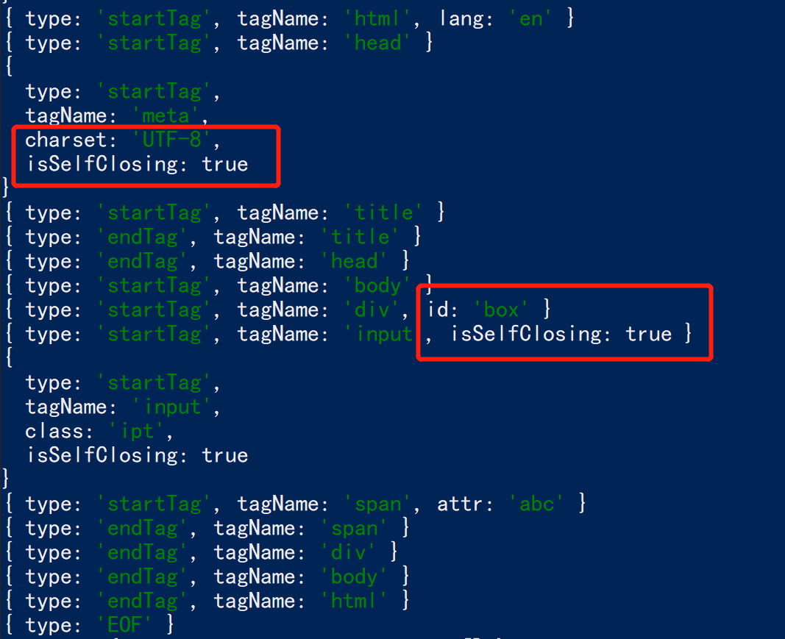
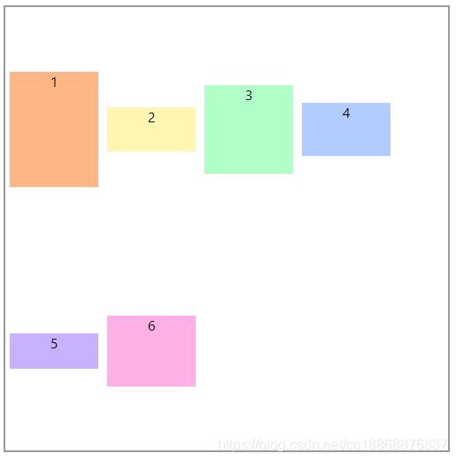
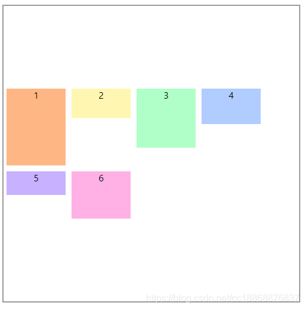

# 浏览器工作原理框架

目标：**弄清楚浏览器基础的工作原理**

过程：自己实现一个Toy-Browser项目，实现从url到一个Bitmap的显示。


浏览器工作原理架构图：

1. 一个URL，通过HTTP请求，HTTP回应拿到html代码
2. html进行parse解析后生成Dom树
3. 下一步进行CSS computing，对Dom树对应的css规则进行计算（叠加，覆盖等）
4. 得到带样式的Dom（Dom with css）
5. 下一步，layout布局计算出每个Dom盒的位置（Dom with position）
6. 最后一步，渲染render到一张图片上
7. 通过操作系统和硬件驱动显示出来

> 📌我们看到的页面，不管是图片还是文字都是一个图片形式，专业点的说法叫做位图（Bitmap），然后经过显卡转换为我们可以识别的光信号。


# 有限状态机

由于Toy-Browser经常需要使用**有限状态机处理字符串**，所以有必要了解有限状态机。

## 有限状态机

**对应的反面不是无限状态机。** 有限状态机可以简称状态机。

1、每个状态机都是一个（机器）函数

- 在每个机器里，可以做计算，输出等
- 所有机器接收的参数是一致的
- 状态机的每一个机器本身是没有状态的（类似纯函数）

2、每个机器都知道自己的下一个状态

- Moore状态机：每个机器的下一个状态是确定的，跟输入无关
- Mealy状态机：每个机器的下一个状态是由输入决定的

Mealy状态机JavaScript伪代码示例：

```javascript
//每个函数是一个状态
function state(input) {
  //... 其他操作
  
  return nextState; // 返回下一个状态函数
} 


// 一般调用过程，通过循环获取输入
while(input) {
  nextState = state(input);
} 
```

## 不使用状态机处理字符串

练习1：在一个字符串中，找到字符“a”：

```javascript
function match(str,c) {
  return str.indexOf(c) !== -1;
}
```

练习2：不准使用正则表达式，纯粹用 JavaScript 的逻辑实现：在一个字符串中，找到字符“ab”

```javascript
function match(str) {
    for(let i=0; i<str.length; i++) {
        if(str[i] == 'a' && str[i+1] == 'b') {
            return true;
        }
    }
    return false;
}

console.log(findAB('I am abcd'));
```

练习3 ：不准使用正则表达式，纯粹用 JavaScript 的逻辑实现：在一个字符串中，找到字符“abcd”

```javascript
function match(str) {
    for(let i=0; i<str.length; i++) {
        if(str[i] == 'a' 
        && str[i+1] == 'b'
        && str[i+2] == 'c'
        && str[i+3] == 'd') {
            return true;
        }
    }
    return false;
}

console.log(findAB('I am aabcdeff dasds'));
```

## 使用状态机处理字符串

练习：在一个字符串中，找到字符“abcd”（使用状态机的方式）

```javascript
// 通过查找每个字符的状态，查到后到达下一个状态
// 到达end状态后，锁死在end状态
function match(str) {
    let state = start;
    for (let c of str) {
        state = state(c);
    }
    return state === end;
}
function start(c) {
    if (c === 'a') {
        return findA;
    }
    return start;
}
function findA(c) {
    if (c === 'b') {
        return findB;
    }
    return start(c);
}
function findB(c) {
    if (c === 'c') {
        return findC;
    }
    return start(c);
}
function findC(c) {
    if (c === 'd') {
        return end;
    }
    return start(c);
}
function end(c) {
    return end;
}

console.log(match('I am ababcd'));
```

练习2：用状态机实现：字符串“abcabx”的解析

```javascript
function match(str) {
    let state = start;
    for (const c of str) {
        state = state(c);
    }
    console.log(state.name);
    return state === end;
}

function start(c) {
    if (c === 'a') return findA;
    return start;
}
function findA(c) {
    if (c === 'b') return findB;
    return start(c);
}
function findB(c) {
    if (c === 'c') return findC;
    return start(c);
}
function findC(c) {
    if (c === 'a') return findA2;
    return start(c);
}
function findA2(c) {
    if (c === 'b') return findB2;
    return start(c);
}
// 如果最后一个不是x，有可能是c，走findB逻辑，如果不是c，进入start，重新开始
function findB2(c) {
    if (c === 'x') return end;
    return findB(c); 
}
function end(c) {
    return end;
}

console.log(match('i am abcabcabx'));
```

练习3：使用状态机完成”abababx”的处理。

```javascript
function match(str) {
    let state = start;
    for (const c of str) {
        state = state(c);
    }
    console.log(state.name);
    return state === end;
}

function start(c) {
    if (c === 'a') return findA;
    return start;
}
function findA(c) {
    if (c === 'b') return findB;
    return start(c);
}
function findB(c) {
    if (c === 'a') return findA2;
    return start(c);
}
function findA2(c) {
    if (c === 'b') return findB2;
    return start(c);
}
function findB2(c) {
    if (c === 'a') return findA3;
    return start(c);
}
function findA3(c) {
    if (c === 'b') return findB3;
    return start(c);
}
// 如果不是x，可能是a，回到查找第三个a的方法，如果不是a，重新开始查找
function findB3(c) {
    if (c === 'x') return end;
    return findB2(c);
}
function end(c) {
    return end;
}

console.log(match('i am ababababx'));
```

## 字符串KMP算法

作业：如何用状态机处理完全未知的 pattern？（参考字符串KMP算法）

[ KMP 算法详解 读完本文，你可以去力扣拿下如下题目： 28.实现 strStr() -----------KMP 算法（Knuth-Morris-Pratt 算法）是一个著名的字符串匹配算法，效率很高，但是确实有点复杂。 很多读者抱怨 KMP 算法无法理解，这很正常，… https://zhuanlan.zhihu.com/p/83334559](https://zhuanlan.zhihu.com/p/83334559 " KMP 算法详解 读完本文，你可以去力扣拿下如下题目： 28.实现 strStr() -----------KMP 算法（Knuth-Morris-Pratt 算法）是一个著名的字符串匹配算法，效率很高，但是确实有点复杂。 很多读者抱怨 KMP 算法无法理解，这很正常，… https://zhuanlan.zhihu.com/p/83334559")

[ 字符串匹配的KMP算法 - 阮一峰的网络日志  http://www.ruanyifeng.com/blog/2013/05/Knuth–Morris–Pratt\_algorithm.html](http://www.ruanyifeng.com/blog/2013/05/Knuth–Morris–Pratt_algorithm.html " 字符串匹配的KMP算法 - 阮一峰的网络日志  http://www.ruanyifeng.com/blog/2013/05/Knuth–Morris–Pratt_algorithm.html")

```javascript

/**
 * 构建dp 二维数组
 * @param {*} pat 模式字符串
 */
function kmp(pat) {
    let patLen = pat.length;

    // 初始化dp为[patLen][256]二维数组
    let dp = new Array(patLen).fill(0).map(() => new Array(256).fill(0));

    // dp[状态][字符] = 下个状态
    // 初始值：当前状态为0，遇到字符pat[0]，转移到下个状态1
    dp[0][pat.charCodeAt(0)] = 1;

    // 影子状态X，初始值为0
    let X = 0;

    // j 从1 开始
    for (let j = 1; j < patLen; j++) {
        for (let c = 0; c < 256; c++) {
            let s = String.fromCharCode(c); //ASCII转字符
            if (pat[j] == s) {
                // 状态推进
                dp[j][c] = j + 1;
            } else {
                // 状态重启（交由影子处理，影子X永远比当前状态 j 落后一个状态，所以它知道当前怎么处理，因为j已经趟过了）
                dp[j][c] = dp[X][c];
            }
        }
        // 更新影子状态（把当前j的状态给影子，然后j继续往前走，相当于打了个tag）
        // 当前是状态 X，遇到字符 pat[j]，
        // X 应该转移到哪个状态？
        X = dp[X][pat.charCodeAt(j)];
    }

    return dp;
}

/**
 * 查找函数
 * @param {*} str 文本字符串
 * @param {*} pat 模式字符串
 * @returns 返回找到pat在str的索引（若为 -1，没找到）
 */
function match(str, pat) {
    let strLen = str.length;
    let patLen = pat.length;

    // pat的初始状态为0
    let j = 0;

    for (let i = 0; i < strLen; i++) {
        
        //当前状态为j，遇到字符str[i]，pat应该转移到哪个状态？
        j = dp[j][str.charCodeAt(i)];

        if (j == patLen) {
            return i - patLen + 1;
        }
    }

    return -1;
}

let str = 'aababababx';
let pat = 'ababx';

let dp = kmp(pat);
let index = match(str, pat);

if (index !== -1) {
    console.log('匹配成功，索引为：',index);
} else {
    console.log('匹配失败');
}

// 参考文档：https://zhuanlan.zhihu.com/p/83334559


```


# HTTP协议解析

## 目标

过程：自己实现一个Toy-Browser项目，实现从url到一个Bitmap的显示。


所以，首先搞清楚第一步，一个URL，通过HTTP请求，HTTP回应拿到html代码

## ISO-OSI七层网络模型


**网络层**：Internet协议就是IP协议，数据包就是通过IP唯一标示地址找到从哪个设备传输到哪个设备。没有对应的库，会调用C++的`libnet`和`libpcap`。

**传输层**：TCP协议，传输一个一个数据包。TCP对应一个概念叫`端口`，区分哪个数据包分配给哪个软件。对应的库为`require('net')`。

**HTTP层**：不能引入`require('http')` ，我们需要自己实现http协议，所以应该引入`require('net')`。

## HTTP

- request
- response

request和response是一对一出现的。

我们要实现的http协议就是实现request和response。

HTTP协议是文本型协议。跟二进制型协议相对的。

文本型协议意思是协议的内容都是**字符串**。

### HTTP请求报文格式



**请求头Request Headers**

- 请求行 Request line：`POST / HTTP/1.1`  post请求，路径为`/`，版本号
- 请求头headers：包括多行key，value的形式，已空行结束
- 请求体body：根据ContentType显示不同的样式


### HTTP响应报文格式




**响应头Response Headers**

- 状态行 status line：`HTTP/1.1 200 OK` 版本号，状态码，状态文本
- 响应头headers：包括多行key，value的形式，已空行结束
- 响应正文body：根据ContentType显示不同的样式


chunk body：node默认返回的一种body格式。由16进制数字独占一行，中间是内容，结尾是16进制0。

### **node服务端代码**

```javascript
const http = require('http');

const server = http.createServer((req, res) => {
    let body = [];

    req.on('error', (err) => {
        console.error(err);
    }).on('data', (chunk) => {
        body.push(chunk.toString());
    }).on('end', () => {
        body = Buffer.concat(body).toString();
        console.log('body:', body);
        res.writeHead(200, { 'Content-Type': 'text/html' });
        res.end('Hello World\n');
    });
});

server.listen(8080);

console.log('server start!');
```

### **node客户端**

实现HTTP的请求代码：

#### 1、构建请求头信息

通过自定义`Request` 类来进行请求头的构建。

下一步实现`send`函数，send函数为把请求发送到服务器。

```javascript
class Request {
    constructor(option) {
        this.method = option.method || 'GET';
        this.host = option.host;
        this.port = option.port || '80';
        this.path = option.path || '/';
        this.body = option.body || {};
        this.headers = option.headers || {};

        if (!this.headers['Content-Type']) {
            this.headers['Content-Type'] = 'application/x-www-form-urlencoded';
        }
        if (this.headers['Content-Type'] === 'application/json') {
            this.bodyText = JSON.stringify(this.body);
        } else if (this.headers['Content-Type'] === 'application/x-www-form-urlencoded') {
            this.bodyText = Object.keys(this.body).map(key => `${key}=${encodeURIComponent(this.body[key])}`).join('&')
        }

        this.headers['Content-Length'] = this.bodyText.length;
    }

    send() {
        // ...
    }
}

void async function () {
    let req = new Request({
        method: 'POST',      // http协议要求
        host: '127.0.0.1',   // ip协议要求
        port: '8080',        // tcp协议要求
        path: '/',           // http协议要求
        headers: {
            ['X-Foo2']: 'customed'
        },
        body: {
            name: 'Daotin',
            age: '18'
        }
    });

    let res = await req.send();

    console.log(res);
}();
```

#### 2、编写send函数

发送请求函数是异步的，所以返回Promise。

发送的过程中，会持续受到数据，我们需要在收到全部数据后，再整合成一个消息。

所以我们需要构建一个类`ResponseParser`，用来整合数据。

```javascript
send() {
    // 发送请求函数是异步的，所以返回Promise。
    return new Promise((resolve, reject) => {
        const parser = new ResponseParser;
    });
}
```

```javascript
class ResponseParser {
    constructor() { }
    // 接收数据
    receive(string) {
        for (let i = 0; i < string.length; i++) {
            this.receiveChar(string[i]);
        }
    }
    // 状态机代码
    receiveChar(char) {}
}
```

#### 3、编写send具体发送请求代码

- 支持已有的connection或者新建的connection
- 发送后收到服务器响应数据传给parser
- 根据parser的状态设置resolve或者reject

```javascript
var net = require('net');

// 把请求发送到node服务器server.js
send(connection) {
    return new Promise((resolve, reject) => {
        // 创建一个处理响应数据的类ResponseParser
        const parser = new ResponseParser;
        
        // 判断当前使用有TCP连接，如果有直接发送，如果没有新创建一个连接
        if (connection) {
            // 由于HTTP协议是文本型协议，所有传输的内容均为字符串
            connection.write(this.reqDatatoString());
        } else {
            connection = net.createConnection({
                host: this.host,
                port: this.port
            }, () => {
                connection.write(this.reqDatatoString());
            });
        }

        // 如果服务器有返回消息，会触发data事件
        connection.on('data', (data) => {
            // 下面是拿到data的示例内容：
            /*
                HTTP/1.1 200 OK
                Content-Type: text/html
                Date: Wed, 14 Apr 2021 15:13:17 GMT
                Connection: keep-alive
                Keep-Alive: timeout=5
                Transfer-Encoding: chunked

                c
                Hello World

                0
            */
            console.log(data.toString());
            parser.receive(data.toString());

            // parser处理字符串完成
            if (parser.isFinished) {
                resolve(parser.response);
                connection.end();
            }
        });

        connection.on('error', (err) => {
            reject(err)
            connection.end();
        });
    });
}

// 把要发送的请求转换成字符串形式，因为HTTP是文本型协议
reqDatatoString() {
        return `${this.method} ${this.path} HTTP/1.1\r
${Object.keys(this.headers).map(key => `${key}: ${this.headers[key]}`).join('\r\n')}
\r
${this.bodyText}`;
    }

```

#### 4、编写处理响应数据的parser代码

- 响应数据是字符串，一个个字符接收到的，所以需要parser专门处理这些字符串
- 使用状态机表示接收字符到哪个状态了（比如status line接收完了，开始接受headers了）

```javascript
/**
 * 处理响应数据的类，把收到的断断续续的数据，整合成一个完整的数据包
 */
class ResponseParser {
    constructor() {
        /**
         * 使用常量表示接收到响应数据的进度状态
         * 换行时\r\n
         * 接收到\r进入下一状态，\n也是一样
         */
        this.WAITING_STATUS_LINE = 0; // 处在等待状态行状态（接收到\r进入WAITING_STATUS_LINE_END状态）
        this.WAITING_STATUS_LINE_END = 1; // 接收到状态行后面的\r,处在等待\n状态 （接收到\n进入WAITING_HEADER_NAME状态)

        this.WAITING_HEADER_NAME = 2; // 等待响应头key
        this.WAITING_HEADER_SPACE = 3; // 等待响应头key和value中间的空格
        this.WAITING_HEADER_VALUE = 4; // 等待响应头value
        this.WAITING_HEADER_END = 5; // 等待响应头部分接收完毕
        this.WAITING_HEADER_BLOCK_END = 6; //等待响应头与响应正文中间的空行

        this.WAITING_BODY = 7; // 等待响应正文部分

        // 转换后的存放响应数据
        this.current = this.WAITING_STATUS_LINE;
        this.statusLine = '';
        this.headers = {};
        this.headerName = '';
        this.headerValue = '';
    }
    receive(string) {
        for (let i = 0; i < string.length; i++) {
            this.receiveChar(string[i]);
        }
        console.log('-->', this.statusLine);
        console.log('-->', this.headers);
    }
    // 使用状态机处理
    receiveChar(char) {
        if (this.current === this.WAITING_STATUS_LINE) {
            if (char === '\r') {
                this.current = this.WAITING_STATUS_LINE_END;
            } else {
                this.statusLine += char;
            }
        } else if (this.current === this.WAITING_STATUS_LINE_END) {
            if (char === '\n') {
                this.current = this.WAITING_HEADER_NAME;
            }
        } else if (this.current === this.WAITING_HEADER_NAME) {
            if (char === ':') {
                this.current = this.WAITING_HEADER_SPACE;
            } else if (char === '\r') { // 遇到空行
                this.current = this.WAITING_HEADER_BLOCK_END;
                // 判断响应数据body的类型（这里是chunked格式的body，还会有其他格式的body，这里node默认为chunked格式，至于其他格式暂不处理）
                if (this.headers['Transfer-Encoding'] === 'chunked') {
                    this.bodyParser = new ThunkedBodyParser();
                }
            } else {
                this.headerName += char;
            }
            
        } else if (this.current === this.WAITING_HEADER_SPACE) {
            if (char === ' ') {
                this.current = this.WAITING_HEADER_VALUE;
            }
        } else if (this.current === this.WAITING_HEADER_VALUE) {
            if (char === '\r') {
                this.current = this.WAITING_HEADER_END;
                this.headers[this.headerName] = this.headerValue;
                this.headerName = '';
                this.headerValue = '';
            } else {
                this.headerValue += char;
            }
        } else if (this.current === this.WAITING_HEADER_END) {
            if (char === '\n') {
                this.current = this.WAITING_HEADER_NAME;
            }
        } else if (this.current === this.WAITING_HEADER_BLOCK_END) {
            if (char === '\n') {
                this.current = this.WAITING_BODY;
            }
        } else if (this.current === this.WAITING_BODY) {
            this.bodyParser.receiveChar(char);
        }
    }
}
```

#### 5、编写bodyParser代码

- node默认的body格式为chunked格式，至于其他格式暂不处理
- 使用状态机处理body的格式

**chunked格式参考文档：**

- [Transfer-Encoding——MDN](https://developer.mozilla.org/zh-CN/docs/Web/HTTP/Headers/Transfer-Encoding "Transfer-Encoding——MDN")
- [HTTP 协议入门——阮一峰](http://www.ruanyifeng.com/blog/2016/08/http.html "HTTP 协议入门——阮一峰")
- [http 协议的结束符](https://github.com/jinhailang/blog/issues/34 "http 协议的结束符")

> 💡终止块0是一个常规的分块，不同之处在于其长度为0。终止块后面是一个挂载（trailer），由一系列（或者为空）的实体消息首部构成。（下图可以看到，0后面是有`两个\r\n`的）

一个分块响应形式如下：

```纯文本
HTTP/1.1 200 OK
Content-Type: text/plain
Transfer-Encoding: chunked

7\r\n
Mozilla\r\n
9\r\n
Developer\r\n
7\r\n
Network\r\n
0\r\n
\r\n
```



```javascript

class ThunkedBodyParser {
    constructor() {
        /** body数据格式如下：
         * 第一行为数据长度，16进制的
         * 第二行开始为数据内容。
         * 当数据长度为0时，body结束。
         * 
           c
           Hello World

           0
         */
        this.WAITING_LENGTH = 0;      // 等待数据长度
        this.WAITING_LENGTH_END = 1;

        this.WAITING_CHUNK = 2;   // 等到body正文

        this.WAITING_NEW_LINE = 3;  // 新的body数据
        this.WAITING_NEW_LINE_END = 4;

        this.current = this.WAITING_LENGTH;
        this.length = 0;
        this.content = '';
        this.isFinished = false;
    }

    receiveChar(char) {
        if (this.current === this.WAITING_LENGTH) {
            if (char === '\r') {
                if (this.length === 0) {
                    this.isFinished = true;
                } else {
                    this.current = this.WAITING_LENGTH_END;
                }
            } else {
                this.length *= 16;
                this.length += parseInt(char, 16);
            }
        } else if (this.current === this.WAITING_LENGTH_END) {
            if (char === '\n') {
                this.current = this.WAITING_CHUNK;
            }
        } else if (this.current === this.WAITING_CHUNK) {
            this.content += char;
            this.length--;
            if (this.length === 0) {
                this.current = this.WAITING_NEW_LINE;
            }
        } else if (this.current === this.WAITING_NEW_LINE) {
            if (char === '\r') {
                this.current = this.WAITING_NEW_LINE_END;
            }
        } else if (this.current === this.WAITING_NEW_LINE_END) {
            if (char === '\n') {
                this.current = this.WAITING_LENGTH;
            }
        }
    }
}
```

## 总结

1. 构建服务端`server.js`
2. 构建客户端`client.js`
3. 创建请求发送类`Request`，通过send发送请求（通过`async/await` 异步发送请求，发送的过程不会阻塞后面代码执行，关于async，这篇文章很好：[https://www.jianshu.com/p/fb1da22f335d](https://www.jianshu.com/p/fb1da22f335d "https://www.jianshu.com/p/fb1da22f335d")）
4. 构建`ResponseParser` 处理服务端返回的数据（利用`状态机`处理状态行，响应头）
5. 创建`ThunkedBodyParser` 处理响应正文（利用`状态机`处理）
6. 最后`req.send()` 的返回值就是处理好的响应数据


# HTML解析生成DOM树

## 目标


我们已经完成第一步：从http请求，http回应拿到html代码。

接下来我们要实现第二步：html进行parse解析后生成Dom树

## 过程

首先新建`parser.js`文件专门处理后续的解析过程。

其中`parseHTML`函数就是解析HTML的过程。

```javascript
// client.js
let dom = parser.parseHTML(response.body);

// parser.js
exports.parseHTML = function (html) {
    console.log('-->', html);
} 
```

## HTML解析（词法分析）

html解析过程也是使用状态机来处理，不过不需要我们自己定义状态，在HTML的标准里面就已经帮我们设计好了80个状态（**13.2.5 Tokenization**章节）。我们只需要根据状态来判断就好了。

[ HTML Standard  https://html.spec.whatwg.org/multipage/parsing.html](https://html.spec.whatwg.org/multipage/parsing.html " HTML Standard  https://html.spec.whatwg.org/multipage/parsing.html")

为了简化处理，大部分状态是不需要的，只需要十几个。

```javascript
const EOF = Symbol('EOF'); // end of file

function data(c) {
    
}

exports.parseHTML = function (html) {
    let state = data;
    for (const c of html) {
        state = state(c);
    }
    // html最后是有一个文件终结的，但是在文件终结的位置，比如说有一些文本节点可能仍然面临没有终结的状态，所以最后给它一个额外的无效的字符，表示html的终结
    state = state(EOF);
}
```

我的问题❓❓❓

## 解析标签tag

标签分为三种：

- 开始标签`<input>`
- 结束标签`</input>`
- 自闭合标签`<input />`

我们需要判断遇到的标签是以上三种的哪一种。

```javascript

const EOF = Symbol('EOF'); // end of file

// 初始状态，因为HTML标准规定中初始状态用的是data
function data(c) {
    if (c === '<') {
        return tagOpen;
    } else if (c == EOF) {
        return;
    } else {
        return data;
    }
}

// 是tag标签状态
function tagOpen(c) {
    if (c === '/') {
        return endTagOpen;
    } else if (c.match(/^[a-zA-Z]$/)) {
        return tagName(c);
    } else {
        return;
    }
}

// 是标签名称状态
function tagName(c) {
    if (c.match(/^[\t\n\f ]$/)) { // 4个有效空格
        return beforeAttributeName;
    } else if (c.match(/^[a-zA-Z]$/)) {
        return tagName;
    } else if (c === '/') {
        return selfClosingTag;
    } else if(c === '>'){ // 匹配到完整的开始标签，进入data，开始匹配下一个标签
        return data;
    } else {
        return;
    }
}

// 是属性名状态（暂未处理）
function beforeAttributeName(c) {
    if (c.match(/^[\t\n\f ]$/)) {
        return beforeAttributeName;
    } else if (c === '>') {
        return data;
    } else if (c === '=') {
        return beforeAttributeName;
    } else {
        return beforeAttributeName;
    } 
}

// 是自闭合标签状态
function selfClosingTag(c) {
    if (c === '>') {
        // 是自闭合标签
        return data;
    } else if(c === EOF){
        return;
    } else {
        return;
    }
}

exports.parseHTML = function (html) {
    let state = data;
    for (const c of html) {
        state = state(c);
    }
    // 最后给一个无效的字符，表示html的终结
    state = state(EOF);
}
```

> 💡4个有效空格：`\t` `\n` `\f` ` ` 。

## 加入业务逻辑

- 增加`currentToken`记录当前标签的类型type和标签名称name，
- 增加`emit`函数输出每个字符是文本类型还是标签

```javascript

const EOF = Symbol('EOF'); // end of file

let currentToken = null;

function emit(token) {
    console.log('-->', token);
}

// 初始状态，因为HTML标准规定中初始状态用的是data
function data(c) {
    if (c === '<') {
        return tagOpen;
    } else if (c == EOF) {
        emit({
            type: 'EOF'
        });
        return;
    } else {
        // 打印每一个文本节点
        emit({
            type: 'text',
            content: c
        });
        return data;
    }
}

// 是tag标签状态
function tagOpen(c) {
    if (c === '/') {
        return endTagOpen;
    } else if (c.match(/^[a-zA-Z]$/)) {
        currentToken = {
            type: 'startTag',
            tagName: ''
        };
        return tagName(c);
    } else {
        return;
    }
}

// 是结束标签
function endTagOpen(c) {
    if (c.match(/^[a-zA-Z]$/)) {
        currentToken = {
            type: 'endTag',
            tagName: ''
        };
        return tagName(c);
    } else if (c === '>') {
        
    } else if (c === EOF) {

    } else {
        
    }
}

// 是标签名称状态
function tagName(c) {
    if (c.match(/^[\t\n\f ]$/)) { // 4个有效空格
        return beforeAttributeName;
    } else if (c.match(/^[a-zA-Z]$/)) {
        currentToken.tagName += c;
        return tagName;
    } else if (c === '/') {
        return selfClosingStartTag;
    } else if (c === '>') { // 匹配到完整的开始标签，进入data，开始匹配下一个标签
        emit(currentToken); // 打印标签
        return data;
    } else {
        return;
    }
}

// 是属性名状态
function beforeAttributeName(c) {
    if (c.match(/^[\t\n\f ]$/)) {
        return beforeAttributeName;
    } else if (c === '>') {
        emit(currentToken); // 打印标签
        return data;
    } else if (c === '=') {
        return beforeAttributeName;
    } else {
        return beforeAttributeName;
    } 
}

// 是自闭合标签状态
function selfClosingStartTag(c) {
    if (c === '>') {
        // 是自闭合标签
        currentToken.isSelfClosing = true;
        return data;
    } else if(c === EOF){
        return;
    } else {
        return;
    }
}

exports.parseHTML = function (html) {
    let state = data;
    for (const c of html) {
        state = state(c);
    }
    // 最后给一个无效的字符，表示html的终结
    state = state(EOF);
}
```

打印结果的一部分：



## 解析标签属性

- 属性值分为`单引号`，`双引号`，`无引号`三种写法。
- 使用全局变量`currentAttribute`暂存属性名和属性值。
- 属性结束时，把属性写到标签Token上。

代码太长就省略了。。



原server中的html代码如下：

```html
<html lang="en">
    <head>
        <meta charset="UTF-8" />
        <title>Document</title>
    </head>
    <body>
        <div id="box">
            <input />
            <input class='ipt' />    
            <span attr=abc >Hello World</span>
        </div>
    </body>
</html>
```

可以看到，输出的token带有属性。

## HTML语法分析

用栈构建dom树原理

- 遇到`开始标签`创建元素并入栈
- 遇到`结束标签`就出栈
- `自闭合标签`可以视为入栈后立刻出栈
- 任何元素的父元素都是其入栈前的`栈顶元素`

### 构建dom树的标签节点

```javascript
// 栈本来是空的，这里给个初始根元素，方便输出观看
let stack = [{ type: 'document', children: [] }];

function emit(token) {
    let top = stack[stack.length-1];

    // 开始标签，构建元素属性，然后入栈
    if (token.type === 'startTag') {
        let element = {
            type: 'element',
            tagName: token.tagName,
            attributes: [],
            parent: top,
            children:[]
        }
        // 所有的标签属性
        for (const k in token) {
            if (k !== 'type' && k !== 'tagName') {
                element.attributes.push({
                    name: k,
                    value: token[k]
                });
            }
        }
        //任何元素的父元素都是其入栈前的栈顶元素
        top.children.push(element);

        // 不是自闭合标签才入栈
        if (!token.isSelfClosing) {
            stack.push(element);
        }
    } else if (token.type === 'endTag') { // 匹配到结束标签出栈
        if (top.tagName === token.tagName) {
            stack.pop();
        } else {
            throw new Error('endTag not match startTag!');
        }
    }
}
```

最后输出的stack如下：

```json
[
  {
    type: "document",
    children: [
      {
        type: "element",
        tagName: "html",
        attributes: [
          {
            name: "lang",
            value: "en",
          },
        ],
        parent: [Circular],
        children: [
          {
            type: "element",
            tagName: "head",
            attributes: [
            ],
            parent: [Circular],
            children: [
              {
                type: "element",
                tagName: "meta",
                attributes: [
                  {
                    name: "charset",
                    value: "UTF-8",
                  },
                  {
                    name: "isSelfClosing",
                    value: true,
                  },
                ],
                parent: [Circular],
                children: [
                ],
              },
              {
                type: "element",
                tagName: "title",
                attributes: [
                ],
                parent: [Circular],
                children: [
                ],
              },
            ],
          },
          {
            type: "element",
            tagName: "body",
            attributes: [
            ],
            parent: [Circular],
            children: [
              {
                type: "element",
                tagName: "div",
                attributes: [
                  {
                    name: "id",
                    value: "box",
                  },
                ],
                parent: [Circular],
                children: [
                  {
                    type: "element",
                    tagName: "input",
                    attributes: [
                      {
                        name: "isSelfClosing",
                        value: true,
                      },
                    ],
                    parent: [Circular],
                    children: [
                    ],
                  },
                  {
                    type: "element",
                    tagName: "input",
                    attributes: [
                      {
                        name: "class",
                        value: "ipt",
                      },
                      {
                        name: "isSelfClosing",
                        value: true,
                      },
                    ],
                    parent: [Circular],
                    children: [
                    ],
                  },
                  {
                    type: "element",
                    tagName: "span",
                    attributes: [
                      {
                        name: "attr",
                        value: "abc",
                      },
                    ],
                    parent: [Circular],
                    children: [
                    ],
                  },
                ],
              },
            ],
          },
        ],
      },
    ],
  },
]
```

### 构建dom树的文本节点

在之前emit函数的基础上，增加文本节点的处理

- 新增当前文本节点currentTextNode，如果遇到token为标签节点，currentTextNode=null
- currentTextNode为null，说明是新的文本节点加入top的children
- currentTextNode不为null，说明上一个token也是文本节点，那么就合并为同一个dom文本节点

```javascript
if (token.type === 'text') {
    if (currentTextNode) {
        currentTextNode.content += token.content;
    } else {
        currentTextNode = {
            type: 'text',
            content: token.content
        }
        top.children.push(currentTextNode);
    }
}
```

最后返回stack，就得到我们最终的dom树了。

```javascript
exports.parseHTML = function (html) {
    let state = data;
    for (const c of html) {
        state = state(c);
    }
    // 最后给一个无效的字符，表示html的终结
    state = state(EOF);

    return stack[0];
}

```

# 生成带CSS属性的DOM树

CSS计算：对CSS进行词法和语法分析

## 环境准备

```纯文本
npm install css
```

css parser 把css代码变成AST抽象语法树的过程。

我们的过程就是**从AST抽象语法树中抽出css语法规则，应用到html元素上。**

## 收集css规则

- 遇到style标签时，把css规则保存起来
- 调用css parser 得到css规则

```javascript
const css = require('css');

// css parser处理，得到css规则
let rules = [];
function addCSSRules(text) {
    let ast = css.parse(text);
    rules.push(...ast.stylesheet.rules);
}
```

```javascript
else if (token.type === 'endTag') { // 匹配到结束标签出栈
    if (top.tagName === token.tagName) {
        
        /*遇到style标签，执行css parser*/
        if (token.tagName === 'style') {
            addCSSRules(top.children[0].content);
        }

        stack.pop();
    } else {
        throw new Error('endTag not match startTag!');
    }

    currentTextNode = null;

}
```

原style

```css
body div span{
    color: red;
    width: 10px
}
```

最后得到的rules：

```javascript
{
  type: "rule",
  selectors: [
    "body div span",
  ],
  declarations: [
    {
      type: "declaration",
      property: "color",
      value: "red",
      position: {
        start: {
          line: 3,
          column: 17,
        },
        end: {
          line: 3,
          column: 27,
        },
        source: undefined,
      },
    },
    {
      type: "declaration",
      property: "width",
      value: "10px",
      position: {
        start: {
          line: 4,
          column: 17,
        },
        end: {
          line: 5,
          column: 13,
        },
        source: undefined,
      },
    },
  ],
  position: {
    start: {
      line: 2,
      column: 13,
    },
    end: {
      line: 5,
      column: 14,
    },
    source: undefined,
  },
}
```

## 应用css规则

时机：**理论上，在解析到startTag的时候就可以匹配到css规则（这里不考虑）。**

我的问题❓❓❓

本节目标：在startTag的时候判断匹配到哪些css规则了。


## 获取父元素列表

在computeCSS函数中，我们需要知道当前元素所有的父元素才能判断元素与规则是否匹配。所以我们需要通过stack拿到该元素所有父元素。

```javascript
let elements = stack.slice().reverse();
```

stack.slice()：因为tag标签一直在加入到stack，会污染stack，所以我们这里需要一个当前stack的副本。（slice不会影响原数组，splice会。）

reverse：因为stack里面元素的顺序是`[document, html, body, div]`，现在匹配规则是从最后匹配，所以要反转一下。

比如下面规则匹配的时候，最先匹配的是span，匹配到span后，才会继续匹配p和div。

```css
div p span {}
```

## 计算选择器与元素匹配

（仅仅处理了简单选择器匹配判断）

```javascript
/**
 * 应用css规则
 */
function computeCSS(element) {
    console.log('==>', rules);
    let elements = stack.slice().reverse();
    console.log('==>', elements);

    if (!element.computedStyle) {
        element.computedStyle = {};
    }

    for (const rule of rules) {
        // 这里选择器只考虑以空格分隔的简单选择器（比如 body div span）
        let selectorParts = rule.selectors[0].split(' ').reverse(); // ['span', 'div', 'body']

        // 检查当前元素与selectorParts[0]是否匹配
        if (match(element, selectorParts[0])) {
            
            let matched = false;

            // 当前元素匹配成功后，开始匹配父元素，当所有的父元素匹配成功，才能说这个规则匹配成功
            /**
             * 比如 body div span
             * 首先匹配span，匹配元素的attribute/元素的tagName是否是span
             * 匹配到了后匹配div和body，看元素的父元素的attribute/元素的tagName是否是div和body
             * 只有全部匹配了，那么`body div span {}` 这条规则才是有效的规则。
             */
            let j = 1;
            for (let i = 0; i < elements.length; i++) { // elements: [span, p, div, body, html, document]
                if (match(elements[i], selectorParts[j])) { 
                    j++;
                }
            }

            if (j >= selectorParts.length) {
                matched = true;
            }

            if (matched) {
                // ...生成计算属性
            }
        }

    }
}

function match(element, selector) {
    if (!selector || !element.attributes) {
        return false;
    }

    // 只处理了简单选择器
    if (selector.charAt(0) === '#') {
        let attr = element.attributes.filter(attr => attr.name === 'id')[0];
        if (attr && attr.value === selector.replace('#', '')) {
            return true;
        }
    } else if (selector.charAt(0) === '.') {
        let attr = element.attributes.filter(attr => attr.name === 'class')[0];
        if (attr && attr.value === selector.replace('.', '')) {
            return true;
        }
    } else {
        if (element.tagName === selector) {
            return true;
        }
    }

    return false;
} 
```

## 生成元素的computedStyle

如果规则匹配成功，则在computedStyle中加入规则，比如：

```javascript
computedStyle:{
  color:{
    value: 'red'
  }
}
```

但是有可能有样式覆盖的问题，所以需要specificity来获取优先级。

计算优先级规则：引入四元数组，分别代表：

| 内联样式 | id选择器 | 类选择器 | tag标签 |
| ---- | ----- | ---- | ----- |
|      |       |      |       |

比如：

- body div span 优先级为：\[0,0,0,3]
- body #div span 优先级为：\[0,1,0,2]

compare函数为优先级比较函数。

如果当前规则的优先级比之前存在的优先级高，则覆盖。

```javascript
function match(element, selector) {
    if (!selector || !element.attributes) {
        return false;
    }

    // 只处理了简单选择器
    if (selector.charAt(0) === '#') {
        let attr = element.attributes.filter(attr => attr.name === 'id')[0];
        if (attr && attr.value === selector.replace('#', '')) {
            return true;
        }
    } else if (selector.charAt(0) === '.') {
        let attr = element.attributes.filter(attr => attr.name === 'class')[0];
        if (attr && attr.value === selector.replace('.', '')) {
            return true;
        }
    } else {
        if (element.tagName === selector) {
            return true;
        }
    }

    return false;
}

function specificity(selector) { // body div span
    let p = [0, 0, 0, 0] // 优先级：inline，#id, .class，tag
    selector.split(' ').forEach(ele => {
        if (ele.charAt(0) === '#') {
            p[1] += 1;
        } else if (ele.charAt(0) === '.') {
            p[2] += 1;
        } else {
            p[3] += 1;
        }
    });

    return p;
}

// 优先级比较函数
function compare(sp1, sp2) {
    if (sp1[0] !== sp2[0]) return sp1[0] - sp2[0];
    if (sp1[1] !== sp2[1]) return sp1[1] - sp2[1];
    if (sp1[2] !== sp2[2]) return sp1[2] - sp2[2];
    return sp1[3] - sp2[3];
}

/**
 * 应用css规则
 */
function computeCSS(element) {
    console.log('==>', rules);
    let elements = stack.slice().reverse();
    console.log('==>', elements);

    if (!element.computedStyle) {
        element.computedStyle = {};
    }

    for (const rule of rules) {
        // 这里选择器只考虑以空格分隔的简单选择器（比如 body div span）
        let selectorParts = rule.selectors[0].split(' ').reverse(); // ['span', 'div', 'body']

        // 检查当前元素与selectorParts[0]是否匹配
        if (match(element, selectorParts[0])) {
            
            let matched = false;

            // 当前元素匹配成功后，开始匹配父元素，当所有的父元素匹配成功，才能说这个规则匹配成功
            /**
             * 比如 body div span
             * 首先匹配span，匹配元素的attribute/元素的tagName是否是span
             * 匹配到了后匹配div和body，看元素的父元素的attribute/元素的tagName是否是div和body
             * 只有全部匹配了，那么`body div span {}` 这条规则才是有效的规则。
             */
            let j = 1;
            for (let i = 0; i < elements.length; i++) { // elements: [span, p, div, body, html, document]
                if (match(elements[i], selectorParts[j])) { 
                    j++;
                }
            }

            if (j >= selectorParts.length) {
                matched = true;
            }

            if (matched) {
                let computedStyle = element.computedStyle;

                let sp = specificity(rule.selectors[0]);
                

                for (const declaration of rule.declarations) {
                    if (!computedStyle[declaration.property]) {
                        computedStyle[declaration.property] = {};
                    }

                    // 属性的优先级
                    if (!computedStyle[declaration.property].specificity) {
                        computedStyle[declaration.property].value = declaration.value;
                        computedStyle[declaration.property].specificity = sp;
                    } else if (compare(sp, computedStyle[declaration.property].specificity) >= 0) { //  现在的优先级 >= 以前的优先级
                        computedStyle[declaration.property].value = declaration.value;
                        computedStyle[declaration.property].specificity = sp;
                    }
                }
                console.log('==>', computedStyle);
            }
        }

    }
}
```

最后在client.js的 `let dom = parser.parseHTML(response.body);` 返回值就是带有css样式的dom数。

```json
// 一个span的computedStyle如下：

{
  color: {
    value: "green",
    specificity: [ 0, 1, 0, 1],
  },
  width: {
    value: "20px",
    specificity: [ 0, 1, 0, 1],
  },
}
```

整个生成带有css属性的dom树完成。


# 生成带位置的DOM树

# 排版算法

第一代排版：position，display，float

第二代排版：flex

第三代排版：grid

第四代排版（预测）：CSS Houdini

## flex排版

选择flex排版是因为容易实现，而且能力不会太差。

主轴：Main Axis

交叉轴：Cross Axis

如果主轴的方向是`flex-direction: row;`

相关的属性有：

- 主轴：width，x，left，right
- 交叉轴：height，y，top，bottom

如果主轴的方向是`flex-direction: column;`则反之。

## 排版的时机

我的问题❓❓❓

**当匹配到结束标签的时候，就需要进行排版。**

1、做抽象的工作，把width，left等属性抽象成main，cross等属性

2、把元素收进“行”内

## 收集元素进行

**当所有子元素主轴方向尺寸之和大于父元素主轴尺寸的时候，就会进行分行处理。**

- 如果设置了no-warp，则把所有子元素强行分配进第一行
- 如果未设置no-warp，则当一个子元素放入时，当前行的剩余空间不足以容纳该子元素时，则另起一行放入，另起的这一行变为当前行，并且有较多的剩余空间
- 以此类推，把所有的子元素收集进不同的行中

## 计算主轴

> 如果是row的话，也就是计算width，left，right

判断主轴剩余空间`mainSpace`是否为负：

- **为负，则只有一行（no-wrap）**
  - 带有flex属性的元素，主轴方向长度为0
  - 不带有flex属性的元素，进行等比缩放
- **不为负（有剩余空间）**
  - 查找每一行的元素是否有flex属性
    - 有，把剩余空间mainSpace分给flex元素（比如如果有两个子元素flex属性分别是1，2的话，分配的剩余空间占比是1/3和2/3）
    - 没有，根据justifyContent属性进行布局，取得起始位置currentMain和子元素的间距step，然后计算每个子元素在主轴方向的位置。

## 计算交叉轴

> 如果是row的话，计算height，top，bottom

[align-items和align-content的区别\_码飞\_CC的博客-CSDN博客 文章目录1. stack overflow上的回答（翻译）2. 自己动手实践2.1 子项为单行的情况2.1.1 flex容器不设置高度2.1.2 flex容器设置高度2.2 子项为多行的情况2.2.1 flex容器不设置高度2.2.2 flex容器设置高度3. 总结在用flex布局时，发现有两个属性功能好像有点类似：align-items和align-content，乍看之下，它们都是用于定义f... https://blog.csdn.net/cc18868876837/article/details/88138057](https://blog.csdn.net/cc18868876837/article/details/88138057 "align-items和align-content的区别_码飞_CC的博客-CSDN博客 文章目录1. stack overflow上的回答（翻译）2. 自己动手实践2.1 子项为单行的情况2.1.1 flex容器不设置高度2.1.2 flex容器设置高度2.2 子项为多行的情况2.2.1 flex容器不设置高度2.2.2 flex容器设置高度3. 总结在用flex布局时，发现有两个属性功能好像有点类似：align-items和align-content，乍看之下，它们都是用于定义f... https://blog.csdn.net/cc18868876837/article/details/88138057")

`align-items`：每一行的元素在交叉轴的排布

`align-content`：所有行在交叉轴剩余空间的排布





## 绘制元素

如何绘制？

准备图形环境，由于Node.js没有图形封装的，所以使用生成图片来代替，把绘制到屏幕变成绘制到图片。

npm下有个[images](https://www.npmjs.com/package/images "images")库：**Node.js轻量级跨平台图像编解码库**

功能特性

- 轻量级：无需安装任何图像处理库。
- 跨平台：Windows下发布了编译好的.node文件,下载就能用。
- 方便用：jQuery风格的API，简单可依赖。

安装

```纯文本
npm install images
```

使用

```javascript
var images = require("images");
 
images("input.jpg")                     //Load image from file 
                                        //加载图像文件
    .size(400)                          //Geometric scaling the image to 400 pixels width
                                        //等比缩放图像到400像素宽
    .draw(images("logo.png"), 10, 10)   //Drawn logo at coordinates (10,10)
                                        //在(10,10)处绘制Logo
    .save("output.jpg", {               //Save the image to a file, with the quality of 50
        quality : 50                    //保存图片到文件,图片质量为50
    });
```


# 问题池

我的问题❓❓❓

html最后是有一个文件终结的，但是在文件终结的位置，比如说有一些文本节点可能仍然面临没有终结的状态，所以最后给它一个额外的无效的字符，表示html的终结？？

啥意思?

回答：比如`<html><body>哈哈哈`是可以正常显示的html文件，其文本节点就没有终结。


我的问题❓❓❓

1、当我们创建一个元素的时候，会立即计算css，假设所有的css已经收集完毕，也就是说这样所有的head里面的元素我们是无法计算其css的。

在toy-broswer中就假设head里面的所有东西默认都不显示，最外层的html我们也不会给它添加任何的样式，我们就这样假设好了。

回答：由于computeCSS(element);里面需要判断rules是否有值，但是rules有值的时候已经到</style>了，然后在进入computeCSS的时候已经到<body>了，所以才有之前说的html和head里面的元素是无法计算css的，因为已经跑过去了。

2、在真实浏览器中可能会遇到写在body的style标签，需要重新css计算的情况，这里也忽略。

style可以写在body中？style标签写在body后与body前有什么区别?

回答：写在body标签后由于浏览器以逐行方式对html文档进行解析，当解析到写在尾部的样式表（外联或写在style标签）会导致浏览器停止之前的渲染，等待加载且解析样式表完成之后重新渲染，在windows的IE下可能会出现FOUC现象（即样式失效导致的页面闪烁问题）

之所以建议style标签写在body前，是因为当你在前面声明css时<body>开始时，你的样式实际上已经加载了。所以用户很快就会看到屏幕上出现的东西(例如背景色)。如果没有，用户会在CSS到达用户之前看到一段时间的空白屏幕。

此外，如果将样式放在<body>，当已声明的样式被解析时，浏览器必须重新呈现页面(加载时新的和旧的)。

https://www.zhihu.com/question/39840003/answer/181308294


我的问题❓❓❓

因为flex布局它需要知道子元素的，所以我们可以认为它的子元素一定是发生在标签的结束标签之前的，所以我们选择的时机就是`token.type==="endTag"`的时候。