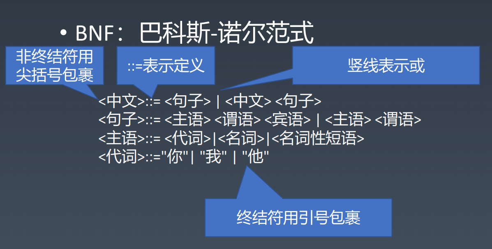
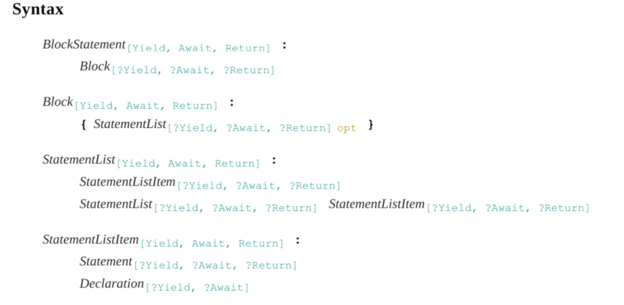
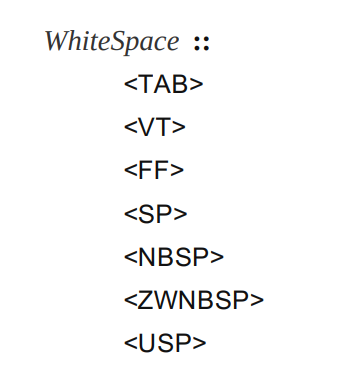
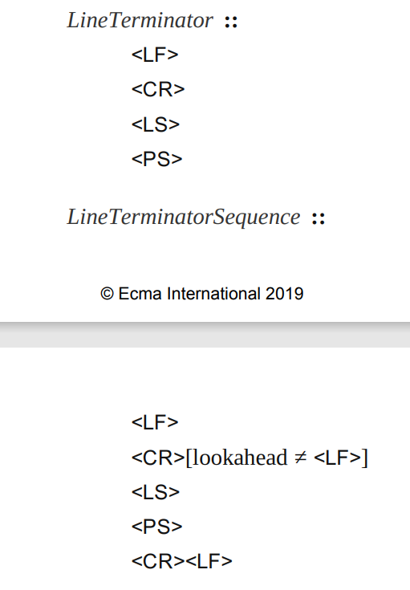
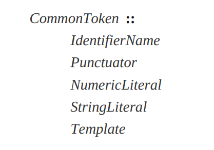
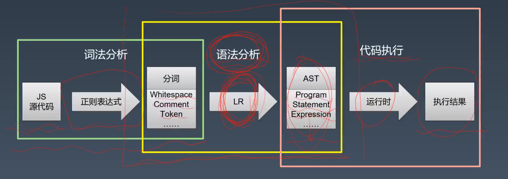
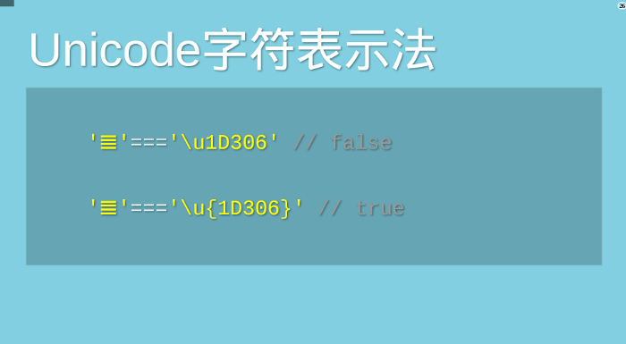
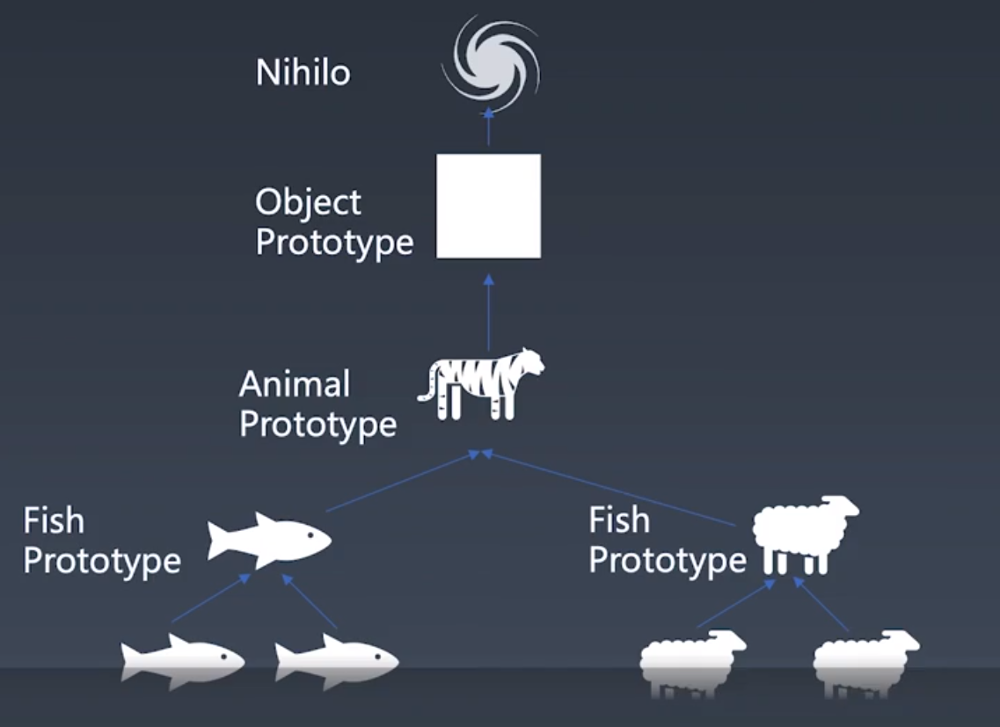

# 二、重学JavaScript

如何定义一门语言？

首先，如何定义中文？

中文有主谓宾，主语可以是代词（我你他），名词或者短语。

那么定义中文就是把一句话进行拆分成各个部分，然后逐渐细化

> 📌学习一个语言最好的方式：先去理解运行时的原理，然后分析它的语法，最后编写它的执行过程（其实就是语义的过程）

# 产生式的定义

> 产生式： 在计算机中指 Tiger 编译器将源程序经过词法分析（Lexical Analysis）和语法分析（Syntax Analysis）后得到的一系列符合文法规则（Backus-Naur Form，BNF）的语句

## production

在计算机里面有个production产生式概念，产生式就是一步一步定义语言的基础设施。

#### 概念

- 符号（Symbol）：一个语法的名称
  - 终结符（Terminal Symbol）
    - 最终在代码中出现的字符，不需要其他符号进行定义了。（比如中文的我你他，已经很具体了，可以理解为叶子节点）永远不会出现在产生式的左边
  - 非终结符（Non-Terminal Symbol）
    - 经过其他符号，由一定的逻辑关系产生的（比如主语，可以是代词，名词等组成）
- 语言的定义

语言可以有一个非终结符和它的产生式来定义。

比如中文语言是由中文这个非终结符，加上中文又是由主谓宾构成，一直往下拆，然后就形成中文语言。

- 语法树

语言文本根据产生式拆分就形成的树形结构。

## 产生式的写法

**BNF：巴科斯-诺尔范式**



- 非终结符：尖括号括起来的
- `::=` 表示定义
- `|` 表示或
- 终结符：使用引号包裹

**EBNF（更常用）**


现在很多语言使用的都不是严格意义上的BNF或者EBNF，都进行了变体。

**JavaScript标准**

（不看蓝色的部分）



- `:`  表示定义
- `换行` 表示或
- 终结符：加粗表示

## 产生式的练习

1、外星语言

外星语言：

- 某外星人采用二进制交流
- 它们的语言只有 “叽咕” 和 “咕叽” 两种词
- 外星人每说完一句，会说一个”啪”

```纯文本
<外星语>::= { <外星句> }
<外星句>::= {“叽咕”| “咕叽” } 啪
```

2、数学语言四则运算，只允许10以内整数的加减乘除

```纯文本
<四则运算表达式>::= <加法算式>
<加法算式> ::= (<加法算式> （"+"|"-"） <乘法算式>) | <乘法算式>
<乘法算式> ::= (<乘法算式> （"*"|"/"） <数字>) | <数字>
<数字> ::= {"0"|"1"|"2"|"3"|"4"|"5"|"6"|"7"|"8"|"9"}
```

3、 四则运算，允许整数

```纯文本
<四则运算表达式>::= <加法算式>
<加法算式> ::= (<加法算式> （"+"|"-"） <乘法算式>) | <乘法算式>
<乘法算式> ::= (<乘法算式> （"*"|"/"） <数字>) | <数字>

<数字> ::= {"1"|"2"|"3"|"4"|"5"|"6"|"7"|"8"|"9"} {"0"|"1"|"2"|"3"|"4"|"5"|"6"|"7"|"8"|"9"}
```

4、四则运算，允许小数

```纯文本
<数字> ::= {"1"|"2"|"3"|"4"|"5"|"6"|"7"|"8"|"9"} {"0"|"1"|"2"|"3"|"4"|"5"|"6"|"7"|"8"|"9"} | {"0"|"1"|"2"|"3"|"4"|"5"|"6"|"7"|"8"|"9"} . {"0"|"1"|"2"|"3"|"4"|"5"|"6"|"7"|"8"|"9"}
```

5、四则运算，允许括号

```纯文本
<四则运算表达式>::= <括号算式>（"+"|"-"）<括号算式>
<加法算式> ::= (<加法算式> （"+"|"-"） <乘法算式>) | <乘法算式>
<乘法算式> ::= (<乘法算式> （"*"|"/"） <数字>) | <数字>
<括号算式> ::= （"(" <加法算式> ")" ） | <数字>

<数字> ::= {"1"|"2"|"3"|"4"|"5"|"6"|"7"|"8"|"9"} {"0"|"1"|"2"|"3"|"4"|"5"|"6"|"7"|"8"|"9"} | {"0"|"1"|"2"|"3"|"4"|"5"|"6"|"7"|"8"|"9"} . {"0"|"1"|"2"|"3"|"4"|"5"|"6"|"7"|"8"|"9"}

```

# 产生式在语言中的应用

产生式定义的语言都是形式化语言。

## 语言分类

[乔姆斯基谱系](https://zh.wikipedia.org/wiki/乔姆斯基谱系 "乔姆斯基谱系")

> 💡0型包含1型；
> 1型包含2型；
> 2型包含3型；

**3型 正则文法（Regular）**

- 左边只有一个非终结符
- 右边
  - 无递归：随便写
  - 有递归：只允许左递归（也就是递归只能放在表达式的左边）

```纯文本
<A>::= <A>? √
<A>::= ?<A> ×
```

**2型 上下文无关文法**

```纯文本
<A>::=?
```

**1型 上下文相关文法**

α：代表上文

β：代表下文

```纯文本
α<A>β ::= α<B>β
```

**0型 无限制文法**

```纯文本
?::=?
```

## 词法和语法

大部分编程语言都是两步处理法，词法处理和文法处理。

- 词法：采用正则文法（3型），得到有效信息Token。（还有空白，换行，注释等无关信息）
- 语法：上下文无关文法（2型），得到语法树。

过程：

- 我们先把一个语言当做一个正则文法，去定义其词法部分得到有效信息Token；
- 然后通过上下文无关文法得到语法树。语法树如果去除一些无效信息，就会得到AST抽象语法树。

# 用产生式定义JavaScript词法和语法

分析JavaScript语法和词法的原因：

讲语法词法的部分，就是帮助我们补全JavaScript的产生式，最后和JavaScript的标准一样了，那么对JavaScript的方方面面都有一定的了解了。

```纯文本
输入元素 ::= 空白符 | 换行符 | 注释 | Token
```

空白符WhiteSpace：

- 空格
- 全角空格
- 所有在Unicode里面隶属于空白符分类的字符（零宽空格等）

换行符（LineTerminator）：

- \n
- \r

注释（Comment）：

- 单行注释
- 多行注释

Token：

- 直接量 Literal：7种基本类型
  - String
  - Number
  - Boolean
  - Null
  - ~~Undefined~~ （没有undefined直接量的，当一个变量未赋值的时候就是undefined与null是有区别的）
  - ~~Object~~ （是个语法结构，不在词法里面）
  - ~~Symbol~~ （无法直接生成一个Symbol，需要用到语法结构，用函数生成）
- 关键字 Keywords
  - if
  - else
  - for
  - ......
- 标识符Identifier（变量）
- 操作符Punctuator（加减乘除，大括号，小括号等）
  - ×÷＋－{ }

# JavaScript词法基本框架

[JavaScript标准文档ECMA-262.pdf](images/ECMA-262.pdf)



- Tab
- VT：竖向Tab
- FF：进纸。打印机时代要换行的时候，不是指针换行，而是纸张进去一行
- SP：space空格
- NBSP：英文一般在空格断行，保证一个单词不出现在两行。NBSP表示不要在我这个空格换行。
- ZWNBSP：zero width NBSP 没有宽度（unicode编码为FEFF）
- USP：unicode 下所有的空格



JavaScript的换行符用来标识自动插入分号规则。

- CR 回车
- LF 换行

windows是CR LF 一起的



Token：

- identifierName
  - 变量
  - get，set，async等不属于关键字的

# JavaScript语法基本框架

对语法的结构越熟悉，那么对JavaScript本身的语言就越熟悉。

建立知识体系，如果问你到，什么属性JavaScript，什么不属于JavaScript，心中有语法和词法两个产生式的图，那么对整个JavaScript的整个脉络就很清楚了。

```javascript
程序 ::= 语句+ 

语句::= 表达式 | if表达式 | 循环表达式 
      | 变量声明 | 函数声明 | 类声明 
      | break语句| continue语句| throw语句| try语句 | 块
```

- Program 程序
- Statement 语句
- ExpressionStatement表达式语句：如 c = a+b
- IfStatement if语句
- ForStatement 循环表达式：for，while
- VariableDeclaration变量声明：var，let，const
- FunctionDeclaration 函数声明
- ClassDeclaration 类声明
- BreakStatement break语句
- ContinueStatement continue语句
- ThrowStatement throw语句
- TryStatement try语句
- Block：两个花括号之间的整个部分

```纯文本
Program ::= Statement+
 
Statement ::=  ExpressionStatement | IfStatement 
              | VariableDeclaration | FunctionDeclaration | ClassDeclaration 
              | BreakStatement | ContinueStatement 
              | ThrowStatement | TryStatement 
              | Block 
              
ExpressionStatement ::= Expression + ";"
 
Expression ::= AdditiveExpression
 
AdditiveExpression ::=  MultiplicativeExpression  
             | AdditiveExpression  ("+" | "-") MultiplicativeExpression
             
MultiplicativeExpression ::= UnaryExpression（单目运算） 
             | MultiplicativeExpression ("*" | "/") UnaryExpression 
             
UnaryExpression ::= PrimaryExpression（主要表达式）
             | （"+" | "-" | "typeof"） +  PrimaryExpression
 
PrimaryExpression ::= "(" Expression ")" | 直接量Literal | Identifier标识符
 
------
 
Block = "{" Statement "}"
 
IfStatement ::= "if" "(" Expression ")" Statement

VariableDeclaration ::= ("var" | "let" | "const") Identifier标识符

FunctionDeclaration ::= "function" "(" Identifier ")" "{" Statement+ "}"

TryStatement ::= "try" "{" Statement+ "}" "catch" "(" Expression ")" "{" Statement+ "}
```

# JavaScript语法和词法代码分析

但用圆括号会有一个副作用，使相关的匹配会被缓存，此时可用 `?:` 放在第一个选项前来消除这种副作用。

其中 `?:` 是非捕获元之一，还有两个非捕获元是 `?=` 和 `?!`，这两个还有更多的含义，前者为正向预查，在任何开始匹配圆括号内的正则表达式模式的位置来匹配搜索字符串，后者为负向预查，在任何开始不匹配该正则表达式模式的位置来匹配搜索字符串。

- [https://blog.csdn.net/csm0912/article/details/81206848](https://blog.csdn.net/csm0912/article/details/81206848 "https://blog.csdn.net/csm0912/article/details/81206848")
- [https://www.runoob.com/regexp/regexp-syntax.html](https://www.runoob.com/regexp/regexp-syntax.html "https://www.runoob.com/regexp/regexp-syntax.html")


# 构建语法树

# 构建语法树



这是之前的JavaScript语法基本框架：

```javascript
程序 ::= 语句+ 

语句::= 表达式 | if表达式 | 循环表达式 
      | 变量声明 | 函数声明 | 类声明 
      | break语句| continue语句| throw语句| try语句 | 块
```

- Program 程序
- Statement 语句
- ExpressionStatement表达式语句：如 c = a+b
- IfStatement if语句
- ForStatement 循环表达式：for，while
- VariableDeclaration变量声明：var，let，const
- FunctionDeclaration 函数声明
- ClassDeclaration 类声明
- BreakStatement break语句
- ContinueStatement continue语句
- ThrowStatement throw语句
- TryStatement try语句
- Block：两个花括号之间的整个部分

```纯文本
Program ::= Statement+
 
Statement ::=  ExpressionStatement | IfStatement 
              | VariableDeclaration | FunctionDeclaration | ClassDeclaration 
              | BreakStatement | ContinueStatement 
              | ThrowStatement | TryStatement 
              | Block 
              
ExpressionStatement ::= Expression + ";"
 
Expression ::= AdditiveExpression
 
AdditiveExpression ::=  MultiplicativeExpression  
             | AdditiveExpression  ("+" | "-") MultiplicativeExpression
             
MultiplicativeExpression ::= UnaryExpression（单目运算） 
             | MultiplicativeExpression ("*" | "/") UnaryExpression 
             
UnaryExpression ::= PrimaryExpression（主要表达式）
             | （"+" | "-" | "typeof"） +  PrimaryExpression
 
PrimaryExpression ::= "(" Expression ")" | 直接量Literal | Identifier标识符
 
------
 
Block = "{" Statement "}"
 
IfStatement ::= "if" "(" Expression ")" Statement

VariableDeclaration ::= ("var" | "let" | "const") Identifier标识符

FunctionDeclaration ::= "function" "(" Identifier ")" "{" Statement+ "}"

TryStatement ::= "try" "{" Statement+ "}" "catch" "(" Expression ")" "{" Statement+ "}
```

根据之前的JavaScript语法基本框架，写成对应的json格式的语法定义代码。

```javascript
let syntax = {
    Program: [["StatementList"]],
    StatementList: [
        ["Statement"],
        ["StatementList", "Statement"],
    ],
    Statement: [
        ["ExpressionStatement"],
        ["IfStatement"],
        ["VariableDeclaration"],
        ["FunctionDeclaration"],
    ],
    ExpressionStatement: [
        ["Expression", ";"]
    ],
    IfStatement: [
        ["if", "(", "Expression",")", "Statement"]
    ],
    VariableDeclaration: [
        ["var", "Identifier"],
        ["let", "Identifier"],
        ["const", "Identifier"],
    ],
    FunctionDeclaration: [
        ["function", "Identifier", "(", ")", "{", "StatementList", "}"]
    ],
    Expression: [
        ["AdditiveExpression"]
    ],
    AdditiveExpression: [
        ["MultiplicativeExpression"],
        ["AdditiveExpression", "+", "MultiplicativeExpression"],
        ["AdditiveExpression", "-", "MultiplicativeExpression"],
    ],
    MultiplicativeExpression: [
        ["PrimaryExpression"],
        ["MultiplicativeExpression", "*", "PrimaryExpression"],
        ["MultiplicativeExpression", "/", "PrimaryExpression"],
    ],
    PrimaryExpression: [
        ["(", "Expression", ")"],
        ["Literal"],
        ["Identifier"]
    ],
    Literal: [
        ["StringLiteral"],
        ["NumberLiteral"],
        ["BooleanLiteral"],
        ["NullLiteral"],
    ]
}
```

# 根据语法树实现语法分析

根据上一节构建的JSON语法树，分析Token流。

最开始的语法分析器能接受什么？

就是最小的终结符，比如if，function，var等，就是把所有的非终结符展开的结果。这叫求closure


## 运行时的基础设施

```纯文本
let a;
let b; 
```

执行具体声明的过程

> 需要规定变量需要存储在哪里？

JS规定了一个执行时的环境，Environment，运行时会有一种特殊的对象：environmentRecord，专门用来存储变量。

### 变量存储

#### **Number**

JS里面默认是双精度浮点数表示（不管是整数还是小数），占用8个字节，64个bit。


- 蓝色部分为符号位。0表示正数，1表示负数
- 黄色部分：指数位，表示2的多少次方
- 白色位置：54位，表示具体数值（比如3为11）

js中处理数字很复杂：

- 十进制（还有小数，科学计数法等需要处理）
- 二进制
- 八进制
- 十六进制

#### **String**

字符串

码点（code point），就是字符的编号。

```javascript
U+0000 = null
```

上式中，U+表示紧跟在后面的十六进制数是Unicode的码点。

**码点表示法**

JavaScript允许直接用码点表示Unicode字符，写法是"反斜杠+u+码点"。

```javascript
'好' === '\u597D' // true
```

但是，这种表示法对4字节的码点无效。ES6修正了这个问题，只要将码点放在大括号内，就能正确识别。



ES6新增了几个专门处理4字节码点的函数：

```javascript
String.fromCodePoint() // 从Unicode码点返回对应字符
String.prototype.codePointAt() // 从字符返回对应的码点
String.prototype.at()  // 返回字符串给定位置的字符
```

#### **字符集**

- ASCII字符集
  - 字符数量太少（大小写字母，0-9，一些特殊的符号，共127个字符）
- Unicode字符集（大部分操作系统，JS都是采用的该字符集）
  - 兼容各国的字符
- UCS
  - 相当于Unicode2.0版本
- GB国标（中文的字符集）
  - GB2312
  - GBK（GB13000）
  - GB18030（基本不包含其他国家的文字）
- ISO-8859（一系列字符集集合）
  - 欧洲诸国自己的文字字符集
- BIG5（台湾繁体中文字符集）

> 💡字符集只能选一个，JavaScript选择了Unicode作为字符集。

Unicode源于一个很简单的想法：将全世界所有的字符包含在一个集合里，计算机只要支持这一个字符集，就能显示所有的字符，再也不会有乱码了。

[   https://www.ruanyifeng.com/blog/2014/12/unicode.html](https://www.ruanyifeng.com/blog/2014/12/unicode.html "   https://www.ruanyifeng.com/blog/2014/12/unicode.html")

#### **编码**

Unicode字符集采用UTF编码格式。

因为Unicode太大，所以编码就是规定如何合理保存Unicode对应的码点。

编码格式

- UTF-8
- UTF-16


**UTF-8**

- 8bit存储，一个字节，就是最小用一个字节表示一个Unicode码点的编码方式，但是也有可能用到3-4个字节
- 兼容ASCII编码（就是在前127个字符中，同一个码点，在ASCII字符集和Unicode字符集表示的字符是同一个，并且在存储格式上也是一致的）

当一个字节不足以容纳码点时，如何采用更多字节表示呢？

比如汉字“一”，Unicode码点是19968，二进制是 10011000000000


黄色部分为占用字节：3个字节

剩下的字节开头均为10，蓝色部分为有效数字。

**UTF-16**

- 很多年前，人们认为2的16次方（65536）几乎包含所有Unicode码点了，于是码点和编码格式统一了


- 但是后来Unicode越来越大，东西越塞越多，Emoji也塞进去了，就超出了65536个字符了
- 那超出16个bit，如何表示呢？这就是UTF-16规定的方法。
  - 超出需要4个字节
  - 第一个字节开头为110110，第三个字节开头为110111
  - 剩下的塞进码点的二进制
    

> **JavaScript采用UTF-16编码方式进行存储的。** 所以我们平时使用的charAt等并不是真正针对字符的，而是针对UTF-16格式的。

**UTF-8 vs UTF-16**

UTF-8在存储比如纯英文的时候，存储空间时更小的，但是存储一些特殊文字，特殊符号的时候，UTF-16占用空间更小了。

> 💡JavaScript语言采用Unicode字符集，但是只支持一种编码方法。这种编码既不是UTF-16，也不是UTF-8，更不是UTF-32。上面那些编码方法，JavaScript都不用。
> **JavaScript用的是UCS-2！**

由于JavaScript只能处理UCS-2编码，造成所有字符在这门语言中都是2个字节，如果是4个字节的字符，会当作两个双字节的字符处理。

JavaScript的字符函数（charAt，slice，substring，replace等）都受到这一点的影响，无法返回正确结果。

## Number的语义分析

```javascript
let valueStr = node.value; // 10,0x1100,0xff等
let len = valueStr.length;
let value = 0;
let base = 10; // 进制

// 判断二进制数字
if (valueStr.startsWith('0b')) {
    base = 2;
    len = len - 2;
} else if (valueStr.startsWith('0o')) { // 判断八进制数字
    base = 8;
    len = len - 2;
} else if (valueStr.startsWith('0x')) { // 判断十六进制数字
    base = 16;
    len = len - 2;
}

while (len--) {
    // 先算高位，再算低位
    let c = valueStr.charCodeAt(valueStr.length - len - 1);
    if (c >= 'a'.charCodeAt('0')) {
        c = c - 'a'.charCodeAt('0') + 10;
    } else if (c >= 'a'.charCodeAt('0')) {
        c = c - 'A'.charCodeAt('0') + 10;
    } else {
        c = c - '0'.charCodeAt('0');
    }
    value = value * base + c;
    console.log('value==>', c, value);
}
```

## String的语义分析

### 转移字符

转义字符是字符的一种间接表示方式。在特殊语境中，无法直接使用字符自身。例如，在字符串中包含引号。

比如："\\"", "\\\\"

### 转义序列

| 序列     | 代表字符                                                                                                |
| ------ | --------------------------------------------------------------------------------------------------- |
| \0     | Null字符（\u0000）                                                                                      |
| \b     | 退格符（\u0008）                                                                                         |
| \t     | 水平制表符（\u0009）                                                                                       |
| \n     | 换行符（\u000A）                                                                                         |
| \v     | 垂直制表符（\u000B）                                                                                       |
| \f     | 换页符（\u000C）                                                                                         |
| \r     | 回车符（\u000D）                                                                                         |
| \\"    | 双引号（\u0022）                                                                                         |
| \\'    | 撇号或单引号（\u0027）                                                                                      |
| \\\\   | 反斜杠（\u005C）                                                                                         |
| \xXX   | 由 2 位十六进制数值 XX 指定的 Latin-1 字符                                                                       |
| \uXXXX | 由 4 位十六进制数值 XXXX 指定的 Unicode 字符                                                                     |
| \XXX   | 由 1\~3 位八进制数值（000 到 377）指定的 Latin-1 字符，可表示 256个 字符。如 \251 表示版本符号。注意，ECMAScript 3.0 不支持，考虑到兼容性不建议使用。 |

> 💡如果在一个正常字符前添加反斜杠，JavaScript 会忽略该反斜杠。
> document.write ("子曰：\\"学\而\不\思\则\罔\\, \思\而\不\学\则\殆\。\\"")

**unicode和字符互转**

如何才能将任意字符转换成\uxxx这种形式呢？

首先要得到字符的 Unicode 编码，然后再将其转化成十六进制编码，那么 js unicode 字符编码的问题就迎刃而解，在 javascript 里，有一个字符串方法：charCodeAt(); 这个 方法可返回指定位置的字符的 Unicode 编码。

这个返回值是 0 - 65535 之间的整数。需要传入一个参数：这个是参数表 示字符串中某个位置的数字，即字符在字符串中的下标。例如：

`'1'.charCodeAt(0) = 49`

得到了字符的 unicode 编码，再使用字符串方法：toString(16)。就得到了 js unicode 的十六进制代码。例如：

`'1'.charCodeAt(0).toString(16); // 31`

然后补全四位：

`\u0031`

封装函数：

```javascript
var Unicode = {stringify: function (str) {
  var res = [],

  len = str.length;

  for (var i = 0; i < len; ++i) {
    res[i] = ("00" + str.charCodeAt(i).toString(16)).slice(-4);
  }

  return str ? "\\u" + res.join("\\u") : "";

  },

  parse: function (str) {
    str = str.replace(/\\/g, "%");
    return unescape(str);
  }

};
```

参考链接：

[ JavaScript中字符串与Unicode编码的互相转换\_铁锚的CSDN博客-CSDN博客\_js unicode转字符串 JavaScript中字符串与Unicode编码的互相转换这段代码演示了JavaScript中字符串与Unicode编码的转换 https://blog.csdn.net/renfufei/article/details/47258309](https://blog.csdn.net/renfufei/article/details/47258309 " JavaScript中字符串与Unicode编码的互相转换_铁锚的CSDN博客-CSDN博客_js unicode转字符串 JavaScript中字符串与Unicode编码的互相转换这段代码演示了JavaScript中字符串与Unicode编码的转换 https://blog.csdn.net/renfufei/article/details/47258309")


# JavaScript对象

# 对象的基础知识

前面讲解了NumberLieral和StringLiteral。

- BooleanLiteral只有true和false
- NullLiteral只有null；
- UndefinedLiteral 在语法上写不出来，有全局变量undefined

  js中的void和其他语言的void不同，js中的void是运算符，始终返回undefined。因此常用`void 0` 得到undefined值。
- Symbol 只能通过API去创建
- 对象
  - RegularExpressionLiteral
  - ObjectLiteral
  - ArrayLiteral

## 对象的概念

> 💡对象就是唯一标识，状态和行为的三合一产物。

唯一标识identifier：存储的内存地址

状态state：对象的一些属性

行为behavior：状态的改变，而不是该对象具备的行为。

> 💡比如：狗咬人。是狗对象有个bite方法吗？不是而是人有个hurt方法。狗咬人，狗的状态未改变，人的状态改变了，被咬了，所以人类有个方法hurt。

## 基于类的面向对象描述方式Class

类是一种常见的描述对象的方式。

- 归类思想：C++的多继承
- 分类思想：C#和Java不允许多重继承。使用接口弥补抽象能力的不足
- 原型思想：JavaScript采用一种小众的面向对象思路：`Prototype`，思想就是：照葫芦画瓢

# JavaScript对象

原型的思维方式也很常见，是一种照猫画虎，照葫芦画瓢的思想。

**每个对象只需要描述跟原型的区别即可。** 在访问的时候，如果自己没有该属性，会根据prototype往父级层层寻找。



JavaScript对象由property和一个指向其他对象的prototype组成。

**property**

kv键值对。

k：

- String
- Symbol 两个不会相等的属性

v：

- Data 普通数据
- Accessor ：getter，setter

JavaScript用属性来统一抽象对象的状态和行为。

一般来说，数据属性用于描述状态。访问器属性用于描述行为。

数据属性中如果存储函数，也可以描述行为。

Data属性和Accessor 属性


**prototype**

当我们访问属性时，如果当前对象没有，则会沿着原型找原型对象是否有此名称的属性，而原型对象还可能有原型，因此，会有“原型链”这一说法。

这一算法保证了，每个对象只需要描述自己和原型的区别即可。

*不能删除父对象上的属性怎么办？*

可以设置和父对象相同的属性名，值为undefined进行覆盖。

## 对象的操作

基本操作

{} . \[] Object.defineProperty

纯粹基于原型的面向对象编程

Object.create

Object.setPrototypeOf

Object.getPrototypeOf


