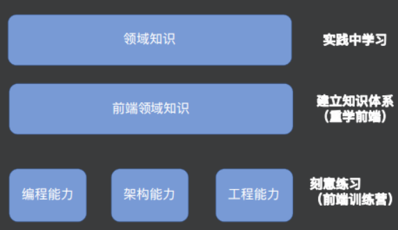
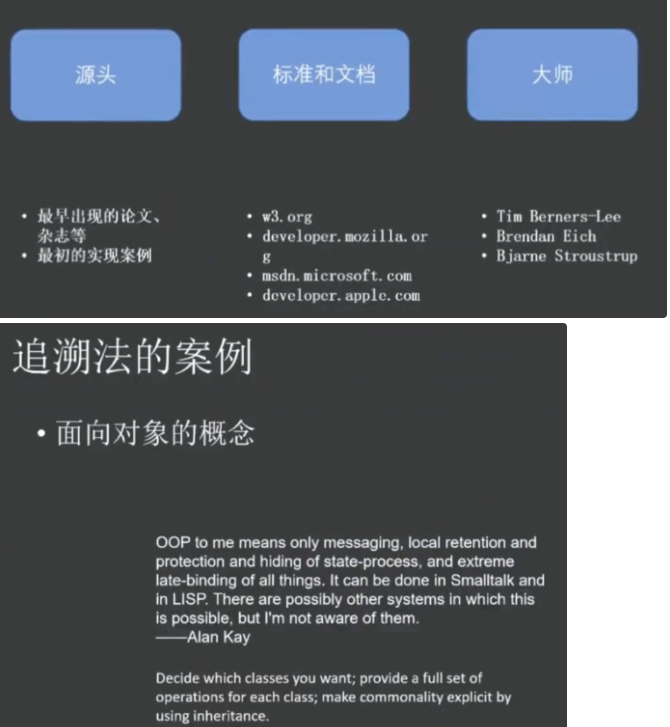

# 前端学习方法及工程体系构建

Vue3要从哪里学起？

1、在使用中学习

新技术分开的各个小模块，构建模块，渲染模块等。比如Vue Mini （Vue响应式模块）

通过插件的方式把你写的新语言转化成平时的代码。比如 preset-typescript

[https://github.com/vuejs/rfcs](https://github.com/vuejs/rfcs)

Vite替换Webpack

1 新技术解决的问题

2 解决问题的理念

3 实现过程：自行实现/ 修框架bug

4 

---

## 前端学习方法及工程体系构建 winter

几点错误的认知：

- 我没有得到晋升是因为我技术不够好
- 我这个题答错了，所以面试没通过
- 我来前端训练营学习知识

一、我没有得到晋升是因为我~~技术不够好~~（没有为公司创造足够的价值）

公司认可什么价值？

**商业价值！**

你在前端团队里属于什么角色，基本决定你的职位和薪资水平。

**看比你高级的人在做什么，你就做什么。**

前端工程师在公司的价值：**业务+技术 +工程**

1. 业务成就🥇
2. 技术难题（在公司遇到的不多，而且是公认的，不一定能解决）🥈
3. 工程设施🥇

业务型成就

- 业务目标：
    - 理解公司业务的核心目标（比如电商GMV就是业务的核心）
    - 目标是否可以转化成指标。（比如点击率达到多少？）
- 技术方案
- 实施方案
- 结果评估
    - 向上级汇报

工程型成就

- 目标：质量、效率
- 方案与实施：代码规范，库，工具
- 结果：线上监控

技术难题

- 目标：公认的技术难点
- 方案与实施：依靠扎实的编程能力、架构能力形成解决方案
- 结果：问题解决

二、我这个题答错了，所以面试没通过（简历阶段就没通过）

简历比面试更重要！基本简历就看出是否通过了。

你眼中的面试：

问→答→问→答→打分

实际的面试：

三、我来前端训练营~~学习知识~~（构建知识体系，提升能力）

前端技能模型：

**构建知识体系的重要性：**

对于不懂的，可以根据其所处知识体系的位置去查。

对于提到的某个知识，马上可以定位到知识体系的某个位置。

至于具体的知识点可以自己去学。

**前端训练营知识体系：**

- **JS语言**
- **CSS和HTML**
- **浏览器和浏览器API**

****

**编程能力：前端训练营一系列练习 + LeetCode刷题群**（算法不仅仅是刷题，最重要的是思维方式）

**架构能力：组件化实践案例 + 学习开源代码等**

**工程能力：工具链，持续集成，发布系统，然后在公司应用**

学习方法

- 脑图整理（逻辑型+完备性）

    
- 追溯法

