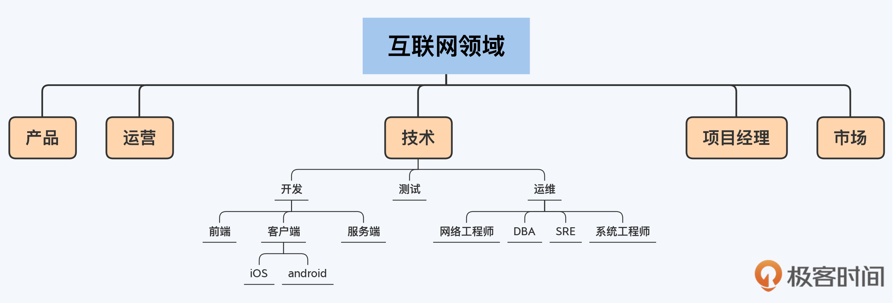
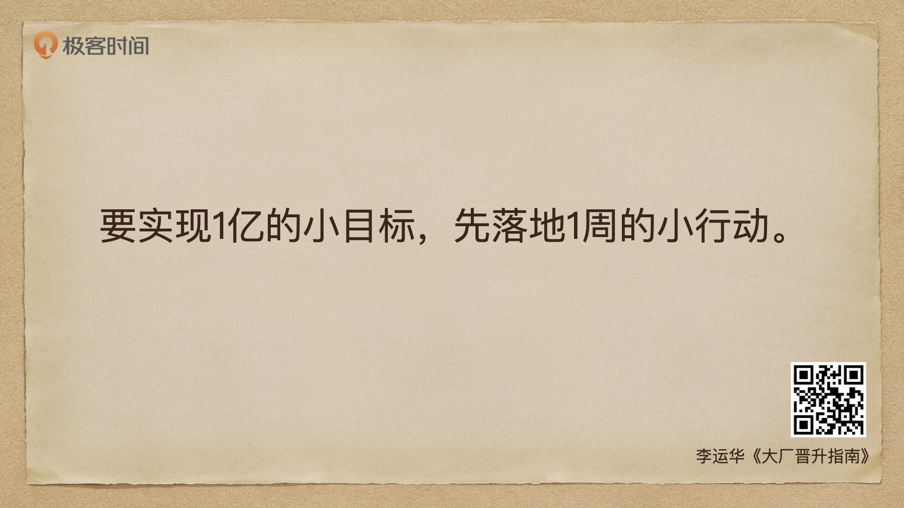
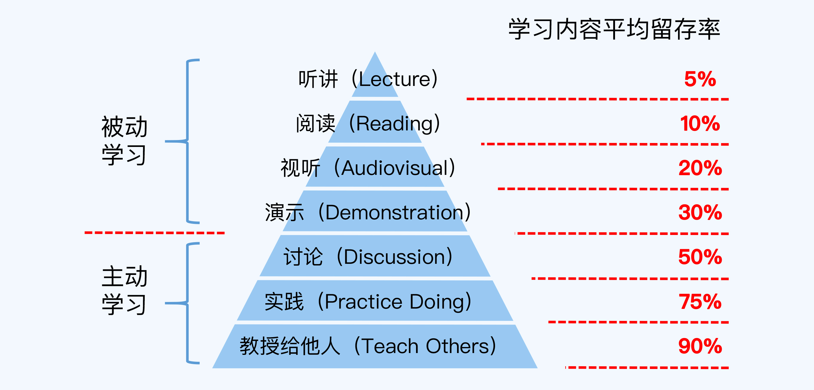

# 学习方法

## 提出问题

不知道你是不是也有这样的感受：

- 光是上班累得要死，还要陪对象吃饭逛街看电影，或者送孩子去上培训班，根本就没什么时间学习；
- 等到哪天好不容易有点空余时间，又因为没有计划，只能随便找本书或者上网水水论坛看看；
- 就算知道要针对某个技能专门提升一下，也不知道怎么学才能达到精通水平；
- 过段时间回头一看，前几周学的东西又忘得差不多了；
- 跟别人交流一下子就暴露了水平……

## 解决方法

指导原则： 10000 小时定律。

## 使用方法

1. 先用“三段分解法”来规划你的学习目标和计划
2. 使用“海绵学习法”来找到你可以用于学习的时间
3. 根据学习目标采取相应的学习方法：我目前提升以技术深度为主，所以是链式学习法
4. 采用“Play & Teach 学习法”来加强效果

### 找时间：海绵学习法

*10年时间成为领域专家，那是我38岁，愿不愿意？*

*当然愿意了。*

*那每天花费3h学习，10年差不多就是10000h，愿不愿意？*

*愿意。*

领域划分

我建议在三级领域这个级别进行投入。因为判断是不是同一个领域的方法，就是看**面对的问题和采取的思维方式是否类似**，至于工具本身，并不是区分的标准。

大前端：前端 + 客户端，都是用户的体验与交互。

我建议你除了上班时间外，尽量保证每天能够有 1 个小时的主动提升时间。

**海绵学习法**

海绵学习法的关键就是“挤时间”。

**周末会针对这周学习的内容做总结。**

我的海绵挤时间计划：

- 早上早起30分钟（之前7:30起床，现在计划7:00起床）
- 通勤时间，因为距离公司比较近，往返大概30分钟（中午有时回家吃饭，再加30分钟）
- 睡前可以挤出30分钟
- 周末至少可以有2小时时间

一周学习共计：**>10小时**

### 学什么：三段分解法

> 💡三段分解法，把“10 年成为大牛”这个大目标，分解成一个个可以在短期内达成的小目标。

**第一段：分解“等级”（职级体系）**

- P5，职场新手，工作 1～3 年，需要别人带你完成任务。
- P6，项目能手，工作 3～5 年，能够独立完成任务。
- P7，团队专家，工作 4～8 年，能够带领小团队实现目标。
- P8，领域专家，工作 8 年以上，能够带领多个团队实现目标。
- P9，业务导演，工作 10 年以上，能够导演成熟落地的作品。

**第二段：分解“技能”**

瞄准下一个最近的等级，继续第二段的分解技能。为了达到下一个等级，你需要什么技能。**（列出自己需要重点提升的 3～5 个技能点，把 2～3 年的一段目标分解成 6 个月左右的二段目标。）**

比如我现在是P5，想到达到P6需要什么技能。

- 多看一些公司的招聘要求，了解下一等级P6的要求
- 将这些要求整理为一个思维导图，详细列出每个技术点。
- 开始第二段分解，分解的方法很简单，**哪里不懂补哪里！**
- 时间安排。比如想从P5-P6需要2年时间，需要N个技能，那么每个技能大概时间为$N/2$ 年。
- 每个技能学习的顺序可以根据工作内容进行调整。（最好学最近就要用到的）

**第三段：分解“行动”**

第二段分解之后，我们得到了 6 个月左右的技能提升目标，然后上网搜索“如何提升xxx技能”（知乎是个好地方），把目标周期再拆解成1\~2个月的三段目标。

**确定提升单项技能的 3～5 个具体行动**，把 6 个月左右的二段目标分解成 1～2 个月的三段目标。

每 1～2 个月只需要专注做好一件事，每次完成后都很有成就感，既感觉自己的水平有了提升，又佩服自己能够坚持按计划完成任务。

当然，**在具体落地的时候，你还需要进一步分解到周**，比如下周看完某本书的哪几个章节。但是在做计划的时候，我建议你先分解到月就可以了

> 举例：如何提升 Linux 水平？

*通过上网查、找别人问等方法，最终将这个目标分解为 4 个行动：*

- *1.5 个月：通读《UNIX 环境高级编程》*
- *1.5 个月：通读《Linux 系统编程》*
- *2 个月：通读《UNIX 网络编程 卷 1》*
- *1 个月：Linux 常用命令实战，包括 tcpdump、ps 和 top 等*

P6的要求：

### 怎么学：链式 & 环式 & 比较学习法

- **链式学习法适合提升技术深度**，通过自顶向下逐步深入的方式，将关联技术逐一掌握。
- 比较学习法适合提升技术宽度，通过比较相似的知识或者技能，全面掌握单个领域的技术。
- 环式学习法适合提升技术广度，通过学习业务闭环流程中相关技术，全面掌握多个领域的技术。

**明确一项技术的深度可以分为哪些层，明确要学到哪一层，明确每一层应该怎么学。**

链式学习法：重学前端的JavaScript部分。

1、明确一项技术的深度可以分为哪些层。

2、明确你自己要学到哪一层。

3、明确每一层应该怎么学。

### 怎么保证学习效果：Play 学习法、Teach 学习法

- Play 学习法可以用来解决工作中暂时没有实践机会的问题，学以致“玩”，通过“玩耍”的方式来应用。
- Teach 学习法可以用来解决学得不深的问题，教学相长，通过“教学”的方式来加深理解。

所谓 Play 学习法，就是*通过模拟实践中的场景来进行学习和训练。*

步骤：

1. 按照链式学习法的方式学习某项技术。
2. 列举常见的场景，搭建模拟场景。
3. 在模拟场景进行测试、体验和练习。

Teach 学习法

所谓 Teach 学习法，就是*通过教别人来提升自己。*

> 哪些需要写文章？哪些看看别人的即可？

*核心的指导原则就是，****看技术和自己工作的相关度****，对于强相关的核心技术，自己写文章来学；而对于弱相关的非核心技术，可以通过阅读资料来学习。*

> 💡我的方法：
> 写文章，然后文章中有示例，示例就是搭建的play场景。

***

## 问题解答

> **关于看了书但是内容记不住的问题：**

\*记忆分为两类：显性记忆，隐性记忆。  \*

\*睡一觉就忘记了，只是你主动去回忆，回忆不起来而已，这就是显性记忆；  \*

\*但是如果有某个关键场景或者关键词提醒，你就能想起来一些了，这就是隐性记忆。  \*

*只要你看得多，多次看到类似内容，就会变成显性记忆，同时隐性记忆也会积累更多，所以不要担心看了没用，看多了肯定会有用*

> 时间利用的比较混乱。没有规定自己学习时间，导致时而有空就学习，时而有空就耍抖音。

*养成习惯，我现在几天不学习就觉得失去了些什么 ：）*

> **看书比较慢怎么办？**

*我开始看书也看得慢，后来就看的很快了，原因在于积累多了，学习就是一个联想和类比的过程，你积累的越多，学习的越快，无论是技术还是非技术的。例如，你看完《思考，快与慢》后，再看其它相关心理学、概率学的东西，很多案例和论点都是一样的，这样看起来自然就快。例如，你看了《UNIX网络编程》后，看netty等就会很快*

问题模板
