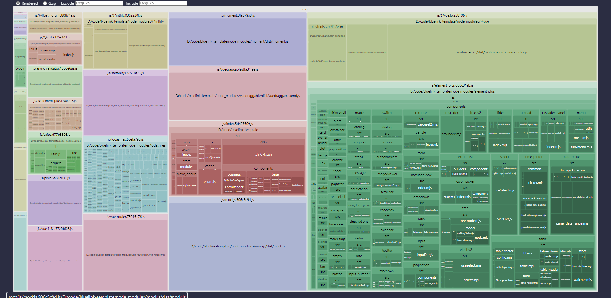
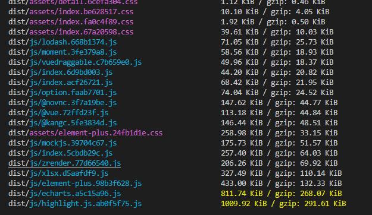
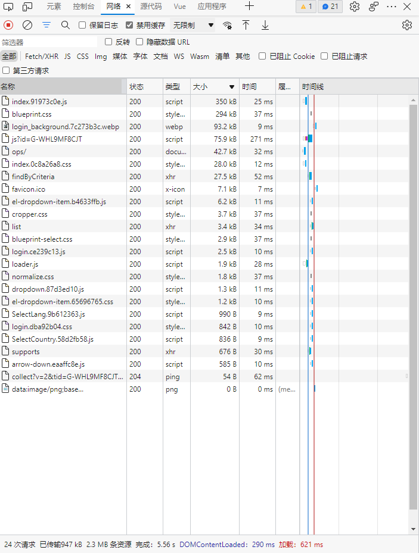
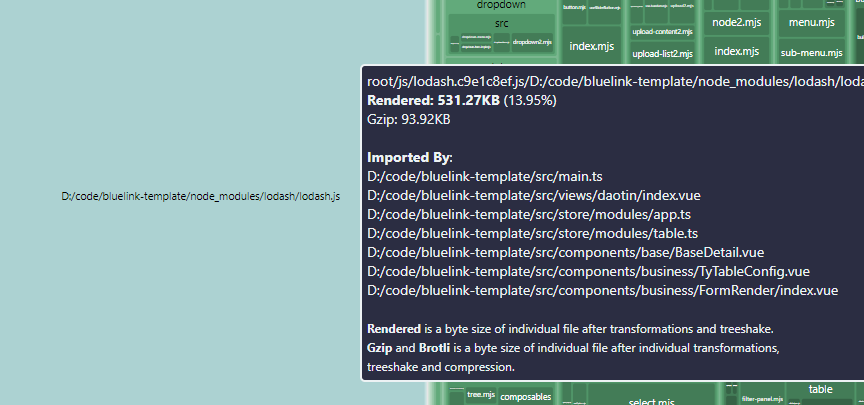
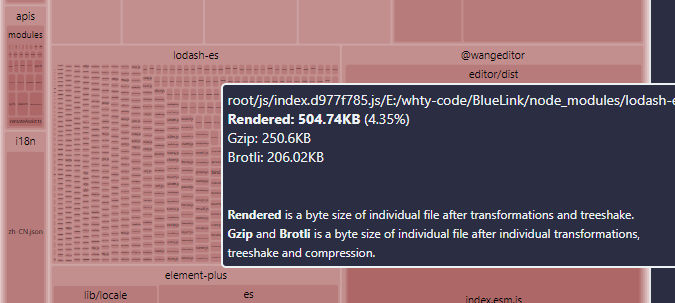
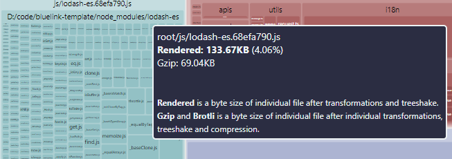

# BlueLink项目打包体积优化

## 体积分析工具

- 安装

```javascript
npm i rollup-plugin-visualizer -D
```

- vite中配置

```javascript
// 引入
import { visualizer } from 'rollup-plugin-visualizer';

// 使用
plugins: [
  visualizer({
    // template: 'treemap', // 图表类型
    // gzipSize: true, // gzip选项
    // open: true, // 自动打开
  }),
],
```

然后在npm run build的时候，就会在项目根目录生成stats.html文件，用浏览器打开后就可以看见项目中各个包的大小。



## ElementPlus按需引入

解决办法（参考官方文档）：[https://element-plus.gitee.io/zh-CN/guide/quickstart.html#按需导入](https://element-plus.gitee.io/zh-CN/guide/quickstart.html#按需导入 "https://element-plus.gitee.io/zh-CN/guide/quickstart.html#按需导入")

优化结果：**减少：436.78KB**

- 全量引入：553.34 + 575.42


- 按需引入: 258.98 + 433.00



### 开发环境切换页面会卡住

问题：ElementPlus 按需加载会出现一个问题，切换不同路由时如果其他模块有使用到新的组件，**页面会卡住**直至 dependencies optimized 完成。


解决办法是：**开发环境下全局加载组件，打包时再执行按需加载了**

[https://github.com/antfu/unplugin-vue-components/issues/361](https://github.com/antfu/unplugin-vue-components/issues/361 "https://github.com/antfu/unplugin-vue-components/issues/361")

vite.config.ts 核心代码如下：

```typescript
plugins: [
  AutoImport({
    imports: ['vue'], // 自动导入vue API
    resolvers: [ElementPlusResolver()],
  }),
  Components({
    dts: true,
    // 生产环境按需导入
    resolvers: mode !== 'development' ? ElementPlusResolver() : undefined, // ElementPlus 按需引入
  }),
  // 开发环境完整引入element-plus
  {
    name: 'dev-auto-import',
    transform(code, id) {
      if (mode === 'development' && /src\/main.ts$/.test(id)) {
        return {
          code: `${code};import ElementPlus from 'element-plus';import 'element-plus/dist/index.css';app.use(ElementPlus);`,
          map: null,
        }
      }
    },
  },
],
```

### **解决非标签元素丢失样式的问题**

问题：非标签元素使用上文的按需自动引入时，会丢失样式。

比如自动引入 `Elmassage` 时，会报 `elmessage is not defined` 的错误，虽然消息弹窗还是能出来，但样式是乱的，也就是说，虽然组件导入了，但样式没有导入。

解决办法：

1、可以通过在main.ts中全量引入css，但是包的体积不会优化。

2、或者在 main.ts 中单独引入那些弹框组件的样式

```javascript
// 引入Elmessage和Elloading的css样式文件
import 'element-plus/theme-chalk/el-loading.css'
import 'element-plus/theme-chalk/el-message.css'

```

3、可以通过 `unplugin-element-plus` 插件来解决，会自动引入对应包的css文件。

```typescript
import { ElButton } from 'element-plus'

//    会自动变成↓ ↓ ↓ ↓ ↓ ↓

import { ElButton } from 'element-plus'
import 'element-plus/es/components/button/style/css'
```

- 安装插件

参考链接：[https://github.com/element-plus/unplugin-element-plus/blob/main/README.zh-CN.md](https://github.com/element-plus/unplugin-element-plus/blob/main/README.zh-CN.md "https://github.com/element-plus/unplugin-element-plus/blob/main/README.zh-CN.md")

```typescript
npm i unplugin-element-plus -D
```

- 然后配置一下 vite.config.js 文件：

```typescript
// vite.config.ts
import ElementPlus from 'unplugin-element-plus/vite'

export default {
  plugins: [
    ElementPlus({
      // options
    }),
  ],
}
```

完成，这样我们可以让两个插件配合帮我们完全按需自动导入组件和对应的样式。

### 按需加载优化

缘由：之前，国际云项目中配置了`manualChunks`（如下注释掉的代码），导致node\_modules中的模块都会打包成一整个文件（如图一），去掉该限制后，系统登录页的模块加载体积可能会稍微变小，并且请求次数会大大减小（如图二）。

ElementPlus继续优化方案：

1、生产环境Nginx未开启gzip，所以 `element-plus.6c7a3c02.js`是400多k，其他环境（beta环境）可以看到是 136k左右

> Nginx需要开启gzip压缩，并配置动态压缩和静态压缩结合使用：
>
> - [https://segmentfault.com/q/1010000022388215](https://segmentfault.com/q/1010000022388215 "https://segmentfault.com/q/1010000022388215")
> - [https://www.cnblogs.com/hahaha111122222/p/16277891.html](https://www.cnblogs.com/hahaha111122222/p/16277891.html "https://www.cnblogs.com/hahaha111122222/p/16277891.html")
> - [https://www.chenhanpeng.com/use-gzip-in-vue-project/](https://www.chenhanpeng.com/use-gzip-in-vue-project/ "https://www.chenhanpeng.com/use-gzip-in-vue-project/")

2、没有单拆成单个组件，是因为打包时配置了每个模块单独达成一个整包。（去掉`manualChunks`那块配置即可）

```javascript
build: {
  rollupOptions: {
    output: {
      manualChunks: id => {
        if (id.includes('node_modules')) {
          return id.toString().split('node_modules/')[1].split('/')[0].toString()
        }
      },
      entryFileNames: 'js/[name].[hash].js',
      chunkFileNames: 'js/[name].[hash].js',
      assetFileNames: 'assets/[name].[hash].[ext]',
    },
  },
},
```

然后对比了下打包体积：

- 整体模块（js+assets）：6.89 MB
- 单独模块（js+assets）：6.99 MB

整体打包大小甚至还小一点。。。但是在页面加载的时候，单独模块打包的情况，（上图示例为登录界面）请求次数更少，资源也更小。所以单独模块打包还是有必要的。

> 📌update at 2023-4-14
>
> 问题：去掉manualChunks后，虽然会将每个模块拆分出更小的文件，比如element plus单个js文件会拆分出el-button，el-select等更小的js文件。
>
> 但是会引入副作用：就是加载的入口js文件会变的很大，因为manualChunks本来就是拆分成小文件的，虽然我们去掉manualChunks是为了拆成小文件，但是显然方法不对。
>
> rollup的manualchunks介绍：[https://www.rollupjs.com/guide/big-list-of-options#outputmanualchunks](https://www.rollupjs.com/guide/big-list-of-options#outputmanualchunks "https://www.rollupjs.com/guide/big-list-of-options#outputmanualchunks")
>
> 解决办法：修改manualChunks配置。伪代码如下（路径可能不对）：就是将大文件拆分成自定义名字的小文件。
>
> ```javascript
> manualChunks: (id) => {
>     if (id.includes('node_modules')) {
>       // 如果是 Element Plus 组件，不用打包成一个单独的包
>       if (!id.includes('node_modules/element-plus')) {
>         return id.toString().split('node_modules/')[1].split('/')[0].toString()
>       }
>     }
>   },
>
> ```
>
> 其他的包如果很大，也可以像element-plus一样排除掉。

（图一：优化前）


（图二：优化后）



## 生成环境不引入mockjs

解决方案：

- 注释掉main.ts中的

```typescript
import './mock'

```

- 在下面加入仅开发环境引入即可：

```typescript
{
  name: 'dev-auto-import',
  transform(code, id) {
    if (mode === 'development' && /src\/main.ts$/.test(id)) {
      return {
        code: `${code};import ElementPlus from 'element-plus';import 'element-plus/dist/index.css';app.use(ElementPlus); import './mock'`,
        map: null,
      }
    }
  },
},
```

## tailwind生产优化

之前项目中，通过`npx tailwindcss init` ，会在您工程的根目录生成一个最小版本的 `tailwind.config.js` 文件。

```typescript
// tailwind.config.js
module.exports = {
  purge: [],
  darkMode: false, // or 'media' or 'class'
  theme: {
    extend: {},
  },
  variants: {},
  plugins: [],
}
```

在修改配置文件后，然后通过指令，`npx tailwindcss -o tailwind.css` 可以生成项目需要的`tailwind.css` 文件（可以将其放入npm scripts中）。

然后，使用的时候在app.less中引入即可：

```typescript
@import './tailwind.css';
```

但是问题是，生成的`tailwind.css` 文件有3000k左右，太大了，很多样式都没有使用到。

解决办法：改为通过\*\*`PostCSS `\*\***插件来添加 Tailwind**，采用postcss方式引入，打包时会根据代码中使用到的样式进行tree sharking

- 安装插件

```typescript
npm install -D tailwindcss@latest postcss@latest autoprefixer@latest
```

> 注意：由于项目中原来用的tailwindcss版本是`"tailwindcss": "^2.2.16",` 修改为最新后，样式有问题，所以这里的版本保持项目中的不变。

- 新增`postcss.config.js`，将 `tailwindcss` 和 `autoprefixer` 添加到您的 PostCSS 配置中：

```typescript
// postcss.config.js
module.exports = {
  plugins: {
    tailwindcss: {},
    autoprefixer: {},
  }
}
```

- 在app.less中引入

```typescript
@import 'tailwindcss/base';
@import 'tailwindcss/components';
@import 'tailwindcss/utilities';
```

> PS：自定义的样式，要放在其后面，免得被覆盖

```typescript
@import 'tailwindcss/base';
@import 'tailwindcss/components';
@import 'tailwindcss/utilities';

// 项目自定义样式
@import './reset.less';
@import './element.less';
```

### 删除未使用的CSS

解决方案：**使用 Tailwind 的 ****`purge`**** 选项来 tree-shake 优化未使用的样式，并优化您的最终构建大小**当使用 Tailwind 删除未使用的样式时，很难最终得到超过 10kb 的压缩 CSS。

```typescript
// tailwind.config.js
module.exports = {
  purge: [
    './src/**/*.html',
    './src/**/*.vue',
    './src/**/*.jsx',
  ],
  theme: {},
  variants: {},
  plugins: [],
}
```

也可以手动启用是否开启优化：

```typescript
// tailwind.config.js
module.exports = {
  purge: {
    enabled: true,
    content: ['./src/**/*.html'],
  },
  // ...
}
```

**遇到的问题0：**

在老的vue2项目中，使用上面PostCSS的方式进行安装后，在运行 npm run dev 的时候，一直在报错：

```bash
TypeError: Invalid PostCSS Plugin found at: plugins[0]
```

尝试的解决方案：把postcss.config.js改成下面的方式，也没用。

```javascript
module.exports = {
  plugins: [
    require("tailwindcss"),
    require("autoprefixer"),
  ]
};
```

一直怀疑是版本太高导致的，于是尝试了使用[PostCSS 7 兼容性版本](https://www.tailwindcss.cn/docs/installation#post-css-7 "PostCSS 7 兼容性版本") 的方式来安装，最后竟然成功了，但是有两点需要修改：

1、在`main.less`中的写法需要改一下：

```javascript
@import 'tailwindcss/base';
@import 'tailwindcss/components';
@import 'tailwindcss/utilities';

// 需要改成下面的写法

@tailwind base;
@tailwind components;
@tailwind utilities;
```

2、postcss.config.js写法需要修改

```javascript
module.exports = {
  plugins: [
    require("tailwindcss"), 
    require("autoprefixer")
  ]
};
```

3、tailwind.config.js代码

```javascript
/** @type {import('tailwindcss').Config} */
module.exports = {
  purge: ["./src/**/*.html", "./src/**/*.vue", "./src/**/*.js"],
  content: [],
  theme: {
    extend: {}
  },
  plugins: []
};
```

**遇到的问题1：**

如果开启优化后，在本地开发环境下，会启动失败。

所以我们需要**在本地环境不启用优化，生产环境才开启优化**。

```typescript
purge: {
  // 仅生产环境启用优化
  enabled: process.env.NODE_ENV === 'prod',
  // 删除未使用的CSS tree-shake，减少打包后的体积
  content: ['./src/**/*.html', './src/**/*.vue', './src/**/*.jsx'],
},
```

**遇到的问题2：**

`process.env`中并没有`NODE_ENV`这个变量，但是在`tailwind.config.js`中打印该变量，不管是serve启动还是build下，`NODE_ENV`均为`development`（原因暂不明），无法判断是本地还是打包后的，而使用`import.meta.env.MODE` 会找不到报错（个人猜测是tailwind.config.js在vite.config.ts之前运行）。

但是通过源码可以看到，在vite启动后，会在vite内部通过`mode`属性，设置`process.env.NODE_ENV`，所以我们才能在项目中其他位置直接使用`NODE_ENV`。

```javascript
// 部分vite源码
const define = {
    'process.env.NODE_ENV': JSON.stringify(process.env.NODE_ENV || config.mode)
};
```

解决办法：使用npm scripts的方式配置在启动时配置`NODE_ENV`的值：

```json
"scripts": {
  "serve": "cross-env NODE_ENV=development vite",
  "build": "cross-env NODE_ENV=prod vite build --mode prod",
  "build-v1": "cross-env NODE_ENV=v1 vite build --mode v1",
},
```

## 优化生成changelog引入库过大问题

问题：changlog引入的`highlight`很大，换成一个vite插件([vite-plugin-md](https://github.com/antfu/vite-plugin-md "vite-plugin-md"))后，打包后的体积可以减小1.4M，不过样式需要自己修改一下。

解决方案：

- 安装依赖

```typescript
npm i vite-plugin-md -D
```

- vite.config.ts配置

```typescript
import Vue from '@vitejs/plugin-vue'
import Markdown from 'vite-plugin-md'

export default {
  plugins: [
    Vue({
      include: [/\.vue$/, /\.md$/], 
    }),
    Markdown(),
  ],
}
```

changelog.vue文件：

```html
<script setup lang="ts">
// import source from '@/assets/changelog/CHANGELOG.md?raw'
import ChangeLog from '@/assets/changelog/CHANGELOG.md'

// import VMdPreview from '@kangc/v-md-editor/lib/preview'
// import '@kangc/v-md-editor/lib/style/preview.css'
// import githubTheme from '@kangc/v-md-editor/lib/theme/github.js'
// import '@kangc/v-md-editor/lib/theme/style/github.css'

// import hljs from 'highlight.js'

// VMdPreview.use(githubTheme, {
//   Hljs: hljs,
// })
</script>

<template>
  <!-- <VMdPreview :text="source" height="400px"></VMdPreview> -->
  <ChangeLog />
</template>

<style lang="less">
.markdown-body {
  padding: 16px 32px 32px;
  font-size: 16px;
  line-height: 1.5;
  h2 {
    font-size: 1.5em;
    padding-bottom: 0.3em;
    border-bottom: 1px solid #eaecef;
    margin-bottom: 16px;
    margin-top: 24px;
    font-weight: 600;
    line-height: 1.25;
  }
  h3 {
    font-size: 1.25em;
    margin-top: 24px;
    margin-bottom: 16px;
    font-weight: 600;
    line-height: 1.25;
  }
  ul {
    list-style-type: disc;
    list-style-position: inside;
    li {
      margin-top: 0.25em;
    }
  }
  a {
    color: #0366d6;
    font-weight: 400;
    text-decoration: none;
    outline: none;
    box-shadow: none;
    &:hover {
      text-decoration: underline;
    }
  }
}
</style>

```

如果您使用的是 Typescript，那么您需要采取额外的步骤来添加“shim 文件”以帮助 Typescript 了解如何从结构上考虑 Vue SFC 文件和 Markdown 文件。

在项目`env.d.ts`中增加下面代码，让Typescript支持md文件类型：

```typescript
declare module '*.md' {
  import type { ComponentOptions } from 'vue'
  const Component: ComponentOptions
  export default Component
}
```

结果

- 修改前（assets+js）：16.2 MB (17,001,750 字节)
- 修改后（assets+js）：14.8 MB (15,533,986 字节)

## lodash优化

项目中直接使用默认导入的方式，会引入整个lodash包，但其实我们只用到其中十几个方法，所以需要按需引入。

```javascript
import _ from 'lodash'
```

优化方案：

1. 尽量选择提供 ES 模块格式的依赖，它们对 tree-shaking 更友好。举例来说，选择 `lodash-es` 比 `lodash` 更好。
2. 使用按需引入的方式进行引入使用的方法

```javascript
import {isEmpty, cloneDeep } from 'lodash-es'
```

当然我们也可以在 main.ts 中引入所有使用的按需加载的 lodash 文件，然后暴露给window对象：

```javascript
// main.ts

import { map, sumBy, debounce, throttle, sum, cloneDeep, groupBy, find } from 'lodash-es'
window._ = { map, sumBy, debounce, throttle, sum, cloneDeep, groupBy, find }
```

参考文章：

- [https://xie.infoq.cn/article/3aba9bbb701cd74afa5b66fcb](https://xie.infoq.cn/article/3aba9bbb701cd74afa5b66fcb "https://xie.infoq.cn/article/3aba9bbb701cd74afa5b66fcb")
- [https://juejin.cn/post/6844904087088021511](https://juejin.cn/post/6844904087088021511 "https://juejin.cn/post/6844904087088021511")

优化前：



换成lodash-es后：体积减小一点点。



按需引入后：体积明显减小（约为优化前1/4）



## moment.js优化

moment的体积太大，打包后占用150k+，而dayjs打包后只占用了6k，所以有必要把moment替换为dayjs。

幸运的是，dayjs和 Moment.js 的 API 设计保持完全一样。所以我们只需要**在项目中全局精确搜索“moment”，然后替换成“dayjs”即可。**

dayjs文档：[https://dayjs.gitee.io/zh-CN/](https://dayjs.gitee.io/zh-CN/ "https://dayjs.gitee.io/zh-CN/")

## ECharts 体积优化

TODO

[https://echarts.apache.org/handbook/zh/basics/import#引入-echarts](https://echarts.apache.org/handbook/zh/basics/import#引入-echarts "https://echarts.apache.org/handbook/zh/basics/import#引入-echarts")

## 其他优化

(1)改变图片格式

Webp格式的图片。[参考地址](<#:~:text=WebP is a modern image,in size compared to PNGs.> "参考地址")。

**优点：** WebP 是一种新型的图片格式，可以为网站上的图片提供卓越的无损和有损压缩。使用 WebP，网站站长和 Web 开发者可以制作更小、更丰富的图片，从而提升网页加载速度。

WebP 无损图片的大小比 PNG 图片小 26% 。WebP 有损图片比采用等效 SSIM 质量索引的同类 JPEG 图片缩小 25-34% 。

无损 WebP 支持透明度（也称为 Alpha 通道），费用仅为 22% 的额外字节。在可以接受有损 RGB 压缩的情况下，有损 WebP 也支持透明度，其提供的文件大小通常比 PNG 小 3 倍。

动画 WebP 图片均支持有损、无损和透明度，与 GIF 和 APNG 相比，这种格式可以减小文件大小。

**缺点：** 需要格式转化的文件数量较多。且存在一定的兼容性问题，[参考地址](https://caniuse.com/?search=webp "参考地址")

## 项目最终效果

优化前


优化后


## 待优化

- [ ] 使用`cross-env NODE_ENV=development`方式写在npm scripts 中，主要用于`tailwind.config.js`中，应该有更好替代方案
