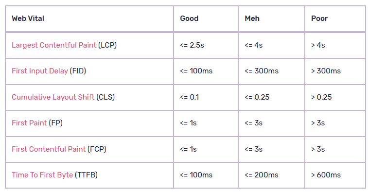
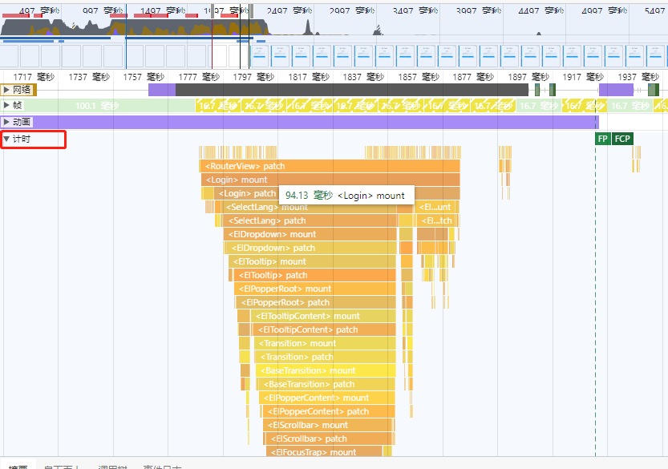
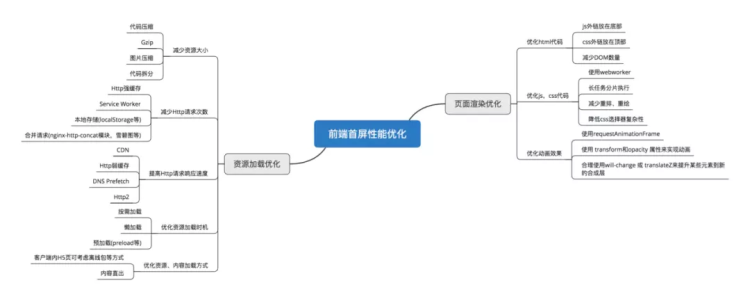

> Update: 2023-08-18

前端性能优化主要分下面几种场景：

- **页面加载性能**
  - `首屏加载优化`。减少首屏的加载时间。
  - `单个页面加载优化`。减少单个界面的加载时间，这与首屏加载优化有些重叠，但更多地关注于页面内的所有资源和内容的加载，而不仅仅是首屏。
- **更新性能**
  - `页面运行时性能优化`。如果页面有一些操作，动画效果，跳转页面等有明显卡顿的需要优化。

## 衡量指标

对于`页面加载性能`的衡量指标通常会用 Google 所定义的一系列 Web 指标 (Web Vitals) 来进行衡量，如最大内容绘制 (Largest Contentful Paint，缩写为 LCP) 和首次输入延迟 (First Input Delay，缩写为 FID)。

下面是比较推荐的指标数值：



> [详细 Web Vitals 如何计算？如何衡量网页性能？](https://juejin.cn/book/7070324244772716556/section/7071919962620690470)

## 如何分析？

为了提高性能，我们首先需要知道如何衡量它。在这方面，有一些很棒的工具可以提供帮助：

**一、用于本地开发期间的性能分析：**

1、打开浏览器的开发者工具，查看 `Network` 标签，优化首屏加载的资源。

- 统计接口耗时，看是否是接口慢的原因？
- 哪些资源加载时间长？是不是有某些资源特别大或者加载时间特别长？
- 查看是否有不必要的大型库或资源被加载。例如，有没有加载整个库但只使用其中一小部分的情况？
- 图片、视频等媒体资源是否经过了优化？是否可以进一步压缩？

2、用 `Vue Devtool` 记录组件耗时，看是否是组件耗时过长

3、Chrome 开发者工具“performance”面板

4、开启 `app.config.performance = true` 将会开启 Vue 特有的性能标记，标记在 Chrome 开发者工具的性能时间线上。



**二、用于生产部署的负载性能分析：**

- [PageSpeed Insights](https://pagespeed.web.dev/)
- [WebPageTest](https://www.webpagetest.org/)
- Lighthouse 性能分析工具

## 首屏加载优化

并非所有的资源都会阻塞页面的首次绘制，比如图片、音频、视频等文件就不会阻塞页面的首次渲染；

而 JavaScript、首次请求的 HTML 资源文件、CSS 文件是会阻塞首次渲染的，因为在构建 DOM 的过程中需要 HTML 和 JavaScript 文件，在构造渲染树的过程中需要用到 CSS 文件。

我们把这些能阻塞网页首次渲染的资源称为关键资源。基于关键资源，我们可以继续细化出来3个影响页面首次渲染的核心因素。

1、减少关键资源个数

2、减小关键资源大小

3、降低关键资源的 RTT 次数


> 关于RTT：什么是 RTT 呢？当使用 TCP 协议传输一个文件时，比如这个文件大小是 0.1M，由于 TCP 的特性，这个数据并不是一次传输到服务端的，而是需要拆分成一个个数据包来回多次进行传输的。RTT 就是这里的往返时延。它是网络中一个重要的性能指标，表示从发送端发送数据开始，到发送端收到来自接收端的确认，总共经历的时延。通常 1 个 HTTP 的数据包在 14KB 左右，所以 1 个 0.1M 的页面就需要拆分成 8 个包来传输了，也就是说需要 8 个 RTT。


### 通用前端优化

> 其他与 Vue 无关的通用优化手段，可以参考这份 [web.dev 指南](https://web.dev/fast/)提供了一个全面的总结。

**0、关键资源个数：越少越好。**

**1、关键资源大小：文件压缩**

- JavaScript/CSS/HTML 文件
  - Gzip 压缩
  - 代码分割
  - 移除未使用的代码 Tree-shaking
- 图片压缩
  - 压缩 TinyPNG
  - 格式优化 webp/svg
  - 雪碧图
  - 懒加载

**2、优化 HTTP 请求**

- 图片懒加载
- 浏览器缓存
- 使用 CDN
- DNS 缓存
- 使用 HTTP2/3
- 合并请求（雪碧图）
- 并发请求
- 本地存储（localStorage）
- 防抖和节流

**3、代码执行效率**

- 使用 Performance 标签，记录页面加载的性能时间线。查看哪些任务执行时间长，是否有可以优化的地方？
- 是否有不必要的计算或渲染在首屏加载时执行？
- 使用 Web Worker

**4、渲染过程优化：**

- 预加载 (Preload)：使用 `<link rel="preload" as="..." href="...">` 预加载关键资源。
- 预获取 (Prefetch)：预获取可能在未来需要的资源，但优先级较低。
- 减少 DOM 数量

**5、对于一些第三方库，考虑使用更轻量级的替代方案。**



### Vue 相关优化

1、包体积与 Tree-shaking 优化

- 安装`rollup-plugin-visualizer`插件，该插件用于分析依赖大小占比。
- 使用按需引入的依赖（比如使用 lodash-es 替代 lodash）

2、代码分割

> 代码分割是指构建工具将构建后的 JavaScript 包拆分为多个较小的，可以按需或并行加载的文件。通过适当的代码分割，页面加载时需要的功能可以立即下载，而额外的块只在需要时才加载，从而提高性能。

- Vue3 的异步组件

  - 路由懒加载：虽然没有使用 defineAsyncComponent，但是 vue-router 内部会为您处理这个懒加载部分，并使用 defineAsyncComponent 或相似的方法来确保组件在需要时才加载。
  - 条件渲染的组件（侧边栏，弹框等）：不是始终在页面上显示的组件，而是基于某些条件才会显示的组件。这可能是由于用户的某些操作，或者基于应用的某些状态。

3、vite 配置优化

- optimizeDeps 预构建依赖
- `assetsInlineLimit: 4096`：静态资源配置，低于配置阈值内联成 base64 编码
- 对 manualChunks 进行了拆分优化
- 使用 terserOptions 去除 console 和 debugger
- `cssCodeSplit: true`：启用 css 动态拆分
- `chunkSizeWarningLimit: 500`：chunk 大小警告限制，避免打出过大的 chunk 包，影响请求速度。
- `vite-plugin-compression`：开启 gzip 或者 brotli 压缩。
- `vite-plugin-imagemin`：图片压缩工具，支持多种图片格式，配置压缩级别。
- 清除无用的 CSS：您可以考虑使用工具像 PurgeCSS 来清除未使用的 CSS，进一步减少文件大小。

4、[BlueLink 项目打包体积优化](https://www.wolai.com/daotin/jLguSrAjNciqpWn9b4tj8n)

## 单个页面加载优化

单个页面加载优化与首屏加载优化有许多相似之处，但也有一些特定的考虑因素。当我们谈论单个页面的优化时，我们通常关注的是`页面内部的交互`、`动态内容加载`、`动画效果`等。

先进行[首屏加载优化](#首屏加载优化)，然后针对单个页面加载优化的一些建议和补充：

1. **组件级优化**：

   - 通过用可视化工具 vueDevtool 分析出耗性能的组件，然后带着目的去优化
   - **避免不必要的重新渲染**：使用 Vue 的 `v-memo`、`computed` 属性或其他缓存策略。

2. **动画和过渡效果**：

   - **使用 `requestAnimationFrame`**：确保动画的流畅性。
   - **避免强制同步布局**：避免在动画中触发重排。
   - **使用 GPU 加速**：使用 `transform` 和 `opacity` 进行动画，而不是 `margin`、`top` 等属性。

3. **优化滚动性能**：

   - **使用虚拟列表**：对于长列表，只渲染当前视口中的项。
   - **避免滚动时的复杂操作**：如滚动监听中的高开销计算。

4. **优化数据加载**：

   - **分页和无限滚动**：不要一次加载过多数据，使用分页或无限滚动加载更多内容。
   - **骨架屏或占位符**：在数据加载时显示，提供更好的用户体验。

5. **优化图表和可视化**：

   - **按需渲染**：只渲染视口中的图表或数据。
   - **使用轻量级库**：如 Chart.js 替代 D3.js（如果不需要 D3 的高级功能）。

6. **Web Workers**：

   - 对于计算密集型任务，考虑在后台线程中执行，避免阻塞主线程。

7. **优化嵌入的第三方内容**：

   - **延迟加载**：如社交媒体插件、广告、地图等。
   - **使用轻量级替代方案**：如使用静态地图图片替代完整的嵌入式地图。

8. **监听事件优化**：

   - **事件委托**：在父元素上监听事件，而不是每个子元素。
   - **避免不必要的事件监听**：确保移除不再需要的事件监听器。

9. **优化 DOM 操作**：

- **减少 DOM 查询**：缓存 DOM 元素引用，避免频繁查询。
- **批量 DOM 操作**：一次性进行多个操作，避免触发多次重排或重绘。

10. 多学习学习 vue 和 react 的设计思路，在我们的开发过程中如果遇到了同样的问题，可以参考这些开源组件的思想解决

## 页面交互时性能优化

谈交互阶段的优化，其实就是在谈渲染进程渲染帧的速度，因为在交互阶段，帧的渲染速度决定了交互的流畅度。因此讨论页面优化实际上就是讨论渲染引擎是如何渲染帧的，否则就无法优化帧率。

我们先来看看交互阶段的渲染流水线，在交互阶段没有了加载关键资源和构建 DOM、CSSOM 流程，是从计算样式开始执行。


大部分情况下，生成一个新的帧都是由 JavaScript 通过修改 DOM 或者 CSSOM 来触发的。如果在计算样式阶段发现有布局信息的修改，那么就会触发**重排**操作，然后触发后续渲染流水线的一系列操作，这个代价是非常大的。

同样如果在计算样式阶段没有发现有布局信息的修改，只是修改了颜色一类的信息，那么就不会涉及到布局相关的调整，所以可以跳过布局阶段，直接进入**重绘**阶段。

还有另外一种情况，通过 CSS 实现一些变形、渐变、动画等特效，这是由 CSS 触发的，并且是在合成线程上执行的，这个过程称为**合成**。因为它不会触发重排或者重绘，而且合成操作本身的速度就非常快，所以执行合成是效率最高的方式。

优化方案：

**1、减少 JavaScript 脚本执行时间，不要一次霸占太久主线程。**
- 将一次执行的函数分解为多个任务
- 耗时且不与DOM操作相关的任务，是有web worker执行

**2、避免强制同步布局**
一般情况下，通过js操作dom，和操作dom后的样式重新计算是放在两个task中的，但是如果在js操作dom后，立即有查询dom相关值的操作，就必须立马计算样式，就会在一个task中完成样式计算，这就相当于延长了当前任务占据主线程的时间。

如下面代码：
```js
function foo() {
    let main_div = document.getElementById("mian_div")
    let new_node = document.createElement("li")
    let textnode = document.createTextNode("time.geekbang")
    new_node.appendChild(textnode);
    document.getElementById("mian_div").appendChild(new_node);
    //由于要获取到offsetHeight，
    //但是此时的offsetHeight还是老的数据，
    //所以需要立即执行布局操作
    console.log(main_div.offsetHeight)
}
```

**3、尽量使用css动画效果（transition，animation，transform），因为合成的效率更高。** 另外，如果能提前知道对某个元素执行动画操作，那就最好将其标记为 `will-change`，这是告诉渲染引擎需要将该元素单独生成一个图层。

另外，可以通过[chrome-devtools-performance](./chrome-devtools-performance.md) 录制一段操作过程进行分析和优化。

## 参考文档

- [BlueLink 项目打包体积优化](https://www.wolai.com/daotin/jLguSrAjNciqpWn9b4tj8n)
- [前端性能优化专栏](https://www.yuque.com/lipengzhou/web-performance) 密码：xa3i
