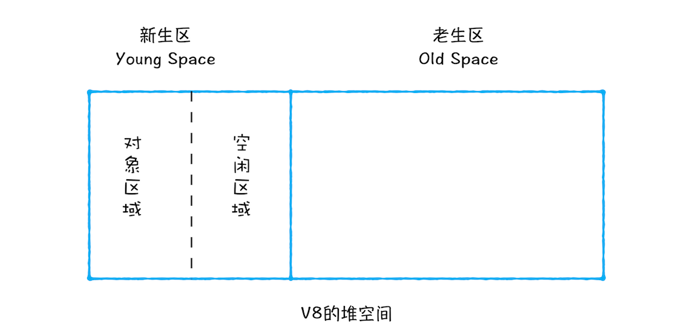
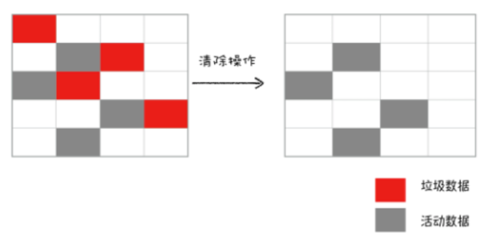
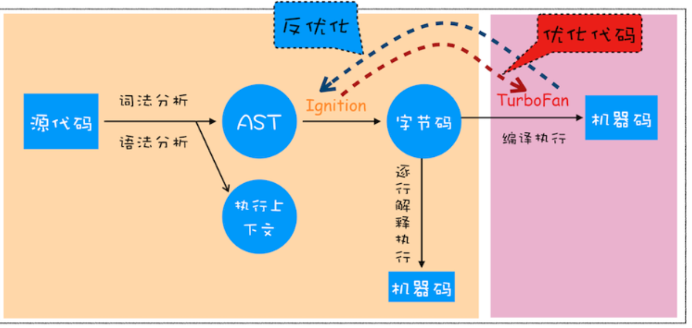

js中的数据，存放在栈和堆中。

## js垃圾回收机制

### 栈的回收

```js
function foo(){
    var a = 1
    var b = {name:"极客邦"}
    function showName(){
      var c = 2
      var d = {name:"极客时间"}
    }
    showName()
}
foo()
```

通过ESP指针，来在调用栈中移动，当栈顶的函数bar执行完后，ESP指针会移动到下一个执行上下文foo，之前栈顶的执行上下文就是无效的内存，如果foo有调用其他的函数，其他的函数的执行上下文会覆盖bar原来的内存，所以其实不需要回收。

### 堆的回收

如果在foo中有引用对象的时候，当foo执行完成，但是堆中的内容并没有释放，如何回收呢？就要用到JavaScript的垃圾回收器了。

V8 中会把堆分为新生代和老生代两个区域，新生代中存放的是生存时间短的对象，老生代中存放的生存时间久的对象。

副垃圾回收器，主要负责新生代的垃圾回收。
主垃圾回收器，主要负责老生代的垃圾回收。

**1、副垃圾回收器**

采用Scavenge 算法来处理。所谓 Scavenge 算法，是把新生代空间对半划分为两个区域，一半是对象区域，一半是空闲区域。

过程：
1. 在垃圾回收过程中，首先要对对象区域中的垃圾做标记；
2. 标记完成之后，就进入垃圾清理阶段，副垃圾回收器会把这些存活的对象复制到空闲区域中，同时它还会把这些对象有序地排列起来
3. 完成复制后，对象区域与空闲区域进行角色翻转，也就是原来的对象区域变成空闲区域，原来的空闲区域变成了对象区域。



缺点：每次执行清理操作时，都需要将存活的对象从对象区域复制到空闲区域。但复制操作需要时间成本。所以为了执行效率，一般新生区的空间会被设置得比较小。

也正是因为新生区的空间不大，所以很容易被存活的对象装满整个区域。为了解决这个问题，JavaScript 引擎采用了**对象晋升策略**，也就是经过两次垃圾回收依然还存活的对象，会被移动到老生区中。

**2、主垃圾回收器**

老生区中的对象有两个特点，一个是对象占用空间大，另一个是对象存活时间长。所以不能才有复制的方式，不然就太慢了。

主垃圾回收器是采用 **标记 - 清除** 的算法进行垃圾回收的。

过程：
1. 标记：从一组根元素开始，递归遍历这组根元素，在这个遍历过程中，如果栈中有变量对某块对空间数据进行引用，就称为活动对象，没有引用的元素就可以判断为垃圾数据。
2. 清除：直接清除掉垃圾数据。



缺点：会产生大量不连续的内存碎片。

所以，又诞生了**标记 - 整理**算法，将零散的活动内存都移动到一边，按照顺序排列。


**3、全停顿**

在执行主垃圾回收器清理的时候，由于 JavaScript 是运行在主线程之上的，一旦执行垃圾回收算法，都需要将正在执行的 JavaScript 脚本暂停下来，待垃圾回收完毕后再恢复脚本执行。我们把这种行为叫做**全停顿**（Stop-The-World）。

如果堆中的数据很大，则执行一次清理，停顿的时间很长，如果有页面动画，会显得很卡顿。

怎么办？V8有一种叫「**增量标记**」的算法，将垃圾回收的过程拆分成很多小块，然后垃圾回收标记和 JavaScript 应用逻辑交替进行，来缓解卡顿的过程。


## V8执行原理

JavaScript是解释型语言，而不是像C语言一样是编译型语言。在每次运行时都需要通过解释器对程序进行动态解释和执行。

整个流程图：



V8执行JavaScript代码的流程如下：
1. 生成AST：解释器对源代码进行词法分析(tokenize)、语法分析(parse)，最终生成抽象语法树（AST）
2. 生成字节码：解释器 Ignition会根据AST生成字节码（最开始是直接编译成机器码的，因为机器码的执行效率非常高，但是因为过于占用内存，所以改成机器码）
3. 执行代码：解释器 Ignition 除了负责生成字节码之外，还负责解释执行字节码（字节码需要通过解释器将其转换为机器码后才能执行）。当执行的多了，发现有一些代码重复执行，就标记成「热点代码」交给编译器 TurboFan，将其转换成机器码，免得每次都要转换成机器码。这种“字节码+解释器+编译器”的方式也叫“即时编译（JIT）技术”


