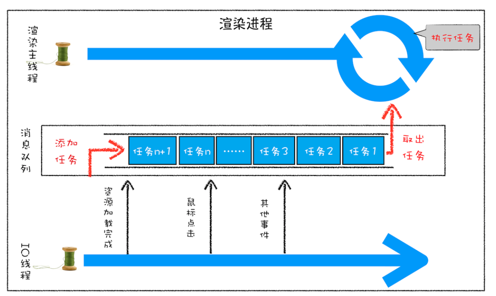
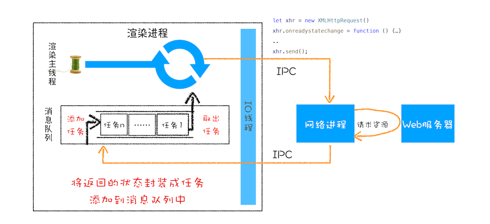

渲染进程的主线程需要处理各种各样的任务，JS脚本，DOM渲染，布局，CSS计算，事件等等，V8引擎也是在主线程上运行的。

这就要一套系统来维持主线程的运转，这就是事件循环。

## 事件循环和消息队列

如果是你，你会如何设计这个系统？

1、第一版

通常来说，主线程会按照顺序执行任务，如果是一些确定的任务还好，但是这就有一个缺点了，就是无法执行临时新到的新任务？如何才能执行？这就需要事件循环机制了。

2、第二版

加入循环的机制，等待任务的到来。来一个，执行一个。


缺点：其他的线程无法把任务给主线程执行？

3、第三版

引入「消息队列」，主线程接收到的IO线程的任务，装入消息队列，主线程循环从消息队列中取任务执行。



## 宏任务，微任务

加入到消息队列的任务种类很多，如输入事件（鼠标滚动、点击、移动）、微任务、文件读写、WebSocket、JavaScript 定时器等等。除此之外，消息队列中还包含了很多与页面相关的事件，如 JavaScript 执行、解析 DOM、样式计算、布局计算、CSS 动画等。

但是由于消息队列先进先出的特性，导致一些实时性比较高的任务，如果加入的晚，就不能及时执行。比如一个DOM的变化，如果前面任务执行的很长时间，界面就不能得到及时的渲染。

**解决办法：微任务。**

通常我们把消息队列中的任务称为宏任务，每个宏任务中都包含了一个微任务队列，在执行宏任务的过程中，如果 DOM 有变化，那么就会将该变化添加到微任务列表中，等宏任务中的主要功能都直接完成之后，这时候，渲染引擎并不着急去执行下一个宏任务，而是执行当前宏任务中的微任务，这就保证了DOM的变化，页面能够及时响应。

能放进微任务的都是**异步执行**的任务。

每个宏任务都关联了一个微任务队列。

那么接下来，我们就需要分析两个重要的时间点——微任务产生的时机和执行微任务队列的时机。

微任务产生的方式：
1、使用 MutationObserver 监控某个 DOM 节点的变化
2、使用 Promise

执行时机：通常情况下，在当前宏任务中的 JavaScript 快执行完成时，也就在 JavaScript 引擎准备退出全局执行上下文并清空调用栈的时候，JavaScript 引擎会检查全局执行上下文中的微任务队列，然后按照顺序执行队列中的微任务。

如果在执行微任务的过程中，产生了新的微任务，同样会将该微任务添加到微任务队列中，V8 引擎一直循环执行微任务队列中的任务，直到队列为空才算执行结束。也就是说在执行微任务过程中产生的新的微任务并不会推迟到下个宏任务中执行，而是在当前的宏任务中继续执行。


### Promise和微任务有啥关系？

Promise解决的是回调地狱的问题。

Promise的一般使用如下：

```js
function executor(resolve, reject) {
    resolve(100)
}
// 将 Promise 改成我们自己的 Bromsie
let demo = new Bromise(executor)

function onResolve(value){
    console.log(value)
}
demo.then(onResolve)
```

当执行到resolve(100)的时候，实际上会触发 demo.then 设置的回调函数 onResolve，但是根据上面的代码的执行的顺序，很显然，当执行到resolve(100)的时候，demo.then(onResolve) 还没有执行，就是还没有绑定onResolve方法，也就没法打印出100.

但是最后居然打印了100，那么在Promise的内容到底做了什么魔法处理？


下面是Promise简单的实现原理：

```js
function Bromise(executor) {
    var onResolve_ = null
    var onReject_ = null
     // 模拟实现 resolve 和 then，暂不支持 rejcet
    this.then = function (onResolve, onReject) {
        onResolve_ = onResolve
    };
    function resolve(value) {
        onResolve_(value);
    }
    executor(resolve, null);
}
```

如果是这样的话，在执行上面代码的时候就会报错：
```
Uncaught TypeError: onResolve_ is not a function
    at resolve (<anonymous>:10:13)
    at executor (<anonymous>:17:5)
    at new Bromise (<anonymous>:13:5)
    at <anonymous>:19:12
```

哎，跟我们的分析是一致，那么要怎么修改一下？这就用到微任务了。

我们需要让 resolve 中的 onResolve_ 函数延后执行，可以在 resolve 函数里面加上一个定时器，让其延时执行 onResolve_ 函数，你可以参考下面改造后的代码：

```js
function resolve(value) {
    setTimeout(()=>{
        onResolve_(value)
    },0)
}
```

上面采用了定时器来推迟 onResolve 的执行，不过使用定时器的效率并不是太高.

好在我们有微任务，所以在 Promise 实现原理中，把这个定时器改为微任务了，这样既可以让 onResolve_ 延时被调用，又提升了代码的执行效率。这就是 Promise 与微任务的关系了。

### async和await

虽然Promise极大地改善了异步编程的可管理性，但在某些情况下，使用.then()和.catch()方法来管理复杂的异步流程仍然可能导致代码冗长和难以理解。`async` 和 `await` 的引入正是为了满足这种需求，它们允许开发者以一种近乎同步的方式编写异步代码，同时保持非阻塞的优势。

要解决的问题：

`async` 和 `await` 主要解决以下问题：

1. **代码可读性**：使异步代码看起来和同步代码相似，这样开发者就可以以线性和更直观的方式理解代码流程，而不需要跟踪Promise链。
2. **错误处理**：允许使用传统的try-catch语法来捕捉异步代码中的错误，这比在Promise中使用.catch()更自然和一致。
3. **简化代码结构**：减少了因为链式Promise而导致的嵌套和复杂结构，简化了代码编写。

实现原理：

`async` 和 `await` 是基于Promise和生成器（generators）的概念实现的。

生成器：

> 参考链接：[05-Generator，async，Class](https://github.com/Daotin/Web/blob/master/08-ES6%E8%AF%AD%E6%B3%95/05-Generator%EF%BC%8Casync%EF%BC%8CClass.md)

生成器函数是一个带星号函数，而且是可以暂停执行和恢复执行的。

```js
function* genDemo() {
    console.log("开始执行第一段")
    yield 'generator 2'

    console.log("开始执行第二段")
    yield 'generator 2'

    console.log("开始执行第三段")
    yield 'generator 2'

    console.log("执行结束")
    return 'generator 2'
}

console.log('main 0')
let gen = genDemo()
console.log(gen.next().value)
console.log('main 1')
console.log(gen.next().value)
console.log('main 2')
console.log(gen.next().value)
console.log('main 3')
console.log(gen.next().value)
console.log('main 4')
```

调用 Generator 函数后，该函数并不执行，返回的也不是函数运行结果，而是一个指向内部状态的指针对象。

下一步，必须调用遍历器对象的`next`方法，使得指针移向下一个状态。也就是说，每次调用`next`方法，内部指针就从函数头部或上一次停下来的地方开始执行，直到遇到下一个`yield`表达式（或`return`语句）为止。

*❓那么，Generator 函数可以实现函数的暂停和恢复，是怎么做到的呢？*

要搞懂函数为何能暂停和恢复，那你首先要了解**协程**的概念。

协程是一种比线程更加轻量级的存在。你可以把协程看成是跑在线程上的任务，一个线程上可以存在多个协程，但是在线程上同时只能执行一个协程，比如当前执行的是 A 协程，要启动 B 协程，那么 A 协程就需要将主线程的控制权交给 B 协程，这就体现在 A 协程暂停执行，B 协程恢复执行；同样，也可以从 B 协程中启动 A 协程。通常，如果从 A 协程启动 B 协程，我们就把 A 协程称为 B 协程的**父协程**。

当使用 yield 暂停协程的时候，就会将控制权转交给父协程，也就是调用Generator的进程。

*❓async和await是如何由Generator函数和Promise来实现的呢？*

看下面示例代码：
```js
async function foo() {
    console.log(1)
    let a = await 100
    console.log(a)
    console.log(2)
}
console.log(0)
foo()
console.log(3)
```

打印的结果为：0,1,3,100,2

我们站在协程的视角看下为啥是这个顺序：

1. 首先，执行`console.log(0)`这个语句，打印出来 0。
2. 紧接着就是执行 foo 函数，由于 foo 函数是被 async 标记过的，所以当进入该函数的时候，首先执行 foo 函数中的`console.log(1)`语句，并打印出 1。
3. 执行到 foo 函数中的`await 100`这个语句了，当执行到`await 100`时，会默认创建一个 Promise 对象，代码如下所示：
```js
let promise_ = new Promise((resolve,reject){
  resolve(100)
})
```
4. 上一节我们知道，resolve(100)会放在微任务列表，然后协程就把控制权转交给父协程，此时打印`console.log(3)`
5. 随后父协程将执行结束，在结束之前，执行微任务队列，微任务队列中有`resolve(100)`打印100
6. 最后，打印2。


*❓下面思考题融合了宏任务，微任务，定时器，请问下面代码输出什么？*

```js
async function foo() {
    console.log('foo');
}
async function bar() {
    console.log('bar start');
    await foo();
    console.log('bar end');
}
console.log('script start');
setTimeout(function() {
    console.log('setTimeout');
}, 0);
bar();
new Promise(function(resolve) {
    console.log('promise executor');
    resolve();
}).then(function() {
    console.log('promise then');
});
console.log('script end');
```

分析：

1. 首先在主协程中初始化异步函数foo和bar，碰到console.log打印script start；
2. 解析到setTimeout，初始化一个Timer，创建一个task，并加入延时队列任务
3. 执行bar函数，将控制权交给协程，输出bar start，碰到await，执行foo，输出foo，创建一个 Promise返回给主协程，并添加到微任务队列
4. 向下执行 new Promise，输出 promise executor，返回resolve 添加到微任务队列
5. 输出script end
6. 当前task结束之前检查微任务队列，执行第一个微任务，将控制器交给协程输出bar end
7. 执行第二个微任务 输出 promise then
8. 当前任务执行完毕进入取出延时队列任务，输出setTimeout。


## 事件循环案例：setTimeout如何设计？

setTimeout的回调不能放到消息队列，因为消息队列是一个个按顺序执行的。那咋办？

在 Chrome 中，除了正常使用的消息队列之外，还有另外一个消息队列**延迟队列**，这个队列中维护了需要延迟执行的任务列表。

所以当通过 JavaScript 创建一个定时器时，渲染进程会将该定时器的回调任务（包含了回调函数 xxx、当前发起时间、延迟执行时间）添加到延迟队列中。

然后，当一个宏任务执行完成后，会去延迟队列查找延时到期的任务去执行。执行完了，再去消息队列执行后续的宏任务。

*❓但，你会发现一个问题？如果一个宏任务要执行很久，那么setTimeout不就不准了？*

另外，setTimeout还有一些其他注意事项：

1. 如果 setTimeout 存在嵌套调用，那么延时时间最短为 4 ms。
（一般如果使用 setTimeout 来做动画的时候，都是需要 setTimeout 嵌套调用，那么对于实时性很高的动画就不适用了。）
2. 在未激活的页面中的 setTimeout 执行的最小间隔为 1000ms ，这是浏览器干预的，为了欧化后台页面的加载损耗以及降低耗电量。
3. 延时时间有最大值。（ Chrome、Safari、Firefox 都是以 32 个 bit 来存储延时值的，32bit 最大只能存放的数字是 2147483647 毫秒，这就意味着，如果 setTimeout 设置的延迟值大于 2147483647 毫秒（大约 24.8 天）时就会溢出，这导致定时器会被立即执行）
4. 如果 setTimeout 的回调函数是一个对象中的一个方法属性，那么这个方法中的 this 会变成 window。


## 事件循环案例：XMLHttpRequest如何设计？

上面，setTimeout 是直接将延迟任务添加到延迟队列中，而 XMLHttpRequest 发起请求，是由浏览器的其他进程或者线程去执行，然后再将执行结果利用 IPC 的方式通知渲染进程，之后渲染进程再将对应的消息添加到消息队列中。

也就是绕了一下，最后还是回归事件循环。




