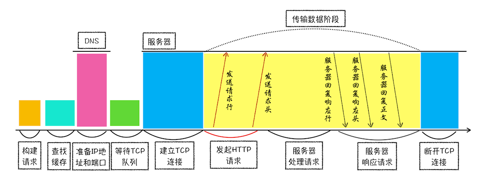

## 进程和线程
一个进程就是一个程序的运行实例。而线程是不能单独存在的，它是由进程来启动和管理的。

进程包含一块内存，用来存放代码、运行中的数据和一个执行任务的主线程。

> 进程就类似一个车间，有一个组长就是主线程。剩下的工人都是线程。
> 
> 任何一个工人罢工都会导致流水线停转，导致生产不了。也就是说进程中的任意一线程执行出错，都会导致整个进程的崩溃。
> 
> 工人们都可以共用休息区。线程之间共享进程中的数据。

任何一个线程出错，都会导致进程崩溃。

## 浏览器的多线程

一个页面至少包含：
1. 主进程：主要负责界面显示、用户交互、子进程管理，同时提供存储等功能。
2. 渲染进程：将 HTML、CSS 和 JavaScript 转换为用户可以与之交互的网页（JavaScript的执行是在渲染进程的）
3. GPU 进程：网页、Chrome 的 UI 界面都选择采用 GPU 来绘制
4. 网络进程：收发网络资源
5. 插件进程：负责插件的运行

## HTTP 请求示意图 ^fa7cea
1. 构建请求行：`GET /index.html HTTP1.1`
2. 查找是否有缓存：通常url就是缓存键
3. 如果没有缓存，则需要发起http链接，而http链接是基于TCP链接的，而TCP链接需要IP和端口
4. 所以，就有了DNS转换，这里又涉及到DNS缓存
5. 等待TCP队列：chrome有机制，每个域名只能有6个tcp链接。
6. 建立tcp链接：3次握手
7. 发送http请求
8. 服务器返回HTTP请求：这里面涉及，状态码、keep-alive、cache-control，登录状态cookie缓存

## 从输入url到页面显示，中间经历了什么？

1、用户输入关键词，地址栏判断是搜索内容还是url地址。
如果是搜索内容，会使用浏览器默认搜索引擎加上搜索内容合成url；
如果是域名会加上协议（如https）合成完整的url。

2、然后按下回车。浏览器进程通过IPC（进程间通信）把url传给网络进程（网络进程接收到url才发起真正的网络请求）。

（中间还会经历，[HTTP的请求流程](#^fa7cea)）

3、网络进程接收到url后，先查找有没有缓存。
有缓存，直接返回缓存的资源。
没有缓存。（进入真正的网络请求）。首先获取域名的IP，系统会首先自动从hosts文件中寻找域名对应的 IP 地址，一旦找到，和服务器建立TCP连接；如果没有找到，则系统会将网址提交 DNS 域名解析服务器进行 IP 地址的解析。

4、利用IP地址和服务器建立TCP连接（3次握手）。

5、建立连接后，浏览器构建数据包（包含请求行，请求头，请求正文，并把该域名相关Cookie等数据附加到请求头），然后向服务器发送请求消息。

6、服务器接收到消息后根据请求信息构建响应数据（包括响应行，响应头，响应正文），然后发送回网络进程。

7、网络进程接收到响应数据后进行解析。
如果发现响应行的返回的状态码为301，302，说明服务器要我们去找别人要数据，找谁呢？找响应头中的Location字段要，Location的内容是需要重定向的地址url。获取到这个url一切重新来过。
如果返回的状态码为200，说明服务器返回了数据。

8、好了，获取到数据以什么方式打开呢？打开的方式不对的话也不行。打开的方式就是 Content-Type。这个属性告诉浏览器服务器返回的数据是什么类型的。如果返回的是网页类型则为 `text/html`，如果是下载文件类型则为 application/octet-stream 等等。打开的方式不对，则得到的结果也不对。    
如果是下载类型，则该请求会被提交给浏览器的下载管理器，同时该请求的流程到此结束。
如果是网页类型，那么浏览器就要准备渲染页面了。

9、渲染页面开始。浏览器进程发出“提交文档”（文档是响应体数据）消息给渲染进程，渲染进程接收到消息后会和网络进程建立传输数据的通道，网络进程将“文档”传输给渲染进程。

10、一旦开始传输，渲染进程便开始渲染界面（详细[渲染过程](#^cc3083)待续。。。）

11、传输完毕，渲染进程会发出“确认提交”消息给浏览器进程。

12、浏览器在接收到“确认提交”消息后，更新浏览器界面状态（包括地址栏信息，仟前进后退历史，web页面和网站安全状态）。

13、页面此时可能还没有渲染完毕，而一旦渲染完毕，渲染进程会发送一个消息给浏览器进程，浏览器接收到这个消息后会停止标签图标的加载动画。

自此，一个完整的页面形成了。

## 渲染过程 ^cc3083

1、构建DOM树：把HTML转换成DOM结构

2、样式计算：先把CSS转换成stylesheets结构，然后转换样式表中的属性值，使其标准化，最后根据继承规则和层叠规则，计算出DOM树每个节点的具体样式。

3、创建布局树，将不可见，header等元素排除。计算元素的布局（省略），然后写回布局树。

4、分层：构建图层树。
（什么情况会构建新的图层？position，z-index，opacity，有滚动条元素等）

5、绘制图层：为每个图层生成绘制列表，并将其提交到合成线程。

6、栅格化：合成线程将图层分成图块，并在光栅化线程池中将优先视口附近的图块转换成位图。

7、一旦所有图块都被光栅化，合成线程发送绘制图块命令 `DrawQuad` 给浏览器进程。

8、浏览器进程根据 DrawQuad 消息绘制到内存里，然后显示到显示器上。

## 重排，重绘，合成

重排会触发重新布局，重新执行完整的渲染流水线，开销最大。

重绘省去了布局和分层阶段，所以执行效率会比重排操作要高一些。

合成：渲染引擎将跳过布局和绘制，只执行后续的合成操作。比如transform动画。
