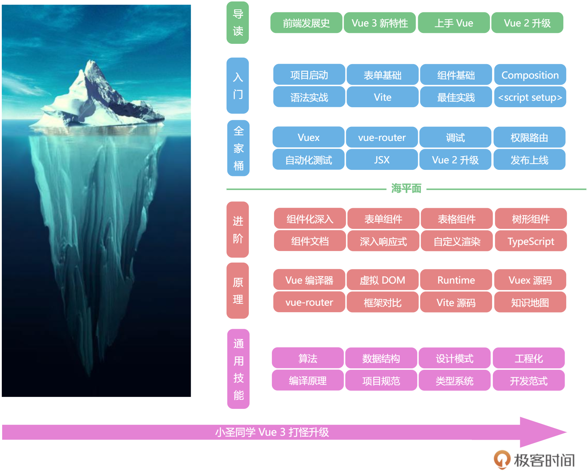
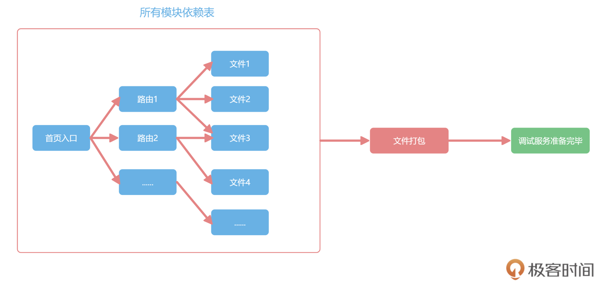
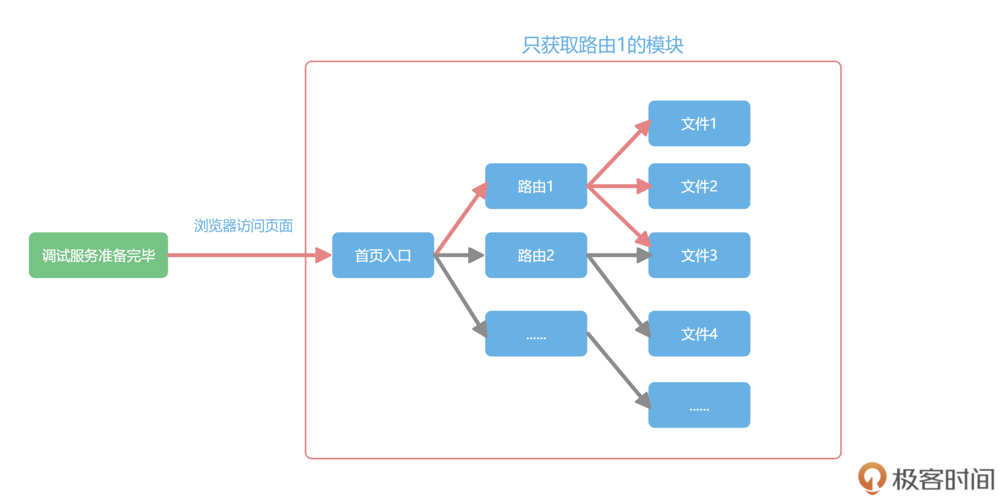
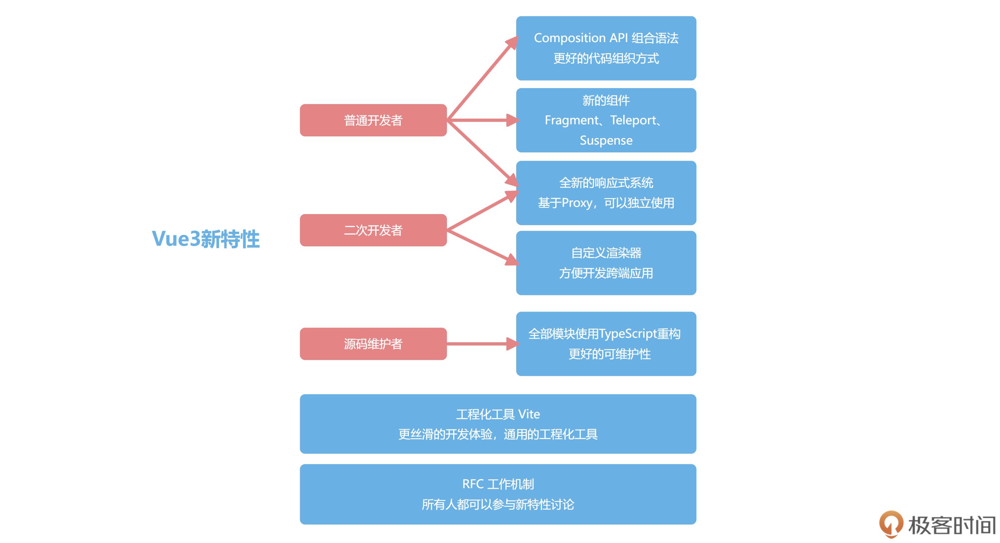

# 玩转 Vue 3 全家桶

## 前言

前端工程师进阶困难的痛点就是，没有体系化的学习。



问题 todo

- Vue 2 大胆引入虚拟 DOM 来解决响应式数据过多的问题？

## 前端框架发展史

**石器时代**：

- 静态网页。整个 90 年代，受限于网速，网页都是静态页，显示非常单一，前端的工作大部分都只是让美工来切切图和写写 HTML+CSS。
- 动态网页。JSP形式，缺点任何数据更新，都需要刷新整个页面，并且在带宽不足的年代，这样做会耗费不少加载网页的时间。
- Ajax阶段。2004 年，Google 发布了 Gmail，用户可以在不刷新页面的情况下进行复杂的交互，之后，Ajax 逐渐成为网页开发的技术标准，也不断地被应用于各种网站。也宣告了 Web2.0 时代正式到来。

**铁器时代**：

- jQuery+Bootstrap：解决浏览器兼容问题

**工业时代**：

- MVVM（数据驱动视图时代）：AngularJS 的诞生，引领了前端 MVVM 模式的潮流；我们甚至不再需要使用 jQuery 去寻找 DOM，而是只关注数据的来源和修改，这也就是现在我们所处的前端时代。

## Vue3新特性

### Vue2遗留问题

- 从开发维护的角度看，Vue 2 是使用 Flow\.js 来做类型校验。但现在 Flow\.js 已经停止维护了，整个社区都在全面使用 TypeScript 来构建基础库，Vue 团队也不例外。
- 从社区的二次开发难度来说，Vue 2 内部运行时，是直接执行浏览器 API 的。但这样就会在 Vue 2 的跨端方案中带来问题，要么直接进入 Vue 源码中，和 Vue 一起维护，比如 Vue 2 中你就能见到 Weex 的文件夹。
- 从我们普通开发者的角度来说，Vue 2 响应式并不是真正意义上的代理，而是基于 Object.defineProperty() 实现的。所以有很多缺陷，比如：新增数据就无法监听
- Option API 在组织代码较多组件的时候不易维护。当代码超过 300 行的时候，新增或者修改一个功能，就需要不停地在 data，methods 里跳转写代码，我称之为上下反复横跳。

### 从七个方面了解 Vue 3 新特性

**1、RFC 机制**

新的 RFC 机制也让我们所有人都可以参与 Vue 新语法的讨论。

**2、响应式系统**

Vue3使用Proxy对数据进行代理，而不是使用Object.defineProperty对数据进行拦截。

**Proxy 代表一种方向，就是框架会越来越多的拥抱浏览器的新特性。**

**3、自定义渲染器**

Vue 2 内部所有的模块都是揉在一起的，这样做会导致不好扩展的问题。

Vue 3 是怎么解决这个问题的呢？那就是**拆包**，使用最近流行的 **monorepo** 管理方式，响应式、编译和运行时全部独立了。

比如响应式独立了出来。而 Vue 2 的响应式只服务于 Vue，Vue 3 的响应式就和 Vue 解耦了，你甚至可以在 Node.js 和 React 中使用响应式。

渲染的逻辑也拆成了平台无关渲染逻辑和浏览器渲染 API 两部分 。那么，在你想使用 Vue 3 开发小程序、开发 canvas 小游戏以及开发客户端的时候，就不用全部 fork Vue 的代码，只需要实现平台的渲染逻辑就可以。

**4、全部模块使用 TypeScript 重构**

类型系统的好处：第一点是，类型系统带来了更方便的提示；第二点是，类型系统让代码更健壮。

**5、Composition API 组合语法**

Options Api缺点：

- 由于所有数据都挂载在 this 之上，因而 Options API 的写法对 TypeScript 的类型推导很不友好，并且这样也不好做 Tree-shaking 清理代码。
- 新增功能基本都得修改 data、method 等配置，并且代码上 300 行之后，会经常上下反复横跳，开发很痛苦。
- 代码不好复用，Vue 2 的组件很难抽离通用逻辑，只能使用 mixin，还会带来命名冲突的问题。

使用 Composition API 后，虽然看起来烦琐了一些，但是带来了诸多好处：

- 所有 API 都是 import 引入的。用到的功能都 import 进来，对 Tree-shaking 很友好，我的例子里没用到功能，打包的时候会被清理掉 ，减小包的大小。
- 不再上下反复横跳，我们可以把一个功能模块的 methods、data 都放在一起书写，维护更轻松。
- 代码方便复用，可以把一个功能所有的 methods、data 封装在一个独立的函数里，复用代码非常容易。
- Composotion API 新增的 return 等语句，在实际项目中使用使用`<script setup>`特性可以清除， 我们后续项目中都会用到这样的操作。

Composition API 的代码风格，看起来会特别清爽。

**6、新的组件**

Vue 3 还内置了 Fragment、Teleport 和 Suspense 三个新组件。

- Fragment: Vue 3 组件不再要求有一个唯一的根节点，清除了很多无用的占位 div。
- Teleport: 允许组件渲染在别的元素内，主要开发弹窗组件的时候特别有用。
- Suspense: 异步组件，更方便开发有异步请求的组件。

**7、新一代工程化工具 Vite**

webpack的缺陷：Webpack 等工程化工具的原理，就是根据你的 import 依赖逻辑，形成一个依赖图，然后调用对应的处理工具，把整个项目打包后，放在内存里再启动调试。由于要预打包，所以复杂项目的开发，启动调试环境需要 3 分钟都很常见，Vite 就是为了解决这个时间资源的消耗问题出现的。

下图展示了 Webpack 的工作原理，Webpack 要把所有路由的依赖打包后，才能开始调试。



现代浏览器已经默认支持了 ES6 的 import 语法，Vite 就是基于这个原理来实现的。具体来说，在调试环境下，我们不需要全部预打包，只是把你首页依赖的文件，依次通过网络请求去获取，整个开发体验得到巨大提升，做到了复杂项目的秒级调试和热更新。

下图所示的是 Vite 的工作原理，一开始就可以准备联调，然后根据首页的依赖模块，再去按需加载，这样启动调试所需要的资源会大大减少。




**Vue3新特性总结图**



## Vue 3的响应式机制

Vue 中用过三种响应式解决方案，分别是 `defineProperty`、`Proxy` 和 `value setter`。

### defineProperty

```vue

let getDouble = n=>n*2
let obj = {}
let count = 1
let double = getDouble(count)

Object.defineProperty(obj,'count',{
    get(){
        return count
    },
    set(val){
        count = val
        double = getDouble(val)
    }
})
console.log(double)  // 打印2
obj.count = 2
console.log(double) // 打印4  有种自动变化的感觉
```

缺陷：我们删除 obj.count 属性，set 函数就不会执行，double 还是之前的数值

```vue
delete obj.count
console.log(double) // doube还是4
```

### reactive响应式

通过 new Proxy 代理了 obj 这个对象，然后通过 get、set 和 deleteProperty 函数代理了对象的读取、修改和删除操作，从而实现了响应式的功能。

```vue

let proxy = new Proxy(obj,{
    get : function (target,prop) {
        return target[prop]
    },
    set : function (target,prop,value) {
        target[prop] = value;
        if(prop==='count'){
            double = getDouble(value)
        }
    },
    deleteProperty(target,prop){
        delete target[prop]
        if(prop==='count'){
            double = NaN
        }
    }
})
console.log(obj.count,double)
proxy.count = 2
console.log(obj.count,double) 
delete proxy.count
// 删除属性后，我们打印log时，输出的结果就会是 undefined NaN
console.log(obj.count,double) 
```

### ref响应式

利用对象的 get 和 set 函数来进行监听

```vue

let getDouble = n => n * 2
let _value = 1
double = getDouble(_value)

let count = {
  get value() {
    return _value
  },
  set value(val) {
    _value = val
    double = getDouble(_value)

  }
}
console.log(count.value,double)
count.value = 2
console.log(count.value,double)
```

### 总结


### 定制响应式数据

**我们可以把日常开发中用到的数据，无论是浏览器的本地存储，还是网络数据，都封装成响应式数据，统一使用响应式数据开发的模式。这样，我们开发项目的时候，只需要修改对应的数据就可以了。**

**可以把一切项目中的状态和数据都封装成响应式的接口，屏蔽了浏览器的 API，对外暴露的就是普通的数据，可以极大地提高我们的开发效率。**

比如，我们可以在 loading 状态下，去修改浏览器的小图标 favicon。和本地存储类似，修改 favicon 时，我们需要找到 head 中有 icon 属性的标签。

```vue

import {ref,watch} from 'vue'
export default function useFavicon( newIcon ) {
    const favicon = ref(newIcon)

    const updateIcon = (icon) => {
      document.head
        .querySelectorAll(`link[rel*="icon"]`)
        .forEach(el => el.href = `${icon}`)
    }
    const reset = ()=>favicon.value = '/favicon.ico'

    watch( favicon,
      (i) => {
        updateIcon(i)
      }
    )
    return {favicon,reset}
  } 
```

**平时项目中还有哪些可以封装成响应式数据？**

todo

composition API  就是把逻辑代码聚合起来.  一些工具函数都可以被封装起来。比如：

- websocket  &#x20;
- 解析 url parameter  &#x20;
- 浏览器页面全屏、滚动等的封装（之前有需求就是全屏要动态调整页面的布局，在没有封装的情况下，就要每个页面需要时都写监听，而用useXXX感觉会优雅很多）
- 鼠标状态监听 &#x20;
- 表单验证
- 图片懒加载
- 本地化持久化存储
- performance 性能检测
- 甚至实现自定义 logger

### Vueuse 工具包

安装

```vue
npm install @vueuse/core
```

使用

```vue

<template>
  <h1 @click="toggle">click</h1>
</template>
<script setup>
import { useFullscreen } from '@vueuse/core'
const { isFullscreen, enter, exit, toggle } = useFullscreen()
</script>
```

## vuex

### 手写迷你 vuex

vuex正常使用方式如下：

```javascript
// store/index.js
import { createStore } from "vuex";
const store = createStore({
  state() {
    return {
      count: 666,
    };
  },
  mutations: {
    add(state) {
      state.count++;
    },
  },
});

export default store;


// main.js
import store from "./store";
app.use(store);

// 组件使用
<template>
  <div>
    {{ count }}
    <el-button type="primary" @click="add">点击累加</el-button>
  </div>
</template>

<script setup>
import { computed } from "vue";
import { useStore } from "vuex";
let store = useStore();
let count = computed(() => store.state.count);

function add() {
  store.commit("add");
}
</script>


```

手写mini Vuex

```javascript
// store/gvuex.js
import { provide, inject, reactive } from "vue";

const STORE_KEY = "__store__";

class Store {
  constructor(options) {
    this._state = reactive({
      data: options.state(),
    });
    this._mutations = options.mutations;
  }
  // 读取state的时候就返回_state.data
  get state() {
    return this._state.data;
  }
  commit = (type, payload) => {
    const func = this._mutations[type];
    func && func(this.state, payload);
  };
  // 为了在main.js中可以使用use(store)的方式
  install(app) {
    app.provide(STORE_KEY, this);
  }
}

function createStore(options) {
  return new Store(options);
}

function useStore() {
  return inject(STORE_KEY);
}

export { createStore, useStore };


```

在store/index.js中引入：

```javascript
// import { createStore } from "vuex";
import { createStore } from "./gvuex";
```

Count组件中使用：

```html
<template>
  <div>
    {{ count }}
    <el-button type="primary" @click="add">点击累加</el-button>
  </div>
</template>

<script setup>
import { computed } from "vue";
import { useStore } from "../store/gvuex";
let store = useStore();
let count = computed(() => store.state.count);

function add() {
  store.commit("add");
}
</script>

```

## vue-router

手写 mini vue-router

使用 hash 模式的迷你 vue-router。

在router/ 文件夹下新增grouter/index.js文件：

```javascript
import { inject, ref } from "vue";
import RouterLink from "./RouterLink.vue";
import RouterView from "./RouterView.vue";

const ROUTER_KEY = "__router__";

function createRouter(options) {
  return new Router(options);
}

function useRouter() {
  return inject(ROUTER_KEY);
}

function createWebHashHistory() {
  // 注册hashchange事件
  function bindEvent(fn) {
    window.addEventListener("hashchange", fn);
  }
  return {
    bindEvent,
    url: window.location.hash.slice(1) || "/",
  };
}

class Router {
  constructor(options) {
    this.history = options.history;
    this.routes = options.routes;
    // 保存当前路由
    this.current = ref(this.history.url);

    // 当hash改变，触发hashchange回调，会修改current值
    this.history.bindEvent(() => {
      this.current.value = window.location.hash.slice(1) || "/";
    });
  }

  install(app) {
    app.provide(ROUTER_KEY, this);
    // 注册全局组件
    app.component("router-link", RouterLink);
    app.component("router-view", RouterView);
  }
}

export { createRouter, createWebHashHistory, useRouter };

```

修改router/index.js入口，使用grouter/index.js文件：

```javascript
// import { createRouter, createWebHashHistory } from "vue-router";
import { createRouter, createWebHashHistory } from "./grouter";

import Home from "../views/Home.vue";
import About from "../views/About.vue";
import Count from "../components/Count.vue";

const routes = [
  { path: "/", component: Home },
  { path: "/about", component: About },
  { path: "/count", component: Count },
];

const router = createRouter({
  history: createWebHashHistory(), // 使用 hash 模式
  routes,
});

export default router;

```

新增grouter/RouterView\.vue和RouterLink.vue文件，并在grouter/index.js中注册为全局组件：

RouterLink.vue

```html
<template>
  <a :href="'#' + to">
    <slot />
  </a>
</template>

<script setup>
const props = defineProps({
  to: {
    type: String,
    required: true,
  },
});
</script>

```

RouterView\.vue

```html
<template>
  <component :is="comp"></component>
</template>
<script setup>
import { computed } from "vue";
import { useRouter } from "./index";

let router = useRouter();

// 匹配 current 地址对应的组件，然后动态渲染到 router-view。
const comp = computed(() => {
  const route = router.routes.find(
    (route) => route.path === router.current.value
  );
  return route ? route.component : null;
});
</script>

```

实际上，vue-router 还需要处理很多额外的任务，比如路由懒加载、路由的正则匹配等等，这里都没实现。
